<html>

<head>
    <meta content="text/html; charset=UTF-8" http-equiv="content-type">
    <style type="text/css">
    @import url('https://themes.googleusercontent.com/fonts/css?kit=fpjTOVmNbO4Lz34iLyptLTi9jKYd1gJzj5O2gWsEpXq5DSxTUXlwXebxyXtT0rCwv1unUalIzurR1sLOY-mh2Q');
    .lst-kix_3i0cln6d8s2n-0>li:before {
        content: "" counter(lst-ctn-kix_3i0cln6d8s2n-0, decimal) ". "
    }
    
    ol.lst-kix_duk8lh7nazr8-6.start {
        counter-reset: lst-ctn-kix_duk8lh7nazr8-6 0
    }
    
    ol.lst-kix_jzne3rhv8o9f-7.start {
        counter-reset: lst-ctn-kix_jzne3rhv8o9f-7 0
    }
    
    .lst-kix_3i0cln6d8s2n-2>li:before {
        content: "" counter(lst-ctn-kix_3i0cln6d8s2n-2, lower-roman) ". "
    }
    
    .lst-kix_21o9xcnwx16t-5>li {
        counter-increment: lst-ctn-kix_21o9xcnwx16t-5
    }
    
    .lst-kix_3i0cln6d8s2n-6>li:before {
        content: "" counter(lst-ctn-kix_3i0cln6d8s2n-6, decimal) ". "
    }
    
    .lst-kix_3i0cln6d8s2n-4>li:before {
        content: "" counter(lst-ctn-kix_3i0cln6d8s2n-4, lower-latin) ". "
    }
    
    .lst-kix_3i0cln6d8s2n-8>li:before {
        content: "" counter(lst-ctn-kix_3i0cln6d8s2n-8, lower-roman) ". "
    }
    
    .lst-kix_we96vvrch9kf-0>li {
        counter-increment: lst-ctn-kix_we96vvrch9kf-0
    }
    
    ol.lst-kix_w2hkgiutbw7i-5.start {
        counter-reset: lst-ctn-kix_w2hkgiutbw7i-5 0
    }
    
    .lst-kix_hrubo4ul5l1u-8>li {
        counter-increment: lst-ctn-kix_hrubo4ul5l1u-8
    }
    
    ol.lst-kix_qy0uelm22eap-0.start {
        counter-reset: lst-ctn-kix_qy0uelm22eap-0 0
    }
    
    .lst-kix_ebfq1uymhoep-0>li {
        counter-increment: lst-ctn-kix_ebfq1uymhoep-0
    }
    
    ol.lst-kix_21o9xcnwx16t-2.start {
        counter-reset: lst-ctn-kix_21o9xcnwx16t-2 0
    }
    
    .lst-kix_b9kg2kcr8jwr-8>li {
        counter-increment: lst-ctn-kix_b9kg2kcr8jwr-8
    }
    
    ol.lst-kix_9tm7py85ny4s-7.start {
        counter-reset: lst-ctn-kix_9tm7py85ny4s-7 0
    }
    
    ul.lst-kix_ktrvyjr93c7e-0 {
        list-style-type: none
    }
    
    ul.lst-kix_ktrvyjr93c7e-1 {
        list-style-type: none
    }
    
    ul.lst-kix_ktrvyjr93c7e-4 {
        list-style-type: none
    }
    
    ul.lst-kix_ktrvyjr93c7e-5 {
        list-style-type: none
    }
    
    ul.lst-kix_ktrvyjr93c7e-2 {
        list-style-type: none
    }
    
    ul.lst-kix_ktrvyjr93c7e-3 {
        list-style-type: none
    }
    
    ul.lst-kix_ktrvyjr93c7e-8 {
        list-style-type: none
    }
    
    ul.lst-kix_ktrvyjr93c7e-6 {
        list-style-type: none
    }
    
    ul.lst-kix_ktrvyjr93c7e-7 {
        list-style-type: none
    }
    
    ol.lst-kix_jzne3rhv8o9f-2.start {
        counter-reset: lst-ctn-kix_jzne3rhv8o9f-2 0
    }
    
    ol.lst-kix_ebfq1uymhoep-5.start {
        counter-reset: lst-ctn-kix_ebfq1uymhoep-5 0
    }
    
    ol.lst-kix_vbjefu8d69if-3.start {
        counter-reset: lst-ctn-kix_vbjefu8d69if-3 0
    }
    
    .lst-kix_j6xbvs5okyri-2>li {
        counter-increment: lst-ctn-kix_j6xbvs5okyri-2
    }
    
    .lst-kix_c3jn31fvzck5-1>li {
        counter-increment: lst-ctn-kix_c3jn31fvzck5-1
    }
    
    .lst-kix_vbjefu8d69if-8>li {
        counter-increment: lst-ctn-kix_vbjefu8d69if-8
    }
    
    .lst-kix_ax1c079i1xii-4>li {
        counter-increment: lst-ctn-kix_ax1c079i1xii-4
    }
    
    .lst-kix_c3jn31fvzck5-8>li:before {
        content: "" counter(lst-ctn-kix_c3jn31fvzck5-8, lower-roman) ". "
    }
    
    ol.lst-kix_duk8lh7nazr8-1.start {
        counter-reset: lst-ctn-kix_duk8lh7nazr8-1 0
    }
    
    ol.lst-kix_c3jn31fvzck5-4.start {
        counter-reset: lst-ctn-kix_c3jn31fvzck5-4 0
    }
    
    .lst-kix_vl42w5ijk91c-2>li:before {
        content: "\0025a0  "
    }
    
    .lst-kix_vl42w5ijk91c-4>li:before {
        content: "\0025cb  "
    }
    
    .lst-kix_vbjefu8d69if-8>li:before {
        content: "" counter(lst-ctn-kix_vbjefu8d69if-8, lower-roman) ". "
    }
    
    .lst-kix_vbjefu8d69if-2>li:before {
        content: "" counter(lst-ctn-kix_vbjefu8d69if-2, lower-roman) ". "
    }
    
    .lst-kix_vbjefu8d69if-6>li:before {
        content: "" counter(lst-ctn-kix_vbjefu8d69if-6, decimal) ". "
    }
    
    .lst-kix_vl42w5ijk91c-6>li:before {
        content: "\0025cf  "
    }
    
    .lst-kix_vl42w5ijk91c-8>li:before {
        content: "\0025a0  "
    }
    
    .lst-kix_vbjefu8d69if-4>li:before {
        content: "" counter(lst-ctn-kix_vbjefu8d69if-4, lower-latin) ". "
    }
    
    .lst-kix_hrubo4ul5l1u-1>li {
        counter-increment: lst-ctn-kix_hrubo4ul5l1u-1
    }
    
    .lst-kix_z77rifdhc5b3-0>li {
        counter-increment: lst-ctn-kix_z77rifdhc5b3-0
    }
    
    ol.lst-kix_gie1cig2oqoz-3.start {
        counter-reset: lst-ctn-kix_gie1cig2oqoz-3 0
    }
    
    ol.lst-kix_mfd42fmrrlpn-4.start {
        counter-reset: lst-ctn-kix_mfd42fmrrlpn-4 0
    }
    
    .lst-kix_me5o3c1j1mrx-7>li {
        counter-increment: lst-ctn-kix_me5o3c1j1mrx-7
    }
    
    .lst-kix_7kt18zse5zr-7>li {
        counter-increment: lst-ctn-kix_7kt18zse5zr-7
    }
    
    .lst-kix_vbjefu8d69if-0>li:before {
        content: "" counter(lst-ctn-kix_vbjefu8d69if-0, decimal) ". "
    }
    
    ol.lst-kix_ebfq1uymhoep-0.start {
        counter-reset: lst-ctn-kix_ebfq1uymhoep-0 0
    }
    
    .lst-kix_duk8lh7nazr8-4>li {
        counter-increment: lst-ctn-kix_duk8lh7nazr8-4
    }
    
    ol.lst-kix_y3gnafa2oi1w-5.start {
        counter-reset: lst-ctn-kix_y3gnafa2oi1w-5 0
    }
    
    .lst-kix_y3gnafa2oi1w-5>li {
        counter-increment: lst-ctn-kix_y3gnafa2oi1w-5
    }
    
    .lst-kix_vl42w5ijk91c-0>li:before {
        content: "\0025cf  "
    }
    
    .lst-kix_iorpjqg1o56q-4>li:before {
        content: "" counter(lst-ctn-kix_iorpjqg1o56q-4, lower-latin) ". "
    }
    
    ol.lst-kix_b9kg2kcr8jwr-4.start {
        counter-reset: lst-ctn-kix_b9kg2kcr8jwr-4 0
    }
    
    .lst-kix_3i0cln6d8s2n-0>li {
        counter-increment: lst-ctn-kix_3i0cln6d8s2n-0
    }
    
    .lst-kix_iorpjqg1o56q-2>li:before {
        content: "" counter(lst-ctn-kix_iorpjqg1o56q-2, lower-roman) ". "
    }
    
    ol.lst-kix_w2hkgiutbw7i-0.start {
        counter-reset: lst-ctn-kix_w2hkgiutbw7i-0 0
    }
    
    .lst-kix_we96vvrch9kf-7>li {
        counter-increment: lst-ctn-kix_we96vvrch9kf-7
    }
    
    .lst-kix_iorpjqg1o56q-8>li:before {
        content: "" counter(lst-ctn-kix_iorpjqg1o56q-8, lower-roman) ". "
    }
    
    .lst-kix_ebfq1uymhoep-7>li {
        counter-increment: lst-ctn-kix_ebfq1uymhoep-7
    }
    
    .lst-kix_me5o3c1j1mrx-0>li {
        counter-increment: lst-ctn-kix_me5o3c1j1mrx-0
    }
    
    .lst-kix_7kt18zse5zr-0>li {
        counter-increment: lst-ctn-kix_7kt18zse5zr-0
    }
    
    .lst-kix_iorpjqg1o56q-6>li:before {
        content: "" counter(lst-ctn-kix_iorpjqg1o56q-6, decimal) ". "
    }
    
    .lst-kix_ax1c079i1xii-7>li:before {
        content: "" counter(lst-ctn-kix_ax1c079i1xii-7, lower-latin) ". "
    }
    
    .lst-kix_puxrcdcrid1z-4>li {
        counter-increment: lst-ctn-kix_puxrcdcrid1z-4
    }
    
    ol.lst-kix_puxrcdcrid1z-7.start {
        counter-reset: lst-ctn-kix_puxrcdcrid1z-7 0
    }
    
    .lst-kix_gie1cig2oqoz-0>li:before {
        content: "" counter(lst-ctn-kix_gie1cig2oqoz-0, decimal) ". "
    }
    
    .lst-kix_884c4pt9zd2v-1>li {
        counter-increment: lst-ctn-kix_884c4pt9zd2v-1
    }
    
    ol.lst-kix_21o9xcnwx16t-7.start {
        counter-reset: lst-ctn-kix_21o9xcnwx16t-7 0
    }
    
    ol.lst-kix_9tm7py85ny4s-0 {
        list-style-type: none
    }
    
    ol.lst-kix_3i0cln6d8s2n-3.start {
        counter-reset: lst-ctn-kix_3i0cln6d8s2n-3 0
    }
    
    ol.lst-kix_9tm7py85ny4s-1 {
        list-style-type: none
    }
    
    ol.lst-kix_9tm7py85ny4s-4 {
        list-style-type: none
    }
    
    ol.lst-kix_9tm7py85ny4s-5 {
        list-style-type: none
    }
    
    ol.lst-kix_9tm7py85ny4s-2 {
        list-style-type: none
    }
    
    ol.lst-kix_9tm7py85ny4s-3 {
        list-style-type: none
    }
    
    ol.lst-kix_9tm7py85ny4s-8 {
        list-style-type: none
    }
    
    .lst-kix_qy0uelm22eap-1>li {
        counter-increment: lst-ctn-kix_qy0uelm22eap-1
    }
    
    ol.lst-kix_9tm7py85ny4s-6 {
        list-style-type: none
    }
    
    ol.lst-kix_9tm7py85ny4s-7 {
        list-style-type: none
    }
    
    .lst-kix_iorpjqg1o56q-0>li:before {
        content: "" counter(lst-ctn-kix_iorpjqg1o56q-0, decimal) ". "
    }
    
    .lst-kix_z77rifdhc5b3-7>li {
        counter-increment: lst-ctn-kix_z77rifdhc5b3-7
    }
    
    ol.lst-kix_z77rifdhc5b3-6.start {
        counter-reset: lst-ctn-kix_z77rifdhc5b3-6 0
    }
    
    .lst-kix_6czg7grieguz-4>li:before {
        content: "" counter(lst-ctn-kix_6czg7grieguz-4, lower-latin) ". "
    }
    
    ul.lst-kix_hmcihavs7yiu-6 {
        list-style-type: none
    }
    
    ul.lst-kix_hmcihavs7yiu-7 {
        list-style-type: none
    }
    
    ul.lst-kix_hmcihavs7yiu-8 {
        list-style-type: none
    }
    
    ul.lst-kix_hmcihavs7yiu-2 {
        list-style-type: none
    }
    
    ol.lst-kix_hrubo4ul5l1u-2.start {
        counter-reset: lst-ctn-kix_hrubo4ul5l1u-2 0
    }
    
    .lst-kix_63siq8pswydo-5>li:before {
        content: "\0025a0  "
    }
    
    ul.lst-kix_hmcihavs7yiu-3 {
        list-style-type: none
    }
    
    ul.lst-kix_hmcihavs7yiu-4 {
        list-style-type: none
    }
    
    ul.lst-kix_hmcihavs7yiu-5 {
        list-style-type: none
    }
    
    .lst-kix_6czg7grieguz-0>li:before {
        content: "" counter(lst-ctn-kix_6czg7grieguz-0, decimal) ". "
    }
    
    .lst-kix_6czg7grieguz-8>li:before {
        content: "" counter(lst-ctn-kix_6czg7grieguz-8, lower-roman) ". "
    }
    
    ol.lst-kix_iv9o7neiu23b-6.start {
        counter-reset: lst-ctn-kix_iv9o7neiu23b-6 0
    }
    
    .lst-kix_vdh3b0j47xgm-3>li {
        counter-increment: lst-ctn-kix_vdh3b0j47xgm-3
    }
    
    .lst-kix_iorpjqg1o56q-3>li {
        counter-increment: lst-ctn-kix_iorpjqg1o56q-3
    }
    
    .lst-kix_63siq8pswydo-1>li:before {
        content: "\0025cb  "
    }
    
    ol.lst-kix_we96vvrch9kf-5.start {
        counter-reset: lst-ctn-kix_we96vvrch9kf-5 0
    }
    
    ul.lst-kix_hmcihavs7yiu-0 {
        list-style-type: none
    }
    
    ul.lst-kix_hmcihavs7yiu-1 {
        list-style-type: none
    }
    
    .lst-kix_gie1cig2oqoz-2>li:before {
        content: "" counter(lst-ctn-kix_gie1cig2oqoz-2, lower-roman) ". "
    }
    
    .lst-kix_iorpjqg1o56q-5>li {
        counter-increment: lst-ctn-kix_iorpjqg1o56q-5
    }
    
    ol.lst-kix_vdh3b0j47xgm-8 {
        list-style-type: none
    }
    
    ol.lst-kix_vdh3b0j47xgm-7 {
        list-style-type: none
    }
    
    ol.lst-kix_vdh3b0j47xgm-2 {
        list-style-type: none
    }
    
    ol.lst-kix_bd7ksp21jor2-3.start {
        counter-reset: lst-ctn-kix_bd7ksp21jor2-3 0
    }
    
    ol.lst-kix_vdh3b0j47xgm-1 {
        list-style-type: none
    }
    
    ol.lst-kix_vdh3b0j47xgm-0 {
        list-style-type: none
    }
    
    ol.lst-kix_vdh3b0j47xgm-6 {
        list-style-type: none
    }
    
    ol.lst-kix_vdh3b0j47xgm-5 {
        list-style-type: none
    }
    
    .lst-kix_ax1c079i1xii-3>li:before {
        content: "" counter(lst-ctn-kix_ax1c079i1xii-3, decimal) ". "
    }
    
    .lst-kix_gie1cig2oqoz-6>li:before {
        content: "" counter(lst-ctn-kix_gie1cig2oqoz-6, decimal) ". "
    }
    
    ol.lst-kix_vdh3b0j47xgm-4 {
        list-style-type: none
    }
    
    ol.lst-kix_me5o3c1j1mrx-3.start {
        counter-reset: lst-ctn-kix_me5o3c1j1mrx-3 0
    }
    
    ol.lst-kix_3i0cln6d8s2n-8.start {
        counter-reset: lst-ctn-kix_3i0cln6d8s2n-8 0
    }
    
    ol.lst-kix_vdh3b0j47xgm-3 {
        list-style-type: none
    }
    
    .lst-kix_884c4pt9zd2v-8>li {
        counter-increment: lst-ctn-kix_884c4pt9zd2v-8
    }
    
    ol.lst-kix_y3gnafa2oi1w-6 {
        list-style-type: none
    }
    
    ol.lst-kix_y3gnafa2oi1w-7 {
        list-style-type: none
    }
    
    ol.lst-kix_y3gnafa2oi1w-4 {
        list-style-type: none
    }
    
    ol.lst-kix_gxpvnml6k7ve-8 {
        list-style-type: none
    }
    
    ol.lst-kix_y3gnafa2oi1w-5 {
        list-style-type: none
    }
    
    ol.lst-kix_y3gnafa2oi1w-2 {
        list-style-type: none
    }
    
    ol.lst-kix_gxpvnml6k7ve-6 {
        list-style-type: none
    }
    
    ol.lst-kix_y3gnafa2oi1w-3 {
        list-style-type: none
    }
    
    ol.lst-kix_gxpvnml6k7ve-7 {
        list-style-type: none
    }
    
    ol.lst-kix_y3gnafa2oi1w-0 {
        list-style-type: none
    }
    
    ol.lst-kix_gxpvnml6k7ve-4 {
        list-style-type: none
    }
    
    ol.lst-kix_y3gnafa2oi1w-1 {
        list-style-type: none
    }
    
    ol.lst-kix_gxpvnml6k7ve-4.start {
        counter-reset: lst-ctn-kix_gxpvnml6k7ve-4 0
    }
    
    ol.lst-kix_gxpvnml6k7ve-5 {
        list-style-type: none
    }
    
    ol.lst-kix_gxpvnml6k7ve-2 {
        list-style-type: none
    }
    
    ol.lst-kix_gxpvnml6k7ve-3 {
        list-style-type: none
    }
    
    ol.lst-kix_gxpvnml6k7ve-0 {
        list-style-type: none
    }
    
    ol.lst-kix_gxpvnml6k7ve-1 {
        list-style-type: none
    }
    
    ol.lst-kix_y3gnafa2oi1w-8 {
        list-style-type: none
    }
    
    .lst-kix_7uppvojj7uei-6>li:before {
        content: "\0025cf  "
    }
    
    ul.lst-kix_3xpd9asy8dr8-8 {
        list-style-type: none
    }
    
    .lst-kix_gie1cig2oqoz-5>li {
        counter-increment: lst-ctn-kix_gie1cig2oqoz-5
    }
    
    ol.lst-kix_uz52ovdmo5p-7.start {
        counter-reset: lst-ctn-kix_uz52ovdmo5p-7 0
    }
    
    ol.lst-kix_avowbswd35oe-4.start {
        counter-reset: lst-ctn-kix_avowbswd35oe-4 0
    }
    
    .lst-kix_uug25iqr6z2a-1>li:before {
        content: "\0025cb  "
    }
    
    .lst-kix_uug25iqr6z2a-5>li:before {
        content: "\0025a0  "
    }
    
    ol.lst-kix_me5o3c1j1mrx-8.start {
        counter-reset: lst-ctn-kix_me5o3c1j1mrx-8 0
    }
    
    ul.lst-kix_3xpd9asy8dr8-7 {
        list-style-type: none
    }
    
    ul.lst-kix_3xpd9asy8dr8-6 {
        list-style-type: none
    }
    
    .lst-kix_leiagoh1xj5l-6>li:before {
        content: "\0025cf  "
    }
    
    ul.lst-kix_3xpd9asy8dr8-5 {
        list-style-type: none
    }
    
    ul.lst-kix_3xpd9asy8dr8-4 {
        list-style-type: none
    }
    
    ul.lst-kix_3xpd9asy8dr8-3 {
        list-style-type: none
    }
    
    ul.lst-kix_3xpd9asy8dr8-2 {
        list-style-type: none
    }
    
    ul.lst-kix_3xpd9asy8dr8-1 {
        list-style-type: none
    }
    
    ul.lst-kix_3xpd9asy8dr8-0 {
        list-style-type: none
    }
    
    .lst-kix_gxpvnml6k7ve-2>li:before {
        content: "" counter(lst-ctn-kix_gxpvnml6k7ve-2, lower-roman) ". "
    }
    
    .lst-kix_we96vvrch9kf-3>li:before {
        content: "" counter(lst-ctn-kix_we96vvrch9kf-3, decimal) ". "
    }
    
    .lst-kix_esyxq5fxetra-2>li:before {
        content: "\0025a0  "
    }
    
    .lst-kix_c3jn31fvzck5-2>li:before {
        content: "" counter(lst-ctn-kix_c3jn31fvzck5-2, lower-roman) ". "
    }
    
    .lst-kix_w2hkgiutbw7i-3>li {
        counter-increment: lst-ctn-kix_w2hkgiutbw7i-3
    }
    
    ol.lst-kix_q7nug13t57n-4.start {
        counter-reset: lst-ctn-kix_q7nug13t57n-4 0
    }
    
    .lst-kix_c3jn31fvzck5-6>li:before {
        content: "" counter(lst-ctn-kix_c3jn31fvzck5-6, decimal) ". "
    }
    
    .lst-kix_9tm7py85ny4s-3>li {
        counter-increment: lst-ctn-kix_9tm7py85ny4s-3
    }
    
    .lst-kix_gxpvnml6k7ve-2>li {
        counter-increment: lst-ctn-kix_gxpvnml6k7ve-2
    }
    
    .lst-kix_gxpvnml6k7ve-6>li:before {
        content: "" counter(lst-ctn-kix_gxpvnml6k7ve-6, decimal) ". "
    }
    
    .lst-kix_vdh3b0j47xgm-0>li:before {
        content: "" counter(lst-ctn-kix_vdh3b0j47xgm-0, decimal) ". "
    }
    
    .lst-kix_leiagoh1xj5l-2>li:before {
        content: "\0025a0  "
    }
    
    .lst-kix_uz52ovdmo5p-1>li:before {
        content: "" counter(lst-ctn-kix_uz52ovdmo5p-1, lower-latin) ". "
    }
    
    .lst-kix_uz52ovdmo5p-5>li:before {
        content: "" counter(lst-ctn-kix_uz52ovdmo5p-5, lower-roman) ". "
    }
    
    ol.lst-kix_iorpjqg1o56q-2.start {
        counter-reset: lst-ctn-kix_iorpjqg1o56q-2 0
    }
    
    .lst-kix_vdh3b0j47xgm-4>li:before {
        content: "" counter(lst-ctn-kix_vdh3b0j47xgm-4, lower-latin) ". "
    }
    
    .lst-kix_vdh3b0j47xgm-8>li:before {
        content: "" counter(lst-ctn-kix_vdh3b0j47xgm-8, lower-roman) ". "
    }
    
    .lst-kix_j84uxmsyid4j-1>li:before {
        content: "\0025cb  "
    }
    
    .lst-kix_mfd42fmrrlpn-0>li:before {
        content: "" counter(lst-ctn-kix_mfd42fmrrlpn-0, decimal) ". "
    }
    
    .lst-kix_mfd42fmrrlpn-8>li:before {
        content: "" counter(lst-ctn-kix_mfd42fmrrlpn-8, lower-roman) ". "
    }
    
    .lst-kix_esyxq5fxetra-6>li:before {
        content: "\0025cf  "
    }
    
    .lst-kix_7kt18zse5zr-1>li:before {
        content: "" counter(lst-ctn-kix_7kt18zse5zr-1, lower-latin) ". "
    }
    
    .lst-kix_7kt18zse5zr-5>li:before {
        content: "" counter(lst-ctn-kix_7kt18zse5zr-5, lower-roman) ". "
    }
    
    .lst-kix_j84uxmsyid4j-5>li:before {
        content: "\0025a0  "
    }
    
    .lst-kix_mfd42fmrrlpn-4>li:before {
        content: "" counter(lst-ctn-kix_mfd42fmrrlpn-4, lower-latin) ". "
    }
    
    ol.lst-kix_z77rifdhc5b3-1.start {
        counter-reset: lst-ctn-kix_z77rifdhc5b3-1 0
    }
    
    .lst-kix_q7nug13t57n-2>li {
        counter-increment: lst-ctn-kix_q7nug13t57n-2
    }
    
    ul.lst-kix_nv6kdwuiwn89-0 {
        list-style-type: none
    }
    
    .lst-kix_9tm7py85ny4s-3>li:before {
        content: "" counter(lst-ctn-kix_9tm7py85ny4s-3, decimal) ". "
    }
    
    ul.lst-kix_nv6kdwuiwn89-3 {
        list-style-type: none
    }
    
    ul.lst-kix_nv6kdwuiwn89-4 {
        list-style-type: none
    }
    
    ul.lst-kix_nv6kdwuiwn89-1 {
        list-style-type: none
    }
    
    ul.lst-kix_nv6kdwuiwn89-2 {
        list-style-type: none
    }
    
    ul.lst-kix_4oi4etc7bs3a-6 {
        list-style-type: none
    }
    
    ol.lst-kix_we96vvrch9kf-4 {
        list-style-type: none
    }
    
    ul.lst-kix_4oi4etc7bs3a-5 {
        list-style-type: none
    }
    
    ol.lst-kix_we96vvrch9kf-3 {
        list-style-type: none
    }
    
    .lst-kix_9htdx0n52ccp-1>li:before {
        content: "\0025cb  "
    }
    
    ul.lst-kix_4oi4etc7bs3a-8 {
        list-style-type: none
    }
    
    .lst-kix_49mok4c05sb6-1>li:before {
        content: "\0025cb  "
    }
    
    ol.lst-kix_we96vvrch9kf-6 {
        list-style-type: none
    }
    
    ul.lst-kix_4oi4etc7bs3a-7 {
        list-style-type: none
    }
    
    ol.lst-kix_we96vvrch9kf-5 {
        list-style-type: none
    }
    
    ol.lst-kix_mfd42fmrrlpn-5 {
        list-style-type: none
    }
    
    ul.lst-kix_4oi4etc7bs3a-2 {
        list-style-type: none
    }
    
    ol.lst-kix_iv9o7neiu23b-1.start {
        counter-reset: lst-ctn-kix_iv9o7neiu23b-1 0
    }
    
    ol.lst-kix_we96vvrch9kf-0 {
        list-style-type: none
    }
    
    ol.lst-kix_mfd42fmrrlpn-6 {
        list-style-type: none
    }
    
    ul.lst-kix_4oi4etc7bs3a-1 {
        list-style-type: none
    }
    
    ol.lst-kix_mfd42fmrrlpn-7 {
        list-style-type: none
    }
    
    ul.lst-kix_4oi4etc7bs3a-4 {
        list-style-type: none
    }
    
    ol.lst-kix_we96vvrch9kf-2 {
        list-style-type: none
    }
    
    ol.lst-kix_mfd42fmrrlpn-8 {
        list-style-type: none
    }
    
    ul.lst-kix_4oi4etc7bs3a-3 {
        list-style-type: none
    }
    
    ol.lst-kix_we96vvrch9kf-1 {
        list-style-type: none
    }
    
    ol.lst-kix_mfd42fmrrlpn-1 {
        list-style-type: none
    }
    
    ol.lst-kix_mfd42fmrrlpn-2 {
        list-style-type: none
    }
    
    ol.lst-kix_mfd42fmrrlpn-3 {
        list-style-type: none
    }
    
    ol.lst-kix_iorpjqg1o56q-0.start {
        counter-reset: lst-ctn-kix_iorpjqg1o56q-0 0
    }
    
    ul.lst-kix_4oi4etc7bs3a-0 {
        list-style-type: none
    }
    
    ol.lst-kix_mfd42fmrrlpn-4 {
        list-style-type: none
    }
    
    .lst-kix_49mok4c05sb6-5>li:before {
        content: "\0025a0  "
    }
    
    .lst-kix_9tm7py85ny4s-7>li:before {
        content: "" counter(lst-ctn-kix_9tm7py85ny4s-7, lower-latin) ". "
    }
    
    ol.lst-kix_we96vvrch9kf-8 {
        list-style-type: none
    }
    
    ol.lst-kix_we96vvrch9kf-7 {
        list-style-type: none
    }
    
    ol.lst-kix_mfd42fmrrlpn-0 {
        list-style-type: none
    }
    
    ol.lst-kix_bd7ksp21jor2-8.start {
        counter-reset: lst-ctn-kix_bd7ksp21jor2-8 0
    }
    
    ol.lst-kix_vbjefu8d69if-8.start {
        counter-reset: lst-ctn-kix_vbjefu8d69if-8 0
    }
    
    ol.lst-kix_q7nug13t57n-2.start {
        counter-reset: lst-ctn-kix_q7nug13t57n-2 0
    }
    
    ol.lst-kix_ax1c079i1xii-4.start {
        counter-reset: lst-ctn-kix_ax1c079i1xii-4 0
    }
    
    ol.lst-kix_9tm7py85ny4s-2.start {
        counter-reset: lst-ctn-kix_9tm7py85ny4s-2 0
    }
    
    ul.lst-kix_nv6kdwuiwn89-7 {
        list-style-type: none
    }
    
    ul.lst-kix_nv6kdwuiwn89-8 {
        list-style-type: none
    }
    
    ul.lst-kix_nv6kdwuiwn89-5 {
        list-style-type: none
    }
    
    .lst-kix_bd7ksp21jor2-3>li {
        counter-increment: lst-ctn-kix_bd7ksp21jor2-3
    }
    
    ul.lst-kix_nv6kdwuiwn89-6 {
        list-style-type: none
    }
    
    .lst-kix_we96vvrch9kf-7>li:before {
        content: "" counter(lst-ctn-kix_we96vvrch9kf-7, lower-latin) ". "
    }
    
    .lst-kix_9htdx0n52ccp-5>li:before {
        content: "\0025a0  "
    }
    
    ol.lst-kix_hrubo4ul5l1u-7.start {
        counter-reset: lst-ctn-kix_hrubo4ul5l1u-7 0
    }
    
    .lst-kix_bd7ksp21jor2-1>li {
        counter-increment: lst-ctn-kix_bd7ksp21jor2-1
    }
    
    ol.lst-kix_me5o3c1j1mrx-6.start {
        counter-reset: lst-ctn-kix_me5o3c1j1mrx-6 0
    }
    
    ol.lst-kix_iorpjqg1o56q-0 {
        list-style-type: none
    }
    
    .lst-kix_df4p2p9qfw2p-8>li:before {
        content: "\0025a0  "
    }
    
    .lst-kix_j6xbvs5okyri-0>li {
        counter-increment: lst-ctn-kix_j6xbvs5okyri-0
    }
    
    ol.lst-kix_we96vvrch9kf-2.start {
        counter-reset: lst-ctn-kix_we96vvrch9kf-2 0
    }
    
    .lst-kix_w2hkgiutbw7i-8>li {
        counter-increment: lst-ctn-kix_w2hkgiutbw7i-8
    }
    
    ol.lst-kix_iorpjqg1o56q-8 {
        list-style-type: none
    }
    
    ol.lst-kix_iorpjqg1o56q-7 {
        list-style-type: none
    }
    
    .lst-kix_df4p2p9qfw2p-2>li:before {
        content: "\0025a0  "
    }
    
    ol.lst-kix_iorpjqg1o56q-6 {
        list-style-type: none
    }
    
    ol.lst-kix_iorpjqg1o56q-5 {
        list-style-type: none
    }
    
    ol.lst-kix_iorpjqg1o56q-4 {
        list-style-type: none
    }
    
    ol.lst-kix_iorpjqg1o56q-3 {
        list-style-type: none
    }
    
    ol.lst-kix_iorpjqg1o56q-2 {
        list-style-type: none
    }
    
    ol.lst-kix_iorpjqg1o56q-1 {
        list-style-type: none
    }
    
    .lst-kix_6czg7grieguz-7>li {
        counter-increment: lst-ctn-kix_6czg7grieguz-7
    }
    
    .lst-kix_c3jn31fvzck5-3>li {
        counter-increment: lst-ctn-kix_c3jn31fvzck5-3
    }
    
    .lst-kix_4oi4etc7bs3a-6>li:before {
        content: "\0025cf  "
    }
    
    ul.lst-kix_leiagoh1xj5l-0 {
        list-style-type: none
    }
    
    ol.lst-kix_bd7ksp21jor2-6.start {
        counter-reset: lst-ctn-kix_bd7ksp21jor2-6 0
    }
    
    ul.lst-kix_leiagoh1xj5l-1 {
        list-style-type: none
    }
    
    ul.lst-kix_leiagoh1xj5l-2 {
        list-style-type: none
    }
    
    ul.lst-kix_leiagoh1xj5l-3 {
        list-style-type: none
    }
    
    ul.lst-kix_leiagoh1xj5l-4 {
        list-style-type: none
    }
    
    .lst-kix_4oi4etc7bs3a-4>li:before {
        content: "\0025cb  "
    }
    
    ul.lst-kix_leiagoh1xj5l-5 {
        list-style-type: none
    }
    
    ul.lst-kix_leiagoh1xj5l-6 {
        list-style-type: none
    }
    
    ul.lst-kix_leiagoh1xj5l-7 {
        list-style-type: none
    }
    
    ul.lst-kix_leiagoh1xj5l-8 {
        list-style-type: none
    }
    
    .lst-kix_vbjefu8d69if-6>li {
        counter-increment: lst-ctn-kix_vbjefu8d69if-6
    }
    
    .lst-kix_ax1c079i1xii-2>li {
        counter-increment: lst-ctn-kix_ax1c079i1xii-2
    }
    
    ol.lst-kix_we96vvrch9kf-7.start {
        counter-reset: lst-ctn-kix_we96vvrch9kf-7 0
    }
    
    .lst-kix_7kt18zse5zr-5>li {
        counter-increment: lst-ctn-kix_7kt18zse5zr-5
    }
    
    ol.lst-kix_68f7wkrecw8t-2.start {
        counter-reset: lst-ctn-kix_68f7wkrecw8t-2 0
    }
    
    ol.lst-kix_6czg7grieguz-6.start {
        counter-reset: lst-ctn-kix_6czg7grieguz-6 0
    }
    
    .lst-kix_21o9xcnwx16t-3>li:before {
        content: "" counter(lst-ctn-kix_21o9xcnwx16t-3, decimal) ". "
    }
    
    .lst-kix_884c4pt9zd2v-3>li {
        counter-increment: lst-ctn-kix_884c4pt9zd2v-3
    }
    
    .lst-kix_w2hkgiutbw7i-1>li {
        counter-increment: lst-ctn-kix_w2hkgiutbw7i-1
    }
    
    .lst-kix_21o9xcnwx16t-5>li:before {
        content: "" counter(lst-ctn-kix_21o9xcnwx16t-5, lower-roman) ". "
    }
    
    .lst-kix_68f7wkrecw8t-6>li {
        counter-increment: lst-ctn-kix_68f7wkrecw8t-6
    }
    
    .lst-kix_df4p2p9qfw2p-0>li:before {
        content: "\0025cf  "
    }
    
    ol.lst-kix_puxrcdcrid1z-4.start {
        counter-reset: lst-ctn-kix_puxrcdcrid1z-4 0
    }
    
    ol.lst-kix_ax1c079i1xii-7.start {
        counter-reset: lst-ctn-kix_ax1c079i1xii-7 0
    }
    
    ol.lst-kix_vdh3b0j47xgm-3.start {
        counter-reset: lst-ctn-kix_vdh3b0j47xgm-3 0
    }
    
    .lst-kix_nk639m503p0q-7>li:before {
        content: "\0025cb  "
    }
    
    .lst-kix_me5o3c1j1mrx-5>li {
        counter-increment: lst-ctn-kix_me5o3c1j1mrx-5
    }
    
    ol.lst-kix_vdh3b0j47xgm-5.start {
        counter-reset: lst-ctn-kix_vdh3b0j47xgm-5 0
    }
    
    .lst-kix_809cjxw5z86h-4>li:before {
        content: "\0025cb  "
    }
    
    ol.lst-kix_21o9xcnwx16t-6 {
        list-style-type: none
    }
    
    ol.lst-kix_21o9xcnwx16t-5 {
        list-style-type: none
    }
    
    .lst-kix_mfd42fmrrlpn-0>li {
        counter-increment: lst-ctn-kix_mfd42fmrrlpn-0
    }
    
    ol.lst-kix_21o9xcnwx16t-4 {
        list-style-type: none
    }
    
    ol.lst-kix_21o9xcnwx16t-3 {
        list-style-type: none
    }
    
    .lst-kix_w2hkgiutbw7i-5>li:before {
        content: "" counter(lst-ctn-kix_w2hkgiutbw7i-5, lower-roman) ". "
    }
    
    .lst-kix_w2hkgiutbw7i-7>li:before {
        content: "" counter(lst-ctn-kix_w2hkgiutbw7i-7, lower-latin) ". "
    }
    
    ol.lst-kix_21o9xcnwx16t-8 {
        list-style-type: none
    }
    
    ol.lst-kix_21o9xcnwx16t-7 {
        list-style-type: none
    }
    
    .lst-kix_jzne3rhv8o9f-3>li {
        counter-increment: lst-ctn-kix_jzne3rhv8o9f-3
    }
    
    .lst-kix_nw9l4q6l1w7q-5>li {
        counter-increment: lst-ctn-kix_nw9l4q6l1w7q-5
    }
    
    .lst-kix_puxrcdcrid1z-0>li:before {
        content: "" counter(lst-ctn-kix_puxrcdcrid1z-0, decimal) ". "
    }
    
    .lst-kix_duk8lh7nazr8-8>li:before {
        content: "" counter(lst-ctn-kix_duk8lh7nazr8-8, lower-roman) ". "
    }
    
    .lst-kix_qy0uelm22eap-4>li:before {
        content: "" counter(lst-ctn-kix_qy0uelm22eap-4, lower-latin) ". "
    }
    
    .lst-kix_884c4pt9zd2v-5>li:before {
        content: "" counter(lst-ctn-kix_884c4pt9zd2v-5, lower-roman) ". "
    }
    
    .lst-kix_q7nug13t57n-4>li {
        counter-increment: lst-ctn-kix_q7nug13t57n-4
    }
    
    ol.lst-kix_6czg7grieguz-1.start {
        counter-reset: lst-ctn-kix_6czg7grieguz-1 0
    }
    
    .lst-kix_809cjxw5z86h-2>li:before {
        content: "\0025a0  "
    }
    
    ol.lst-kix_21o9xcnwx16t-2 {
        list-style-type: none
    }
    
    .lst-kix_884c4pt9zd2v-7>li:before {
        content: "" counter(lst-ctn-kix_884c4pt9zd2v-7, lower-latin) ". "
    }
    
    ol.lst-kix_21o9xcnwx16t-1 {
        list-style-type: none
    }
    
    ol.lst-kix_21o9xcnwx16t-0 {
        list-style-type: none
    }
    
    .lst-kix_9tm7py85ny4s-5>li {
        counter-increment: lst-ctn-kix_9tm7py85ny4s-5
    }
    
    .lst-kix_21o9xcnwx16t-0>li {
        counter-increment: lst-ctn-kix_21o9xcnwx16t-0
    }
    
    .lst-kix_jzne3rhv8o9f-4>li:before {
        content: "" counter(lst-ctn-kix_jzne3rhv8o9f-4, lower-latin) ". "
    }
    
    .lst-kix_iv9o7neiu23b-1>li {
        counter-increment: lst-ctn-kix_iv9o7neiu23b-1
    }
    
    ol.lst-kix_q7nug13t57n-7.start {
        counter-reset: lst-ctn-kix_q7nug13t57n-7 0
    }
    
    .lst-kix_jzne3rhv8o9f-2>li:before {
        content: "" counter(lst-ctn-kix_jzne3rhv8o9f-2, lower-roman) ". "
    }
    
    .lst-kix_puxrcdcrid1z-6>li:before {
        content: "" counter(lst-ctn-kix_puxrcdcrid1z-0, decimal) "." counter(lst-ctn-kix_puxrcdcrid1z-1, decimal) "." counter(lst-ctn-kix_puxrcdcrid1z-2, decimal) "." counter(lst-ctn-kix_puxrcdcrid1z-3, decimal) "." counter(lst-ctn-kix_puxrcdcrid1z-4, decimal) "." counter(lst-ctn-kix_puxrcdcrid1z-5, decimal) "." counter(lst-ctn-kix_puxrcdcrid1z-6, decimal) ". "
    }
    
    ol.lst-kix_6czg7grieguz-4.start {
        counter-reset: lst-ctn-kix_6czg7grieguz-4 0
    }
    
    ol.lst-kix_z77rifdhc5b3-4.start {
        counter-reset: lst-ctn-kix_z77rifdhc5b3-4 0
    }
    
    .lst-kix_puxrcdcrid1z-8>li:before {
        content: "" counter(lst-ctn-kix_puxrcdcrid1z-0, decimal) "." counter(lst-ctn-kix_puxrcdcrid1z-1, decimal) "." counter(lst-ctn-kix_puxrcdcrid1z-2, decimal) "." counter(lst-ctn-kix_puxrcdcrid1z-3, decimal) "." counter(lst-ctn-kix_puxrcdcrid1z-4, decimal) "." counter(lst-ctn-kix_puxrcdcrid1z-5, decimal) "." counter(lst-ctn-kix_puxrcdcrid1z-6, decimal) "." counter(lst-ctn-kix_puxrcdcrid1z-7, decimal) "." counter(lst-ctn-kix_puxrcdcrid1z-8, decimal) ". "
    }
    
    ol.lst-kix_vdh3b0j47xgm-8.start {
        counter-reset: lst-ctn-kix_vdh3b0j47xgm-8 0
    }
    
    .lst-kix_1oksoeyc57o5-2>li:before {
        content: "\0025a0  "
    }
    
    ol.lst-kix_gxpvnml6k7ve-2.start {
        counter-reset: lst-ctn-kix_gxpvnml6k7ve-2 0
    }
    
    .lst-kix_7uppvojj7uei-4>li:before {
        content: "\0025cb  "
    }
    
    .lst-kix_1oksoeyc57o5-4>li:before {
        content: "\0025cb  "
    }
    
    .lst-kix_vbjefu8d69if-3>li {
        counter-increment: lst-ctn-kix_vbjefu8d69if-3
    }
    
    .lst-kix_j6xbvs5okyri-4>li {
        counter-increment: lst-ctn-kix_j6xbvs5okyri-4
    }
    
    ol.lst-kix_duk8lh7nazr8-8 {
        list-style-type: none
    }
    
    ol.lst-kix_duk8lh7nazr8-7 {
        list-style-type: none
    }
    
    .lst-kix_vdh3b0j47xgm-5>li {
        counter-increment: lst-ctn-kix_vdh3b0j47xgm-5
    }
    
    .lst-kix_21o9xcnwx16t-7>li {
        counter-increment: lst-ctn-kix_21o9xcnwx16t-7
    }
    
    ol.lst-kix_duk8lh7nazr8-2 {
        list-style-type: none
    }
    
    ol.lst-kix_duk8lh7nazr8-1 {
        list-style-type: none
    }
    
    ol.lst-kix_ebfq1uymhoep-2.start {
        counter-reset: lst-ctn-kix_ebfq1uymhoep-2 0
    }
    
    ol.lst-kix_duk8lh7nazr8-0 {
        list-style-type: none
    }
    
    .lst-kix_6czg7grieguz-4>li {
        counter-increment: lst-ctn-kix_6czg7grieguz-4
    }
    
    .lst-kix_iv9o7neiu23b-8>li {
        counter-increment: lst-ctn-kix_iv9o7neiu23b-8
    }
    
    .lst-kix_czexvz1zoqdr-8>li:before {
        content: "\0025a0  "
    }
    
    ol.lst-kix_duk8lh7nazr8-6 {
        list-style-type: none
    }
    
    ol.lst-kix_duk8lh7nazr8-5 {
        list-style-type: none
    }
    
    ol.lst-kix_duk8lh7nazr8-4 {
        list-style-type: none
    }
    
    ol.lst-kix_duk8lh7nazr8-3 {
        list-style-type: none
    }
    
    .lst-kix_czexvz1zoqdr-6>li:before {
        content: "\0025cf  "
    }
    
    ol.lst-kix_bd7ksp21jor2-1.start {
        counter-reset: lst-ctn-kix_bd7ksp21jor2-1 0
    }
    
    .lst-kix_ax1c079i1xii-6>li {
        counter-increment: lst-ctn-kix_ax1c079i1xii-6
    }
    
    .lst-kix_68f7wkrecw8t-3>li:before {
        content: "" counter(lst-ctn-kix_68f7wkrecw8t-3, decimal) ". "
    }
    
    ol.lst-kix_uz52ovdmo5p-5.start {
        counter-reset: lst-ctn-kix_uz52ovdmo5p-5 0
    }
    
    .lst-kix_qy0uelm22eap-2>li:before {
        content: "" counter(lst-ctn-kix_qy0uelm22eap-2, lower-roman) ". "
    }
    
    .lst-kix_hrubo4ul5l1u-6>li {
        counter-increment: lst-ctn-kix_hrubo4ul5l1u-6
    }
    
    .lst-kix_czexvz1zoqdr-0>li:before {
        content: "\0025cf  "
    }
    
    .lst-kix_68f7wkrecw8t-1>li:before {
        content: "" counter(lst-ctn-kix_68f7wkrecw8t-1, lower-latin) ". "
    }
    
    .lst-kix_7kt18zse5zr-2>li {
        counter-increment: lst-ctn-kix_7kt18zse5zr-2
    }
    
    .lst-kix_63siq8pswydo-7>li:before {
        content: "\0025cb  "
    }
    
    .lst-kix_30qbq51p133j-8>li {
        counter-increment: lst-ctn-kix_30qbq51p133j-8
    }
    
    .lst-kix_884c4pt9zd2v-6>li {
        counter-increment: lst-ctn-kix_884c4pt9zd2v-6
    }
    
    ol.lst-kix_ebfq1uymhoep-7.start {
        counter-reset: lst-ctn-kix_ebfq1uymhoep-7 0
    }
    
    .lst-kix_iv9o7neiu23b-5>li {
        counter-increment: lst-ctn-kix_iv9o7neiu23b-5
    }
    
    ol.lst-kix_68f7wkrecw8t-0.start {
        counter-reset: lst-ctn-kix_68f7wkrecw8t-0 0
    }
    
    .lst-kix_mfd42fmrrlpn-7>li {
        counter-increment: lst-ctn-kix_mfd42fmrrlpn-7
    }
    
    ol.lst-kix_eli06wns9zh-6.start {
        counter-reset: lst-ctn-kix_eli06wns9zh-6 0
    }
    
    .lst-kix_bd7ksp21jor2-1>li:before {
        content: "" counter(lst-ctn-kix_bd7ksp21jor2-1, lower-latin) ". "
    }
    
    ol.lst-kix_jzne3rhv8o9f-4.start {
        counter-reset: lst-ctn-kix_jzne3rhv8o9f-4 0
    }
    
    .lst-kix_uz52ovdmo5p-7>li {
        counter-increment: lst-ctn-kix_uz52ovdmo5p-7
    }
    
    .lst-kix_49mok4c05sb6-7>li:before {
        content: "\0025cb  "
    }
    
    .lst-kix_82d0z5w5jh92-2>li:before {
        content: "\0025a0  "
    }
    
    .lst-kix_30qbq51p133j-5>li:before {
        content: "" counter(lst-ctn-kix_30qbq51p133j-5, lower-roman) ". "
    }
    
    .lst-kix_me5o3c1j1mrx-7>li:before {
        content: "" counter(lst-ctn-kix_me5o3c1j1mrx-7, lower-latin) ". "
    }
    
    .lst-kix_ax1c079i1xii-1>li:before {
        content: "" counter(lst-ctn-kix_ax1c079i1xii-1, lower-latin) ". "
    }
    
    .lst-kix_gie1cig2oqoz-4>li:before {
        content: "" counter(lst-ctn-kix_gie1cig2oqoz-4, lower-latin) ". "
    }
    
    ol.lst-kix_puxrcdcrid1z-2.start {
        counter-reset: lst-ctn-kix_puxrcdcrid1z-2 0
    }
    
    .lst-kix_nw9l4q6l1w7q-6>li:before {
        content: "" counter(lst-ctn-kix_nw9l4q6l1w7q-6, decimal) ". "
    }
    
    .lst-kix_c3jn31fvzck5-6>li {
        counter-increment: lst-ctn-kix_c3jn31fvzck5-6
    }
    
    .lst-kix_6czg7grieguz-6>li:before {
        content: "" counter(lst-ctn-kix_6czg7grieguz-6, decimal) ". "
    }
    
    .lst-kix_hrubo4ul5l1u-4>li:before {
        content: "" counter(lst-ctn-kix_hrubo4ul5l1u-4, lower-latin) ". "
    }
    
    .lst-kix_nw9l4q6l1w7q-8>li {
        counter-increment: lst-ctn-kix_nw9l4q6l1w7q-8
    }
    
    .lst-kix_nw9l4q6l1w7q-1>li {
        counter-increment: lst-ctn-kix_nw9l4q6l1w7q-1
    }
    
    .lst-kix_iorpjqg1o56q-7>li {
        counter-increment: lst-ctn-kix_iorpjqg1o56q-7
    }
    
    ol.lst-kix_21o9xcnwx16t-5.start {
        counter-reset: lst-ctn-kix_21o9xcnwx16t-5 0
    }
    
    ol.lst-kix_eli06wns9zh-1.start {
        counter-reset: lst-ctn-kix_eli06wns9zh-1 0
    }
    
    ol.lst-kix_we96vvrch9kf-0.start {
        counter-reset: lst-ctn-kix_we96vvrch9kf-0 0
    }
    
    .lst-kix_kkd04uoqgtxr-6>li:before {
        content: "\0025cf  "
    }
    
    .lst-kix_u9fygu7mjvs0-1>li:before {
        content: "\0025cb  "
    }
    
    ol.lst-kix_21o9xcnwx16t-4.start {
        counter-reset: lst-ctn-kix_21o9xcnwx16t-4 0
    }
    
    .lst-kix_68f7wkrecw8t-3>li {
        counter-increment: lst-ctn-kix_68f7wkrecw8t-3
    }
    
    ol.lst-kix_uz52ovdmo5p-2.start {
        counter-reset: lst-ctn-kix_uz52ovdmo5p-2 0
    }
    
    .lst-kix_duk8lh7nazr8-2>li:before {
        content: "" counter(lst-ctn-kix_duk8lh7nazr8-2, lower-roman) ". "
    }
    
    .lst-kix_gxpvnml6k7ve-4>li:before {
        content: "" counter(lst-ctn-kix_gxpvnml6k7ve-4, lower-latin) ". "
    }
    
    .lst-kix_uug25iqr6z2a-7>li:before {
        content: "\0025cb  "
    }
    
    .lst-kix_3i0cln6d8s2n-7>li {
        counter-increment: lst-ctn-kix_3i0cln6d8s2n-7
    }
    
    .lst-kix_uz52ovdmo5p-0>li {
        counter-increment: lst-ctn-kix_uz52ovdmo5p-0
    }
    
    ol.lst-kix_eli06wns9zh-7.start {
        counter-reset: lst-ctn-kix_eli06wns9zh-7 0
    }
    
    .lst-kix_we96vvrch9kf-1>li:before {
        content: "" counter(lst-ctn-kix_we96vvrch9kf-1, lower-latin) ". "
    }
    
    .lst-kix_eli06wns9zh-3>li {
        counter-increment: lst-ctn-kix_eli06wns9zh-3
    }
    
    .lst-kix_ebfq1uymhoep-1>li:before {
        content: "" counter(lst-ctn-kix_ebfq1uymhoep-1, lower-latin) ". "
    }
    
    .lst-kix_esyxq5fxetra-0>li:before {
        content: "\0025cf  "
    }
    
    .lst-kix_c3jn31fvzck5-0>li:before {
        content: "" counter(lst-ctn-kix_c3jn31fvzck5-0, decimal) ". "
    }
    
    ol.lst-kix_884c4pt9zd2v-6.start {
        counter-reset: lst-ctn-kix_884c4pt9zd2v-6 0
    }
    
    .lst-kix_nk639m503p0q-1>li:before {
        content: "\0025cb  "
    }
    
    ol.lst-kix_68f7wkrecw8t-7.start {
        counter-reset: lst-ctn-kix_68f7wkrecw8t-7 0
    }
    
    .lst-kix_leiagoh1xj5l-4>li:before {
        content: "\0025cb  "
    }
    
    .lst-kix_30qbq51p133j-1>li {
        counter-increment: lst-ctn-kix_30qbq51p133j-1
    }
    
    ol.lst-kix_21o9xcnwx16t-0.start {
        counter-reset: lst-ctn-kix_21o9xcnwx16t-0 0
    }
    
    .lst-kix_nv6kdwuiwn89-2>li:before {
        content: "\0025a0  "
    }
    
    .lst-kix_y3gnafa2oi1w-3>li:before {
        content: "" counter(lst-ctn-kix_y3gnafa2oi1w-3, decimal) ". "
    }
    
    .lst-kix_uz52ovdmo5p-3>li:before {
        content: "" counter(lst-ctn-kix_uz52ovdmo5p-3, decimal) ". "
    }
    
    .lst-kix_j84uxmsyid4j-7>li:before {
        content: "\0025cb  "
    }
    
    .lst-kix_mfd42fmrrlpn-2>li:before {
        content: "" counter(lst-ctn-kix_mfd42fmrrlpn-2, lower-roman) ". "
    }
    
    .lst-kix_ktrvyjr93c7e-1>li:before {
        content: "-  "
    }
    
    .lst-kix_vdh3b0j47xgm-2>li:before {
        content: "" counter(lst-ctn-kix_vdh3b0j47xgm-2, lower-roman) ". "
    }
    
    .lst-kix_qy0uelm22eap-3>li {
        counter-increment: lst-ctn-kix_qy0uelm22eap-3
    }
    
    ol.lst-kix_884c4pt9zd2v-1.start {
        counter-reset: lst-ctn-kix_884c4pt9zd2v-1 0
    }
    
    .lst-kix_puxrcdcrid1z-0>li {
        counter-increment: lst-ctn-kix_puxrcdcrid1z-0
    }
    
    ol.lst-kix_uz52ovdmo5p-0.start {
        counter-reset: lst-ctn-kix_uz52ovdmo5p-0 0
    }
    
    .lst-kix_7kt18zse5zr-3>li:before {
        content: "" counter(lst-ctn-kix_7kt18zse5zr-3, decimal) ". "
    }
    
    .lst-kix_esyxq5fxetra-8>li:before {
        content: "\0025a0  "
    }
    
    ol.lst-kix_jzne3rhv8o9f-5.start {
        counter-reset: lst-ctn-kix_jzne3rhv8o9f-5 0
    }
    
    .lst-kix_j6xbvs5okyri-7>li {
        counter-increment: lst-ctn-kix_j6xbvs5okyri-7
    }
    
    ol.lst-kix_eli06wns9zh-2.start {
        counter-reset: lst-ctn-kix_eli06wns9zh-2 0
    }
    
    .lst-kix_9tm7py85ny4s-5>li:before {
        content: "" counter(lst-ctn-kix_9tm7py85ny4s-5, lower-roman) ". "
    }
    
    ul.lst-kix_49mok4c05sb6-3 {
        list-style-type: none
    }
    
    ul.lst-kix_49mok4c05sb6-2 {
        list-style-type: none
    }
    
    ul.lst-kix_49mok4c05sb6-5 {
        list-style-type: none
    }
    
    .lst-kix_iv9o7neiu23b-1>li:before {
        content: "" counter(lst-ctn-kix_iv9o7neiu23b-1, lower-latin) ". "
    }
    
    ul.lst-kix_49mok4c05sb6-4 {
        list-style-type: none
    }
    
    ul.lst-kix_49mok4c05sb6-7 {
        list-style-type: none
    }
    
    ul.lst-kix_49mok4c05sb6-6 {
        list-style-type: none
    }
    
    .lst-kix_avowbswd35oe-6>li {
        counter-increment: lst-ctn-kix_avowbswd35oe-6
    }
    
    ul.lst-kix_49mok4c05sb6-8 {
        list-style-type: none
    }
    
    .lst-kix_avowbswd35oe-6>li:before {
        content: "" counter(lst-ctn-kix_avowbswd35oe-6, decimal) ". "
    }
    
    .lst-kix_jzne3rhv8o9f-6>li {
        counter-increment: lst-ctn-kix_jzne3rhv8o9f-6
    }
    
    ol.lst-kix_vdh3b0j47xgm-0.start {
        counter-reset: lst-ctn-kix_vdh3b0j47xgm-0 0
    }
    
    .lst-kix_6czg7grieguz-0>li {
        counter-increment: lst-ctn-kix_6czg7grieguz-0
    }
    
    ol.lst-kix_884c4pt9zd2v-4.start {
        counter-reset: lst-ctn-kix_884c4pt9zd2v-4 0
    }
    
    ul.lst-kix_49mok4c05sb6-1 {
        list-style-type: none
    }
    
    ol.lst-kix_68f7wkrecw8t-5.start {
        counter-reset: lst-ctn-kix_68f7wkrecw8t-5 0
    }
    
    ul.lst-kix_49mok4c05sb6-0 {
        list-style-type: none
    }
    
    ol.lst-kix_884c4pt9zd2v-3.start {
        counter-reset: lst-ctn-kix_884c4pt9zd2v-3 0
    }
    
    .lst-kix_hmcihavs7yiu-5>li:before {
        content: "\0025a0  "
    }
    
    ol.lst-kix_eli06wns9zh-4.start {
        counter-reset: lst-ctn-kix_eli06wns9zh-4 0
    }
    
    .lst-kix_9htdx0n52ccp-3>li:before {
        content: "\0025cf  "
    }
    
    .lst-kix_q7nug13t57n-7>li:before {
        content: "" counter(lst-ctn-kix_q7nug13t57n-7, lower-latin) ". "
    }
    
    .lst-kix_j6xbvs5okyri-1>li:before {
        content: "" counter(lst-ctn-kix_j6xbvs5okyri-1, lower-latin) ". "
    }
    
    .lst-kix_z77rifdhc5b3-4>li:before {
        content: "" counter(lst-ctn-kix_z77rifdhc5b3-4, lower-latin) ". "
    }
    
    .lst-kix_b9kg2kcr8jwr-1>li {
        counter-increment: lst-ctn-kix_b9kg2kcr8jwr-1
    }
    
    ol.lst-kix_ebfq1uymhoep-8.start {
        counter-reset: lst-ctn-kix_ebfq1uymhoep-8 0
    }
    
    .lst-kix_hrubo4ul5l1u-3>li {
        counter-increment: lst-ctn-kix_hrubo4ul5l1u-3
    }
    
    ol.lst-kix_iv9o7neiu23b-3.start {
        counter-reset: lst-ctn-kix_iv9o7neiu23b-3 0
    }
    
    ol.lst-kix_z77rifdhc5b3-3.start {
        counter-reset: lst-ctn-kix_z77rifdhc5b3-3 0
    }
    
    ol.lst-kix_7kt18zse5zr-3.start {
        counter-reset: lst-ctn-kix_7kt18zse5zr-3 0
    }
    
    ol.lst-kix_gxpvnml6k7ve-6.start {
        counter-reset: lst-ctn-kix_gxpvnml6k7ve-6 0
    }
    
    .lst-kix_7kt18zse5zr-3>li {
        counter-increment: lst-ctn-kix_7kt18zse5zr-3
    }
    
    ol.lst-kix_68f7wkrecw8t-8.start {
        counter-reset: lst-ctn-kix_68f7wkrecw8t-8 0
    }
    
    .lst-kix_duk8lh7nazr8-7>li {
        counter-increment: lst-ctn-kix_duk8lh7nazr8-7
    }
    
    ol.lst-kix_bd7ksp21jor2-0.start {
        counter-reset: lst-ctn-kix_bd7ksp21jor2-0 0
    }
    
    .lst-kix_884c4pt9zd2v-5>li {
        counter-increment: lst-ctn-kix_884c4pt9zd2v-5
    }
    
    ol.lst-kix_me5o3c1j1mrx-0.start {
        counter-reset: lst-ctn-kix_me5o3c1j1mrx-0 0
    }
    
    .lst-kix_6czg7grieguz-5>li {
        counter-increment: lst-ctn-kix_6czg7grieguz-5
    }
    
    .lst-kix_b9kg2kcr8jwr-3>li:before {
        content: "" counter(lst-ctn-kix_b9kg2kcr8jwr-3, decimal) ". "
    }
    
    .lst-kix_m6z8ml5uhlw2-0>li:before {
        content: "\0025cf  "
    }
    
    .lst-kix_m6z8ml5uhlw2-1>li:before {
        content: "\0025cb  "
    }
    
    .lst-kix_b9kg2kcr8jwr-0>li:before {
        content: "" counter(lst-ctn-kix_b9kg2kcr8jwr-0, decimal) ". "
    }
    
    .lst-kix_vdh3b0j47xgm-0>li {
        counter-increment: lst-ctn-kix_vdh3b0j47xgm-0
    }
    
    .lst-kix_b9kg2kcr8jwr-2>li:before {
        content: "" counter(lst-ctn-kix_b9kg2kcr8jwr-2, lower-roman) ". "
    }
    
    ol.lst-kix_7kt18zse5zr-8.start {
        counter-reset: lst-ctn-kix_7kt18zse5zr-8 0
    }
    
    ol.lst-kix_z77rifdhc5b3-8.start {
        counter-reset: lst-ctn-kix_z77rifdhc5b3-8 0
    }
    
    ol.lst-kix_w2hkgiutbw7i-0 {
        list-style-type: none
    }
    
    .lst-kix_nw9l4q6l1w7q-7>li {
        counter-increment: lst-ctn-kix_nw9l4q6l1w7q-7
    }
    
    ol.lst-kix_puxrcdcrid1z-5.start {
        counter-reset: lst-ctn-kix_puxrcdcrid1z-5 0
    }
    
    ol.lst-kix_w2hkgiutbw7i-6 {
        list-style-type: none
    }
    
    ol.lst-kix_w2hkgiutbw7i-5 {
        list-style-type: none
    }
    
    ol.lst-kix_w2hkgiutbw7i-8 {
        list-style-type: none
    }
    
    ol.lst-kix_w2hkgiutbw7i-7 {
        list-style-type: none
    }
    
    ol.lst-kix_qy0uelm22eap-7.start {
        counter-reset: lst-ctn-kix_qy0uelm22eap-7 0
    }
    
    ol.lst-kix_w2hkgiutbw7i-2 {
        list-style-type: none
    }
    
    ol.lst-kix_w2hkgiutbw7i-1 {
        list-style-type: none
    }
    
    ol.lst-kix_w2hkgiutbw7i-4 {
        list-style-type: none
    }
    
    ol.lst-kix_w2hkgiutbw7i-3 {
        list-style-type: none
    }
    
    .lst-kix_3xpd9asy8dr8-7>li:before {
        content: "\0025cb  "
    }
    
    ol.lst-kix_bd7ksp21jor2-5.start {
        counter-reset: lst-ctn-kix_bd7ksp21jor2-5 0
    }
    
    .lst-kix_iv9o7neiu23b-6>li {
        counter-increment: lst-ctn-kix_iv9o7neiu23b-6
    }
    
    .lst-kix_b9kg2kcr8jwr-5>li:before {
        content: "" counter(lst-ctn-kix_b9kg2kcr8jwr-5, lower-roman) ". "
    }
    
    .lst-kix_b9kg2kcr8jwr-6>li:before {
        content: "" counter(lst-ctn-kix_b9kg2kcr8jwr-6, decimal) ". "
    }
    
    .lst-kix_3xpd9asy8dr8-1>li:before {
        content: "\0025cb  "
    }
    
    .lst-kix_b9kg2kcr8jwr-4>li {
        counter-increment: lst-ctn-kix_b9kg2kcr8jwr-4
    }
    
    .lst-kix_nv6kdwuiwn89-3>li:before {
        content: "\0025cf  "
    }
    
    .lst-kix_y3gnafa2oi1w-0>li:before {
        content: "" counter(lst-ctn-kix_y3gnafa2oi1w-0, decimal) ". "
    }
    
    .lst-kix_y3gnafa2oi1w-4>li:before {
        content: "" counter(lst-ctn-kix_y3gnafa2oi1w-4, lower-latin) ". "
    }
    
    .lst-kix_mug6ghwu2qqc-7>li:before {
        content: "\0025cb  "
    }
    
    ol.lst-kix_vbjefu8d69if-8 {
        list-style-type: none
    }
    
    ol.lst-kix_vbjefu8d69if-7 {
        list-style-type: none
    }
    
    ol.lst-kix_vbjefu8d69if-6 {
        list-style-type: none
    }
    
    .lst-kix_ax1c079i1xii-7>li {
        counter-increment: lst-ctn-kix_ax1c079i1xii-7
    }
    
    .lst-kix_uz52ovdmo5p-2>li {
        counter-increment: lst-ctn-kix_uz52ovdmo5p-2
    }
    
    ol.lst-kix_vbjefu8d69if-5 {
        list-style-type: none
    }
    
    ol.lst-kix_vbjefu8d69if-4 {
        list-style-type: none
    }
    
    ol.lst-kix_ebfq1uymhoep-5 {
        list-style-type: none
    }
    
    ol.lst-kix_vbjefu8d69if-3 {
        list-style-type: none
    }
    
    ol.lst-kix_ebfq1uymhoep-6 {
        list-style-type: none
    }
    
    ol.lst-kix_vbjefu8d69if-2 {
        list-style-type: none
    }
    
    ol.lst-kix_ebfq1uymhoep-7 {
        list-style-type: none
    }
    
    ol.lst-kix_vbjefu8d69if-1 {
        list-style-type: none
    }
    
    ol.lst-kix_ebfq1uymhoep-8 {
        list-style-type: none
    }
    
    ol.lst-kix_vbjefu8d69if-0 {
        list-style-type: none
    }
    
    .lst-kix_3i0cln6d8s2n-5>li {
        counter-increment: lst-ctn-kix_3i0cln6d8s2n-5
    }
    
    .lst-kix_30qbq51p133j-3>li {
        counter-increment: lst-ctn-kix_30qbq51p133j-3
    }
    
    ol.lst-kix_w2hkgiutbw7i-3.start {
        counter-reset: lst-ctn-kix_w2hkgiutbw7i-3 0
    }
    
    .lst-kix_m6z8ml5uhlw2-4>li:before {
        content: "\0025cb  "
    }
    
    .lst-kix_m6z8ml5uhlw2-6>li:before {
        content: "\0025cf  "
    }
    
    .lst-kix_b9kg2kcr8jwr-5>li {
        counter-increment: lst-ctn-kix_b9kg2kcr8jwr-5
    }
    
    .lst-kix_q7nug13t57n-6>li {
        counter-increment: lst-ctn-kix_q7nug13t57n-6
    }
    
    ol.lst-kix_ebfq1uymhoep-0 {
        list-style-type: none
    }
    
    ol.lst-kix_ebfq1uymhoep-1 {
        list-style-type: none
    }
    
    ol.lst-kix_ebfq1uymhoep-2 {
        list-style-type: none
    }
    
    ol.lst-kix_ebfq1uymhoep-3 {
        list-style-type: none
    }
    
    ol.lst-kix_ebfq1uymhoep-4 {
        list-style-type: none
    }
    
    ol.lst-kix_c3jn31fvzck5-6.start {
        counter-reset: lst-ctn-kix_c3jn31fvzck5-6 0
    }
    
    .lst-kix_j6xbvs5okyri-4>li:before {
        content: "" counter(lst-ctn-kix_j6xbvs5okyri-4, lower-latin) ". "
    }
    
    .lst-kix_eli06wns9zh-0>li {
        counter-increment: lst-ctn-kix_eli06wns9zh-0
    }
    
    ol.lst-kix_iv9o7neiu23b-8.start {
        counter-reset: lst-ctn-kix_iv9o7neiu23b-8 0
    }
    
    .lst-kix_iv9o7neiu23b-6>li:before {
        content: "" counter(lst-ctn-kix_iv9o7neiu23b-6, decimal) ". "
    }
    
    .lst-kix_iv9o7neiu23b-0>li:before {
        content: "" counter(lst-ctn-kix_iv9o7neiu23b-0, decimal) ". "
    }
    
    .lst-kix_j6xbvs5okyri-6>li:before {
        content: "" counter(lst-ctn-kix_j6xbvs5okyri-6, decimal) ". "
    }
    
    .lst-kix_68f7wkrecw8t-4>li {
        counter-increment: lst-ctn-kix_68f7wkrecw8t-4
    }
    
    ol.lst-kix_gxpvnml6k7ve-1.start {
        counter-reset: lst-ctn-kix_gxpvnml6k7ve-1 0
    }
    
    .lst-kix_eli06wns9zh-3>li:before {
        content: "" counter(lst-ctn-kix_eli06wns9zh-3, decimal) ". "
    }
    
    .lst-kix_gxpvnml6k7ve-5>li {
        counter-increment: lst-ctn-kix_gxpvnml6k7ve-5
    }
    
    ol.lst-kix_6czg7grieguz-3.start {
        counter-reset: lst-ctn-kix_6czg7grieguz-3 0
    }
    
    ol.lst-kix_vdh3b0j47xgm-7.start {
        counter-reset: lst-ctn-kix_vdh3b0j47xgm-7 0
    }
    
    .lst-kix_eli06wns9zh-5>li:before {
        content: "" counter(lst-ctn-kix_eli06wns9zh-5, lower-roman) ". "
    }
    
    ol.lst-kix_mfd42fmrrlpn-6.start {
        counter-reset: lst-ctn-kix_mfd42fmrrlpn-6 0
    }
    
    .lst-kix_mug6ghwu2qqc-3>li:before {
        content: "\0025cf  "
    }
    
    ol.lst-kix_c3jn31fvzck5-7.start {
        counter-reset: lst-ctn-kix_c3jn31fvzck5-7 0
    }
    
    .lst-kix_mug6ghwu2qqc-1>li:before {
        content: "\0025cb  "
    }
    
    .lst-kix_z77rifdhc5b3-3>li:before {
        content: "" counter(lst-ctn-kix_z77rifdhc5b3-3, decimal) ". "
    }
    
    .lst-kix_bd7ksp21jor2-0>li {
        counter-increment: lst-ctn-kix_bd7ksp21jor2-0
    }
    
    ul.lst-kix_esyxq5fxetra-2 {
        list-style-type: none
    }
    
    ol.lst-kix_6czg7grieguz-2.start {
        counter-reset: lst-ctn-kix_6czg7grieguz-2 0
    }
    
    ul.lst-kix_esyxq5fxetra-3 {
        list-style-type: none
    }
    
    ul.lst-kix_esyxq5fxetra-0 {
        list-style-type: none
    }
    
    ul.lst-kix_esyxq5fxetra-1 {
        list-style-type: none
    }
    
    ul.lst-kix_esyxq5fxetra-6 {
        list-style-type: none
    }
    
    ol.lst-kix_gie1cig2oqoz-1.start {
        counter-reset: lst-ctn-kix_gie1cig2oqoz-1 0
    }
    
    ul.lst-kix_esyxq5fxetra-7 {
        list-style-type: none
    }
    
    ul.lst-kix_esyxq5fxetra-4 {
        list-style-type: none
    }
    
    .lst-kix_j6xbvs5okyri-0>li:before {
        content: "" counter(lst-ctn-kix_j6xbvs5okyri-0, decimal) ". "
    }
    
    ol.lst-kix_y3gnafa2oi1w-7.start {
        counter-reset: lst-ctn-kix_y3gnafa2oi1w-7 0
    }
    
    .lst-kix_avowbswd35oe-5>li:before {
        content: "" counter(lst-ctn-kix_avowbswd35oe-5, lower-roman) ". "
    }
    
    ul.lst-kix_esyxq5fxetra-5 {
        list-style-type: none
    }
    
    .lst-kix_bd7ksp21jor2-6>li {
        counter-increment: lst-ctn-kix_bd7ksp21jor2-6
    }
    
    .lst-kix_w2hkgiutbw7i-6>li {
        counter-increment: lst-ctn-kix_w2hkgiutbw7i-6
    }
    
    .lst-kix_1od7yh45onsb-5>li:before {
        content: "\0025a0  "
    }
    
    ul.lst-kix_esyxq5fxetra-8 {
        list-style-type: none
    }
    
    ol.lst-kix_vdh3b0j47xgm-6.start {
        counter-reset: lst-ctn-kix_vdh3b0j47xgm-6 0
    }
    
    ol.lst-kix_jzne3rhv8o9f-0.start {
        counter-reset: lst-ctn-kix_jzne3rhv8o9f-0 0
    }
    
    .lst-kix_iv9o7neiu23b-4>li:before {
        content: "" counter(lst-ctn-kix_iv9o7neiu23b-4, lower-latin) ". "
    }
    
    .lst-kix_z77rifdhc5b3-7>li:before {
        content: "" counter(lst-ctn-kix_z77rifdhc5b3-7, lower-latin) ". "
    }
    
    ol.lst-kix_w2hkgiutbw7i-2.start {
        counter-reset: lst-ctn-kix_w2hkgiutbw7i-2 0
    }
    
    .lst-kix_me5o3c1j1mrx-2>li {
        counter-increment: lst-ctn-kix_me5o3c1j1mrx-2
    }
    
    ol.lst-kix_c3jn31fvzck5-1.start {
        counter-reset: lst-ctn-kix_c3jn31fvzck5-1 0
    }
    
    ol.lst-kix_6czg7grieguz-8.start {
        counter-reset: lst-ctn-kix_6czg7grieguz-8 0
    }
    
    .lst-kix_puxrcdcrid1z-8>li {
        counter-increment: lst-ctn-kix_puxrcdcrid1z-8
    }
    
    .lst-kix_bd7ksp21jor2-0>li:before {
        content: "" counter(lst-ctn-kix_bd7ksp21jor2-0, decimal) ". "
    }
    
    .lst-kix_bd7ksp21jor2-4>li:before {
        content: "" counter(lst-ctn-kix_bd7ksp21jor2-4, lower-latin) ". "
    }
    
    .lst-kix_bd7ksp21jor2-3>li:before {
        content: "" counter(lst-ctn-kix_bd7ksp21jor2-3, decimal) ". "
    }
    
    .lst-kix_68f7wkrecw8t-7>li:before {
        content: "" counter(lst-ctn-kix_68f7wkrecw8t-7, lower-latin) ". "
    }
    
    .lst-kix_c3jn31fvzck5-4>li {
        counter-increment: lst-ctn-kix_c3jn31fvzck5-4
    }
    
    .lst-kix_30qbq51p133j-7>li:before {
        content: "" counter(lst-ctn-kix_30qbq51p133j-7, lower-latin) ". "
    }
    
    .lst-kix_me5o3c1j1mrx-4>li {
        counter-increment: lst-ctn-kix_me5o3c1j1mrx-4
    }
    
    .lst-kix_me5o3c1j1mrx-6>li:before {
        content: "" counter(lst-ctn-kix_me5o3c1j1mrx-6, decimal) ". "
    }
    
    .lst-kix_qy0uelm22eap-6>li {
        counter-increment: lst-ctn-kix_qy0uelm22eap-6
    }
    
    .lst-kix_30qbq51p133j-4>li:before {
        content: "" counter(lst-ctn-kix_30qbq51p133j-4, lower-latin) ". "
    }
    
    .lst-kix_82d0z5w5jh92-1>li:before {
        content: "\0025cb  "
    }
    
    .lst-kix_nw9l4q6l1w7q-8>li:before {
        content: "" counter(lst-ctn-kix_nw9l4q6l1w7q-8, lower-roman) ". "
    }
    
    .lst-kix_82d0z5w5jh92-8>li:before {
        content: "\0025a0  "
    }
    
    .lst-kix_q7nug13t57n-0>li {
        counter-increment: lst-ctn-kix_q7nug13t57n-0
    }
    
    .lst-kix_82d0z5w5jh92-4>li:before {
        content: "\0025cb  "
    }
    
    .lst-kix_hrubo4ul5l1u-3>li:before {
        content: "" counter(lst-ctn-kix_hrubo4ul5l1u-3, decimal) ". "
    }
    
    .lst-kix_82d0z5w5jh92-5>li:before {
        content: "\0025a0  "
    }
    
    .lst-kix_kkd04uoqgtxr-3>li:before {
        content: "\0025cf  "
    }
    
    .lst-kix_kkd04uoqgtxr-4>li:before {
        content: "\0025cb  "
    }
    
    .lst-kix_hrubo4ul5l1u-6>li:before {
        content: "" counter(lst-ctn-kix_hrubo4ul5l1u-6, decimal) ". "
    }
    
    .lst-kix_gxpvnml6k7ve-4>li {
        counter-increment: lst-ctn-kix_gxpvnml6k7ve-4
    }
    
    .lst-kix_hrubo4ul5l1u-7>li:before {
        content: "" counter(lst-ctn-kix_hrubo4ul5l1u-7, lower-latin) ". "
    }
    
    .lst-kix_21o9xcnwx16t-8>li {
        counter-increment: lst-ctn-kix_21o9xcnwx16t-8
    }
    
    .lst-kix_kkd04uoqgtxr-7>li:before {
        content: "\0025cb  "
    }
    
    .lst-kix_u9fygu7mjvs0-2>li:before {
        content: "\0025a0  "
    }
    
    ol.lst-kix_mfd42fmrrlpn-2.start {
        counter-reset: lst-ctn-kix_mfd42fmrrlpn-2 0
    }
    
    ol.lst-kix_bd7ksp21jor2-4.start {
        counter-reset: lst-ctn-kix_bd7ksp21jor2-4 0
    }
    
    .lst-kix_30qbq51p133j-8>li:before {
        content: "" counter(lst-ctn-kix_30qbq51p133j-8, lower-roman) ". "
    }
    
    .lst-kix_vbjefu8d69if-5>li {
        counter-increment: lst-ctn-kix_vbjefu8d69if-5
    }
    
    ul.lst-kix_1oksoeyc57o5-5 {
        list-style-type: none
    }
    
    ul.lst-kix_1oksoeyc57o5-6 {
        list-style-type: none
    }
    
    .lst-kix_ax1c079i1xii-1>li {
        counter-increment: lst-ctn-kix_ax1c079i1xii-1
    }
    
    ul.lst-kix_1oksoeyc57o5-3 {
        list-style-type: none
    }
    
    ul.lst-kix_1oksoeyc57o5-4 {
        list-style-type: none
    }
    
    ul.lst-kix_1od7yh45onsb-1 {
        list-style-type: none
    }
    
    ul.lst-kix_1od7yh45onsb-0 {
        list-style-type: none
    }
    
    ul.lst-kix_1oksoeyc57o5-7 {
        list-style-type: none
    }
    
    ul.lst-kix_1oksoeyc57o5-8 {
        list-style-type: none
    }
    
    ul.lst-kix_1od7yh45onsb-5 {
        list-style-type: none
    }
    
    ul.lst-kix_1od7yh45onsb-4 {
        list-style-type: none
    }
    
    ul.lst-kix_1od7yh45onsb-3 {
        list-style-type: none
    }
    
    ul.lst-kix_1od7yh45onsb-2 {
        list-style-type: none
    }
    
    ul.lst-kix_1oksoeyc57o5-1 {
        list-style-type: none
    }
    
    ul.lst-kix_1oksoeyc57o5-2 {
        list-style-type: none
    }
    
    ul.lst-kix_1od7yh45onsb-8 {
        list-style-type: none
    }
    
    ul.lst-kix_1od7yh45onsb-7 {
        list-style-type: none
    }
    
    ul.lst-kix_1oksoeyc57o5-0 {
        list-style-type: none
    }
    
    ul.lst-kix_1od7yh45onsb-6 {
        list-style-type: none
    }
    
    .lst-kix_kkd04uoqgtxr-0>li:before {
        content: "\0025cf  "
    }
    
    .lst-kix_duk8lh7nazr8-4>li:before {
        content: "" counter(lst-ctn-kix_duk8lh7nazr8-4, lower-latin) ". "
    }
    
    .lst-kix_w2hkgiutbw7i-8>li:before {
        content: "" counter(lst-ctn-kix_w2hkgiutbw7i-8, lower-roman) ". "
    }
    
    .lst-kix_duk8lh7nazr8-7>li:before {
        content: "" counter(lst-ctn-kix_duk8lh7nazr8-7, lower-latin) ". "
    }
    
    .lst-kix_809cjxw5z86h-1>li:before {
        content: "\0025cb  "
    }
    
    .lst-kix_809cjxw5z86h-5>li:before {
        content: "\0025a0  "
    }
    
    .lst-kix_j6xbvs5okyri-6>li {
        counter-increment: lst-ctn-kix_j6xbvs5okyri-6
    }
    
    .lst-kix_nk639m503p0q-3>li:before {
        content: "\0025cf  "
    }
    
    .lst-kix_vdh3b0j47xgm-8>li {
        counter-increment: lst-ctn-kix_vdh3b0j47xgm-8
    }
    
    .lst-kix_w2hkgiutbw7i-4>li:before {
        content: "" counter(lst-ctn-kix_w2hkgiutbw7i-4, lower-latin) ". "
    }
    
    .lst-kix_we96vvrch9kf-4>li {
        counter-increment: lst-ctn-kix_we96vvrch9kf-4
    }
    
    .lst-kix_puxrcdcrid1z-5>li:before {
        content: "" counter(lst-ctn-kix_puxrcdcrid1z-0, decimal) "." counter(lst-ctn-kix_puxrcdcrid1z-1, decimal) "." counter(lst-ctn-kix_puxrcdcrid1z-2, decimal) "." counter(lst-ctn-kix_puxrcdcrid1z-3, decimal) "." counter(lst-ctn-kix_puxrcdcrid1z-4, decimal) "." counter(lst-ctn-kix_puxrcdcrid1z-5, decimal) ". "
    }
    
    .lst-kix_nv6kdwuiwn89-0>li:before {
        content: "\0025cf  "
    }
    
    .lst-kix_y3gnafa2oi1w-1>li:before {
        content: "" counter(lst-ctn-kix_y3gnafa2oi1w-1, decimal) ". "
    }
    
    .lst-kix_z77rifdhc5b3-3>li {
        counter-increment: lst-ctn-kix_z77rifdhc5b3-3
    }
    
    ol.lst-kix_mfd42fmrrlpn-1.start {
        counter-reset: lst-ctn-kix_mfd42fmrrlpn-1 0
    }
    
    .lst-kix_iorpjqg1o56q-8>li {
        counter-increment: lst-ctn-kix_iorpjqg1o56q-8
    }
    
    ol.lst-kix_iv9o7neiu23b-2.start {
        counter-reset: lst-ctn-kix_iv9o7neiu23b-2 0
    }
    
    ol.lst-kix_c3jn31fvzck5-2.start {
        counter-reset: lst-ctn-kix_c3jn31fvzck5-2 0
    }
    
    .lst-kix_m6z8ml5uhlw2-7>li:before {
        content: "\0025cb  "
    }
    
    .lst-kix_hrubo4ul5l1u-4>li {
        counter-increment: lst-ctn-kix_hrubo4ul5l1u-4
    }
    
    .lst-kix_eli06wns9zh-2>li:before {
        content: "" counter(lst-ctn-kix_eli06wns9zh-2, lower-roman) ". "
    }
    
    ol.lst-kix_6czg7grieguz-7.start {
        counter-reset: lst-ctn-kix_6czg7grieguz-7 0
    }
    
    ol.lst-kix_gxpvnml6k7ve-5.start {
        counter-reset: lst-ctn-kix_gxpvnml6k7ve-5 0
    }
    
    .lst-kix_m6z8ml5uhlw2-3>li:before {
        content: "\0025cf  "
    }
    
    .lst-kix_jzne3rhv8o9f-5>li {
        counter-increment: lst-ctn-kix_jzne3rhv8o9f-5
    }
    
    .lst-kix_j6xbvs5okyri-7>li:before {
        content: "" counter(lst-ctn-kix_j6xbvs5okyri-7, lower-latin) ". "
    }
    
    .lst-kix_1od7yh45onsb-8>li:before {
        content: "\0025a0  "
    }
    
    .lst-kix_iv9o7neiu23b-3>li:before {
        content: "" counter(lst-ctn-kix_iv9o7neiu23b-3, decimal) ". "
    }
    
    .lst-kix_avowbswd35oe-8>li:before {
        content: "" counter(lst-ctn-kix_avowbswd35oe-8, lower-roman) ". "
    }
    
    ol.lst-kix_me5o3c1j1mrx-4.start {
        counter-reset: lst-ctn-kix_me5o3c1j1mrx-4 0
    }
    
    ul.lst-kix_j84uxmsyid4j-8 {
        list-style-type: none
    }
    
    ol.lst-kix_w2hkgiutbw7i-7.start {
        counter-reset: lst-ctn-kix_w2hkgiutbw7i-7 0
    }
    
    .lst-kix_iv9o7neiu23b-7>li:before {
        content: "" counter(lst-ctn-kix_iv9o7neiu23b-7, lower-latin) ". "
    }
    
    ul.lst-kix_j84uxmsyid4j-7 {
        list-style-type: none
    }
    
    ul.lst-kix_j84uxmsyid4j-6 {
        list-style-type: none
    }
    
    ol.lst-kix_me5o3c1j1mrx-3 {
        list-style-type: none
    }
    
    ol.lst-kix_me5o3c1j1mrx-2 {
        list-style-type: none
    }
    
    ol.lst-kix_me5o3c1j1mrx-5 {
        list-style-type: none
    }
    
    ol.lst-kix_me5o3c1j1mrx-4 {
        list-style-type: none
    }
    
    .lst-kix_ktrvyjr93c7e-3>li:before {
        content: "-  "
    }
    
    .lst-kix_ktrvyjr93c7e-7>li:before {
        content: "-  "
    }
    
    ol.lst-kix_me5o3c1j1mrx-7 {
        list-style-type: none
    }
    
    ol.lst-kix_me5o3c1j1mrx-6 {
        list-style-type: none
    }
    
    ol.lst-kix_me5o3c1j1mrx-8 {
        list-style-type: none
    }
    
    ol.lst-kix_me5o3c1j1mrx-1 {
        list-style-type: none
    }
    
    .lst-kix_eli06wns9zh-6>li:before {
        content: "" counter(lst-ctn-kix_eli06wns9zh-6, decimal) ". "
    }
    
    ol.lst-kix_me5o3c1j1mrx-0 {
        list-style-type: none
    }
    
    ol.lst-kix_me5o3c1j1mrx-5.start {
        counter-reset: lst-ctn-kix_me5o3c1j1mrx-5 0
    }
    
    ol.lst-kix_w2hkgiutbw7i-8.start {
        counter-reset: lst-ctn-kix_w2hkgiutbw7i-8 0
    }
    
    .lst-kix_duk8lh7nazr8-8>li {
        counter-increment: lst-ctn-kix_duk8lh7nazr8-8
    }
    
    .lst-kix_mug6ghwu2qqc-0>li:before {
        content: "\0025cf  "
    }
    
    .lst-kix_mug6ghwu2qqc-4>li:before {
        content: "\0025cb  "
    }
    
    .lst-kix_bd7ksp21jor2-7>li:before {
        content: "" counter(lst-ctn-kix_bd7ksp21jor2-7, lower-latin) ". "
    }
    
    .lst-kix_hmcihavs7yiu-7>li:before {
        content: "\0025cb  "
    }
    
    .lst-kix_68f7wkrecw8t-4>li:before {
        content: "" counter(lst-ctn-kix_68f7wkrecw8t-4, lower-latin) ". "
    }
    
    ul.lst-kix_j84uxmsyid4j-1 {
        list-style-type: none
    }
    
    ul.lst-kix_j84uxmsyid4j-0 {
        list-style-type: none
    }
    
    ol.lst-kix_gxpvnml6k7ve-7.start {
        counter-reset: lst-ctn-kix_gxpvnml6k7ve-7 0
    }
    
    .lst-kix_mfd42fmrrlpn-8>li {
        counter-increment: lst-ctn-kix_mfd42fmrrlpn-8
    }
    
    ul.lst-kix_j84uxmsyid4j-5 {
        list-style-type: none
    }
    
    ul.lst-kix_j84uxmsyid4j-4 {
        list-style-type: none
    }
    
    ul.lst-kix_j84uxmsyid4j-3 {
        list-style-type: none
    }
    
    ul.lst-kix_j84uxmsyid4j-2 {
        list-style-type: none
    }
    
    .lst-kix_czexvz1zoqdr-1>li:before {
        content: "\0025cb  "
    }
    
    .lst-kix_j6xbvs5okyri-3>li:before {
        content: "" counter(lst-ctn-kix_j6xbvs5okyri-3, decimal) ". "
    }
    
    .lst-kix_z77rifdhc5b3-6>li:before {
        content: "" counter(lst-ctn-kix_z77rifdhc5b3-6, decimal) ". "
    }
    
    .lst-kix_qy0uelm22eap-4>li {
        counter-increment: lst-ctn-kix_qy0uelm22eap-4
    }
    
    .lst-kix_68f7wkrecw8t-0>li:before {
        content: "" counter(lst-ctn-kix_68f7wkrecw8t-0, decimal) ". "
    }
    
    .lst-kix_gxpvnml6k7ve-7>li {
        counter-increment: lst-ctn-kix_gxpvnml6k7ve-7
    }
    
    .lst-kix_uz52ovdmo5p-8>li {
        counter-increment: lst-ctn-kix_uz52ovdmo5p-8
    }
    
    .lst-kix_df4p2p9qfw2p-7>li:before {
        content: "\0025cb  "
    }
    
    ol.lst-kix_mfd42fmrrlpn-0.start {
        counter-reset: lst-ctn-kix_mfd42fmrrlpn-0 0
    }
    
    .lst-kix_df4p2p9qfw2p-1>li:before {
        content: "\0025cb  "
    }
    
    ol.lst-kix_y3gnafa2oi1w-6.start {
        counter-reset: lst-ctn-kix_y3gnafa2oi1w-6 0
    }
    
    .lst-kix_df4p2p9qfw2p-4>li:before {
        content: "\0025cb  "
    }
    
    .lst-kix_4oi4etc7bs3a-8>li:before {
        content: "\0025a0  "
    }
    
    ol.lst-kix_duk8lh7nazr8-0.start {
        counter-reset: lst-ctn-kix_duk8lh7nazr8-0 0
    }
    
    .lst-kix_4oi4etc7bs3a-5>li:before {
        content: "\0025a0  "
    }
    
    ol.lst-kix_qy0uelm22eap-6.start {
        counter-reset: lst-ctn-kix_qy0uelm22eap-6 0
    }
    
    .lst-kix_4oi4etc7bs3a-2>li:before {
        content: "\0025a0  "
    }
    
    .lst-kix_iorpjqg1o56q-2>li {
        counter-increment: lst-ctn-kix_iorpjqg1o56q-2
    }
    
    ul.lst-kix_nk639m503p0q-2 {
        list-style-type: none
    }
    
    ul.lst-kix_nk639m503p0q-3 {
        list-style-type: none
    }
    
    ul.lst-kix_nk639m503p0q-4 {
        list-style-type: none
    }
    
    ul.lst-kix_nk639m503p0q-5 {
        list-style-type: none
    }
    
    ul.lst-kix_nk639m503p0q-6 {
        list-style-type: none
    }
    
    ul.lst-kix_nk639m503p0q-7 {
        list-style-type: none
    }
    
    ul.lst-kix_nk639m503p0q-8 {
        list-style-type: none
    }
    
    ol.lst-kix_nw9l4q6l1w7q-1 {
        list-style-type: none
    }
    
    ol.lst-kix_nw9l4q6l1w7q-0 {
        list-style-type: none
    }
    
    ol.lst-kix_nw9l4q6l1w7q-3 {
        list-style-type: none
    }
    
    .lst-kix_9tm7py85ny4s-1>li {
        counter-increment: lst-ctn-kix_9tm7py85ny4s-1
    }
    
    ol.lst-kix_nw9l4q6l1w7q-2 {
        list-style-type: none
    }
    
    ol.lst-kix_nw9l4q6l1w7q-5 {
        list-style-type: none
    }
    
    ol.lst-kix_nw9l4q6l1w7q-4 {
        list-style-type: none
    }
    
    ul.lst-kix_nk639m503p0q-0 {
        list-style-type: none
    }
    
    ol.lst-kix_nw9l4q6l1w7q-7 {
        list-style-type: none
    }
    
    ul.lst-kix_nk639m503p0q-1 {
        list-style-type: none
    }
    
    ol.lst-kix_nw9l4q6l1w7q-6 {
        list-style-type: none
    }
    
    ol.lst-kix_nw9l4q6l1w7q-8 {
        list-style-type: none
    }
    
    .lst-kix_jzne3rhv8o9f-0>li:before {
        content: "" counter(lst-ctn-kix_jzne3rhv8o9f-0, decimal) ". "
    }
    
    ol.lst-kix_me5o3c1j1mrx-1.start {
        counter-reset: lst-ctn-kix_me5o3c1j1mrx-1 0
    }
    
    ol.lst-kix_iv9o7neiu23b-4.start {
        counter-reset: lst-ctn-kix_iv9o7neiu23b-4 0
    }
    
    .lst-kix_21o9xcnwx16t-6>li:before {
        content: "" counter(lst-ctn-kix_21o9xcnwx16t-6, decimal) ". "
    }
    
    ul.lst-kix_63siq8pswydo-7 {
        list-style-type: none
    }
    
    ul.lst-kix_63siq8pswydo-8 {
        list-style-type: none
    }
    
    ol.lst-kix_duk8lh7nazr8-7.start {
        counter-reset: lst-ctn-kix_duk8lh7nazr8-7 0
    }
    
    ul.lst-kix_63siq8pswydo-1 {
        list-style-type: none
    }
    
    ul.lst-kix_63siq8pswydo-2 {
        list-style-type: none
    }
    
    .lst-kix_puxrcdcrid1z-5>li {
        counter-increment: lst-ctn-kix_puxrcdcrid1z-5
    }
    
    ol.lst-kix_7kt18zse5zr-2.start {
        counter-reset: lst-ctn-kix_7kt18zse5zr-2 0
    }
    
    ul.lst-kix_63siq8pswydo-0 {
        list-style-type: none
    }
    
    ol.lst-kix_qy0uelm22eap-1.start {
        counter-reset: lst-ctn-kix_qy0uelm22eap-1 0
    }
    
    ul.lst-kix_63siq8pswydo-5 {
        list-style-type: none
    }
    
    ul.lst-kix_63siq8pswydo-6 {
        list-style-type: none
    }
    
    .lst-kix_ebfq1uymhoep-2>li {
        counter-increment: lst-ctn-kix_ebfq1uymhoep-2
    }
    
    ul.lst-kix_63siq8pswydo-3 {
        list-style-type: none
    }
    
    ul.lst-kix_63siq8pswydo-4 {
        list-style-type: none
    }
    
    .lst-kix_iv9o7neiu23b-0>li {
        counter-increment: lst-ctn-kix_iv9o7neiu23b-0
    }
    
    .lst-kix_7kt18zse5zr-8>li {
        counter-increment: lst-ctn-kix_7kt18zse5zr-8
    }
    
    .lst-kix_1oksoeyc57o5-8>li:before {
        content: "\0025a0  "
    }
    
    .lst-kix_nk639m503p0q-0>li:before {
        content: "\0025cf  "
    }
    
    .lst-kix_ebfq1uymhoep-2>li:before {
        content: "" counter(lst-ctn-kix_ebfq1uymhoep-2, lower-roman) ". "
    }
    
    .lst-kix_809cjxw5z86h-8>li:before {
        content: "\0025a0  "
    }
    
    .lst-kix_we96vvrch9kf-0>li:before {
        content: "" counter(lst-ctn-kix_we96vvrch9kf-0, decimal) ". "
    }
    
    .lst-kix_puxrcdcrid1z-2>li:before {
        content: "" counter(lst-ctn-kix_puxrcdcrid1z-0, decimal) "." counter(lst-ctn-kix_puxrcdcrid1z-1, decimal) "." counter(lst-ctn-kix_puxrcdcrid1z-2, decimal) ". "
    }
    
    ol.lst-kix_gie1cig2oqoz-0.start {
        counter-reset: lst-ctn-kix_gie1cig2oqoz-0 0
    }
    
    .lst-kix_w2hkgiutbw7i-1>li:before {
        content: "" counter(lst-ctn-kix_w2hkgiutbw7i-1, lower-latin) ". "
    }
    
    .lst-kix_884c4pt9zd2v-0>li {
        counter-increment: lst-ctn-kix_884c4pt9zd2v-0
    }
    
    ol.lst-kix_mfd42fmrrlpn-7.start {
        counter-reset: lst-ctn-kix_mfd42fmrrlpn-7 0
    }
    
    .lst-kix_hmcihavs7yiu-4>li:before {
        content: "\0025cb  "
    }
    
    .lst-kix_qy0uelm22eap-8>li:before {
        content: "" counter(lst-ctn-kix_qy0uelm22eap-8, lower-roman) ". "
    }
    
    .lst-kix_q7nug13t57n-0>li:before {
        content: "" counter(lst-ctn-kix_q7nug13t57n-0, decimal) ". "
    }
    
    .lst-kix_ebfq1uymhoep-8>li:before {
        content: "" counter(lst-ctn-kix_ebfq1uymhoep-8, lower-roman) ". "
    }
    
    .lst-kix_jzne3rhv8o9f-6>li:before {
        content: "" counter(lst-ctn-kix_jzne3rhv8o9f-6, decimal) ". "
    }
    
    ul.lst-kix_7uppvojj7uei-8 {
        list-style-type: none
    }
    
    .lst-kix_ktrvyjr93c7e-0>li:before {
        content: "-  "
    }
    
    .lst-kix_mfd42fmrrlpn-1>li:before {
        content: "" counter(lst-ctn-kix_mfd42fmrrlpn-1, lower-latin) ". "
    }
    
    ol.lst-kix_y3gnafa2oi1w-8.start {
        counter-reset: lst-ctn-kix_y3gnafa2oi1w-8 0
    }
    
    ol.lst-kix_q7nug13t57n-7 {
        list-style-type: none
    }
    
    ol.lst-kix_q7nug13t57n-8 {
        list-style-type: none
    }
    
    .lst-kix_7kt18zse5zr-2>li:before {
        content: "" counter(lst-ctn-kix_7kt18zse5zr-2, lower-roman) ". "
    }
    
    ol.lst-kix_q7nug13t57n-5 {
        list-style-type: none
    }
    
    ol.lst-kix_q7nug13t57n-6 {
        list-style-type: none
    }
    
    ol.lst-kix_q7nug13t57n-3 {
        list-style-type: none
    }
    
    ol.lst-kix_q7nug13t57n-4 {
        list-style-type: none
    }
    
    ol.lst-kix_q7nug13t57n-1 {
        list-style-type: none
    }
    
    ol.lst-kix_q7nug13t57n-2 {
        list-style-type: none
    }
    
    .lst-kix_avowbswd35oe-4>li {
        counter-increment: lst-ctn-kix_avowbswd35oe-4
    }
    
    ol.lst-kix_q7nug13t57n-0 {
        list-style-type: none
    }
    
    .lst-kix_7uppvojj7uei-2>li:before {
        content: "\0025a0  "
    }
    
    ol.lst-kix_mfd42fmrrlpn-5.start {
        counter-reset: lst-ctn-kix_mfd42fmrrlpn-5 0
    }
    
    .lst-kix_hrubo4ul5l1u-0>li:before {
        content: "" counter(lst-ctn-kix_hrubo4ul5l1u-0, decimal) ". "
    }
    
    .lst-kix_9tm7py85ny4s-4>li:before {
        content: "" counter(lst-ctn-kix_9tm7py85ny4s-4, lower-latin) ". "
    }
    
    ol.lst-kix_gie1cig2oqoz-2.start {
        counter-reset: lst-ctn-kix_gie1cig2oqoz-2 0
    }
    
    .lst-kix_eli06wns9zh-5>li {
        counter-increment: lst-ctn-kix_eli06wns9zh-5
    }
    
    .lst-kix_y3gnafa2oi1w-0>li {
        counter-increment: lst-ctn-kix_y3gnafa2oi1w-0
    }
    
    ul.lst-kix_7uppvojj7uei-1 {
        list-style-type: none
    }
    
    ul.lst-kix_7uppvojj7uei-0 {
        list-style-type: none
    }
    
    ul.lst-kix_7uppvojj7uei-3 {
        list-style-type: none
    }
    
    ul.lst-kix_7uppvojj7uei-2 {
        list-style-type: none
    }
    
    ul.lst-kix_7uppvojj7uei-5 {
        list-style-type: none
    }
    
    ul.lst-kix_7uppvojj7uei-4 {
        list-style-type: none
    }
    
    ul.lst-kix_7uppvojj7uei-7 {
        list-style-type: none
    }
    
    ul.lst-kix_7uppvojj7uei-6 {
        list-style-type: none
    }
    
    .lst-kix_duk8lh7nazr8-5>li {
        counter-increment: lst-ctn-kix_duk8lh7nazr8-5
    }
    
    .lst-kix_czexvz1zoqdr-4>li:before {
        content: "\0025cb  "
    }
    
    .lst-kix_gie1cig2oqoz-7>li {
        counter-increment: lst-ctn-kix_gie1cig2oqoz-7
    }
    
    .lst-kix_884c4pt9zd2v-3>li:before {
        content: "" counter(lst-ctn-kix_884c4pt9zd2v-3, decimal) ". "
    }
    
    .lst-kix_gie1cig2oqoz-1>li {
        counter-increment: lst-ctn-kix_gie1cig2oqoz-1
    }
    
    ol.lst-kix_iv9o7neiu23b-7.start {
        counter-reset: lst-ctn-kix_iv9o7neiu23b-7 0
    }
    
    .lst-kix_q7nug13t57n-6>li:before {
        content: "" counter(lst-ctn-kix_q7nug13t57n-6, decimal) ". "
    }
    
    .lst-kix_mfd42fmrrlpn-5>li {
        counter-increment: lst-ctn-kix_mfd42fmrrlpn-5
    }
    
    ol.lst-kix_qy0uelm22eap-3.start {
        counter-reset: lst-ctn-kix_qy0uelm22eap-3 0
    }
    
    .lst-kix_63siq8pswydo-3>li:before {
        content: "\0025cf  "
    }
    
    .lst-kix_6czg7grieguz-2>li:before {
        content: "" counter(lst-ctn-kix_6czg7grieguz-2, lower-roman) ". "
    }
    
    ol.lst-kix_duk8lh7nazr8-3.start {
        counter-reset: lst-ctn-kix_duk8lh7nazr8-3 0
    }
    
    .lst-kix_68f7wkrecw8t-1>li {
        counter-increment: lst-ctn-kix_68f7wkrecw8t-1
    }
    
    .lst-kix_z77rifdhc5b3-0>li:before {
        content: "" counter(lst-ctn-kix_z77rifdhc5b3-0, decimal) ". "
    }
    
    .lst-kix_eli06wns9zh-8>li {
        counter-increment: lst-ctn-kix_eli06wns9zh-8
    }
    
    ol.lst-kix_7kt18zse5zr-6.start {
        counter-reset: lst-ctn-kix_7kt18zse5zr-6 0
    }
    
    .lst-kix_me5o3c1j1mrx-3>li:before {
        content: "" counter(lst-ctn-kix_me5o3c1j1mrx-3, decimal) ". "
    }
    
    .lst-kix_me5o3c1j1mrx-0>li:before {
        content: "" counter(lst-ctn-kix_me5o3c1j1mrx-0, decimal) ". "
    }
    
    ol.lst-kix_7kt18zse5zr-0.start {
        counter-reset: lst-ctn-kix_7kt18zse5zr-0 0
    }
    
    .lst-kix_nw9l4q6l1w7q-2>li:before {
        content: "" counter(lst-ctn-kix_nw9l4q6l1w7q-2, lower-roman) ". "
    }
    
    .lst-kix_nw9l4q6l1w7q-5>li:before {
        content: "" counter(lst-ctn-kix_nw9l4q6l1w7q-5, lower-roman) ". "
    }
    
    .lst-kix_30qbq51p133j-6>li {
        counter-increment: lst-ctn-kix_30qbq51p133j-6
    }
    
    .lst-kix_gie1cig2oqoz-5>li:before {
        content: "" counter(lst-ctn-kix_gie1cig2oqoz-5, lower-roman) ". "
    }
    
    .lst-kix_z77rifdhc5b3-6>li {
        counter-increment: lst-ctn-kix_z77rifdhc5b3-6
    }
    
    .lst-kix_we96vvrch9kf-1>li {
        counter-increment: lst-ctn-kix_we96vvrch9kf-1
    }
    
    ol.lst-kix_bd7ksp21jor2-2 {
        list-style-type: none
    }
    
    .lst-kix_30qbq51p133j-1>li:before {
        content: "" counter(lst-ctn-kix_30qbq51p133j-1, lower-latin) ". "
    }
    
    ol.lst-kix_bd7ksp21jor2-3 {
        list-style-type: none
    }
    
    .lst-kix_gie1cig2oqoz-8>li:before {
        content: "" counter(lst-ctn-kix_gie1cig2oqoz-8, lower-roman) ". "
    }
    
    ol.lst-kix_bd7ksp21jor2-0 {
        list-style-type: none
    }
    
    ol.lst-kix_bd7ksp21jor2-1 {
        list-style-type: none
    }
    
    ol.lst-kix_bd7ksp21jor2-6 {
        list-style-type: none
    }
    
    ol.lst-kix_mfd42fmrrlpn-8.start {
        counter-reset: lst-ctn-kix_mfd42fmrrlpn-8 0
    }
    
    ol.lst-kix_bd7ksp21jor2-7 {
        list-style-type: none
    }
    
    ol.lst-kix_bd7ksp21jor2-4 {
        list-style-type: none
    }
    
    ol.lst-kix_bd7ksp21jor2-5 {
        list-style-type: none
    }
    
    .lst-kix_9tm7py85ny4s-1>li:before {
        content: "" counter(lst-ctn-kix_9tm7py85ny4s-1, lower-latin) ". "
    }
    
    .lst-kix_jzne3rhv8o9f-8>li {
        counter-increment: lst-ctn-kix_jzne3rhv8o9f-8
    }
    
    .lst-kix_ax1c079i1xii-0>li:before {
        content: "" counter(lst-ctn-kix_ax1c079i1xii-0, decimal) ". "
    }
    
    ol.lst-kix_bd7ksp21jor2-8 {
        list-style-type: none
    }
    
    .lst-kix_63siq8pswydo-6>li:before {
        content: "\0025cf  "
    }
    
    ol.lst-kix_y3gnafa2oi1w-4.start {
        counter-reset: lst-ctn-kix_y3gnafa2oi1w-4 0
    }
    
    .lst-kix_u9fygu7mjvs0-8>li:before {
        content: "\0025a0  "
    }
    
    .lst-kix_21o9xcnwx16t-2>li {
        counter-increment: lst-ctn-kix_21o9xcnwx16t-2
    }
    
    .lst-kix_uug25iqr6z2a-8>li:before {
        content: "\0025a0  "
    }
    
    .lst-kix_u9fygu7mjvs0-5>li:before {
        content: "\0025a0  "
    }
    
    .lst-kix_ebfq1uymhoep-8>li {
        counter-increment: lst-ctn-kix_ebfq1uymhoep-8
    }
    
    ol.lst-kix_duk8lh7nazr8-8.start {
        counter-reset: lst-ctn-kix_duk8lh7nazr8-8 0
    }
    
    .lst-kix_7uppvojj7uei-8>li:before {
        content: "\0025a0  "
    }
    
    .lst-kix_9tm7py85ny4s-7>li {
        counter-increment: lst-ctn-kix_9tm7py85ny4s-7
    }
    
    ol.lst-kix_7kt18zse5zr-1.start {
        counter-reset: lst-ctn-kix_7kt18zse5zr-1 0
    }
    
    ol.lst-kix_qy0uelm22eap-8.start {
        counter-reset: lst-ctn-kix_qy0uelm22eap-8 0
    }
    
    ol.lst-kix_gie1cig2oqoz-5.start {
        counter-reset: lst-ctn-kix_gie1cig2oqoz-5 0
    }
    
    ol.lst-kix_y3gnafa2oi1w-3.start {
        counter-reset: lst-ctn-kix_y3gnafa2oi1w-3 0
    }
    
    ol.lst-kix_ax1c079i1xii-8 {
        list-style-type: none
    }
    
    .lst-kix_duk8lh7nazr8-1>li:before {
        content: "" counter(lst-ctn-kix_duk8lh7nazr8-1, lower-latin) ". "
    }
    
    .lst-kix_puxrcdcrid1z-2>li {
        counter-increment: lst-ctn-kix_puxrcdcrid1z-2
    }
    
    ol.lst-kix_ax1c079i1xii-0 {
        list-style-type: none
    }
    
    .lst-kix_iv9o7neiu23b-3>li {
        counter-increment: lst-ctn-kix_iv9o7neiu23b-3
    }
    
    ol.lst-kix_ax1c079i1xii-1 {
        list-style-type: none
    }
    
    .lst-kix_leiagoh1xj5l-8>li:before {
        content: "\0025a0  "
    }
    
    ol.lst-kix_ax1c079i1xii-2 {
        list-style-type: none
    }
    
    ol.lst-kix_ax1c079i1xii-3 {
        list-style-type: none
    }
    
    .lst-kix_gxpvnml6k7ve-0>li:before {
        content: "" counter(lst-ctn-kix_gxpvnml6k7ve-0, decimal) ". "
    }
    
    ol.lst-kix_ax1c079i1xii-4 {
        list-style-type: none
    }
    
    ol.lst-kix_gie1cig2oqoz-4.start {
        counter-reset: lst-ctn-kix_gie1cig2oqoz-4 0
    }
    
    ol.lst-kix_ax1c079i1xii-5 {
        list-style-type: none
    }
    
    ol.lst-kix_ax1c079i1xii-6 {
        list-style-type: none
    }
    
    ol.lst-kix_ax1c079i1xii-7 {
        list-style-type: none
    }
    
    .lst-kix_6czg7grieguz-2>li {
        counter-increment: lst-ctn-kix_6czg7grieguz-2
    }
    
    .lst-kix_9tm7py85ny4s-4>li {
        counter-increment: lst-ctn-kix_9tm7py85ny4s-4
    }
    
    .lst-kix_y3gnafa2oi1w-3>li {
        counter-increment: lst-ctn-kix_y3gnafa2oi1w-3
    }
    
    .lst-kix_ebfq1uymhoep-5>li:before {
        content: "" counter(lst-ctn-kix_ebfq1uymhoep-5, lower-roman) ". "
    }
    
    .lst-kix_ebfq1uymhoep-5>li {
        counter-increment: lst-ctn-kix_ebfq1uymhoep-5
    }
    
    .lst-kix_884c4pt9zd2v-6>li:before {
        content: "" counter(lst-ctn-kix_884c4pt9zd2v-6, decimal) ". "
    }
    
    ol.lst-kix_duk8lh7nazr8-2.start {
        counter-reset: lst-ctn-kix_duk8lh7nazr8-2 0
    }
    
    .lst-kix_hmcihavs7yiu-1>li:before {
        content: "\0025cb  "
    }
    
    .lst-kix_vl42w5ijk91c-7>li:before {
        content: "\0025cb  "
    }
    
    .lst-kix_3xpd9asy8dr8-4>li:before {
        content: "\0025cb  "
    }
    
    ol.lst-kix_gie1cig2oqoz-8.start {
        counter-reset: lst-ctn-kix_gie1cig2oqoz-8 0
    }
    
    .lst-kix_c3jn31fvzck5-4>li:before {
        content: "" counter(lst-ctn-kix_c3jn31fvzck5-4, lower-latin) ". "
    }
    
    .lst-kix_vdh3b0j47xgm-6>li:before {
        content: "" counter(lst-ctn-kix_vdh3b0j47xgm-6, decimal) ". "
    }
    
    .lst-kix_y3gnafa2oi1w-7>li:before {
        content: "" counter(lst-ctn-kix_y3gnafa2oi1w-7, lower-latin) ". "
    }
    
    ol.lst-kix_7kt18zse5zr-7.start {
        counter-reset: lst-ctn-kix_7kt18zse5zr-7 0
    }
    
    .lst-kix_3i0cln6d8s2n-2>li {
        counter-increment: lst-ctn-kix_3i0cln6d8s2n-2
    }
    
    ol.lst-kix_qy0uelm22eap-2.start {
        counter-reset: lst-ctn-kix_qy0uelm22eap-2 0
    }
    
    .lst-kix_jzne3rhv8o9f-3>li:before {
        content: "" counter(lst-ctn-kix_jzne3rhv8o9f-3, decimal) ". "
    }
    
    ol.lst-kix_gie1cig2oqoz-6.start {
        counter-reset: lst-ctn-kix_gie1cig2oqoz-6 0
    }
    
    .lst-kix_7uppvojj7uei-5>li:before {
        content: "\0025a0  "
    }
    
    .lst-kix_q7nug13t57n-3>li {
        counter-increment: lst-ctn-kix_q7nug13t57n-3
    }
    
    .lst-kix_avowbswd35oe-1>li {
        counter-increment: lst-ctn-kix_avowbswd35oe-1
    }
    
    ol.lst-kix_y3gnafa2oi1w-2.start {
        counter-reset: lst-ctn-kix_y3gnafa2oi1w-2 0
    }
    
    ul.lst-kix_mug6ghwu2qqc-0 {
        list-style-type: none
    }
    
    ul.lst-kix_mug6ghwu2qqc-1 {
        list-style-type: none
    }
    
    ul.lst-kix_mug6ghwu2qqc-8 {
        list-style-type: none
    }
    
    ol.lst-kix_7kt18zse5zr-4.start {
        counter-reset: lst-ctn-kix_7kt18zse5zr-4 0
    }
    
    ul.lst-kix_mug6ghwu2qqc-6 {
        list-style-type: none
    }
    
    ul.lst-kix_mug6ghwu2qqc-7 {
        list-style-type: none
    }
    
    ul.lst-kix_mug6ghwu2qqc-4 {
        list-style-type: none
    }
    
    ul.lst-kix_mug6ghwu2qqc-5 {
        list-style-type: none
    }
    
    ul.lst-kix_mug6ghwu2qqc-2 {
        list-style-type: none
    }
    
    ul.lst-kix_mug6ghwu2qqc-3 {
        list-style-type: none
    }
    
    ol.lst-kix_y3gnafa2oi1w-1.start {
        counter-reset: lst-ctn-kix_y3gnafa2oi1w-1 0
    }
    
    .lst-kix_uz52ovdmo5p-5>li {
        counter-increment: lst-ctn-kix_uz52ovdmo5p-5
    }
    
    ol.lst-kix_qy0uelm22eap-5.start {
        counter-reset: lst-ctn-kix_qy0uelm22eap-5 0
    }
    
    ol.lst-kix_duk8lh7nazr8-5.start {
        counter-reset: lst-ctn-kix_duk8lh7nazr8-5 0
    }
    
    .lst-kix_czexvz1zoqdr-7>li:before {
        content: "\0025cb  "
    }
    
    ol.lst-kix_7kt18zse5zr-5.start {
        counter-reset: lst-ctn-kix_7kt18zse5zr-5 0
    }
    
    .lst-kix_q7nug13t57n-3>li:before {
        content: "" counter(lst-ctn-kix_q7nug13t57n-3, decimal) ". "
    }
    
    .lst-kix_gie1cig2oqoz-4>li {
        counter-increment: lst-ctn-kix_gie1cig2oqoz-4
    }
    
    .lst-kix_duk8lh7nazr8-2>li {
        counter-increment: lst-ctn-kix_duk8lh7nazr8-2
    }
    
    .lst-kix_avowbswd35oe-2>li:before {
        content: "" counter(lst-ctn-kix_avowbswd35oe-2, lower-roman) ". "
    }
    
    ol.lst-kix_gie1cig2oqoz-7.start {
        counter-reset: lst-ctn-kix_gie1cig2oqoz-7 0
    }
    
    ol.lst-kix_y3gnafa2oi1w-0.start {
        counter-reset: lst-ctn-kix_y3gnafa2oi1w-0 0
    }
    
    .lst-kix_1od7yh45onsb-2>li:before {
        content: "\0025a0  "
    }
    
    ol.lst-kix_6czg7grieguz-8 {
        list-style-type: none
    }
    
    .lst-kix_nv6kdwuiwn89-6>li:before {
        content: "\0025cf  "
    }
    
    ol.lst-kix_6czg7grieguz-7 {
        list-style-type: none
    }
    
    ol.lst-kix_6czg7grieguz-6 {
        list-style-type: none
    }
    
    ol.lst-kix_duk8lh7nazr8-4.start {
        counter-reset: lst-ctn-kix_duk8lh7nazr8-4 0
    }
    
    ol.lst-kix_6czg7grieguz-5 {
        list-style-type: none
    }
    
    .lst-kix_mfd42fmrrlpn-2>li {
        counter-increment: lst-ctn-kix_mfd42fmrrlpn-2
    }
    
    ol.lst-kix_6czg7grieguz-4 {
        list-style-type: none
    }
    
    ol.lst-kix_6czg7grieguz-3 {
        list-style-type: none
    }
    
    ol.lst-kix_6czg7grieguz-2 {
        list-style-type: none
    }
    
    ol.lst-kix_qy0uelm22eap-4.start {
        counter-reset: lst-ctn-kix_qy0uelm22eap-4 0
    }
    
    ol.lst-kix_6czg7grieguz-1 {
        list-style-type: none
    }
    
    .lst-kix_9htdx0n52ccp-7>li:before {
        content: "\0025cb  "
    }
    
    ol.lst-kix_6czg7grieguz-0 {
        list-style-type: none
    }
    
    .lst-kix_mfd42fmrrlpn-6>li {
        counter-increment: lst-ctn-kix_mfd42fmrrlpn-6
    }
    
    ol.lst-kix_6czg7grieguz-5.start {
        counter-reset: lst-ctn-kix_6czg7grieguz-5 0
    }
    
    ol.lst-kix_iorpjqg1o56q-1.start {
        counter-reset: lst-ctn-kix_iorpjqg1o56q-1 0
    }
    
    .lst-kix_3i0cln6d8s2n-1>li:before {
        content: "" counter(lst-ctn-kix_3i0cln6d8s2n-1, lower-latin) ". "
    }
    
    .lst-kix_3i0cln6d8s2n-3>li:before {
        content: "" counter(lst-ctn-kix_3i0cln6d8s2n-3, decimal) ". "
    }
    
    ol.lst-kix_gie1cig2oqoz-0 {
        list-style-type: none
    }
    
    ol.lst-kix_gie1cig2oqoz-1 {
        list-style-type: none
    }
    
    .lst-kix_30qbq51p133j-7>li {
        counter-increment: lst-ctn-kix_30qbq51p133j-7
    }
    
    ol.lst-kix_gie1cig2oqoz-2 {
        list-style-type: none
    }
    
    .lst-kix_iorpjqg1o56q-4>li {
        counter-increment: lst-ctn-kix_iorpjqg1o56q-4
    }
    
    .lst-kix_3i0cln6d8s2n-5>li:before {
        content: "" counter(lst-ctn-kix_3i0cln6d8s2n-5, lower-roman) ". "
    }
    
    ol.lst-kix_gie1cig2oqoz-7 {
        list-style-type: none
    }
    
    ol.lst-kix_gie1cig2oqoz-8 {
        list-style-type: none
    }
    
    ol.lst-kix_gie1cig2oqoz-3 {
        list-style-type: none
    }
    
    ol.lst-kix_gie1cig2oqoz-4 {
        list-style-type: none
    }
    
    .lst-kix_3i0cln6d8s2n-7>li:before {
        content: "" counter(lst-ctn-kix_3i0cln6d8s2n-7, lower-latin) ". "
    }
    
    ol.lst-kix_gie1cig2oqoz-5 {
        list-style-type: none
    }
    
    ol.lst-kix_gie1cig2oqoz-6 {
        list-style-type: none
    }
    
    ol.lst-kix_b9kg2kcr8jwr-0 {
        list-style-type: none
    }
    
    .lst-kix_vdh3b0j47xgm-4>li {
        counter-increment: lst-ctn-kix_vdh3b0j47xgm-4
    }
    
    ol.lst-kix_b9kg2kcr8jwr-1 {
        list-style-type: none
    }
    
    ol.lst-kix_b9kg2kcr8jwr-2 {
        list-style-type: none
    }
    
    ol.lst-kix_b9kg2kcr8jwr-3 {
        list-style-type: none
    }
    
    ol.lst-kix_b9kg2kcr8jwr-4 {
        list-style-type: none
    }
    
    ol.lst-kix_b9kg2kcr8jwr-5 {
        list-style-type: none
    }
    
    ol.lst-kix_b9kg2kcr8jwr-6 {
        list-style-type: none
    }
    
    ol.lst-kix_b9kg2kcr8jwr-7 {
        list-style-type: none
    }
    
    ol.lst-kix_b9kg2kcr8jwr-8 {
        list-style-type: none
    }
    
    ol.lst-kix_vdh3b0j47xgm-4.start {
        counter-reset: lst-ctn-kix_vdh3b0j47xgm-4 0
    }
    
    .lst-kix_3i0cln6d8s2n-8>li {
        counter-increment: lst-ctn-kix_3i0cln6d8s2n-8
    }
    
    ol.lst-kix_iorpjqg1o56q-6.start {
        counter-reset: lst-ctn-kix_iorpjqg1o56q-6 0
    }
    
    ol.lst-kix_q7nug13t57n-3.start {
        counter-reset: lst-ctn-kix_q7nug13t57n-3 0
    }
    
    ol.lst-kix_nw9l4q6l1w7q-8.start {
        counter-reset: lst-ctn-kix_nw9l4q6l1w7q-8 0
    }
    
    .lst-kix_gie1cig2oqoz-6>li {
        counter-increment: lst-ctn-kix_gie1cig2oqoz-6
    }
    
    ol.lst-kix_6czg7grieguz-0.start {
        counter-reset: lst-ctn-kix_6czg7grieguz-0 0
    }
    
    .lst-kix_uz52ovdmo5p-6>li {
        counter-increment: lst-ctn-kix_uz52ovdmo5p-6
    }
    
    ol.lst-kix_we96vvrch9kf-1.start {
        counter-reset: lst-ctn-kix_we96vvrch9kf-1 0
    }
    
    .lst-kix_68f7wkrecw8t-0>li {
        counter-increment: lst-ctn-kix_68f7wkrecw8t-0
    }
    
    ul.lst-kix_df4p2p9qfw2p-8 {
        list-style-type: none
    }
    
    .lst-kix_3i0cln6d8s2n-1>li {
        counter-increment: lst-ctn-kix_3i0cln6d8s2n-1
    }
    
    ul.lst-kix_df4p2p9qfw2p-6 {
        list-style-type: none
    }
    
    ul.lst-kix_df4p2p9qfw2p-7 {
        list-style-type: none
    }
    
    ul.lst-kix_df4p2p9qfw2p-0 {
        list-style-type: none
    }
    
    ul.lst-kix_df4p2p9qfw2p-1 {
        list-style-type: none
    }
    
    ul.lst-kix_df4p2p9qfw2p-4 {
        list-style-type: none
    }
    
    ul.lst-kix_df4p2p9qfw2p-5 {
        list-style-type: none
    }
    
    ul.lst-kix_df4p2p9qfw2p-2 {
        list-style-type: none
    }
    
    ul.lst-kix_df4p2p9qfw2p-3 {
        list-style-type: none
    }
    
    .lst-kix_qy0uelm22eap-2>li {
        counter-increment: lst-ctn-kix_qy0uelm22eap-2
    }
    
    .lst-kix_esyxq5fxetra-1>li:before {
        content: "\0025cb  "
    }
    
    .lst-kix_esyxq5fxetra-3>li:before {
        content: "\0025cf  "
    }
    
    .lst-kix_c3jn31fvzck5-1>li:before {
        content: "" counter(lst-ctn-kix_c3jn31fvzck5-1, lower-latin) ". "
    }
    
    ol.lst-kix_bd7ksp21jor2-2.start {
        counter-reset: lst-ctn-kix_bd7ksp21jor2-2 0
    }
    
    .lst-kix_c3jn31fvzck5-7>li:before {
        content: "" counter(lst-ctn-kix_c3jn31fvzck5-7, lower-latin) ". "
    }
    
    .lst-kix_uz52ovdmo5p-0>li:before {
        content: "" counter(lst-ctn-kix_uz52ovdmo5p-0, decimal) ". "
    }
    
    .lst-kix_c3jn31fvzck5-3>li:before {
        content: "" counter(lst-ctn-kix_c3jn31fvzck5-3, decimal) ". "
    }
    
    .lst-kix_c3jn31fvzck5-5>li:before {
        content: "" counter(lst-ctn-kix_c3jn31fvzck5-5, lower-roman) ". "
    }
    
    .lst-kix_uz52ovdmo5p-2>li:before {
        content: "" counter(lst-ctn-kix_uz52ovdmo5p-2, lower-roman) ". "
    }
    
    .lst-kix_uz52ovdmo5p-6>li:before {
        content: "" counter(lst-ctn-kix_uz52ovdmo5p-6, decimal) ". "
    }
    
    .lst-kix_vdh3b0j47xgm-5>li:before {
        content: "" counter(lst-ctn-kix_vdh3b0j47xgm-5, lower-roman) ". "
    }
    
    .lst-kix_j84uxmsyid4j-6>li:before {
        content: "\0025cf  "
    }
    
    .lst-kix_uz52ovdmo5p-4>li:before {
        content: "" counter(lst-ctn-kix_uz52ovdmo5p-4, lower-latin) ". "
    }
    
    .lst-kix_uz52ovdmo5p-8>li:before {
        content: "" counter(lst-ctn-kix_uz52ovdmo5p-8, lower-roman) ". "
    }
    
    .lst-kix_puxrcdcrid1z-3>li {
        counter-increment: lst-ctn-kix_puxrcdcrid1z-3
    }
    
    .lst-kix_j84uxmsyid4j-4>li:before {
        content: "\0025cb  "
    }
    
    .lst-kix_j84uxmsyid4j-8>li:before {
        content: "\0025a0  "
    }
    
    ul.lst-kix_9htdx0n52ccp-0 {
        list-style-type: none
    }
    
    .lst-kix_vdh3b0j47xgm-1>li:before {
        content: "" counter(lst-ctn-kix_vdh3b0j47xgm-1, lower-latin) ". "
    }
    
    .lst-kix_j84uxmsyid4j-2>li:before {
        content: "\0025a0  "
    }
    
    ol.lst-kix_we96vvrch9kf-6.start {
        counter-reset: lst-ctn-kix_we96vvrch9kf-6 0
    }
    
    ul.lst-kix_9htdx0n52ccp-4 {
        list-style-type: none
    }
    
    .lst-kix_vdh3b0j47xgm-3>li:before {
        content: "" counter(lst-ctn-kix_vdh3b0j47xgm-3, decimal) ". "
    }
    
    ul.lst-kix_9htdx0n52ccp-3 {
        list-style-type: none
    }
    
    ul.lst-kix_9htdx0n52ccp-2 {
        list-style-type: none
    }
    
    ul.lst-kix_9htdx0n52ccp-1 {
        list-style-type: none
    }
    
    ul.lst-kix_u9fygu7mjvs0-7 {
        list-style-type: none
    }
    
    .lst-kix_esyxq5fxetra-7>li:before {
        content: "\0025cb  "
    }
    
    ul.lst-kix_u9fygu7mjvs0-8 {
        list-style-type: none
    }
    
    ol.lst-kix_68f7wkrecw8t-1.start {
        counter-reset: lst-ctn-kix_68f7wkrecw8t-1 0
    }
    
    ul.lst-kix_u9fygu7mjvs0-5 {
        list-style-type: none
    }
    
    ul.lst-kix_u9fygu7mjvs0-6 {
        list-style-type: none
    }
    
    .lst-kix_esyxq5fxetra-5>li:before {
        content: "\0025a0  "
    }
    
    ul.lst-kix_u9fygu7mjvs0-0 {
        list-style-type: none
    }
    
    ol.lst-kix_iv9o7neiu23b-5.start {
        counter-reset: lst-ctn-kix_iv9o7neiu23b-5 0
    }
    
    ol.lst-kix_3i0cln6d8s2n-2.start {
        counter-reset: lst-ctn-kix_3i0cln6d8s2n-2 0
    }
    
    ul.lst-kix_u9fygu7mjvs0-3 {
        list-style-type: none
    }
    
    .lst-kix_jzne3rhv8o9f-2>li {
        counter-increment: lst-ctn-kix_jzne3rhv8o9f-2
    }
    
    .lst-kix_vdh3b0j47xgm-7>li:before {
        content: "" counter(lst-ctn-kix_vdh3b0j47xgm-7, lower-latin) ". "
    }
    
    ul.lst-kix_u9fygu7mjvs0-4 {
        list-style-type: none
    }
    
    ul.lst-kix_u9fygu7mjvs0-1 {
        list-style-type: none
    }
    
    ul.lst-kix_u9fygu7mjvs0-2 {
        list-style-type: none
    }
    
    ol.lst-kix_z77rifdhc5b3-5.start {
        counter-reset: lst-ctn-kix_z77rifdhc5b3-5 0
    }
    
    ol.lst-kix_puxrcdcrid1z-8.start {
        counter-reset: lst-ctn-kix_puxrcdcrid1z-8 0
    }
    
    ol.lst-kix_nw9l4q6l1w7q-3.start {
        counter-reset: lst-ctn-kix_nw9l4q6l1w7q-3 0
    }
    
    .lst-kix_y3gnafa2oi1w-6>li {
        counter-increment: lst-ctn-kix_y3gnafa2oi1w-6
    }
    
    .lst-kix_iv9o7neiu23b-2>li {
        counter-increment: lst-ctn-kix_iv9o7neiu23b-2
    }
    
    ol.lst-kix_j6xbvs5okyri-6.start {
        counter-reset: lst-ctn-kix_j6xbvs5okyri-6 0
    }
    
    ol.lst-kix_uz52ovdmo5p-6.start {
        counter-reset: lst-ctn-kix_uz52ovdmo5p-6 0
    }
    
    ul.lst-kix_9htdx0n52ccp-8 {
        list-style-type: none
    }
    
    .lst-kix_9htdx0n52ccp-2>li:before {
        content: "\0025a0  "
    }
    
    ul.lst-kix_9htdx0n52ccp-7 {
        list-style-type: none
    }
    
    ul.lst-kix_9htdx0n52ccp-6 {
        list-style-type: none
    }
    
    ul.lst-kix_9htdx0n52ccp-5 {
        list-style-type: none
    }
    
    .lst-kix_49mok4c05sb6-2>li:before {
        content: "\0025a0  "
    }
    
    .lst-kix_me5o3c1j1mrx-6>li {
        counter-increment: lst-ctn-kix_me5o3c1j1mrx-6
    }
    
    .lst-kix_9htdx0n52ccp-0>li:before {
        content: "\0025cf  "
    }
    
    .lst-kix_49mok4c05sb6-4>li:before {
        content: "\0025cb  "
    }
    
    .lst-kix_7kt18zse5zr-6>li {
        counter-increment: lst-ctn-kix_7kt18zse5zr-6
    }
    
    .lst-kix_9htdx0n52ccp-8>li:before {
        content: "\0025a0  "
    }
    
    ol.lst-kix_hrubo4ul5l1u-1.start {
        counter-reset: lst-ctn-kix_hrubo4ul5l1u-1 0
    }
    
    .lst-kix_49mok4c05sb6-0>li:before {
        content: "\0025cf  "
    }
    
    .lst-kix_9htdx0n52ccp-4>li:before {
        content: "\0025cb  "
    }
    
    ol.lst-kix_30qbq51p133j-1.start {
        counter-reset: lst-ctn-kix_30qbq51p133j-1 0
    }
    
    .lst-kix_9htdx0n52ccp-6>li:before {
        content: "\0025cf  "
    }
    
    ol.lst-kix_q7nug13t57n-8.start {
        counter-reset: lst-ctn-kix_q7nug13t57n-8 0
    }
    
    ol.lst-kix_avowbswd35oe-8.start {
        counter-reset: lst-ctn-kix_avowbswd35oe-8 0
    }
    
    .lst-kix_hrubo4ul5l1u-0>li {
        counter-increment: lst-ctn-kix_hrubo4ul5l1u-0
    }
    
    ul.lst-kix_vl42w5ijk91c-0 {
        list-style-type: none
    }
    
    ul.lst-kix_vl42w5ijk91c-1 {
        list-style-type: none
    }
    
    .lst-kix_6czg7grieguz-5>li:before {
        content: "" counter(lst-ctn-kix_6czg7grieguz-5, lower-roman) ". "
    }
    
    .lst-kix_6czg7grieguz-8>li {
        counter-increment: lst-ctn-kix_6czg7grieguz-8
    }
    
    ul.lst-kix_vl42w5ijk91c-4 {
        list-style-type: none
    }
    
    ul.lst-kix_vl42w5ijk91c-5 {
        list-style-type: none
    }
    
    ul.lst-kix_vl42w5ijk91c-2 {
        list-style-type: none
    }
    
    .lst-kix_63siq8pswydo-4>li:before {
        content: "\0025cb  "
    }
    
    .lst-kix_63siq8pswydo-8>li:before {
        content: "\0025a0  "
    }
    
    ul.lst-kix_vl42w5ijk91c-3 {
        list-style-type: none
    }
    
    ol.lst-kix_z77rifdhc5b3-0.start {
        counter-reset: lst-ctn-kix_z77rifdhc5b3-0 0
    }
    
    ol.lst-kix_ax1c079i1xii-3.start {
        counter-reset: lst-ctn-kix_ax1c079i1xii-3 0
    }
    
    ul.lst-kix_vl42w5ijk91c-8 {
        list-style-type: none
    }
    
    .lst-kix_6czg7grieguz-1>li:before {
        content: "" counter(lst-ctn-kix_6czg7grieguz-1, lower-latin) ". "
    }
    
    ul.lst-kix_vl42w5ijk91c-6 {
        list-style-type: none
    }
    
    ul.lst-kix_vl42w5ijk91c-7 {
        list-style-type: none
    }
    
    .lst-kix_vbjefu8d69if-7>li {
        counter-increment: lst-ctn-kix_vbjefu8d69if-7
    }
    
    .lst-kix_z77rifdhc5b3-8>li {
        counter-increment: lst-ctn-kix_z77rifdhc5b3-8
    }
    
    .lst-kix_63siq8pswydo-0>li:before {
        content: "\0025cf  "
    }
    
    .lst-kix_gie1cig2oqoz-3>li:before {
        content: "" counter(lst-ctn-kix_gie1cig2oqoz-3, decimal) ". "
    }
    
    .lst-kix_b9kg2kcr8jwr-0>li {
        counter-increment: lst-ctn-kix_b9kg2kcr8jwr-0
    }
    
    .lst-kix_hrubo4ul5l1u-7>li {
        counter-increment: lst-ctn-kix_hrubo4ul5l1u-7
    }
    
    ol.lst-kix_b9kg2kcr8jwr-5.start {
        counter-reset: lst-ctn-kix_b9kg2kcr8jwr-5 0
    }
    
    .lst-kix_avowbswd35oe-7>li {
        counter-increment: lst-ctn-kix_avowbswd35oe-7
    }
    
    .lst-kix_ax1c079i1xii-2>li:before {
        content: "" counter(lst-ctn-kix_ax1c079i1xii-2, lower-roman) ". "
    }
    
    .lst-kix_49mok4c05sb6-8>li:before {
        content: "\0025a0  "
    }
    
    .lst-kix_gie1cig2oqoz-7>li:before {
        content: "" counter(lst-ctn-kix_gie1cig2oqoz-7, lower-latin) ". "
    }
    
    ol.lst-kix_hrubo4ul5l1u-0 {
        list-style-type: none
    }
    
    .lst-kix_j6xbvs5okyri-1>li {
        counter-increment: lst-ctn-kix_j6xbvs5okyri-1
    }
    
    ol.lst-kix_hrubo4ul5l1u-3 {
        list-style-type: none
    }
    
    ol.lst-kix_hrubo4ul5l1u-4 {
        list-style-type: none
    }
    
    ol.lst-kix_hrubo4ul5l1u-1 {
        list-style-type: none
    }
    
    ol.lst-kix_hrubo4ul5l1u-2 {
        list-style-type: none
    }
    
    ol.lst-kix_hrubo4ul5l1u-7 {
        list-style-type: none
    }
    
    ol.lst-kix_hrubo4ul5l1u-8 {
        list-style-type: none
    }
    
    .lst-kix_9tm7py85ny4s-0>li:before {
        content: "" counter(lst-ctn-kix_9tm7py85ny4s-0, decimal) ". "
    }
    
    ol.lst-kix_hrubo4ul5l1u-5 {
        list-style-type: none
    }
    
    ol.lst-kix_hrubo4ul5l1u-6 {
        list-style-type: none
    }
    
    ul.lst-kix_82d0z5w5jh92-3 {
        list-style-type: none
    }
    
    ol.lst-kix_68f7wkrecw8t-8 {
        list-style-type: none
    }
    
    ul.lst-kix_82d0z5w5jh92-4 {
        list-style-type: none
    }
    
    ol.lst-kix_68f7wkrecw8t-7 {
        list-style-type: none
    }
    
    ul.lst-kix_82d0z5w5jh92-5 {
        list-style-type: none
    }
    
    ol.lst-kix_68f7wkrecw8t-6 {
        list-style-type: none
    }
    
    ul.lst-kix_82d0z5w5jh92-6 {
        list-style-type: none
    }
    
    ol.lst-kix_68f7wkrecw8t-5 {
        list-style-type: none
    }
    
    ul.lst-kix_82d0z5w5jh92-7 {
        list-style-type: none
    }
    
    ul.lst-kix_82d0z5w5jh92-8 {
        list-style-type: none
    }
    
    .lst-kix_ax1c079i1xii-5>li {
        counter-increment: lst-ctn-kix_ax1c079i1xii-5
    }
    
    ol.lst-kix_68f7wkrecw8t-0 {
        list-style-type: none
    }
    
    ol.lst-kix_68f7wkrecw8t-4 {
        list-style-type: none
    }
    
    ul.lst-kix_82d0z5w5jh92-0 {
        list-style-type: none
    }
    
    ol.lst-kix_68f7wkrecw8t-3 {
        list-style-type: none
    }
    
    ul.lst-kix_82d0z5w5jh92-1 {
        list-style-type: none
    }
    
    ol.lst-kix_68f7wkrecw8t-2 {
        list-style-type: none
    }
    
    .lst-kix_j6xbvs5okyri-8>li {
        counter-increment: lst-ctn-kix_j6xbvs5okyri-8
    }
    
    ul.lst-kix_82d0z5w5jh92-2 {
        list-style-type: none
    }
    
    ol.lst-kix_68f7wkrecw8t-1 {
        list-style-type: none
    }
    
    .lst-kix_avowbswd35oe-5>li {
        counter-increment: lst-ctn-kix_avowbswd35oe-5
    }
    
    .lst-kix_7uppvojj7uei-7>li:before {
        content: "\0025cb  "
    }
    
    ol.lst-kix_ax1c079i1xii-8.start {
        counter-reset: lst-ctn-kix_ax1c079i1xii-8 0
    }
    
    .lst-kix_uug25iqr6z2a-2>li:before {
        content: "\0025a0  "
    }
    
    ol.lst-kix_gxpvnml6k7ve-3.start {
        counter-reset: lst-ctn-kix_gxpvnml6k7ve-3 0
    }
    
    ol.lst-kix_mfd42fmrrlpn-3.start {
        counter-reset: lst-ctn-kix_mfd42fmrrlpn-3 0
    }
    
    .lst-kix_leiagoh1xj5l-5>li:before {
        content: "\0025a0  "
    }
    
    ol.lst-kix_me5o3c1j1mrx-2.start {
        counter-reset: lst-ctn-kix_me5o3c1j1mrx-2 0
    }
    
    .lst-kix_uug25iqr6z2a-6>li:before {
        content: "\0025cf  "
    }
    
    .lst-kix_eli06wns9zh-4>li {
        counter-increment: lst-ctn-kix_eli06wns9zh-4
    }
    
    .lst-kix_gxpvnml6k7ve-3>li:before {
        content: "" counter(lst-ctn-kix_gxpvnml6k7ve-3, decimal) ". "
    }
    
    ol.lst-kix_3i0cln6d8s2n-7.start {
        counter-reset: lst-ctn-kix_3i0cln6d8s2n-7 0
    }
    
    .lst-kix_vl42w5ijk91c-1>li:before {
        content: "\0025cb  "
    }
    
    .lst-kix_vl42w5ijk91c-5>li:before {
        content: "\0025a0  "
    }
    
    .lst-kix_vbjefu8d69if-7>li:before {
        content: "" counter(lst-ctn-kix_vbjefu8d69if-7, lower-latin) ". "
    }
    
    .lst-kix_1oksoeyc57o5-1>li:before {
        content: "\0025cb  "
    }
    
    .lst-kix_vbjefu8d69if-3>li:before {
        content: "" counter(lst-ctn-kix_vbjefu8d69if-3, decimal) ". "
    }
    
    .lst-kix_nw9l4q6l1w7q-4>li {
        counter-increment: lst-ctn-kix_nw9l4q6l1w7q-4
    }
    
    .lst-kix_68f7wkrecw8t-7>li {
        counter-increment: lst-ctn-kix_68f7wkrecw8t-7
    }
    
    ol.lst-kix_hrubo4ul5l1u-6.start {
        counter-reset: lst-ctn-kix_hrubo4ul5l1u-6 0
    }
    
    .lst-kix_qy0uelm22eap-5>li:before {
        content: "" counter(lst-ctn-kix_qy0uelm22eap-5, lower-roman) ". "
    }
    
    .lst-kix_y3gnafa2oi1w-4>li {
        counter-increment: lst-ctn-kix_y3gnafa2oi1w-4
    }
    
    .lst-kix_hrubo4ul5l1u-2>li {
        counter-increment: lst-ctn-kix_hrubo4ul5l1u-2
    }
    
    .lst-kix_duk8lh7nazr8-3>li {
        counter-increment: lst-ctn-kix_duk8lh7nazr8-3
    }
    
    .lst-kix_884c4pt9zd2v-8>li:before {
        content: "" counter(lst-ctn-kix_884c4pt9zd2v-8, lower-roman) ". "
    }
    
    .lst-kix_eli06wns9zh-2>li {
        counter-increment: lst-ctn-kix_eli06wns9zh-2
    }
    
    .lst-kix_30qbq51p133j-0>li {
        counter-increment: lst-ctn-kix_30qbq51p133j-0
    }
    
    .lst-kix_6czg7grieguz-1>li {
        counter-increment: lst-ctn-kix_6czg7grieguz-1
    }
    
    ol.lst-kix_me5o3c1j1mrx-7.start {
        counter-reset: lst-ctn-kix_me5o3c1j1mrx-7 0
    }
    
    .lst-kix_b9kg2kcr8jwr-2>li {
        counter-increment: lst-ctn-kix_b9kg2kcr8jwr-2
    }
    
    ol.lst-kix_gxpvnml6k7ve-8.start {
        counter-reset: lst-ctn-kix_gxpvnml6k7ve-8 0
    }
    
    ol.lst-kix_avowbswd35oe-3.start {
        counter-reset: lst-ctn-kix_avowbswd35oe-3 0
    }
    
    ol.lst-kix_w2hkgiutbw7i-6.start {
        counter-reset: lst-ctn-kix_w2hkgiutbw7i-6 0
    }
    
    .lst-kix_1oksoeyc57o5-5>li:before {
        content: "\0025a0  "
    }
    
    .lst-kix_vbjefu8d69if-0>li {
        counter-increment: lst-ctn-kix_vbjefu8d69if-0
    }
    
    .lst-kix_7uppvojj7uei-3>li:before {
        content: "\0025cf  "
    }
    
    .lst-kix_iorpjqg1o56q-3>li:before {
        content: "" counter(lst-ctn-kix_iorpjqg1o56q-3, decimal) ". "
    }
    
    ol.lst-kix_bd7ksp21jor2-7.start {
        counter-reset: lst-ctn-kix_bd7ksp21jor2-7 0
    }
    
    .lst-kix_b9kg2kcr8jwr-7>li {
        counter-increment: lst-ctn-kix_b9kg2kcr8jwr-7
    }
    
    ol.lst-kix_vbjefu8d69if-7.start {
        counter-reset: lst-ctn-kix_vbjefu8d69if-7 0
    }
    
    .lst-kix_avowbswd35oe-0>li {
        counter-increment: lst-ctn-kix_avowbswd35oe-0
    }
    
    .lst-kix_jzne3rhv8o9f-0>li {
        counter-increment: lst-ctn-kix_jzne3rhv8o9f-0
    }
    
    .lst-kix_iorpjqg1o56q-7>li:before {
        content: "" counter(lst-ctn-kix_iorpjqg1o56q-7, lower-latin) ". "
    }
    
    .lst-kix_ax1c079i1xii-6>li:before {
        content: "" counter(lst-ctn-kix_ax1c079i1xii-6, decimal) ". "
    }
    
    ol.lst-kix_9tm7py85ny4s-3.start {
        counter-reset: lst-ctn-kix_9tm7py85ny4s-3 0
    }
    
    ol.lst-kix_c3jn31fvzck5-0.start {
        counter-reset: lst-ctn-kix_c3jn31fvzck5-0 0
    }
    
    .lst-kix_884c4pt9zd2v-4>li:before {
        content: "" counter(lst-ctn-kix_884c4pt9zd2v-4, lower-latin) ". "
    }
    
    .lst-kix_ax1c079i1xii-3>li {
        counter-increment: lst-ctn-kix_ax1c079i1xii-3
    }
    
    ol.lst-kix_iv9o7neiu23b-0.start {
        counter-reset: lst-ctn-kix_iv9o7neiu23b-0 0
    }
    
    .lst-kix_c3jn31fvzck5-2>li {
        counter-increment: lst-ctn-kix_c3jn31fvzck5-2
    }
    
    .lst-kix_qy0uelm22eap-1>li:before {
        content: "" counter(lst-ctn-kix_qy0uelm22eap-1, lower-latin) ". "
    }
    
    .lst-kix_884c4pt9zd2v-0>li:before {
        content: "" counter(lst-ctn-kix_884c4pt9zd2v-0, decimal) ". "
    }
    
    .lst-kix_vdh3b0j47xgm-2>li {
        counter-increment: lst-ctn-kix_vdh3b0j47xgm-2
    }
    
    ol.lst-kix_884c4pt9zd2v-2.start {
        counter-reset: lst-ctn-kix_884c4pt9zd2v-2 0
    }
    
    .lst-kix_df4p2p9qfw2p-3>li:before {
        content: "\0025cf  "
    }
    
    .lst-kix_df4p2p9qfw2p-5>li:before {
        content: "\0025a0  "
    }
    
    ol.lst-kix_eli06wns9zh-3.start {
        counter-reset: lst-ctn-kix_eli06wns9zh-3 0
    }
    
    .lst-kix_me5o3c1j1mrx-1>li {
        counter-increment: lst-ctn-kix_me5o3c1j1mrx-1
    }
    
    ol.lst-kix_jzne3rhv8o9f-1.start {
        counter-reset: lst-ctn-kix_jzne3rhv8o9f-1 0
    }
    
    .lst-kix_mfd42fmrrlpn-4>li {
        counter-increment: lst-ctn-kix_mfd42fmrrlpn-4
    }
    
    .lst-kix_4oi4etc7bs3a-3>li:before {
        content: "\0025cf  "
    }
    
    ul.lst-kix_czexvz1zoqdr-4 {
        list-style-type: none
    }
    
    ul.lst-kix_czexvz1zoqdr-5 {
        list-style-type: none
    }
    
    ul.lst-kix_czexvz1zoqdr-2 {
        list-style-type: none
    }
    
    .lst-kix_4oi4etc7bs3a-1>li:before {
        content: "\0025cb  "
    }
    
    ul.lst-kix_czexvz1zoqdr-3 {
        list-style-type: none
    }
    
    ul.lst-kix_czexvz1zoqdr-8 {
        list-style-type: none
    }
    
    ul.lst-kix_czexvz1zoqdr-6 {
        list-style-type: none
    }
    
    ul.lst-kix_czexvz1zoqdr-7 {
        list-style-type: none
    }
    
    .lst-kix_68f7wkrecw8t-2>li {
        counter-increment: lst-ctn-kix_68f7wkrecw8t-2
    }
    
    ul.lst-kix_czexvz1zoqdr-0 {
        list-style-type: none
    }
    
    ul.lst-kix_czexvz1zoqdr-1 {
        list-style-type: none
    }
    
    ol.lst-kix_uz52ovdmo5p-3.start {
        counter-reset: lst-ctn-kix_uz52ovdmo5p-3 0
    }
    
    ol.lst-kix_9tm7py85ny4s-6.start {
        counter-reset: lst-ctn-kix_9tm7py85ny4s-6 0
    }
    
    .lst-kix_c3jn31fvzck5-7>li {
        counter-increment: lst-ctn-kix_c3jn31fvzck5-7
    }
    
    .lst-kix_nw9l4q6l1w7q-2>li {
        counter-increment: lst-ctn-kix_nw9l4q6l1w7q-2
    }
    
    ol.lst-kix_z77rifdhc5b3-2.start {
        counter-reset: lst-ctn-kix_z77rifdhc5b3-2 0
    }
    
    ol.lst-kix_eli06wns9zh-8.start {
        counter-reset: lst-ctn-kix_eli06wns9zh-8 0
    }
    
    .lst-kix_21o9xcnwx16t-2>li:before {
        content: "" counter(lst-ctn-kix_21o9xcnwx16t-2, lower-roman) ". "
    }
    
    .lst-kix_vdh3b0j47xgm-6>li {
        counter-increment: lst-ctn-kix_vdh3b0j47xgm-6
    }
    
    ol.lst-kix_c3jn31fvzck5-3.start {
        counter-reset: lst-ctn-kix_c3jn31fvzck5-3 0
    }
    
    .lst-kix_21o9xcnwx16t-0>li:before {
        content: "" counter(lst-ctn-kix_21o9xcnwx16t-0, decimal) ". "
    }
    
    .lst-kix_jzne3rhv8o9f-1>li:before {
        content: "" counter(lst-ctn-kix_jzne3rhv8o9f-1, lower-latin) ". "
    }
    
    ol.lst-kix_884c4pt9zd2v-7.start {
        counter-reset: lst-ctn-kix_884c4pt9zd2v-7 0
    }
    
    .lst-kix_q7nug13t57n-1>li {
        counter-increment: lst-ctn-kix_q7nug13t57n-1
    }
    
    .lst-kix_w2hkgiutbw7i-4>li {
        counter-increment: lst-ctn-kix_w2hkgiutbw7i-4
    }
    
    .lst-kix_21o9xcnwx16t-8>li:before {
        content: "" counter(lst-ctn-kix_21o9xcnwx16t-8, lower-roman) ". "
    }
    
    ol.lst-kix_ebfq1uymhoep-4.start {
        counter-reset: lst-ctn-kix_ebfq1uymhoep-4 0
    }
    
    .lst-kix_vbjefu8d69if-2>li {
        counter-increment: lst-ctn-kix_vbjefu8d69if-2
    }
    
    ol.lst-kix_w2hkgiutbw7i-4.start {
        counter-reset: lst-ctn-kix_w2hkgiutbw7i-4 0
    }
    
    ol.lst-kix_uz52ovdmo5p-8.start {
        counter-reset: lst-ctn-kix_uz52ovdmo5p-8 0
    }
    
    .lst-kix_30qbq51p133j-5>li {
        counter-increment: lst-ctn-kix_30qbq51p133j-5
    }
    
    .lst-kix_nk639m503p0q-4>li:before {
        content: "\0025cb  "
    }
    
    .lst-kix_nk639m503p0q-6>li:before {
        content: "\0025cf  "
    }
    
    .lst-kix_q7nug13t57n-5>li {
        counter-increment: lst-ctn-kix_q7nug13t57n-5
    }
    
    ol.lst-kix_puxrcdcrid1z-6.start {
        counter-reset: lst-ctn-kix_puxrcdcrid1z-6 0
    }
    
    .lst-kix_ebfq1uymhoep-6>li:before {
        content: "" counter(lst-ctn-kix_ebfq1uymhoep-6, decimal) ". "
    }
    
    ol.lst-kix_z77rifdhc5b3-7.start {
        counter-reset: lst-ctn-kix_z77rifdhc5b3-7 0
    }
    
    .lst-kix_7kt18zse5zr-0>li:before {
        content: "" counter(lst-ctn-kix_7kt18zse5zr-0, decimal) ". "
    }
    
    .lst-kix_ebfq1uymhoep-4>li:before {
        content: "" counter(lst-ctn-kix_ebfq1uymhoep-4, lower-latin) ". "
    }
    
    ul.lst-kix_kkd04uoqgtxr-8 {
        list-style-type: none
    }
    
    ol.lst-kix_9tm7py85ny4s-8.start {
        counter-reset: lst-ctn-kix_9tm7py85ny4s-8 0
    }
    
    ul.lst-kix_kkd04uoqgtxr-7 {
        list-style-type: none
    }
    
    ul.lst-kix_kkd04uoqgtxr-6 {
        list-style-type: none
    }
    
    ul.lst-kix_kkd04uoqgtxr-5 {
        list-style-type: none
    }
    
    ul.lst-kix_kkd04uoqgtxr-4 {
        list-style-type: none
    }
    
    ul.lst-kix_kkd04uoqgtxr-3 {
        list-style-type: none
    }
    
    .lst-kix_gxpvnml6k7ve-7>li:before {
        content: "" counter(lst-ctn-kix_gxpvnml6k7ve-7, lower-latin) ". "
    }
    
    .lst-kix_leiagoh1xj5l-1>li:before {
        content: "\0025cb  "
    }
    
    ul.lst-kix_kkd04uoqgtxr-2 {
        list-style-type: none
    }
    
    .lst-kix_hmcihavs7yiu-2>li:before {
        content: "\0025a0  "
    }
    
    ul.lst-kix_kkd04uoqgtxr-1 {
        list-style-type: none
    }
    
    ul.lst-kix_kkd04uoqgtxr-0 {
        list-style-type: none
    }
    
    ol.lst-kix_c3jn31fvzck5-8.start {
        counter-reset: lst-ctn-kix_c3jn31fvzck5-8 0
    }
    
    .lst-kix_c3jn31fvzck5-0>li {
        counter-increment: lst-ctn-kix_c3jn31fvzck5-0
    }
    
    ol.lst-kix_c3jn31fvzck5-5.start {
        counter-reset: lst-ctn-kix_c3jn31fvzck5-5 0
    }
    
    .lst-kix_ebfq1uymhoep-6>li {
        counter-increment: lst-ctn-kix_ebfq1uymhoep-6
    }
    
    .lst-kix_mfd42fmrrlpn-7>li:before {
        content: "" counter(lst-ctn-kix_mfd42fmrrlpn-7, lower-latin) ". "
    }
    
    .lst-kix_we96vvrch9kf-6>li {
        counter-increment: lst-ctn-kix_we96vvrch9kf-6
    }
    
    .lst-kix_6czg7grieguz-3>li {
        counter-increment: lst-ctn-kix_6czg7grieguz-3
    }
    
    .lst-kix_hmcihavs7yiu-0>li:before {
        content: "\0025cf  "
    }
    
    .lst-kix_qy0uelm22eap-0>li {
        counter-increment: lst-ctn-kix_qy0uelm22eap-0
    }
    
    .lst-kix_7kt18zse5zr-8>li:before {
        content: "" counter(lst-ctn-kix_7kt18zse5zr-8, lower-roman) ". "
    }
    
    .lst-kix_7kt18zse5zr-6>li:before {
        content: "" counter(lst-ctn-kix_7kt18zse5zr-6, decimal) ". "
    }
    
    .lst-kix_mfd42fmrrlpn-5>li:before {
        content: "" counter(lst-ctn-kix_mfd42fmrrlpn-5, lower-roman) ". "
    }
    
    ol.lst-kix_21o9xcnwx16t-6.start {
        counter-reset: lst-ctn-kix_21o9xcnwx16t-6 0
    }
    
    .lst-kix_j6xbvs5okyri-3>li {
        counter-increment: lst-ctn-kix_j6xbvs5okyri-3
    }
    
    .lst-kix_9tm7py85ny4s-2>li:before {
        content: "" counter(lst-ctn-kix_9tm7py85ny4s-2, lower-roman) ". "
    }
    
    .lst-kix_eli06wns9zh-6>li {
        counter-increment: lst-ctn-kix_eli06wns9zh-6
    }
    
    .lst-kix_w2hkgiutbw7i-0>li {
        counter-increment: lst-ctn-kix_w2hkgiutbw7i-0
    }
    
    ol.lst-kix_21o9xcnwx16t-8.start {
        counter-reset: lst-ctn-kix_21o9xcnwx16t-8 0
    }
    
    .lst-kix_ktrvyjr93c7e-4>li:before {
        content: "-  "
    }
    
    .lst-kix_ktrvyjr93c7e-6>li:before {
        content: "-  "
    }
    
    .lst-kix_9tm7py85ny4s-8>li:before {
        content: "" counter(lst-ctn-kix_9tm7py85ny4s-8, lower-roman) ". "
    }
    
    .lst-kix_q7nug13t57n-2>li:before {
        content: "" counter(lst-ctn-kix_q7nug13t57n-2, lower-roman) ". "
    }
    
    .lst-kix_bd7ksp21jor2-6>li:before {
        content: "" counter(lst-ctn-kix_bd7ksp21jor2-6, decimal) ". "
    }
    
    .lst-kix_q7nug13t57n-4>li:before {
        content: "" counter(lst-ctn-kix_q7nug13t57n-4, lower-latin) ". "
    }
    
    .lst-kix_hmcihavs7yiu-8>li:before {
        content: "\0025a0  "
    }
    
    .lst-kix_qy0uelm22eap-7>li {
        counter-increment: lst-ctn-kix_qy0uelm22eap-7
    }
    
    ol.lst-kix_ebfq1uymhoep-1.start {
        counter-reset: lst-ctn-kix_ebfq1uymhoep-1 0
    }
    
    .lst-kix_z77rifdhc5b3-1>li {
        counter-increment: lst-ctn-kix_z77rifdhc5b3-1
    }
    
    .lst-kix_we96vvrch9kf-6>li:before {
        content: "" counter(lst-ctn-kix_we96vvrch9kf-6, decimal) ". "
    }
    
    ol.lst-kix_w2hkgiutbw7i-1.start {
        counter-reset: lst-ctn-kix_w2hkgiutbw7i-1 0
    }
    
    ol.lst-kix_gxpvnml6k7ve-0.start {
        counter-reset: lst-ctn-kix_gxpvnml6k7ve-0 0
    }
    
    .lst-kix_we96vvrch9kf-4>li:before {
        content: "" counter(lst-ctn-kix_we96vvrch9kf-4, lower-latin) ". "
    }
    
    ol.lst-kix_we96vvrch9kf-4.start {
        counter-reset: lst-ctn-kix_we96vvrch9kf-4 0
    }
    
    .lst-kix_6czg7grieguz-3>li:before {
        content: "" counter(lst-ctn-kix_6czg7grieguz-3, decimal) ". "
    }
    
    ol.lst-kix_eli06wns9zh-0.start {
        counter-reset: lst-ctn-kix_eli06wns9zh-0 0
    }
    
    .lst-kix_63siq8pswydo-2>li:before {
        content: "\0025a0  "
    }
    
    .lst-kix_z77rifdhc5b3-1>li:before {
        content: "" counter(lst-ctn-kix_z77rifdhc5b3-1, lower-latin) ". "
    }
    
    ol.lst-kix_uz52ovdmo5p-1.start {
        counter-reset: lst-ctn-kix_uz52ovdmo5p-1 0
    }
    
    .lst-kix_21o9xcnwx16t-4>li {
        counter-increment: lst-ctn-kix_21o9xcnwx16t-4
    }
    
    .lst-kix_68f7wkrecw8t-6>li:before {
        content: "" counter(lst-ctn-kix_68f7wkrecw8t-6, decimal) ". "
    }
    
    .lst-kix_gxpvnml6k7ve-8>li {
        counter-increment: lst-ctn-kix_gxpvnml6k7ve-8
    }
    
    .lst-kix_gie1cig2oqoz-1>li:before {
        content: "" counter(lst-ctn-kix_gie1cig2oqoz-1, lower-latin) ". "
    }
    
    .lst-kix_ax1c079i1xii-4>li:before {
        content: "" counter(lst-ctn-kix_ax1c079i1xii-4, lower-latin) ". "
    }
    
    .lst-kix_nw9l4q6l1w7q-1>li:before {
        content: "" counter(lst-ctn-kix_nw9l4q6l1w7q-1, lower-latin) ". "
    }
    
    .lst-kix_w2hkgiutbw7i-7>li {
        counter-increment: lst-ctn-kix_w2hkgiutbw7i-7
    }
    
    .lst-kix_y3gnafa2oi1w-8>li {
        counter-increment: lst-ctn-kix_y3gnafa2oi1w-8
    }
    
    .lst-kix_me5o3c1j1mrx-4>li:before {
        content: "" counter(lst-ctn-kix_me5o3c1j1mrx-4, lower-latin) ". "
    }
    
    ol.lst-kix_884c4pt9zd2v-5.start {
        counter-reset: lst-ctn-kix_884c4pt9zd2v-5 0
    }
    
    .lst-kix_30qbq51p133j-2>li:before {
        content: "" counter(lst-ctn-kix_30qbq51p133j-2, lower-roman) ". "
    }
    
    ol.lst-kix_vdh3b0j47xgm-1.start {
        counter-reset: lst-ctn-kix_vdh3b0j47xgm-1 0
    }
    
    .lst-kix_82d0z5w5jh92-7>li:before {
        content: "\0025cb  "
    }
    
    .lst-kix_kkd04uoqgtxr-1>li:before {
        content: "\0025cb  "
    }
    
    .lst-kix_884c4pt9zd2v-2>li {
        counter-increment: lst-ctn-kix_884c4pt9zd2v-2
    }
    
    .lst-kix_u9fygu7mjvs0-4>li:before {
        content: "\0025cb  "
    }
    
    .lst-kix_y3gnafa2oi1w-1>li {
        counter-increment: lst-ctn-kix_y3gnafa2oi1w-1
    }
    
    .lst-kix_bd7ksp21jor2-4>li {
        counter-increment: lst-ctn-kix_bd7ksp21jor2-4
    }
    
    ol.lst-kix_884c4pt9zd2v-0.start {
        counter-reset: lst-ctn-kix_884c4pt9zd2v-0 0
    }
    
    .lst-kix_uug25iqr6z2a-4>li:before {
        content: "\0025cb  "
    }
    
    .lst-kix_leiagoh1xj5l-7>li:before {
        content: "\0025cb  "
    }
    
    .lst-kix_duk8lh7nazr8-5>li:before {
        content: "" counter(lst-ctn-kix_duk8lh7nazr8-5, lower-roman) ". "
    }
    
    .lst-kix_me5o3c1j1mrx-8>li {
        counter-increment: lst-ctn-kix_me5o3c1j1mrx-8
    }
    
    ol.lst-kix_jzne3rhv8o9f-3.start {
        counter-reset: lst-ctn-kix_jzne3rhv8o9f-3 0
    }
    
    .lst-kix_gxpvnml6k7ve-1>li:before {
        content: "" counter(lst-ctn-kix_gxpvnml6k7ve-1, lower-latin) ". "
    }
    
    .lst-kix_vl42w5ijk91c-3>li:before {
        content: "\0025cf  "
    }
    
    ol.lst-kix_21o9xcnwx16t-3.start {
        counter-reset: lst-ctn-kix_21o9xcnwx16t-3 0
    }
    
    .lst-kix_3xpd9asy8dr8-0>li:before {
        content: "\0025cf  "
    }
    
    .lst-kix_1oksoeyc57o5-7>li:before {
        content: "\0025cb  "
    }
    
    ol.lst-kix_68f7wkrecw8t-4.start {
        counter-reset: lst-ctn-kix_68f7wkrecw8t-4 0
    }
    
    .lst-kix_gxpvnml6k7ve-1>li {
        counter-increment: lst-ctn-kix_gxpvnml6k7ve-1
    }
    
    ol.lst-kix_puxrcdcrid1z-3.start {
        counter-reset: lst-ctn-kix_puxrcdcrid1z-3 0
    }
    
    .lst-kix_809cjxw5z86h-7>li:before {
        content: "\0025cb  "
    }
    
    .lst-kix_w2hkgiutbw7i-2>li:before {
        content: "" counter(lst-ctn-kix_w2hkgiutbw7i-2, lower-roman) ". "
    }
    
    .lst-kix_qy0uelm22eap-7>li:before {
        content: "" counter(lst-ctn-kix_qy0uelm22eap-7, lower-latin) ". "
    }
    
    ol.lst-kix_puxrcdcrid1z-0.start {
        counter-reset: lst-ctn-kix_puxrcdcrid1z-0 0
    }
    
    .lst-kix_mug6ghwu2qqc-6>li:before {
        content: "\0025cf  "
    }
    
    .lst-kix_puxrcdcrid1z-3>li:before {
        content: "" counter(lst-ctn-kix_puxrcdcrid1z-0, decimal) "." counter(lst-ctn-kix_puxrcdcrid1z-1, decimal) "." counter(lst-ctn-kix_puxrcdcrid1z-2, decimal) "." counter(lst-ctn-kix_puxrcdcrid1z-3, decimal) ". "
    }
    
    ol.lst-kix_vdh3b0j47xgm-2.start {
        counter-reset: lst-ctn-kix_vdh3b0j47xgm-2 0
    }
    
    .lst-kix_ebfq1uymhoep-3>li {
        counter-increment: lst-ctn-kix_ebfq1uymhoep-3
    }
    
    .lst-kix_we96vvrch9kf-3>li {
        counter-increment: lst-ctn-kix_we96vvrch9kf-3
    }
    
    .lst-kix_vbjefu8d69if-1>li:before {
        content: "" counter(lst-ctn-kix_vbjefu8d69if-1, lower-latin) ". "
    }
    
    .lst-kix_eli06wns9zh-0>li:before {
        content: "" counter(lst-ctn-kix_eli06wns9zh-0, decimal) ". "
    }
    
    ol.lst-kix_ebfq1uymhoep-6.start {
        counter-reset: lst-ctn-kix_ebfq1uymhoep-6 0
    }
    
    ol.lst-kix_884c4pt9zd2v-0 {
        list-style-type: none
    }
    
    ol.lst-kix_884c4pt9zd2v-3 {
        list-style-type: none
    }
    
    ol.lst-kix_884c4pt9zd2v-4 {
        list-style-type: none
    }
    
    ol.lst-kix_884c4pt9zd2v-1 {
        list-style-type: none
    }
    
    ol.lst-kix_884c4pt9zd2v-2 {
        list-style-type: none
    }
    
    .lst-kix_7uppvojj7uei-1>li:before {
        content: "\0025cb  "
    }
    
    ol.lst-kix_884c4pt9zd2v-7 {
        list-style-type: none
    }
    
    ol.lst-kix_884c4pt9zd2v-8 {
        list-style-type: none
    }
    
    ol.lst-kix_jzne3rhv8o9f-8.start {
        counter-reset: lst-ctn-kix_jzne3rhv8o9f-8 0
    }
    
    ol.lst-kix_884c4pt9zd2v-5 {
        list-style-type: none
    }
    
    .lst-kix_jzne3rhv8o9f-7>li:before {
        content: "" counter(lst-ctn-kix_jzne3rhv8o9f-7, lower-latin) ". "
    }
    
    ol.lst-kix_884c4pt9zd2v-6 {
        list-style-type: none
    }
    
    .lst-kix_9tm7py85ny4s-2>li {
        counter-increment: lst-ctn-kix_9tm7py85ny4s-2
    }
    
    ol.lst-kix_puxrcdcrid1z-1.start {
        counter-reset: lst-ctn-kix_puxrcdcrid1z-1 0
    }
    
    ol.lst-kix_eli06wns9zh-5.start {
        counter-reset: lst-ctn-kix_eli06wns9zh-5 0
    }
    
    .lst-kix_q7nug13t57n-8>li {
        counter-increment: lst-ctn-kix_q7nug13t57n-8
    }
    
    .lst-kix_iorpjqg1o56q-5>li:before {
        content: "" counter(lst-ctn-kix_iorpjqg1o56q-5, lower-roman) ". "
    }
    
    .lst-kix_1od7yh45onsb-6>li:before {
        content: "\0025cf  "
    }
    
    .lst-kix_hrubo4ul5l1u-1>li:before {
        content: "" counter(lst-ctn-kix_hrubo4ul5l1u-1, lower-latin) ". "
    }
    
    .lst-kix_eli06wns9zh-8>li:before {
        content: "" counter(lst-ctn-kix_eli06wns9zh-8, lower-roman) ". "
    }
    
    .lst-kix_884c4pt9zd2v-2>li:before {
        content: "" counter(lst-ctn-kix_884c4pt9zd2v-2, lower-roman) ". "
    }
    
    ol.lst-kix_jzne3rhv8o9f-6.start {
        counter-reset: lst-ctn-kix_jzne3rhv8o9f-6 0
    }
    
    .lst-kix_czexvz1zoqdr-3>li:before {
        content: "\0025cf  "
    }
    
    ol.lst-kix_68f7wkrecw8t-6.start {
        counter-reset: lst-ctn-kix_68f7wkrecw8t-6 0
    }
    
    .lst-kix_z77rifdhc5b3-4>li {
        counter-increment: lst-ctn-kix_z77rifdhc5b3-4
    }
    
    ol.lst-kix_21o9xcnwx16t-1.start {
        counter-reset: lst-ctn-kix_21o9xcnwx16t-1 0
    }
    
    ol.lst-kix_3i0cln6d8s2n-0.start {
        counter-reset: lst-ctn-kix_3i0cln6d8s2n-0 0
    }
    
    .lst-kix_puxrcdcrid1z-7>li {
        counter-increment: lst-ctn-kix_puxrcdcrid1z-7
    }
    
    .lst-kix_c3jn31fvzck5-5>li {
        counter-increment: lst-ctn-kix_c3jn31fvzck5-5
    }
    
    .lst-kix_gie1cig2oqoz-2>li {
        counter-increment: lst-ctn-kix_gie1cig2oqoz-2
    }
    
    ol.lst-kix_ax1c079i1xii-6.start {
        counter-reset: lst-ctn-kix_ax1c079i1xii-6 0
    }
    
    ol.lst-kix_b9kg2kcr8jwr-2.start {
        counter-reset: lst-ctn-kix_b9kg2kcr8jwr-2 0
    }
    
    .lst-kix_me5o3c1j1mrx-3>li {
        counter-increment: lst-ctn-kix_me5o3c1j1mrx-3
    }
    
    ol.lst-kix_uz52ovdmo5p-4.start {
        counter-reset: lst-ctn-kix_uz52ovdmo5p-4 0
    }
    
    ol.lst-kix_avowbswd35oe-8 {
        list-style-type: none
    }
    
    ol.lst-kix_avowbswd35oe-6 {
        list-style-type: none
    }
    
    ol.lst-kix_avowbswd35oe-7 {
        list-style-type: none
    }
    
    ol.lst-kix_avowbswd35oe-4 {
        list-style-type: none
    }
    
    ol.lst-kix_avowbswd35oe-5 {
        list-style-type: none
    }
    
    ol.lst-kix_avowbswd35oe-2 {
        list-style-type: none
    }
    
    ol.lst-kix_avowbswd35oe-3 {
        list-style-type: none
    }
    
    ol.lst-kix_avowbswd35oe-0 {
        list-style-type: none
    }
    
    ol.lst-kix_avowbswd35oe-1 {
        list-style-type: none
    }
    
    ol.lst-kix_3i0cln6d8s2n-5.start {
        counter-reset: lst-ctn-kix_3i0cln6d8s2n-5 0
    }
    
    ol.lst-kix_884c4pt9zd2v-8.start {
        counter-reset: lst-ctn-kix_884c4pt9zd2v-8 0
    }
    
    .lst-kix_b9kg2kcr8jwr-4>li:before {
        content: "" counter(lst-ctn-kix_b9kg2kcr8jwr-4, lower-latin) ". "
    }
    
    .lst-kix_qy0uelm22eap-5>li {
        counter-increment: lst-ctn-kix_qy0uelm22eap-5
    }
    
    .lst-kix_b9kg2kcr8jwr-8>li:before {
        content: "" counter(lst-ctn-kix_b9kg2kcr8jwr-8, lower-roman) ". "
    }
    
    .lst-kix_b9kg2kcr8jwr-1>li:before {
        content: "" counter(lst-ctn-kix_b9kg2kcr8jwr-1, lower-latin) ". "
    }
    
    ol.lst-kix_ax1c079i1xii-1.start {
        counter-reset: lst-ctn-kix_ax1c079i1xii-1 0
    }
    
    .lst-kix_duk8lh7nazr8-0>li {
        counter-increment: lst-ctn-kix_duk8lh7nazr8-0
    }
    
    ol.lst-kix_b9kg2kcr8jwr-7.start {
        counter-reset: lst-ctn-kix_b9kg2kcr8jwr-7 0
    }
    
    ol.lst-kix_we96vvrch9kf-8.start {
        counter-reset: lst-ctn-kix_we96vvrch9kf-8 0
    }
    
    ol.lst-kix_68f7wkrecw8t-3.start {
        counter-reset: lst-ctn-kix_68f7wkrecw8t-3 0
    }
    
    ul.lst-kix_m6z8ml5uhlw2-8 {
        list-style-type: none
    }
    
    .lst-kix_3xpd9asy8dr8-8>li:before {
        content: "\0025a0  "
    }
    
    ul.lst-kix_m6z8ml5uhlw2-6 {
        list-style-type: none
    }
    
    ul.lst-kix_m6z8ml5uhlw2-7 {
        list-style-type: none
    }
    
    ul.lst-kix_m6z8ml5uhlw2-4 {
        list-style-type: none
    }
    
    ul.lst-kix_m6z8ml5uhlw2-5 {
        list-style-type: none
    }
    
    .lst-kix_eli06wns9zh-7>li {
        counter-increment: lst-ctn-kix_eli06wns9zh-7
    }
    
    ul.lst-kix_m6z8ml5uhlw2-2 {
        list-style-type: none
    }
    
    ul.lst-kix_m6z8ml5uhlw2-3 {
        list-style-type: none
    }
    
    .lst-kix_b9kg2kcr8jwr-7>li:before {
        content: "" counter(lst-ctn-kix_b9kg2kcr8jwr-7, lower-latin) ". "
    }
    
    ul.lst-kix_m6z8ml5uhlw2-0 {
        list-style-type: none
    }
    
    ol.lst-kix_hrubo4ul5l1u-4.start {
        counter-reset: lst-ctn-kix_hrubo4ul5l1u-4 0
    }
    
    ul.lst-kix_m6z8ml5uhlw2-1 {
        list-style-type: none
    }
    
    .lst-kix_3i0cln6d8s2n-4>li {
        counter-increment: lst-ctn-kix_3i0cln6d8s2n-4
    }
    
    ol.lst-kix_iorpjqg1o56q-8.start {
        counter-reset: lst-ctn-kix_iorpjqg1o56q-8 0
    }
    
    .lst-kix_avowbswd35oe-3>li {
        counter-increment: lst-ctn-kix_avowbswd35oe-3
    }
    
    .lst-kix_bd7ksp21jor2-7>li {
        counter-increment: lst-ctn-kix_bd7ksp21jor2-7
    }
    
    ol.lst-kix_j6xbvs5okyri-4.start {
        counter-reset: lst-ctn-kix_j6xbvs5okyri-4 0
    }
    
    .lst-kix_uz52ovdmo5p-3>li {
        counter-increment: lst-ctn-kix_uz52ovdmo5p-3
    }
    
    .lst-kix_y3gnafa2oi1w-2>li:before {
        content: "" counter(lst-ctn-kix_y3gnafa2oi1w-2, lower-roman) ". "
    }
    
    ol.lst-kix_nw9l4q6l1w7q-1.start {
        counter-reset: lst-ctn-kix_nw9l4q6l1w7q-1 0
    }
    
    .lst-kix_3xpd9asy8dr8-5>li:before {
        content: "\0025a0  "
    }
    
    .lst-kix_avowbswd35oe-2>li {
        counter-increment: lst-ctn-kix_avowbswd35oe-2
    }
    
    .lst-kix_nv6kdwuiwn89-1>li:before {
        content: "\0025cb  "
    }
    
    .lst-kix_mug6ghwu2qqc-5>li:before {
        content: "\0025a0  "
    }
    
    .lst-kix_3xpd9asy8dr8-3>li:before {
        content: "\0025cf  "
    }
    
    ol.lst-kix_c3jn31fvzck5-8 {
        list-style-type: none
    }
    
    ol.lst-kix_30qbq51p133j-3.start {
        counter-reset: lst-ctn-kix_30qbq51p133j-3 0
    }
    
    ol.lst-kix_c3jn31fvzck5-6 {
        list-style-type: none
    }
    
    ol.lst-kix_c3jn31fvzck5-7 {
        list-style-type: none
    }
    
    .lst-kix_y3gnafa2oi1w-8>li:before {
        content: "" counter(lst-ctn-kix_y3gnafa2oi1w-8, lower-roman) ". "
    }
    
    ol.lst-kix_c3jn31fvzck5-4 {
        list-style-type: none
    }
    
    ol.lst-kix_c3jn31fvzck5-5 {
        list-style-type: none
    }
    
    ol.lst-kix_c3jn31fvzck5-2 {
        list-style-type: none
    }
    
    ol.lst-kix_c3jn31fvzck5-3 {
        list-style-type: none
    }
    
    .lst-kix_y3gnafa2oi1w-6>li:before {
        content: "" counter(lst-ctn-kix_y3gnafa2oi1w-6, decimal) ". "
    }
    
    .lst-kix_m6z8ml5uhlw2-8>li:before {
        content: "\0025a0  "
    }
    
    ol.lst-kix_avowbswd35oe-6.start {
        counter-reset: lst-ctn-kix_avowbswd35oe-6 0
    }
    
    .lst-kix_eli06wns9zh-1>li:before {
        content: "" counter(lst-ctn-kix_eli06wns9zh-1, lower-latin) ". "
    }
    
    .lst-kix_m6z8ml5uhlw2-2>li:before {
        content: "\0025a0  "
    }
    
    ol.lst-kix_c3jn31fvzck5-0 {
        list-style-type: none
    }
    
    ol.lst-kix_c3jn31fvzck5-1 {
        list-style-type: none
    }
    
    ol.lst-kix_ebfq1uymhoep-3.start {
        counter-reset: lst-ctn-kix_ebfq1uymhoep-3 0
    }
    
    ol.lst-kix_uz52ovdmo5p-3 {
        list-style-type: none
    }
    
    .lst-kix_iv9o7neiu23b-2>li:before {
        content: "" counter(lst-ctn-kix_iv9o7neiu23b-2, lower-roman) ". "
    }
    
    ol.lst-kix_uz52ovdmo5p-4 {
        list-style-type: none
    }
    
    ol.lst-kix_uz52ovdmo5p-5 {
        list-style-type: none
    }
    
    ol.lst-kix_vbjefu8d69if-0.start {
        counter-reset: lst-ctn-kix_vbjefu8d69if-0 0
    }
    
    ol.lst-kix_uz52ovdmo5p-6 {
        list-style-type: none
    }
    
    ol.lst-kix_uz52ovdmo5p-7 {
        list-style-type: none
    }
    
    ol.lst-kix_uz52ovdmo5p-8 {
        list-style-type: none
    }
    
    .lst-kix_1od7yh45onsb-7>li:before {
        content: "\0025cb  "
    }
    
    .lst-kix_j6xbvs5okyri-8>li:before {
        content: "" counter(lst-ctn-kix_j6xbvs5okyri-8, lower-roman) ". "
    }
    
    .lst-kix_iv9o7neiu23b-8>li:before {
        content: "" counter(lst-ctn-kix_iv9o7neiu23b-8, lower-roman) ". "
    }
    
    ol.lst-kix_uz52ovdmo5p-0 {
        list-style-type: none
    }
    
    ol.lst-kix_uz52ovdmo5p-1 {
        list-style-type: none
    }
    
    .lst-kix_9tm7py85ny4s-6>li {
        counter-increment: lst-ctn-kix_9tm7py85ny4s-6
    }
    
    .lst-kix_avowbswd35oe-7>li:before {
        content: "" counter(lst-ctn-kix_avowbswd35oe-7, lower-latin) ". "
    }
    
    ol.lst-kix_uz52ovdmo5p-2 {
        list-style-type: none
    }
    
    .lst-kix_30qbq51p133j-4>li {
        counter-increment: lst-ctn-kix_30qbq51p133j-4
    }
    
    .lst-kix_vbjefu8d69if-4>li {
        counter-increment: lst-ctn-kix_vbjefu8d69if-4
    }
    
    .lst-kix_ax1c079i1xii-0>li {
        counter-increment: lst-ctn-kix_ax1c079i1xii-0
    }
    
    .lst-kix_21o9xcnwx16t-1>li {
        counter-increment: lst-ctn-kix_21o9xcnwx16t-1
    }
    
    .lst-kix_iorpjqg1o56q-0>li {
        counter-increment: lst-ctn-kix_iorpjqg1o56q-0
    }
    
    ol.lst-kix_we96vvrch9kf-3.start {
        counter-reset: lst-ctn-kix_we96vvrch9kf-3 0
    }
    
    .lst-kix_eli06wns9zh-7>li:before {
        content: "" counter(lst-ctn-kix_eli06wns9zh-7, lower-latin) ". "
    }
    
    ol.lst-kix_vbjefu8d69if-1.start {
        counter-reset: lst-ctn-kix_vbjefu8d69if-1 0
    }
    
    .lst-kix_nw9l4q6l1w7q-0>li {
        counter-increment: lst-ctn-kix_nw9l4q6l1w7q-0
    }
    
    .lst-kix_nv6kdwuiwn89-5>li:before {
        content: "\0025a0  "
    }
    
    .lst-kix_1od7yh45onsb-1>li:before {
        content: "\0025cb  "
    }
    
    .lst-kix_nv6kdwuiwn89-7>li:before {
        content: "\0025cb  "
    }
    
    .lst-kix_1od7yh45onsb-3>li:before {
        content: "\0025cf  "
    }
    
    .lst-kix_avowbswd35oe-1>li:before {
        content: "" counter(lst-ctn-kix_avowbswd35oe-1, lower-latin) ". "
    }
    
    .lst-kix_z77rifdhc5b3-5>li:before {
        content: "" counter(lst-ctn-kix_z77rifdhc5b3-5, lower-roman) ". "
    }
    
    .lst-kix_j6xbvs5okyri-2>li:before {
        content: "" counter(lst-ctn-kix_j6xbvs5okyri-2, lower-roman) ". "
    }
    
    .lst-kix_avowbswd35oe-3>li:before {
        content: "" counter(lst-ctn-kix_avowbswd35oe-3, decimal) ". "
    }
    
    .lst-kix_gie1cig2oqoz-3>li {
        counter-increment: lst-ctn-kix_gie1cig2oqoz-3
    }
    
    ol.lst-kix_avowbswd35oe-5.start {
        counter-reset: lst-ctn-kix_avowbswd35oe-5 0
    }
    
    ol.lst-kix_9tm7py85ny4s-4.start {
        counter-reset: lst-ctn-kix_9tm7py85ny4s-4 0
    }
    
    .lst-kix_z77rifdhc5b3-2>li:before {
        content: "" counter(lst-ctn-kix_z77rifdhc5b3-2, lower-roman) ". "
    }
    
    .lst-kix_68f7wkrecw8t-8>li:before {
        content: "" counter(lst-ctn-kix_68f7wkrecw8t-8, lower-roman) ". "
    }
    
    .lst-kix_vdh3b0j47xgm-1>li {
        counter-increment: lst-ctn-kix_vdh3b0j47xgm-1
    }
    
    .lst-kix_me5o3c1j1mrx-2>li:before {
        content: "" counter(lst-ctn-kix_me5o3c1j1mrx-2, lower-roman) ". "
    }
    
    .lst-kix_82d0z5w5jh92-0>li:before {
        content: "\0025cf  "
    }
    
    ol.lst-kix_j6xbvs5okyri-8.start {
        counter-reset: lst-ctn-kix_j6xbvs5okyri-8 0
    }
    
    .lst-kix_me5o3c1j1mrx-1>li:before {
        content: "" counter(lst-ctn-kix_me5o3c1j1mrx-1, lower-latin) ". "
    }
    
    .lst-kix_me5o3c1j1mrx-5>li:before {
        content: "" counter(lst-ctn-kix_me5o3c1j1mrx-5, lower-roman) ". "
    }
    
    .lst-kix_nw9l4q6l1w7q-3>li:before {
        content: "" counter(lst-ctn-kix_nw9l4q6l1w7q-3, decimal) ". "
    }
    
    .lst-kix_puxrcdcrid1z-6>li {
        counter-increment: lst-ctn-kix_puxrcdcrid1z-6
    }
    
    ol.lst-kix_vbjefu8d69if-6.start {
        counter-reset: lst-ctn-kix_vbjefu8d69if-6 0
    }
    
    .lst-kix_nw9l4q6l1w7q-4>li:before {
        content: "" counter(lst-ctn-kix_nw9l4q6l1w7q-4, lower-latin) ". "
    }
    
    .lst-kix_6czg7grieguz-6>li {
        counter-increment: lst-ctn-kix_6czg7grieguz-6
    }
    
    .lst-kix_30qbq51p133j-3>li:before {
        content: "" counter(lst-ctn-kix_30qbq51p133j-3, decimal) ". "
    }
    
    .lst-kix_30qbq51p133j-0>li:before {
        content: "" counter(lst-ctn-kix_30qbq51p133j-0, decimal) ". "
    }
    
    .lst-kix_nw9l4q6l1w7q-7>li:before {
        content: "" counter(lst-ctn-kix_nw9l4q6l1w7q-7, lower-latin) ". "
    }
    
    .lst-kix_hrubo4ul5l1u-2>li:before {
        content: "" counter(lst-ctn-kix_hrubo4ul5l1u-2, lower-roman) ". "
    }
    
    ol.lst-kix_q7nug13t57n-0.start {
        counter-reset: lst-ctn-kix_q7nug13t57n-0 0
    }
    
    .lst-kix_mfd42fmrrlpn-3>li {
        counter-increment: lst-ctn-kix_mfd42fmrrlpn-3
    }
    
    .lst-kix_u9fygu7mjvs0-6>li:before {
        content: "\0025cf  "
    }
    
    .lst-kix_u9fygu7mjvs0-3>li:before {
        content: "\0025cf  "
    }
    
    .lst-kix_u9fygu7mjvs0-7>li:before {
        content: "\0025cb  "
    }
    
    .lst-kix_iorpjqg1o56q-1>li {
        counter-increment: lst-ctn-kix_iorpjqg1o56q-1
    }
    
    .lst-kix_w2hkgiutbw7i-5>li {
        counter-increment: lst-ctn-kix_w2hkgiutbw7i-5
    }
    
    ol.lst-kix_iorpjqg1o56q-3.start {
        counter-reset: lst-ctn-kix_iorpjqg1o56q-3 0
    }
    
    ol.lst-kix_q7nug13t57n-6.start {
        counter-reset: lst-ctn-kix_q7nug13t57n-6 0
    }
    
    .lst-kix_q7nug13t57n-7>li {
        counter-increment: lst-ctn-kix_q7nug13t57n-7
    }
    
    .lst-kix_duk8lh7nazr8-6>li {
        counter-increment: lst-ctn-kix_duk8lh7nazr8-6
    }
    
    .lst-kix_kkd04uoqgtxr-8>li:before {
        content: "\0025a0  "
    }
    
    ol.lst-kix_9tm7py85ny4s-5.start {
        counter-reset: lst-ctn-kix_9tm7py85ny4s-5 0
    }
    
    .lst-kix_duk8lh7nazr8-0>li:before {
        content: "" counter(lst-ctn-kix_duk8lh7nazr8-0, decimal) ". "
    }
    
    ol.lst-kix_qy0uelm22eap-2 {
        list-style-type: none
    }
    
    ol.lst-kix_qy0uelm22eap-3 {
        list-style-type: none
    }
    
    ol.lst-kix_qy0uelm22eap-0 {
        list-style-type: none
    }
    
    ol.lst-kix_qy0uelm22eap-1 {
        list-style-type: none
    }
    
    ol.lst-kix_q7nug13t57n-5.start {
        counter-reset: lst-ctn-kix_q7nug13t57n-5 0
    }
    
    ol.lst-kix_z77rifdhc5b3-1 {
        list-style-type: none
    }
    
    .lst-kix_duk8lh7nazr8-3>li:before {
        content: "" counter(lst-ctn-kix_duk8lh7nazr8-3, decimal) ". "
    }
    
    ol.lst-kix_iorpjqg1o56q-4.start {
        counter-reset: lst-ctn-kix_iorpjqg1o56q-4 0
    }
    
    ol.lst-kix_z77rifdhc5b3-2 {
        list-style-type: none
    }
    
    ol.lst-kix_z77rifdhc5b3-0 {
        list-style-type: none
    }
    
    ol.lst-kix_z77rifdhc5b3-5 {
        list-style-type: none
    }
    
    ol.lst-kix_z77rifdhc5b3-6 {
        list-style-type: none
    }
    
    ol.lst-kix_qy0uelm22eap-8 {
        list-style-type: none
    }
    
    ol.lst-kix_z77rifdhc5b3-3 {
        list-style-type: none
    }
    
    ol.lst-kix_nw9l4q6l1w7q-0.start {
        counter-reset: lst-ctn-kix_nw9l4q6l1w7q-0 0
    }
    
    ol.lst-kix_z77rifdhc5b3-4 {
        list-style-type: none
    }
    
    ol.lst-kix_qy0uelm22eap-6 {
        list-style-type: none
    }
    
    .lst-kix_30qbq51p133j-2>li {
        counter-increment: lst-ctn-kix_30qbq51p133j-2
    }
    
    ol.lst-kix_qy0uelm22eap-7 {
        list-style-type: none
    }
    
    ol.lst-kix_qy0uelm22eap-4 {
        list-style-type: none
    }
    
    ol.lst-kix_z77rifdhc5b3-7 {
        list-style-type: none
    }
    
    ol.lst-kix_b9kg2kcr8jwr-6.start {
        counter-reset: lst-ctn-kix_b9kg2kcr8jwr-6 0
    }
    
    ol.lst-kix_qy0uelm22eap-5 {
        list-style-type: none
    }
    
    ol.lst-kix_z77rifdhc5b3-8 {
        list-style-type: none
    }
    
    .lst-kix_ax1c079i1xii-8>li {
        counter-increment: lst-ctn-kix_ax1c079i1xii-8
    }
    
    ol.lst-kix_30qbq51p133j-0 {
        list-style-type: none
    }
    
    .lst-kix_3i0cln6d8s2n-3>li {
        counter-increment: lst-ctn-kix_3i0cln6d8s2n-3
    }
    
    ol.lst-kix_q7nug13t57n-1.start {
        counter-reset: lst-ctn-kix_q7nug13t57n-1 0
    }
    
    .lst-kix_ebfq1uymhoep-3>li:before {
        content: "" counter(lst-ctn-kix_ebfq1uymhoep-3, decimal) ". "
    }
    
    ol.lst-kix_30qbq51p133j-4 {
        list-style-type: none
    }
    
    ol.lst-kix_30qbq51p133j-3 {
        list-style-type: none
    }
    
    ol.lst-kix_30qbq51p133j-2 {
        list-style-type: none
    }
    
    ol.lst-kix_30qbq51p133j-1 {
        list-style-type: none
    }
    
    ol.lst-kix_30qbq51p133j-8 {
        list-style-type: none
    }
    
    ol.lst-kix_30qbq51p133j-7 {
        list-style-type: none
    }
    
    ol.lst-kix_30qbq51p133j-6 {
        list-style-type: none
    }
    
    ol.lst-kix_30qbq51p133j-5 {
        list-style-type: none
    }
    
    .lst-kix_nv6kdwuiwn89-4>li:before {
        content: "\0025cb  "
    }
    
    .lst-kix_3xpd9asy8dr8-6>li:before {
        content: "\0025cf  "
    }
    
    .lst-kix_mug6ghwu2qqc-8>li:before {
        content: "\0025a0  "
    }
    
    .lst-kix_puxrcdcrid1z-1>li:before {
        content: "" counter(lst-ctn-kix_puxrcdcrid1z-0, decimal) "." counter(lst-ctn-kix_puxrcdcrid1z-1, decimal) ". "
    }
    
    ol.lst-kix_vbjefu8d69if-5.start {
        counter-reset: lst-ctn-kix_vbjefu8d69if-5 0
    }
    
    .lst-kix_puxrcdcrid1z-1>li {
        counter-increment: lst-ctn-kix_puxrcdcrid1z-1
    }
    
    .lst-kix_hmcihavs7yiu-3>li:before {
        content: "\0025cf  "
    }
    
    .lst-kix_ebfq1uymhoep-4>li {
        counter-increment: lst-ctn-kix_ebfq1uymhoep-4
    }
    
    .lst-kix_q7nug13t57n-1>li:before {
        content: "" counter(lst-ctn-kix_q7nug13t57n-1, lower-latin) ". "
    }
    
    .lst-kix_3xpd9asy8dr8-2>li:before {
        content: "\0025a0  "
    }
    
    .lst-kix_ebfq1uymhoep-7>li:before {
        content: "" counter(lst-ctn-kix_ebfq1uymhoep-7, lower-latin) ". "
    }
    
    .lst-kix_w2hkgiutbw7i-0>li:before {
        content: "" counter(lst-ctn-kix_w2hkgiutbw7i-0, decimal) ". "
    }
    
    .lst-kix_y3gnafa2oi1w-2>li {
        counter-increment: lst-ctn-kix_y3gnafa2oi1w-2
    }
    
    .lst-kix_jzne3rhv8o9f-5>li:before {
        content: "" counter(lst-ctn-kix_jzne3rhv8o9f-5, lower-roman) ". "
    }
    
    .lst-kix_uz52ovdmo5p-4>li {
        counter-increment: lst-ctn-kix_uz52ovdmo5p-4
    }
    
    ol.lst-kix_9tm7py85ny4s-0.start {
        counter-reset: lst-ctn-kix_9tm7py85ny4s-0 0
    }
    
    .lst-kix_mfd42fmrrlpn-1>li {
        counter-increment: lst-ctn-kix_mfd42fmrrlpn-1
    }
    
    .lst-kix_bd7ksp21jor2-8>li {
        counter-increment: lst-ctn-kix_bd7ksp21jor2-8
    }
    
    .lst-kix_y3gnafa2oi1w-5>li:before {
        content: "" counter(lst-ctn-kix_y3gnafa2oi1w-5, lower-roman) ". "
    }
    
    .lst-kix_duk8lh7nazr8-1>li {
        counter-increment: lst-ctn-kix_duk8lh7nazr8-1
    }
    
    ol.lst-kix_ax1c079i1xii-2.start {
        counter-reset: lst-ctn-kix_ax1c079i1xii-2 0
    }
    
    ol.lst-kix_eli06wns9zh-8 {
        list-style-type: none
    }
    
    ol.lst-kix_avowbswd35oe-0.start {
        counter-reset: lst-ctn-kix_avowbswd35oe-0 0
    }
    
    ol.lst-kix_puxrcdcrid1z-0 {
        list-style-type: none
    }
    
    ol.lst-kix_ax1c079i1xii-5.start {
        counter-reset: lst-ctn-kix_ax1c079i1xii-5 0
    }
    
    ol.lst-kix_puxrcdcrid1z-1 {
        list-style-type: none
    }
    
    ol.lst-kix_puxrcdcrid1z-2 {
        list-style-type: none
    }
    
    ol.lst-kix_puxrcdcrid1z-3 {
        list-style-type: none
    }
    
    ol.lst-kix_eli06wns9zh-0 {
        list-style-type: none
    }
    
    ol.lst-kix_3i0cln6d8s2n-8 {
        list-style-type: none
    }
    
    ol.lst-kix_eli06wns9zh-1 {
        list-style-type: none
    }
    
    ol.lst-kix_3i0cln6d8s2n-7 {
        list-style-type: none
    }
    
    ol.lst-kix_eli06wns9zh-2 {
        list-style-type: none
    }
    
    ol.lst-kix_eli06wns9zh-3 {
        list-style-type: none
    }
    
    ol.lst-kix_eli06wns9zh-4 {
        list-style-type: none
    }
    
    ol.lst-kix_eli06wns9zh-5 {
        list-style-type: none
    }
    
    ol.lst-kix_eli06wns9zh-6 {
        list-style-type: none
    }
    
    ol.lst-kix_eli06wns9zh-7 {
        list-style-type: none
    }
    
    ol.lst-kix_3i0cln6d8s2n-0 {
        list-style-type: none
    }
    
    .lst-kix_1od7yh45onsb-0>li:before {
        content: "\0025cf  "
    }
    
    ol.lst-kix_3i0cln6d8s2n-2 {
        list-style-type: none
    }
    
    ol.lst-kix_3i0cln6d8s2n-1 {
        list-style-type: none
    }
    
    ol.lst-kix_3i0cln6d8s2n-4 {
        list-style-type: none
    }
    
    ol.lst-kix_3i0cln6d8s2n-3 {
        list-style-type: none
    }
    
    ol.lst-kix_3i0cln6d8s2n-6 {
        list-style-type: none
    }
    
    ol.lst-kix_3i0cln6d8s2n-5 {
        list-style-type: none
    }
    
    ol.lst-kix_puxrcdcrid1z-4 {
        list-style-type: none
    }
    
    ol.lst-kix_puxrcdcrid1z-5 {
        list-style-type: none
    }
    
    ol.lst-kix_puxrcdcrid1z-6 {
        list-style-type: none
    }
    
    ol.lst-kix_puxrcdcrid1z-7 {
        list-style-type: none
    }
    
    ol.lst-kix_puxrcdcrid1z-8 {
        list-style-type: none
    }
    
    ol.lst-kix_hrubo4ul5l1u-8.start {
        counter-reset: lst-ctn-kix_hrubo4ul5l1u-8 0
    }
    
    .lst-kix_nw9l4q6l1w7q-0>li:before {
        content: "" counter(lst-ctn-kix_nw9l4q6l1w7q-0, decimal) ". "
    }
    
    .lst-kix_czexvz1zoqdr-5>li:before {
        content: "\0025a0  "
    }
    
    ol.lst-kix_avowbswd35oe-1.start {
        counter-reset: lst-ctn-kix_avowbswd35oe-1 0
    }
    
    .lst-kix_q7nug13t57n-5>li:before {
        content: "" counter(lst-ctn-kix_q7nug13t57n-5, lower-roman) ". "
    }
    
    .lst-kix_avowbswd35oe-0>li:before {
        content: "" counter(lst-ctn-kix_avowbswd35oe-0, decimal) ". "
    }
    
    .lst-kix_1od7yh45onsb-4>li:before {
        content: "\0025cb  "
    }
    
    .lst-kix_avowbswd35oe-4>li:before {
        content: "" counter(lst-ctn-kix_avowbswd35oe-4, lower-latin) ". "
    }
    
    .lst-kix_nv6kdwuiwn89-8>li:before {
        content: "\0025a0  "
    }
    
    ol.lst-kix_ax1c079i1xii-0.start {
        counter-reset: lst-ctn-kix_ax1c079i1xii-0 1
    }
    
    .lst-kix_df4p2p9qfw2p-6>li:before {
        content: "\0025cf  "
    }
    
    ol.lst-kix_9tm7py85ny4s-1.start {
        counter-reset: lst-ctn-kix_9tm7py85ny4s-1 0
    }
    
    ol.lst-kix_30qbq51p133j-7.start {
        counter-reset: lst-ctn-kix_30qbq51p133j-7 0
    }
    
    ol.lst-kix_j6xbvs5okyri-0.start {
        counter-reset: lst-ctn-kix_j6xbvs5okyri-0 0
    }
    
    ol.lst-kix_avowbswd35oe-2.start {
        counter-reset: lst-ctn-kix_avowbswd35oe-2 0
    }
    
    ol.lst-kix_7kt18zse5zr-3 {
        list-style-type: none
    }
    
    ol.lst-kix_7kt18zse5zr-4 {
        list-style-type: none
    }
    
    ol.lst-kix_7kt18zse5zr-5 {
        list-style-type: none
    }
    
    .lst-kix_iv9o7neiu23b-4>li {
        counter-increment: lst-ctn-kix_iv9o7neiu23b-4
    }
    
    .lst-kix_4oi4etc7bs3a-7>li:before {
        content: "\0025cb  "
    }
    
    ol.lst-kix_7kt18zse5zr-6 {
        list-style-type: none
    }
    
    ol.lst-kix_7kt18zse5zr-7 {
        list-style-type: none
    }
    
    ol.lst-kix_7kt18zse5zr-8 {
        list-style-type: none
    }
    
    .lst-kix_9tm7py85ny4s-8>li {
        counter-increment: lst-ctn-kix_9tm7py85ny4s-8
    }
    
    ol.lst-kix_j6xbvs5okyri-5.start {
        counter-reset: lst-ctn-kix_j6xbvs5okyri-5 0
    }
    
    ol.lst-kix_hrubo4ul5l1u-5.start {
        counter-reset: lst-ctn-kix_hrubo4ul5l1u-5 0
    }
    
    ol.lst-kix_b9kg2kcr8jwr-8.start {
        counter-reset: lst-ctn-kix_b9kg2kcr8jwr-8 0
    }
    
    ol.lst-kix_7kt18zse5zr-0 {
        list-style-type: none
    }
    
    ol.lst-kix_nw9l4q6l1w7q-2.start {
        counter-reset: lst-ctn-kix_nw9l4q6l1w7q-2 0
    }
    
    ol.lst-kix_7kt18zse5zr-1 {
        list-style-type: none
    }
    
    ol.lst-kix_7kt18zse5zr-2 {
        list-style-type: none
    }
    
    .lst-kix_7kt18zse5zr-1>li {
        counter-increment: lst-ctn-kix_7kt18zse5zr-1
    }
    
    .lst-kix_gie1cig2oqoz-0>li {
        counter-increment: lst-ctn-kix_gie1cig2oqoz-0
    }
    
    .lst-kix_21o9xcnwx16t-3>li {
        counter-increment: lst-ctn-kix_21o9xcnwx16t-3
    }
    
    .lst-kix_4oi4etc7bs3a-0>li:before {
        content: "\0025cf  "
    }
    
    .lst-kix_21o9xcnwx16t-1>li:before {
        content: "" counter(lst-ctn-kix_21o9xcnwx16t-1, lower-latin) ". "
    }
    
    .lst-kix_jzne3rhv8o9f-7>li {
        counter-increment: lst-ctn-kix_jzne3rhv8o9f-7
    }
    
    ol.lst-kix_nw9l4q6l1w7q-7.start {
        counter-reset: lst-ctn-kix_nw9l4q6l1w7q-7 0
    }
    
    .lst-kix_y3gnafa2oi1w-7>li {
        counter-increment: lst-ctn-kix_y3gnafa2oi1w-7
    }
    
    .lst-kix_21o9xcnwx16t-4>li:before {
        content: "" counter(lst-ctn-kix_21o9xcnwx16t-4, lower-latin) ". "
    }
    
    .lst-kix_z77rifdhc5b3-5>li {
        counter-increment: lst-ctn-kix_z77rifdhc5b3-5
    }
    
    ol.lst-kix_3i0cln6d8s2n-6.start {
        counter-reset: lst-ctn-kix_3i0cln6d8s2n-6 0
    }
    
    ol.lst-kix_3i0cln6d8s2n-1.start {
        counter-reset: lst-ctn-kix_3i0cln6d8s2n-1 0
    }
    
    .lst-kix_b9kg2kcr8jwr-6>li {
        counter-increment: lst-ctn-kix_b9kg2kcr8jwr-6
    }
    
    .lst-kix_21o9xcnwx16t-7>li:before {
        content: "" counter(lst-ctn-kix_21o9xcnwx16t-7, lower-latin) ". "
    }
    
    .lst-kix_avowbswd35oe-8>li {
        counter-increment: lst-ctn-kix_avowbswd35oe-8
    }
    
    .lst-kix_nk639m503p0q-8>li:before {
        content: "\0025a0  "
    }
    
    ol.lst-kix_vbjefu8d69if-4.start {
        counter-reset: lst-ctn-kix_vbjefu8d69if-4 0
    }
    
    .lst-kix_we96vvrch9kf-2>li {
        counter-increment: lst-ctn-kix_we96vvrch9kf-2
    }
    
    .lst-kix_we96vvrch9kf-5>li {
        counter-increment: lst-ctn-kix_we96vvrch9kf-5
    }
    
    .lst-kix_nk639m503p0q-5>li:before {
        content: "\0025a0  "
    }
    
    .lst-kix_ebfq1uymhoep-0>li:before {
        content: "" counter(lst-ctn-kix_ebfq1uymhoep-0, decimal) ". "
    }
    
    .lst-kix_we96vvrch9kf-2>li:before {
        content: "" counter(lst-ctn-kix_we96vvrch9kf-2, lower-roman) ". "
    }
    
    .lst-kix_nk639m503p0q-2>li:before {
        content: "\0025a0  "
    }
    
    .lst-kix_809cjxw5z86h-0>li:before {
        content: "\0025cf  "
    }
    
    ol.lst-kix_vbjefu8d69if-2.start {
        counter-reset: lst-ctn-kix_vbjefu8d69if-2 0
    }
    
    .lst-kix_w2hkgiutbw7i-3>li:before {
        content: "" counter(lst-ctn-kix_w2hkgiutbw7i-3, decimal) ". "
    }
    
    .lst-kix_809cjxw5z86h-6>li:before {
        content: "\0025cf  "
    }
    
    .lst-kix_we96vvrch9kf-8>li:before {
        content: "" counter(lst-ctn-kix_we96vvrch9kf-8, lower-roman) ". "
    }
    
    ol.lst-kix_iorpjqg1o56q-5.start {
        counter-reset: lst-ctn-kix_iorpjqg1o56q-5 0
    }
    
    ol.lst-kix_30qbq51p133j-0.start {
        counter-reset: lst-ctn-kix_30qbq51p133j-0 0
    }
    
    .lst-kix_jzne3rhv8o9f-4>li {
        counter-increment: lst-ctn-kix_jzne3rhv8o9f-4
    }
    
    .lst-kix_1oksoeyc57o5-0>li:before {
        content: "\0025cf  "
    }
    
    ol.lst-kix_3i0cln6d8s2n-4.start {
        counter-reset: lst-ctn-kix_3i0cln6d8s2n-4 0
    }
    
    .lst-kix_leiagoh1xj5l-3>li:before {
        content: "\0025cf  "
    }
    
    .lst-kix_qy0uelm22eap-6>li:before {
        content: "" counter(lst-ctn-kix_qy0uelm22eap-6, decimal) ". "
    }
    
    .lst-kix_puxrcdcrid1z-4>li:before {
        content: "" counter(lst-ctn-kix_puxrcdcrid1z-0, decimal) "." counter(lst-ctn-kix_puxrcdcrid1z-1, decimal) "." counter(lst-ctn-kix_puxrcdcrid1z-2, decimal) "." counter(lst-ctn-kix_puxrcdcrid1z-3, decimal) "." counter(lst-ctn-kix_puxrcdcrid1z-4, decimal) ". "
    }
    
    .lst-kix_gie1cig2oqoz-8>li {
        counter-increment: lst-ctn-kix_gie1cig2oqoz-8
    }
    
    .lst-kix_b9kg2kcr8jwr-3>li {
        counter-increment: lst-ctn-kix_b9kg2kcr8jwr-3
    }
    
    .lst-kix_z77rifdhc5b3-2>li {
        counter-increment: lst-ctn-kix_z77rifdhc5b3-2
    }
    
    .lst-kix_mfd42fmrrlpn-3>li:before {
        content: "" counter(lst-ctn-kix_mfd42fmrrlpn-3, decimal) ". "
    }
    
    ol.lst-kix_hrubo4ul5l1u-3.start {
        counter-reset: lst-ctn-kix_hrubo4ul5l1u-3 0
    }
    
    .lst-kix_uz52ovdmo5p-1>li {
        counter-increment: lst-ctn-kix_uz52ovdmo5p-1
    }
    
    .lst-kix_jzne3rhv8o9f-8>li:before {
        content: "" counter(lst-ctn-kix_jzne3rhv8o9f-8, lower-roman) ". "
    }
    
    .lst-kix_7uppvojj7uei-0>li:before {
        content: "\0025cf  "
    }
    
    .lst-kix_ktrvyjr93c7e-2>li:before {
        content: "-  "
    }
    
    .lst-kix_bd7ksp21jor2-5>li {
        counter-increment: lst-ctn-kix_bd7ksp21jor2-5
    }
    
    ol.lst-kix_b9kg2kcr8jwr-1.start {
        counter-reset: lst-ctn-kix_b9kg2kcr8jwr-1 0
    }
    
    .lst-kix_1oksoeyc57o5-6>li:before {
        content: "\0025cf  "
    }
    
    .lst-kix_68f7wkrecw8t-5>li {
        counter-increment: lst-ctn-kix_68f7wkrecw8t-5
    }
    
    .lst-kix_gxpvnml6k7ve-0>li {
        counter-increment: lst-ctn-kix_gxpvnml6k7ve-0
    }
    
    .lst-kix_7kt18zse5zr-4>li:before {
        content: "" counter(lst-ctn-kix_7kt18zse5zr-4, lower-latin) ". "
    }
    
    .lst-kix_3i0cln6d8s2n-6>li {
        counter-increment: lst-ctn-kix_3i0cln6d8s2n-6
    }
    
    .lst-kix_9tm7py85ny4s-6>li:before {
        content: "" counter(lst-ctn-kix_9tm7py85ny4s-6, decimal) ". "
    }
    
    ol.lst-kix_avowbswd35oe-7.start {
        counter-reset: lst-ctn-kix_avowbswd35oe-7 0
    }
    
    .lst-kix_ktrvyjr93c7e-8>li:before {
        content: "-  "
    }
    
    ol.lst-kix_30qbq51p133j-2.start {
        counter-reset: lst-ctn-kix_30qbq51p133j-2 0
    }
    
    .lst-kix_iorpjqg1o56q-6>li {
        counter-increment: lst-ctn-kix_iorpjqg1o56q-6
    }
    
    .lst-kix_9tm7py85ny4s-0>li {
        counter-increment: lst-ctn-kix_9tm7py85ny4s-0
    }
    
    ol.lst-kix_hrubo4ul5l1u-0.start {
        counter-reset: lst-ctn-kix_hrubo4ul5l1u-0 0
    }
    
    .lst-kix_ebfq1uymhoep-1>li {
        counter-increment: lst-ctn-kix_ebfq1uymhoep-1
    }
    
    ol.lst-kix_nw9l4q6l1w7q-4.start {
        counter-reset: lst-ctn-kix_nw9l4q6l1w7q-4 0
    }
    
    .lst-kix_hmcihavs7yiu-6>li:before {
        content: "\0025cf  "
    }
    
    .lst-kix_bd7ksp21jor2-8>li:before {
        content: "" counter(lst-ctn-kix_bd7ksp21jor2-8, lower-roman) ". "
    }
    
    .lst-kix_nw9l4q6l1w7q-6>li {
        counter-increment: lst-ctn-kix_nw9l4q6l1w7q-6
    }
    
    ol.lst-kix_b9kg2kcr8jwr-3.start {
        counter-reset: lst-ctn-kix_b9kg2kcr8jwr-3 0
    }
    
    .lst-kix_czexvz1zoqdr-2>li:before {
        content: "\0025a0  "
    }
    
    .lst-kix_68f7wkrecw8t-5>li:before {
        content: "" counter(lst-ctn-kix_68f7wkrecw8t-5, lower-roman) ". "
    }
    
    .lst-kix_884c4pt9zd2v-7>li {
        counter-increment: lst-ctn-kix_884c4pt9zd2v-7
    }
    
    ol.lst-kix_iorpjqg1o56q-7.start {
        counter-reset: lst-ctn-kix_iorpjqg1o56q-7 0
    }
    
    ol.lst-kix_j6xbvs5okyri-7.start {
        counter-reset: lst-ctn-kix_j6xbvs5okyri-7 0
    }
    
    .lst-kix_884c4pt9zd2v-1>li:before {
        content: "" counter(lst-ctn-kix_884c4pt9zd2v-1, lower-latin) ". "
    }
    
    .lst-kix_q7nug13t57n-8>li:before {
        content: "" counter(lst-ctn-kix_q7nug13t57n-8, lower-roman) ". "
    }
    
    .lst-kix_qy0uelm22eap-0>li:before {
        content: "" counter(lst-ctn-kix_qy0uelm22eap-0, decimal) ". "
    }
    
    ol.lst-kix_nw9l4q6l1w7q-5.start {
        counter-reset: lst-ctn-kix_nw9l4q6l1w7q-5 0
    }
    
    .lst-kix_qy0uelm22eap-8>li {
        counter-increment: lst-ctn-kix_qy0uelm22eap-8
    }
    
    .lst-kix_bd7ksp21jor2-2>li:before {
        content: "" counter(lst-ctn-kix_bd7ksp21jor2-2, lower-roman) ". "
    }
    
    .lst-kix_me5o3c1j1mrx-8>li:before {
        content: "" counter(lst-ctn-kix_me5o3c1j1mrx-8, lower-roman) ". "
    }
    
    .lst-kix_30qbq51p133j-6>li:before {
        content: "" counter(lst-ctn-kix_30qbq51p133j-6, decimal) ". "
    }
    
    .lst-kix_iv9o7neiu23b-7>li {
        counter-increment: lst-ctn-kix_iv9o7neiu23b-7
    }
    
    .lst-kix_21o9xcnwx16t-6>li {
        counter-increment: lst-ctn-kix_21o9xcnwx16t-6
    }
    
    .lst-kix_ax1c079i1xii-5>li:before {
        content: "" counter(lst-ctn-kix_ax1c079i1xii-5, lower-roman) ". "
    }
    
    .lst-kix_49mok4c05sb6-6>li:before {
        content: "\0025cf  "
    }
    
    .lst-kix_82d0z5w5jh92-3>li:before {
        content: "\0025cf  "
    }
    
    .lst-kix_7kt18zse5zr-4>li {
        counter-increment: lst-ctn-kix_7kt18zse5zr-4
    }
    
    .lst-kix_bd7ksp21jor2-2>li {
        counter-increment: lst-ctn-kix_bd7ksp21jor2-2
    }
    
    .lst-kix_6czg7grieguz-7>li:before {
        content: "" counter(lst-ctn-kix_6czg7grieguz-7, lower-latin) ". "
    }
    
    .lst-kix_gxpvnml6k7ve-6>li {
        counter-increment: lst-ctn-kix_gxpvnml6k7ve-6
    }
    
    .lst-kix_82d0z5w5jh92-6>li:before {
        content: "\0025cf  "
    }
    
    ol.lst-kix_j6xbvs5okyri-2.start {
        counter-reset: lst-ctn-kix_j6xbvs5okyri-2 0
    }
    
    .lst-kix_hrubo4ul5l1u-5>li:before {
        content: "" counter(lst-ctn-kix_hrubo4ul5l1u-5, lower-roman) ". "
    }
    
    ul.lst-kix_809cjxw5z86h-7 {
        list-style-type: none
    }
    
    ul.lst-kix_809cjxw5z86h-8 {
        list-style-type: none
    }
    
    ul.lst-kix_809cjxw5z86h-5 {
        list-style-type: none
    }
    
    ul.lst-kix_809cjxw5z86h-6 {
        list-style-type: none
    }
    
    .lst-kix_kkd04uoqgtxr-5>li:before {
        content: "\0025a0  "
    }
    
    ul.lst-kix_809cjxw5z86h-3 {
        list-style-type: none
    }
    
    ul.lst-kix_809cjxw5z86h-4 {
        list-style-type: none
    }
    
    .lst-kix_kkd04uoqgtxr-2>li:before {
        content: "\0025a0  "
    }
    
    .lst-kix_hrubo4ul5l1u-8>li:before {
        content: "" counter(lst-ctn-kix_hrubo4ul5l1u-8, lower-roman) ". "
    }
    
    .lst-kix_jzne3rhv8o9f-1>li {
        counter-increment: lst-ctn-kix_jzne3rhv8o9f-1
    }
    
    ul.lst-kix_uug25iqr6z2a-8 {
        list-style-type: none
    }
    
    ul.lst-kix_uug25iqr6z2a-6 {
        list-style-type: none
    }
    
    .lst-kix_u9fygu7mjvs0-0>li:before {
        content: "\0025cf  "
    }
    
    ul.lst-kix_uug25iqr6z2a-7 {
        list-style-type: none
    }
    
    .lst-kix_j84uxmsyid4j-0>li:before {
        content: "\0025cf  "
    }
    
    ul.lst-kix_uug25iqr6z2a-0 {
        list-style-type: none
    }
    
    ul.lst-kix_uug25iqr6z2a-1 {
        list-style-type: none
    }
    
    .lst-kix_hrubo4ul5l1u-5>li {
        counter-increment: lst-ctn-kix_hrubo4ul5l1u-5
    }
    
    ol.lst-kix_30qbq51p133j-5.start {
        counter-reset: lst-ctn-kix_30qbq51p133j-5 0
    }
    
    ul.lst-kix_uug25iqr6z2a-4 {
        list-style-type: none
    }
    
    ul.lst-kix_uug25iqr6z2a-5 {
        list-style-type: none
    }
    
    ul.lst-kix_uug25iqr6z2a-2 {
        list-style-type: none
    }
    
    ul.lst-kix_uug25iqr6z2a-3 {
        list-style-type: none
    }
    
    ol.lst-kix_j6xbvs5okyri-3.start {
        counter-reset: lst-ctn-kix_j6xbvs5okyri-3 0
    }
    
    ol.lst-kix_j6xbvs5okyri-0 {
        list-style-type: none
    }
    
    ol.lst-kix_j6xbvs5okyri-1 {
        list-style-type: none
    }
    
    ol.lst-kix_j6xbvs5okyri-2 {
        list-style-type: none
    }
    
    ol.lst-kix_j6xbvs5okyri-3 {
        list-style-type: none
    }
    
    ol.lst-kix_j6xbvs5okyri-4 {
        list-style-type: none
    }
    
    .lst-kix_uug25iqr6z2a-0>li:before {
        content: "\0025cf  "
    }
    
    ol.lst-kix_b9kg2kcr8jwr-0.start {
        counter-reset: lst-ctn-kix_b9kg2kcr8jwr-0 0
    }
    
    .lst-kix_eli06wns9zh-1>li {
        counter-increment: lst-ctn-kix_eli06wns9zh-1
    }
    
    ol.lst-kix_nw9l4q6l1w7q-6.start {
        counter-reset: lst-ctn-kix_nw9l4q6l1w7q-6 0
    }
    
    .lst-kix_gxpvnml6k7ve-5>li:before {
        content: "" counter(lst-ctn-kix_gxpvnml6k7ve-5, lower-roman) ". "
    }
    
    .lst-kix_uug25iqr6z2a-3>li:before {
        content: "\0025cf  "
    }
    
    ol.lst-kix_j6xbvs5okyri-5 {
        list-style-type: none
    }
    
    .lst-kix_we96vvrch9kf-8>li {
        counter-increment: lst-ctn-kix_we96vvrch9kf-8
    }
    
    ol.lst-kix_j6xbvs5okyri-6 {
        list-style-type: none
    }
    
    .lst-kix_duk8lh7nazr8-6>li:before {
        content: "" counter(lst-ctn-kix_duk8lh7nazr8-6, decimal) ". "
    }
    
    ol.lst-kix_j6xbvs5okyri-7 {
        list-style-type: none
    }
    
    ol.lst-kix_j6xbvs5okyri-8 {
        list-style-type: none
    }
    
    ol.lst-kix_30qbq51p133j-4.start {
        counter-reset: lst-ctn-kix_30qbq51p133j-4 0
    }
    
    .lst-kix_w2hkgiutbw7i-6>li:before {
        content: "" counter(lst-ctn-kix_w2hkgiutbw7i-6, decimal) ". "
    }
    
    .lst-kix_68f7wkrecw8t-8>li {
        counter-increment: lst-ctn-kix_68f7wkrecw8t-8
    }
    
    .lst-kix_vbjefu8d69if-1>li {
        counter-increment: lst-ctn-kix_vbjefu8d69if-1
    }
    
    .lst-kix_j6xbvs5okyri-5>li {
        counter-increment: lst-ctn-kix_j6xbvs5okyri-5
    }
    
    ol.lst-kix_j6xbvs5okyri-1.start {
        counter-reset: lst-ctn-kix_j6xbvs5okyri-1 0
    }
    
    .lst-kix_leiagoh1xj5l-0>li:before {
        content: "\0025cf  "
    }
    
    .lst-kix_gxpvnml6k7ve-8>li:before {
        content: "" counter(lst-ctn-kix_gxpvnml6k7ve-8, lower-roman) ". "
    }
    
    .lst-kix_vbjefu8d69if-5>li:before {
        content: "" counter(lst-ctn-kix_vbjefu8d69if-5, lower-roman) ". "
    }
    
    .lst-kix_809cjxw5z86h-3>li:before {
        content: "\0025cf  "
    }
    
    ol.lst-kix_iv9o7neiu23b-3 {
        list-style-type: none
    }
    
    ol.lst-kix_iv9o7neiu23b-4 {
        list-style-type: none
    }
    
    ol.lst-kix_jzne3rhv8o9f-0 {
        list-style-type: none
    }
    
    .lst-kix_uz52ovdmo5p-7>li:before {
        content: "" counter(lst-ctn-kix_uz52ovdmo5p-7, lower-latin) ". "
    }
    
    ol.lst-kix_iv9o7neiu23b-1 {
        list-style-type: none
    }
    
    ol.lst-kix_jzne3rhv8o9f-1 {
        list-style-type: none
    }
    
    ol.lst-kix_iv9o7neiu23b-2 {
        list-style-type: none
    }
    
    ol.lst-kix_jzne3rhv8o9f-2 {
        list-style-type: none
    }
    
    .lst-kix_vdh3b0j47xgm-7>li {
        counter-increment: lst-ctn-kix_vdh3b0j47xgm-7
    }
    
    ol.lst-kix_jzne3rhv8o9f-3 {
        list-style-type: none
    }
    
    ol.lst-kix_iv9o7neiu23b-0 {
        list-style-type: none
    }
    
    ol.lst-kix_jzne3rhv8o9f-4 {
        list-style-type: none
    }
    
    .lst-kix_mfd42fmrrlpn-6>li:before {
        content: "" counter(lst-ctn-kix_mfd42fmrrlpn-6, decimal) ". "
    }
    
    ol.lst-kix_jzne3rhv8o9f-5 {
        list-style-type: none
    }
    
    ol.lst-kix_jzne3rhv8o9f-6 {
        list-style-type: none
    }
    
    ol.lst-kix_jzne3rhv8o9f-7 {
        list-style-type: none
    }
    
    ol.lst-kix_jzne3rhv8o9f-8 {
        list-style-type: none
    }
    
    .lst-kix_j84uxmsyid4j-3>li:before {
        content: "\0025cf  "
    }
    
    .lst-kix_7kt18zse5zr-7>li:before {
        content: "" counter(lst-ctn-kix_7kt18zse5zr-7, lower-latin) ". "
    }
    
    ol.lst-kix_iv9o7neiu23b-7 {
        list-style-type: none
    }
    
    ol.lst-kix_iv9o7neiu23b-8 {
        list-style-type: none
    }
    
    ol.lst-kix_iv9o7neiu23b-5 {
        list-style-type: none
    }
    
    .lst-kix_puxrcdcrid1z-7>li:before {
        content: "" counter(lst-ctn-kix_puxrcdcrid1z-0, decimal) "." counter(lst-ctn-kix_puxrcdcrid1z-1, decimal) "." counter(lst-ctn-kix_puxrcdcrid1z-2, decimal) "." counter(lst-ctn-kix_puxrcdcrid1z-3, decimal) "." counter(lst-ctn-kix_puxrcdcrid1z-4, decimal) "." counter(lst-ctn-kix_puxrcdcrid1z-5, decimal) "." counter(lst-ctn-kix_puxrcdcrid1z-6, decimal) "." counter(lst-ctn-kix_puxrcdcrid1z-7, decimal) ". "
    }
    
    ol.lst-kix_iv9o7neiu23b-6 {
        list-style-type: none
    }
    
    ol.lst-kix_30qbq51p133j-6.start {
        counter-reset: lst-ctn-kix_30qbq51p133j-6 0
    }
    
    .lst-kix_m6z8ml5uhlw2-5>li:before {
        content: "\0025a0  "
    }
    
    .lst-kix_1oksoeyc57o5-3>li:before {
        content: "\0025cf  "
    }
    
    .lst-kix_esyxq5fxetra-4>li:before {
        content: "\0025cb  "
    }
    
    .lst-kix_w2hkgiutbw7i-2>li {
        counter-increment: lst-ctn-kix_w2hkgiutbw7i-2
    }
    
    ul.lst-kix_809cjxw5z86h-1 {
        list-style-type: none
    }
    
    .lst-kix_gxpvnml6k7ve-3>li {
        counter-increment: lst-ctn-kix_gxpvnml6k7ve-3
    }
    
    ul.lst-kix_809cjxw5z86h-2 {
        list-style-type: none
    }
    
    ul.lst-kix_809cjxw5z86h-0 {
        list-style-type: none
    }
    
    .lst-kix_j6xbvs5okyri-5>li:before {
        content: "" counter(lst-ctn-kix_j6xbvs5okyri-5, lower-roman) ". "
    }
    
    .lst-kix_iorpjqg1o56q-1>li:before {
        content: "" counter(lst-ctn-kix_iorpjqg1o56q-1, lower-latin) ". "
    }
    
    .lst-kix_ktrvyjr93c7e-5>li:before {
        content: "-  "
    }
    
    .lst-kix_c3jn31fvzck5-8>li {
        counter-increment: lst-ctn-kix_c3jn31fvzck5-8
    }
    
    .lst-kix_eli06wns9zh-4>li:before {
        content: "" counter(lst-ctn-kix_eli06wns9zh-4, lower-latin) ". "
    }
    
    .lst-kix_ax1c079i1xii-8>li:before {
        content: "" counter(lst-ctn-kix_ax1c079i1xii-8, lower-roman) ". "
    }
    
    .lst-kix_49mok4c05sb6-3>li:before {
        content: "\0025cf  "
    }
    
    .lst-kix_z77rifdhc5b3-8>li:before {
        content: "" counter(lst-ctn-kix_z77rifdhc5b3-8, lower-roman) ". "
    }
    
    .lst-kix_nw9l4q6l1w7q-3>li {
        counter-increment: lst-ctn-kix_nw9l4q6l1w7q-3
    }
    
    ol.lst-kix_30qbq51p133j-8.start {
        counter-reset: lst-ctn-kix_30qbq51p133j-8 0
    }
    
    .lst-kix_884c4pt9zd2v-4>li {
        counter-increment: lst-ctn-kix_884c4pt9zd2v-4
    }
    
    .lst-kix_mug6ghwu2qqc-2>li:before {
        content: "\0025a0  "
    }
    
    .lst-kix_bd7ksp21jor2-5>li:before {
        content: "" counter(lst-ctn-kix_bd7ksp21jor2-5, lower-roman) ". "
    }
    
    .lst-kix_qy0uelm22eap-3>li:before {
        content: "" counter(lst-ctn-kix_qy0uelm22eap-3, decimal) ". "
    }
    
    .lst-kix_68f7wkrecw8t-2>li:before {
        content: "" counter(lst-ctn-kix_68f7wkrecw8t-2, lower-roman) ". "
    }
    
    .lst-kix_we96vvrch9kf-5>li:before {
        content: "" counter(lst-ctn-kix_we96vvrch9kf-5, lower-roman) ". "
    }
    
    .lst-kix_iv9o7neiu23b-5>li:before {
        content: "" counter(lst-ctn-kix_iv9o7neiu23b-5, lower-roman) ". "
    }
    
    ol {
        margin: 0;
        padding: 0
    }
    
    table td,
    table th {
        padding: 0
    }
    
    .c49 {
        border-right-style: solid;
        padding: 5pt 5pt 5pt 5pt;
        border-bottom-color: #000000;
        border-top-width: 0pt;
        border-right-width: 0pt;
        border-left-color: #000000;
        vertical-align: top;
        border-right-color: #000000;
        border-left-width: 0pt;
        border-top-style: solid;
        background-color: #d9d9d9;
        border-left-style: solid;
        border-bottom-width: 0pt;
        width: 470.2pt;
        border-top-color: #000000;
        border-bottom-style: solid
    }
    
    .c21 {
        border-right-style: solid;
        padding: 5pt 5pt 5pt 5pt;
        border-bottom-color: #000000;
        border-top-width: 0pt;
        border-right-width: 0pt;
        border-left-color: #000000;
        vertical-align: top;
        border-right-color: #000000;
        border-left-width: 0pt;
        border-top-style: solid;
        border-left-style: solid;
        border-bottom-width: 0pt;
        width: 158.2pt;
        border-top-color: #000000;
        border-bottom-style: solid
    }
    
    .c54 {
        border-right-style: solid;
        padding: 5pt 5pt 5pt 5pt;
        border-bottom-color: #000000;
        border-top-width: 0pt;
        border-right-width: 0pt;
        border-left-color: #000000;
        vertical-align: top;
        border-right-color: #000000;
        border-left-width: 0pt;
        border-top-style: solid;
        border-left-style: solid;
        border-bottom-width: 0pt;
        width: 470.2pt;
        border-top-color: #000000;
        border-bottom-style: solid
    }
    
    .c72 {
        border-right-style: solid;
        padding: 0pt 5.8pt 0pt 5.8pt;
        border-bottom-color: #000000;
        border-top-width: 0pt;
        border-right-width: 0pt;
        border-left-color: #4f81bd;
        vertical-align: top;
        border-right-color: #000000;
        border-left-width: 2.2pt;
        border-top-style: solid;
        border-left-style: solid;
        border-bottom-width: 0pt;
        width: 377.6pt;
        border-top-color: #000000;
        border-bottom-style: solid
    }
    
    .c32 {
        border-right-style: solid;
        padding: 5pt 5pt 5pt 54pt;
        border-bottom-color: #ffffff;
        border-top-width: 0pt;
        border-right-width: 0pt;
        border-left-color: #ffffff;
        vertical-align: top;
        border-right-color: #ffffff;
        border-left-width: 0pt;
        border-top-style: solid;
        border-left-style: solid;
        border-bottom-width: 0pt;
        width: 435.2pt;
        border-top-color: #ffffff;
        border-bottom-style: solid
    }
    
    .c96 {
        border-right-style: solid;
        padding: 5pt 5pt 5pt 5pt;
        border-bottom-color: #000000;
        border-top-width: 0pt;
        border-right-width: 0pt;
        border-left-color: #000000;
        vertical-align: top;
        border-right-color: #000000;
        border-left-width: 0pt;
        border-top-style: solid;
        border-left-style: solid;
        border-bottom-width: 0pt;
        width: 18pt;
        border-top-color: #000000;
        border-bottom-style: solid
    }
    
    .c61 {
        border-right-style: solid;
        padding: 5pt 5pt 5pt 5pt;
        border-bottom-color: #000000;
        border-top-width: 0pt;
        border-right-width: 0pt;
        border-left-color: #000000;
        vertical-align: top;
        border-right-color: #000000;
        border-left-width: 0pt;
        border-top-style: solid;
        border-left-style: solid;
        border-bottom-width: 0pt;
        width: 246.8pt;
        border-top-color: #000000;
        border-bottom-style: solid
    }
    
    .c24 {
        border-right-style: solid;
        padding: 5pt 5pt 5pt 18pt;
        border-bottom-color: #ffffff;
        border-top-width: 0pt;
        border-right-width: 0pt;
        border-left-color: #ffffff;
        vertical-align: top;
        border-right-color: #ffffff;
        border-left-width: 0pt;
        border-top-style: solid;
        border-left-style: solid;
        border-bottom-width: 0pt;
        width: 435.2pt;
        border-top-color: #ffffff;
        border-bottom-style: solid
    }
    
    .c100 {
        border-right-style: solid;
        padding: 5pt 5pt 5pt 5pt;
        border-bottom-color: #000000;
        border-top-width: 0pt;
        border-right-width: 0pt;
        border-left-color: #000000;
        vertical-align: top;
        border-right-color: #000000;
        border-left-width: 0pt;
        border-top-style: solid;
        border-left-style: solid;
        border-bottom-width: 0pt;
        width: 316.4pt;
        border-top-color: #000000;
        border-bottom-style: solid
    }
    
    .c58 {
        border-right-style: solid;
        padding: 5pt 5pt 5pt 5pt;
        border-bottom-color: #000000;
        border-top-width: 0pt;
        border-right-width: 0pt;
        border-left-color: #000000;
        vertical-align: top;
        border-right-color: #000000;
        border-left-width: 0pt;
        border-top-style: solid;
        border-left-style: solid;
        border-bottom-width: 0pt;
        width: 235.1pt;
        border-top-color: #000000;
        border-bottom-style: solid
    }
    
    .c98 {
        border-right-style: solid;
        padding: 5pt 5pt 5pt 5pt;
        border-bottom-color: #000000;
        border-top-width: 0pt;
        border-right-width: 0pt;
        border-left-color: #000000;
        vertical-align: top;
        border-right-color: #000000;
        border-left-width: 0pt;
        border-top-style: solid;
        border-left-style: solid;
        border-bottom-width: 0pt;
        width: 153.8pt;
        border-top-color: #000000;
        border-bottom-style: solid
    }
    
    .c79 {
        border-right-style: solid;
        padding: 5pt 5pt 5pt 5pt;
        border-bottom-color: #000000;
        border-top-width: 0pt;
        border-right-width: 0pt;
        border-left-color: #000000;
        vertical-align: top;
        border-right-color: #000000;
        border-left-width: 0pt;
        border-top-style: solid;
        border-left-style: solid;
        border-bottom-width: 0pt;
        width: 59.2pt;
        border-top-color: #000000;
        border-bottom-style: solid
    }
    
    .c68 {
        border-right-style: solid;
        padding: 5pt 5pt 5pt 5pt;
        border-bottom-color: #000000;
        border-top-width: 0pt;
        border-right-width: 0pt;
        border-left-color: #000000;
        vertical-align: top;
        border-right-color: #000000;
        border-left-width: 0pt;
        border-top-style: solid;
        border-left-style: solid;
        border-bottom-width: 0pt;
        width: 203.2pt;
        border-top-color: #000000;
        border-bottom-style: solid
    }
    
    .c40 {
        border-right-style: solid;
        padding: 5pt 5pt 5pt 0pt;
        border-bottom-color: #ffffff;
        border-top-width: 0pt;
        border-right-width: 0pt;
        border-left-color: #ffffff;
        vertical-align: top;
        border-right-color: #ffffff;
        border-left-width: 0pt;
        border-top-style: solid;
        border-left-style: solid;
        border-bottom-width: 0pt;
        width: 435.2pt;
        border-top-color: #ffffff;
        border-bottom-style: solid
    }
    
    .c37 {
        border-right-style: solid;
        padding: 5pt 5pt 5pt 5pt;
        border-bottom-color: #ffffff;
        border-top-width: 0pt;
        border-right-width: 0pt;
        border-left-color: #ffffff;
        vertical-align: top;
        border-right-color: #ffffff;
        border-left-width: 0pt;
        border-top-style: solid;
        border-left-style: solid;
        border-bottom-width: 0pt;
        width: 35pt;
        border-top-color: #ffffff;
        border-bottom-style: solid
    }
    
    .c66 {
        border-right-style: solid;
        padding: 5pt 5pt 5pt 72pt;
        border-bottom-color: #ffffff;
        border-top-width: 0pt;
        border-right-width: 0pt;
        border-left-color: #ffffff;
        vertical-align: top;
        border-right-color: #ffffff;
        border-left-width: 0pt;
        border-top-style: solid;
        border-left-style: solid;
        border-bottom-width: 0pt;
        width: 435.2pt;
        border-top-color: #ffffff;
        border-bottom-style: solid
    }
    
    .c0 {
        border-right-style: solid;
        padding: 5pt 5pt 5pt 5pt;
        border-bottom-color: #000000;
        border-top-width: 0pt;
        border-right-width: 0pt;
        border-left-color: #000000;
        vertical-align: top;
        border-right-color: #000000;
        border-left-width: 0pt;
        border-top-style: solid;
        border-left-style: solid;
        border-bottom-width: 0pt;
        width: 410.2pt;
        border-top-color: #000000;
        border-bottom-style: solid
    }
    
    .c39 {
        border-right-style: solid;
        padding: 5pt 5pt 5pt 36pt;
        border-bottom-color: #ffffff;
        border-top-width: 0pt;
        border-right-width: 0pt;
        border-left-color: #ffffff;
        vertical-align: top;
        border-right-color: #ffffff;
        border-left-width: 0pt;
        border-top-style: solid;
        border-left-style: solid;
        border-bottom-width: 0pt;
        width: 435.2pt;
        border-top-color: #ffffff;
        border-bottom-style: solid
    }
    
    .c81 {
        border-right-style: solid;
        padding: 10.8pt 5.8pt 10.8pt 5.8pt;
        border-bottom-color: #000000;
        border-top-width: 0pt;
        border-right-width: 0pt;
        border-left-color: #4f81bd;
        vertical-align: top;
        border-right-color: #000000;
        border-left-width: 2.2pt;
        border-top-style: solid;
        border-left-style: solid;
        border-bottom-width: 0pt;
        width: 377.6pt;
        border-top-color: #000000;
        border-bottom-style: solid
    }
    
    .c6 {
        margin-left: 36pt;
        padding-top: 0pt;
        padding-left: 0pt;
        padding-bottom: 0pt;
        line-height: 1.5;
        orphans: 2;
        widows: 2;
        text-align: justify
    }
    
    .c30 {
        color: #000000;
        font-weight: 700;
        text-decoration: none;
        vertical-align: baseline;
        font-size: 8pt;
        font-family: "Arial";
        font-style: italic
    }
    
    .c14 {
        color: #1155cc;
        font-weight: 400;
        text-decoration: none;
        vertical-align: baseline;
        font-size: 11pt;
        font-family: "Arial";
        font-style: normal
    }
    
    .c8 {
        color: #000000;
        font-weight: 400;
        text-decoration: none;
        vertical-align: baseline;
        font-size: 11pt;
        font-family: "Arial";
        font-style: normal
    }
    
    .c19 {
        color: #000000;
        font-weight: 700;
        text-decoration: none;
        vertical-align: baseline;
        font-size: 12pt;
        font-family: "Arial";
        font-style: normal
    }
    
    .c2 {
        padding-top: 0pt;
        padding-bottom: 0pt;
        line-height: 1.5;
        orphans: 2;
        widows: 2;
        text-align: justify;
        height: 11pt
    }
    
    .c20 {
        color: #000000;
        font-weight: 400;
        text-decoration: none;
        vertical-align: baseline;
        font-size: 20pt;
        font-family: "Arial";
        font-style: normal
    }
    
    .c15 {
        padding-top: 0pt;
        padding-bottom: 0pt;
        line-height: 1.5;
        orphans: 2;
        widows: 2;
        text-align: justify
    }
    
    .c51 {
        color: #000000;
        font-weight: 700;
        text-decoration: none;
        font-size: 12pt;
        font-family: "Arial";
        font-style: italic
    }
    
    .c18 {
        color: #000000;
        font-weight: 700;
        text-decoration: underline;
        font-size: 12pt;
        font-family: "Arial";
        font-style: normal
    }
    
    .c55 {
        color: #000000;
        font-weight: 700;
        text-decoration: none;
        font-size: 18pt;
        font-family: "Arial";
        font-style: normal
    }
    
    .c5 {
        padding-top: 0pt;
        padding-bottom: 0pt;
        line-height: 1.5;
        orphans: 2;
        widows: 2;
        text-align: left
    }
    
    .c56 {
        color: #000000;
        font-weight: 700;
        text-decoration: none;
        font-size: 12pt;
        font-family: "Arial";
        font-style: normal
    }
    
    .c45 {
        color: #000000;
        font-weight: 400;
        text-decoration: none;
        font-size: 12pt;
        font-family: "Arial";
        font-style: normal
    }
    
    .c64 {
        color: #4f81bd;
        font-weight: 400;
        text-decoration: none;
        font-size: 11pt;
        font-family: "Calibri";
        font-style: normal
    }
    
    .c25 {
        padding-top: 6pt;
        padding-bottom: 12pt;
        line-height: 1.5;
        page-break-after: avoid;
        text-align: justify
    }
    
    .c9 {
        padding-top: 6pt;
        padding-bottom: 14pt;
        line-height: 1.5;
        page-break-after: avoid;
        text-align: justify
    }
    
    .c85 {
        padding-top: 20pt;
        padding-bottom: 6pt;
        line-height: 1.5;
        page-break-after: avoid;
        text-align: justify
    }
    
    .c11 {
        color: #000000;
        text-decoration: none;
        vertical-align: baseline;
        font-size: 11pt;
        font-style: normal
    }
    
    .c29 {
        color: #000000;
        text-decoration: none;
        vertical-align: baseline;
        font-size: 8pt;
        font-style: normal
    }
    
    .c35 {
        padding-top: 0pt;
        padding-bottom: 0pt;
        line-height: 1.5;
        text-align: center
    }
    
    .c1 {
        padding-top: 0pt;
        padding-bottom: 0pt;
        line-height: 1.15;
        text-align: right
    }
    
    .c70 {
        padding-top: 6pt;
        padding-bottom: 12pt;
        line-height: 1.5;
        text-align: justify
    }
    
    .c28 {
        padding-top: 0pt;
        padding-bottom: 0pt;
        line-height: 1.15;
        text-align: left
    }
    
    .c38 {
        padding-top: 0pt;
        padding-bottom: 0pt;
        line-height: 1.0;
        text-align: justify
    }
    
    .c80 {
        margin-left: -5.8pt;
        border-spacing: 0;
        border-collapse: collapse;
        margin-right: auto
    }
    
    .c27 {
        padding-top: 0pt;
        padding-bottom: 0pt;
        line-height: 1.5;
        text-align: left
    }
    
    .c87 {
        padding-top: 5pt;
        padding-bottom: 5pt;
        line-height: 2.0;
        text-align: justify
    }
    
    .c13 {
        font-size: 18pt;
        font-family: "Cambria";
        color: #4f81bd;
        font-weight: 400
    }
    
    .c46 {
        padding-top: 0pt;
        padding-bottom: 10pt;
        line-height: 1.5;
        text-align: justify
    }
    
    .c36 {
        padding-top: 0pt;
        padding-bottom: 0pt;
        line-height: 1.5;
        text-align: justify
    }
    
    .c62 {
        padding-top: 0pt;
        padding-bottom: 10pt;
        line-height: 1.5;
        text-align: center
    }
    
    .c63 {
        padding-top: 5pt;
        padding-bottom: 5pt;
        line-height: 1.5;
        text-align: justify
    }
    
    .c22 {
        padding-top: 0pt;
        padding-bottom: 0pt;
        line-height: 1.0;
        text-align: right
    }
    
    .c3 {
        border-spacing: 0;
        border-collapse: collapse;
        margin-right: auto
    }
    
    .c16 {
        padding-top: 0pt;
        padding-bottom: 0pt;
        line-height: 1.0;
        text-align: left
    }
    
    .c34 {
        padding-top: 0pt;
        padding-bottom: 0pt;
        line-height: 1.5;
        text-align: right
    }
    
    .c75 {
        padding-top: 0pt;
        padding-bottom: 0pt;
        line-height: 1.15;
        text-align: justify
    }
    
    .c74 {
        background-color: #ffffff;
        max-width: 470.2pt;
        padding: 70.6pt 42.5pt 70.6pt 99.4pt
    }
    
    .c43 {
        font-size: 8pt;
        font-style: italic;
        font-weight: 700
    }
    
    .c59 {
        color: #000000;
        text-decoration: none;
        font-family: "Consolas"
    }
    
    .c65 {
        color: #000000;
        text-decoration: none;
        font-style: normal
    }
    
    .c4 {
        color: #1155cc;
        text-decoration: underline
    }
    
    .c48 {
        font-weight: 400;
        font-family: "Arial"
    }
    
    .c12 {
        padding: 0;
        margin: 0
    }
    
    .c60 {
        margin-left: 72pt;
        padding-left: 0pt
    }
    
    .c44 {
        margin-left: 108pt;
        padding-left: 0pt
    }
    
    .c53 {
        font-weight: 400;
        font-family: "Georgia"
    }
    
    .c90 {
        color: #4f81bd;
        font-size: 40pt
    }
    
    .c92 {
        width: 33%;
        height: 1px
    }
    
    .c50 {
        font-weight: 700;
        font-family: "Georgia"
    }
    
    .c52 {
        margin-left: 36pt;
        padding-left: 0pt
    }
    
    .c10 {
        font-weight: 400;
        font-family: "Consolas"
    }
    
    .c26 {
        color: inherit;
        text-decoration: inherit
    }
    
    .c89 {
        text-decoration: none;
        font-style: normal
    }
    
    .c84 {
        font-weight: 400;
        font-family: "Cambria"
    }
    
    .c99 {
        color: #666666;
        font-size: 12pt
    }
    
    .c31 {
        orphans: 2;
        widows: 2
    }
    
    .c83 {
        font-size: 9pt
    }
    
    .c47 {
        font-size: 8pt
    }
    
    .c57 {
        text-indent: 35.4pt
    }
    
    .c73 {
        font-style: italic
    }
    
    .c33 {
        height: 78pt
    }
    
    .c88 {
        font-size: 18pt
    }
    
    .c17 {
        height: 0pt
    }
    
    .c41 {
        vertical-align: baseline
    }
    
    .c71 {
        height: 48pt
    }
    
    .c42 {
        height: 18pt
    }
    
    .c93 {
        height: 96pt
    }
    
    .c69 {
        font-family: "Consolas"
    }
    
    .c23 {
        height: 11pt
    }
    
    .c82 {
        background-color: #ffffff
    }
    
    .c91 {
        height: 21pt
    }
    
    .c76 {
        font-size: 14pt
    }
    
    .c86 {
        height: 36pt
    }
    
    .c67 {
        font-weight: 700
    }
    
    .c95 {
        height: 7pt
    }
    
    .c97 {
        font-family: "Calibri"
    }
    
    .c78 {
        height: 13pt
    }
    
    .c94 {
        color: #434343
    }
    
    .c77 {
        font-family: "Arial"
    }
    
    .c7 {
        font-size: 10pt
    }
    
    .title {
        padding-top: 0pt;
        color: #000000;
        font-size: 26pt;
        padding-bottom: 3pt;
        font-family: "Arial";
        line-height: 1.15;
        page-break-after: avoid;
        orphans: 2;
        widows: 2;
        text-align: left
    }
    
    .subtitle {
        padding-top: 0pt;
        color: #666666;
        font-size: 15pt;
        padding-bottom: 16pt;
        font-family: "Arial";
        line-height: 1.15;
        page-break-after: avoid;
        orphans: 2;
        widows: 2;
        text-align: left
    }
    
    li {
        color: #000000;
        font-size: 11pt;
        font-family: "Arial"
    }
    
    p {
        margin: 0;
        color: #000000;
        font-size: 11pt;
        font-family: "Arial"
    }
    
    h1 {
        padding-top: 20pt;
        color: #000000;
        font-size: 20pt;
        padding-bottom: 6pt;
        font-family: "Arial";
        line-height: 1.15;
        page-break-after: avoid;
        orphans: 2;
        widows: 2;
        text-align: left
    }
    
    h2 {
        padding-top: 18pt;
        color: #000000;
        font-size: 16pt;
        padding-bottom: 6pt;
        font-family: "Arial";
        line-height: 1.15;
        page-break-after: avoid;
        orphans: 2;
        widows: 2;
        text-align: left
    }
    
    h3 {
        padding-top: 16pt;
        color: #434343;
        font-size: 14pt;
        padding-bottom: 4pt;
        font-family: "Arial";
        line-height: 1.15;
        page-break-after: avoid;
        orphans: 2;
        widows: 2;
        text-align: left
    }
    
    h4 {
        padding-top: 14pt;
        color: #666666;
        font-size: 12pt;
        padding-bottom: 4pt;
        font-family: "Arial";
        line-height: 1.15;
        page-break-after: avoid;
        orphans: 2;
        widows: 2;
        text-align: left
    }
    
    h5 {
        padding-top: 12pt;
        color: #666666;
        font-size: 11pt;
        padding-bottom: 4pt;
        font-family: "Arial";
        line-height: 1.15;
        page-break-after: avoid;
        orphans: 2;
        widows: 2;
        text-align: left
    }
    
    h6 {
        padding-top: 12pt;
        color: #666666;
        font-size: 11pt;
        padding-bottom: 4pt;
        font-family: "Arial";
        line-height: 1.15;
        page-break-after: avoid;
        font-style: italic;
        orphans: 2;
        widows: 2;
        text-align: left
    }
    </style>
</head>

<body class="c74">
    

        

        
        
        <table class="c3">
            <tbody>
                <tr class="c17">
                    <td class="c68" colspan="1" rowspan="1">
                        
Almudena Martin Vallejo

                    </td>
                    <td class="c96" colspan="1" rowspan="1">
                        

                    </td>
                    <td class="c61" colspan="1" rowspan="1">
                        
Grado en Ingenier&iacute;a Inform&aacute;tica

                    </td>
                </tr>
            </tbody>
        </table>
        

    

    

    

    

    

    
    
    <table class="c80">
        <tbody>
            <tr class="c17">
                <td class="c81" colspan="1" rowspan="1">
                    
Universidad Internacional de La Rioja (UNIR)

                    

                    
Escuela de Ingenier&iacute;a&nbsp; &nbsp; &nbsp; &nbsp; &nbsp; &nbsp; &nbsp; &nbsp; &nbsp; &nbsp; &nbsp; &nbsp; &nbsp; &nbsp; &nbsp; &nbsp; &nbsp; &nbsp; &nbsp; &nbsp; &nbsp; &nbsp; &nbsp; 

                    

                    
Grado en Ingenier&iacute;a Inform&aacute;tica

                </td>
            </tr>
            <tr class="c78">
                <td class="c81" colspan="1" rowspan="1">
                    

                </td>
            </tr>
            <tr class="c33">
                <td class="c72" colspan="1" rowspan="1">
                    
DETECCI&Oacute;N DE FRAUDES

                    
en el seguro de salud con bases de datos orientadas a grafos

                </td>
            </tr>
        </tbody>
    </table>
    

    

    

    

    

    

    
Ubicaci&oacute;n del c&oacute;digo fuente: <a class="c26" href="https://www.google.com/url?q=https://github.com/goleax/TFG&amp;sa=D&amp;ust=1489312943587000&amp;usg=AFQjCNFF_Y8xndVV5HZ4ZWBZ7THETC0QeA">https://github.com/goleax/TFG</a>

    

    

    
Trabajo Fin de Grado 

    
presentado por:&nbsp;Mart&iacute;n Vallejo, Almudena

    
Director/a:&nbsp;Machio Regidor, Francisco

    

    
Ciudad: Bruselas

    
Fecha: 05/07/2016

    

    <h1 class="c9" id="h.37pj51ppo8pz">1 RESUMEN</h1>
    
En este Trabajo Fin de Grado se hace uso de una serie de herramientas como,&nbsp;noSQL con bases de datos orientada a grafos en Neo4J, infraestructura como c&oacute;digo con Docker y Spring Boot, que conjuntamente&nbsp;nos permitir&aacute; detectar fraudes en el sector de seguros. Inicialmente he dise&ntilde;ado un modelo de datos en MySQL, adem&aacute;s de realizar un an&aacute;lisis y estrategia de migraci&oacute;n a un modelo basado en grafos, que posteriormente he aplicado sobre Neo4J. Para finalizar he desarrollado una aplicaci&oacute;n en Spring Boot en la que se revisa de forma peri&oacute;dica los datos en busca de nuevos fraudes..

    
Palabras Clave:&nbsp;noSQL, Grafos, Docker, Spring Boot, Fraudes

    <h1 class="c9" id="h.xwku1hc6xe7x">2 ABSTRACT</h1>
    
In this degree final project is been used a set of tools such as, noSQL with graph databases using&nbsp;Neo4J, infrastructure as a code by using Docker and Spring Boot, which together allow us to detect frauds in the insurance sector. Initially I have designed a data model on MySQL, beside I have analyzed and designed a migration strategy to graph model which afterwards I have applied on Neo4J. Finally, I have developed a Spring Boot application which watch periodically the data looking for new frauds.

    
Keywords: noSQL, Grafos, Docker, Spring Boot, Fraudes

    

    

    

    

    

    
&Iacute;NDICE

    

    
    
    <table class="c3">
        <tbody>
            <tr class="c17">
                <td class="c40" colspan="1" rowspan="1">
                    
<a class="c26" href="#h.37pj51ppo8pz">1 RESUMEN</a>

                </td>
                <td class="c37" colspan="1" rowspan="1">
                    
1

                </td>
            </tr>
            <tr class="c17">
                <td class="c40" colspan="1" rowspan="1">
                    
<a class="c26" href="#h.xwku1hc6xe7x">2 ABSTRACT</a>

                </td>
                <td class="c37" colspan="1" rowspan="1">
                    
1

                </td>
            </tr>
            <tr class="c17">
                <td class="c40" colspan="1" rowspan="1">
                    
<a class="c26" href="#h.y424c8zg1bj">3 OBJETIVO</a>

                </td>
                <td class="c37" colspan="1" rowspan="1">
                    
7

                </td>
            </tr>
            <tr class="c17">
                <td class="c40" colspan="1" rowspan="1">
                    
<a class="c26" href="#h.cbrh7r60jk5x">4 INTRODUCCI&Oacute;N</a>

                </td>
                <td class="c37" colspan="1" rowspan="1">
                    
7

                </td>
            </tr>
            <tr class="c17">
                <td class="c40" colspan="1" rowspan="1">
                    
<a class="c26" href="#h.vlizqg70k95l">5 CONTEXTO </a>

                </td>
                <td class="c37" colspan="1" rowspan="1">
                    
8

                </td>
            </tr>
            <tr class="c17">
                <td class="c24" colspan="1" rowspan="1">
                    
<a class="c26" href="#h.hgcpngmwy6n">5.1 Asegurados</a>

                </td>
                <td class="c37" colspan="1" rowspan="1">
                    
9

                </td>
            </tr>
            <tr class="c17">
                <td class="c24" colspan="1" rowspan="1">
                    
<a class="c26" href="#h.t4glomyd0du">5.2 M&eacute;dicos</a>

                </td>
                <td class="c37" colspan="1" rowspan="1">
                    
9

                </td>
            </tr>
            <tr class="c17">
                <td class="c24" colspan="1" rowspan="1">
                    
<a class="c26" href="#h.7rscfm2pc90l">5.3 Internos de la compa&ntilde;&iacute;a</a>

                </td>
                <td class="c37" colspan="1" rowspan="1">
                    
9

                </td>
            </tr>
            <tr class="c17">
                <td class="c40" colspan="1" rowspan="1">
                    
<a class="c26" href="#h.2sbfg41p8hdb">6 CONCEPTOS</a>

                </td>
                <td class="c37" colspan="1" rowspan="1">
                    
9

                </td>
            </tr>
            <tr class="c17">
                <td class="c24" colspan="1" rowspan="1">
                    
<a class="c26" href="#h.7ej4349vu9vv">6.1 Microservicios </a>

                </td>
                <td class="c37" colspan="1" rowspan="1">
                    
9

                </td>
            </tr>
            <tr class="c17">
                <td class="c24" colspan="1" rowspan="1">
                    
<a class="c26" href="#h.9vbnkgrilotx">6.2 Infraestructura como c&oacute;digo</a>

                </td>
                <td class="c37" colspan="1" rowspan="1">
                    
10

                </td>
            </tr>
            <tr class="c17">
                <td class="c24" colspan="1" rowspan="1">
                    
<a class="c26" href="#h.kumm107jkscb">6.3 Docker</a>

                </td>
                <td class="c37" colspan="1" rowspan="1">
                    
10

                </td>
            </tr>
            <tr class="c17">
                <td class="c24" colspan="1" rowspan="1">
                    
<a class="c26" href="#h.w3hcch520bsp">6.4 Docker compose</a>

                </td>
                <td class="c37" colspan="1" rowspan="1">
                    
13

                </td>
            </tr>
            <tr class="c17">
                <td class="c24" colspan="1" rowspan="1">
                    
<a class="c26" href="#h.und8h6tobxc0">6.5 Mysql</a>

                </td>
                <td class="c37" colspan="1" rowspan="1">
                    
13

                </td>
            </tr>
            <tr class="c17">
                <td class="c24" colspan="1" rowspan="1">
                    
<a class="c26" href="#h.1ud2a4izwsfw">6.6 Neo4j</a>

                </td>
                <td class="c37" colspan="1" rowspan="1">
                    
13

                </td>
            </tr>
            <tr class="c17">
                <td class="c24" colspan="1" rowspan="1">
                    
<a class="c26" href="#h.xepqcfaamnt">6.7 Spring boot</a>

                </td>
                <td class="c37" colspan="1" rowspan="1">
                    
14

                </td>
            </tr>
            <tr class="c17">
                <td class="c40" colspan="1" rowspan="1">
                    
<a class="c26" href="#h.hpp4beucubjm">7 DESCRIPCI&Oacute;N T&Eacute;CNICA</a>

                </td>
                <td class="c37" colspan="1" rowspan="1">
                    
15

                </td>
            </tr>
            <tr class="c17">
                <td class="c24" colspan="1" rowspan="1">
                    
<a class="c26" href="#h.e1use2wt49l">7.1 Gesti&oacute;n de la infraestructura</a>

                </td>
                <td class="c37" colspan="1" rowspan="1">
                    
16

                </td>
            </tr>
            <tr class="c17">
                <td class="c24" colspan="1" rowspan="1">
                    
<a class="c26" href="#h.1pifvithpdls">7.2 Gesti&oacute;n del ciclo de vida de la aplicaci&oacute;n</a>

                </td>
                <td class="c37" colspan="1" rowspan="1">
                    
16

                </td>
            </tr>
            <tr class="c17">
                <td class="c24" colspan="1" rowspan="1">
                    
<a class="c26" href="#h.58r6voj6x6ql">7.3 Aplicaci&oacute;n alarmas</a>

                </td>
                <td class="c37" colspan="1" rowspan="1">
                    
16

                </td>
            </tr>
            <tr class="c17">
                <td class="c24" colspan="1" rowspan="1">
                    
<a class="c26" href="#h.p5vclgjff3l6">7.4 Servicios</a>

                </td>
                <td class="c37" colspan="1" rowspan="1">
                    
16

                </td>
            </tr>
            <tr class="c17">
                <td class="c39" colspan="1" rowspan="1">
                    
<a class="c26" href="#h.q8legfp1z7i2">7.4.1 Servicio base de datos origen</a>

                </td>
                <td class="c37" colspan="1" rowspan="1">
                    
16

                </td>
            </tr>
            <tr class="c17">
                <td class="c39" colspan="1" rowspan="1">
                    
<a class="c26" href="#h.dchsma5wg3te">7.4.2 Servicio base de datos destino</a>

                </td>
                <td class="c37" colspan="1" rowspan="1">
                    
16

                </td>
            </tr>
            <tr class="c17">
                <td class="c39" colspan="1" rowspan="1">
                    
<a class="c26" href="#h.d9kc45ybxj44">7.4.3 Servicio alarmas</a>

                </td>
                <td class="c37" colspan="1" rowspan="1">
                    
16

                </td>
            </tr>
            <tr class="c17">
                <td class="c40" colspan="1" rowspan="1">
                    
<a class="c26" href="#h.to41exjw804o">8 PROTOTIPO</a>

                </td>
                <td class="c37" colspan="1" rowspan="1">
                    
17

                </td>
            </tr>
            <tr class="c17">
                <td class="c24" colspan="1" rowspan="1">
                    
<a class="c26" href="#h.lvja5s2jesb">8.1 Requisitos</a>

                </td>
                <td class="c37" colspan="1" rowspan="1">
                    
17

                </td>
            </tr>
            <tr class="c17">
                <td class="c39" colspan="1" rowspan="1">
                    
<a class="c26" href="#h.2jh7z5bjba1u">8.1.1 Instalaci&oacute;n y configuraci&oacute;n</a>

                </td>
                <td class="c37" colspan="1" rowspan="1">
                    
17

                </td>
            </tr>
            <tr class="c17">
                <td class="c32" colspan="1" rowspan="1">
                    
<a class="c26" href="#h.ssfd6nm4zge6">8.1.1.1 Jdk </a>

                </td>
                <td class="c37" colspan="1" rowspan="1">
                    
17

                </td>
            </tr>
            <tr class="c17">
                <td class="c32" colspan="1" rowspan="1">
                    
<a class="c26" href="#h.kdhj801hujmt">8.1.1.2 Software</a>

                </td>
                <td class="c37" colspan="1" rowspan="1">
                    
18

                </td>
            </tr>
            <tr class="c17">
                <td class="c32" colspan="1" rowspan="1">
                    
<a class="c26" href="#h.eov8537ttv32">8.1.1.3 Imagenes docker</a>

                </td>
                <td class="c37" colspan="1" rowspan="1">
                    
19

                </td>
            </tr>
            <tr class="c17">
                <td class="c24" colspan="1" rowspan="1">
                    
<a class="c26" href="#h.o5gmgjysn90l">8.2 Desarrollo</a>

                </td>
                <td class="c37" colspan="1" rowspan="1">
                    
19

                </td>
            </tr>
            <tr class="c17">
                <td class="c39" colspan="1" rowspan="1">
                    
<a class="c26" href="#h.vm4c17kr6fvf">8.2.1 Fase 1 - base</a>

                </td>
                <td class="c37" colspan="1" rowspan="1">
                    
19

                </td>
            </tr>
            <tr class="c17">
                <td class="c32" colspan="1" rowspan="1">
                    
<a class="c26" href="#h.a6vfw9nklvsr">8.2.1.1 Base aplicaci&oacute;n de alarmas</a>

                </td>
                <td class="c37" colspan="1" rowspan="1">
                    
20

                </td>
            </tr>
            <tr class="c17">
                <td class="c32" colspan="1" rowspan="1">
                    
<a class="c26" href="#h.lksehgnfby33">8.2.1.2 Configuraci&oacute;n docker y compose</a>

                </td>
                <td class="c37" colspan="1" rowspan="1">
                    
23

                </td>
            </tr>
            <tr class="c17">
                <td class="c66" colspan="1" rowspan="1">
                    
<a class="c26" href="#h.9ocd64zeotd">8.2.1.2.1 Servicio alarmas</a>

                </td>
                <td class="c37" colspan="1" rowspan="1">
                    
23

                </td>
            </tr>
            <tr class="c17">
                <td class="c66" colspan="1" rowspan="1">
                    
<a class="c26" href="#h.9mxfu2ijqxj0">8.2.1.2.2 Docker aplicaci&oacute;n de alarmas</a>

                </td>
                <td class="c37" colspan="1" rowspan="1">
                    
24

                </td>
            </tr>
            <tr class="c17">
                <td class="c66" colspan="1" rowspan="1">
                    
<a class="c26" href="#h.4gghtlp9wut6">8.2.1.2.3 Servicio mysql</a>

                </td>
                <td class="c37" colspan="1" rowspan="1">
                    
26

                </td>
            </tr>
            <tr class="c17">
                <td class="c39" colspan="1" rowspan="1">
                    
<a class="c26" href="#h.bhde9t8t37up">8.2.2 Fase 2 - an&aacute;lisis y migraci&oacute;n</a>

                </td>
                <td class="c37" colspan="1" rowspan="1">
                    
27

                </td>
            </tr>
            <tr class="c17">
                <td class="c32" colspan="1" rowspan="1">
                    
<a class="c26" href="#h.i4iuc2ffccag">8.2.2.1 Modelo de datos inicial (sql)</a>

                </td>
                <td class="c37" colspan="1" rowspan="1">
                    
27

                </td>
            </tr>
            <tr class="c17">
                <td class="c66" colspan="1" rowspan="1">
                    
<a class="c26" href="#h.dndwpeqg51zl">8.2.2.1.1 Descripci&oacute;n del modelo</a>

                </td>
                <td class="c37" colspan="1" rowspan="1">
                    
28

                </td>
            </tr>
            <tr class="c17">
                <td class="c32" colspan="1" rowspan="1">
                    
<a class="c26" href="#h.cf8dvvb5uw7c">8.2.2.2 Modelo de datos objetivo (grafo)</a>

                </td>
                <td class="c37" colspan="1" rowspan="1">
                    
29

                </td>
            </tr>
            <tr class="c17">
                <td class="c66" colspan="1" rowspan="1">
                    
<a class="c26" href="#h.codpxqkg0zrx">8.2.2.2.1 Descripci&oacute;n del modelo</a>

                </td>
                <td class="c37" colspan="1" rowspan="1">
                    
29

                </td>
            </tr>
            <tr class="c17">
                <td class="c32" colspan="1" rowspan="1">
                    
<a class="c26" href="#h.7f0yukxcnmly">8.2.2.3 ETL - Extracci&oacute;n, Transformaci&oacute;n y Carga</a>

                </td>
                <td class="c37" colspan="1" rowspan="1">
                    
30

                </td>
            </tr>
            <tr class="c17">
                <td class="c66" colspan="1" rowspan="1">
                    
<a class="c26" href="#h.turbe9o8e8my">8.2.2.3.1 MySQLl a CSV</a>

                </td>
                <td class="c37" colspan="1" rowspan="1">
                    
30

                </td>
            </tr>
            <tr class="c17">
                <td class="c66" colspan="1" rowspan="1">
                    
<a class="c26" href="#h.4ao9hjqnhopn">8.2.2.3.2 CSV a Neo4J</a>

                </td>
                <td class="c37" colspan="1" rowspan="1">
                    
33

                </td>
            </tr>
            <tr class="c17">
                <td class="c39" colspan="1" rowspan="1">
                    
<a class="c26" href="#h.2nrzzrkpsg9w">8.2.3 Fase 3 - Implementaci&oacute;n de alarmas</a>

                </td>
                <td class="c37" colspan="1" rowspan="1">
                    
34

                </td>
            </tr>
            <tr class="c17">
                <td class="c32" colspan="1" rowspan="1">
                    
<a class="c26" href="#h.9jfh187aqux4">8.2.3.1 Conceptos</a>

                </td>
                <td class="c37" colspan="1" rowspan="1">
                    
34

                </td>
            </tr>
            <tr class="c17">
                <td class="c32" colspan="1" rowspan="1">
                    
<a class="c26" href="#h.q27f85364ewa">8.2.3.2 Ajustes</a>

                </td>
                <td class="c37" colspan="1" rowspan="1">
                    
35

                </td>
            </tr>
            <tr class="c17">
                <td class="c32" colspan="1" rowspan="1">
                    
<a class="c26" href="#h.85ai2h56doyc">8.2.3.3 Configuracion scheduler </a>

                </td>
                <td class="c37" colspan="1" rowspan="1">
                    
36

                </td>
            </tr>
            <tr class="c17">
                <td class="c32" colspan="1" rowspan="1">
                    
<a class="c26" href="#h.vj4wt4uvp5nl">8.2.3.4 Conectividad Neo4J</a>

                </td>
                <td class="c37" colspan="1" rowspan="1">
                    
36

                </td>
            </tr>
            <tr class="c17">
                <td class="c32" colspan="1" rowspan="1">
                    
<a class="c26" href="#h.ewxfcb23rd6s">8.2.3.5 Creaci&oacute;n repositorio</a>

                </td>
                <td class="c37" colspan="1" rowspan="1">
                    
38

                </td>
            </tr>
            <tr class="c17">
                <td class="c24" colspan="1" rowspan="1">
                    
<a class="c26" href="#h.yrzj0b7z0qot">8.3 Queries</a>

                </td>
                <td class="c37" colspan="1" rowspan="1">
                    
40

                </td>
            </tr>
            <tr class="c17">
                <td class="c39" colspan="1" rowspan="1">
                    
<a class="c26" href="#h.908sjvtjaghz">8.3.1 Alteraci&oacute;n de registros</a>

                </td>
                <td class="c37" colspan="1" rowspan="1">
                    
40

                </td>
            </tr>
            <tr class="c17">
                <td class="c32" colspan="1" rowspan="1">
                    
<a class="c26" href="#h.q7ipoo4o4eli">8.3.1.1 Query cypher</a>

                </td>
                <td class="c37" colspan="1" rowspan="1">
                    
40

                </td>
            </tr>
            <tr class="c17">
                <td class="c32" colspan="1" rowspan="1">
                    
<a class="c26" href="#h.h7yqx53mvhwa">8.3.1.2 Resultado</a>

                </td>
                <td class="c37" colspan="1" rowspan="1">
                    
41

                </td>
            </tr>
            <tr class="c17">
                <td class="c39" colspan="1" rowspan="1">
                    
<a class="c26" href="#h.t08s2qyktbwk">8.3.2 Benefactor</a>

                </td>
                <td class="c37" colspan="1" rowspan="1">
                    
41

                </td>
            </tr>
            <tr class="c17">
                <td class="c32" colspan="1" rowspan="1">
                    
<a class="c26" href="#h.lvdmutazw565">8.3.2.1 Query cypher</a>

                </td>
                <td class="c37" colspan="1" rowspan="1">
                    
42

                </td>
            </tr>
            <tr class="c17">
                <td class="c32" colspan="1" rowspan="1">
                    
<a class="c26" href="#h.18w16lw2u72i">8.3.2.2 Resultado</a>

                </td>
                <td class="c37" colspan="1" rowspan="1">
                    
42

                </td>
            </tr>
            <tr class="c17">
                <td class="c39" colspan="1" rowspan="1">
                    
<a class="c26" href="#h.c363lrz7pd0p">8.3.3 Preexistencias</a>

                </td>
                <td class="c37" colspan="1" rowspan="1">
                    
42

                </td>
            </tr>
            <tr class="c17">
                <td class="c32" colspan="1" rowspan="1">
                    
<a class="c26" href="#h.b3i3buijcjbg">8.3.3.1 Query cypher</a>

                </td>
                <td class="c37" colspan="1" rowspan="1">
                    
43

                </td>
            </tr>
            <tr class="c17">
                <td class="c32" colspan="1" rowspan="1">
                    
<a class="c26" href="#h.r0v1um82fmqz">8.3.3.2 Resultado</a>

                </td>
                <td class="c37" colspan="1" rowspan="1">
                    
43

                </td>
            </tr>
            <tr class="c17">
                <td class="c32" colspan="1" rowspan="1">
                    
<a class="c26" href="#h.eehsmnwwz7tk">8.3.3.3 Query cypher</a>

                </td>
                <td class="c37" colspan="1" rowspan="1">
                    
44

                </td>
            </tr>
            <tr class="c17">
                <td class="c32" colspan="1" rowspan="1">
                    
<a class="c26" href="#h.1x66bwu3x8cr">8.3.3.4 Resultado</a>

                </td>
                <td class="c37" colspan="1" rowspan="1">
                    
45

                </td>
            </tr>
            <tr class="c17">
                <td class="c32" colspan="1" rowspan="1">
                    
<a class="c26" href="#h.bjsvx3uao787">8.3.3.5 Creaci&oacute;n scheduler</a>

                </td>
                <td class="c37" colspan="1" rowspan="1">
                    
45

                </td>
            </tr>
            <tr class="c17">
                <td class="c32" colspan="1" rowspan="1">
                    
<a class="c26" href="#h.yieakodgm4vs">8.3.3.6 Ejecuci&oacute;n y Resultados</a>

                </td>
                <td class="c37" colspan="1" rowspan="1">
                    
46

                </td>
            </tr>
            <tr class="c17">
                <td class="c40" colspan="1" rowspan="1">
                    
<a class="c26" href="#h.e0yk2yvdlwtb">Conclusiones</a>

                </td>
                <td class="c37" colspan="1" rowspan="1">
                    
49

                </td>
            </tr>
            <tr class="c17">
                <td class="c40" colspan="1" rowspan="1">
                    
<a class="c26" href="#h.3lstccutwue8">9 REFERENCIAS</a>

                </td>
                <td class="c37" colspan="1" rowspan="1">
                    
49

                </td>
            </tr>
            <tr class="c17">
                <td class="c24" colspan="1" rowspan="1">
                    
<a class="c26" href="#h.ps4h2cnseoih">9.1 Docker</a>

                </td>
                <td class="c37" colspan="1" rowspan="1">
                    
50

                </td>
            </tr>
            <tr class="c17">
                <td class="c24" colspan="1" rowspan="1">
                    
<a class="c26" href="#h.d80qp0knz2if">9.2 Spring boot</a>

                </td>
                <td class="c37" colspan="1" rowspan="1">
                    
50

                </td>
            </tr>
            <tr class="c17">
                <td class="c24" colspan="1" rowspan="1">
                    
<a class="c26" href="#h.mc9g8xs6zo4y">9.3 Neo4j</a>

                </td>
                <td class="c37" colspan="1" rowspan="1">
                    
51

                </td>
            </tr>
            <tr class="c17">
                <td class="c24" colspan="1" rowspan="1">
                    
<a class="c26" href="#h.qucrpi5m0fmi">9.4 Herramientas</a>

                </td>
                <td class="c37" colspan="1" rowspan="1">
                    
52

                </td>
            </tr>
            <tr class="c17">
                <td class="c24" colspan="1" rowspan="1">
                    
<a class="c26" href="#h.ugm8473z8anr">9.5 Otras referencias</a>

                </td>
                <td class="c37" colspan="1" rowspan="1">
                    
52

                </td>
            </tr>
        </tbody>
    </table>
    

    
&Iacute;NDICE DE IM&Aacute;GENES

    
    
    <table class="c3">
        <tbody>
            <tr class="c17">
                <td class="c0" colspan="1" rowspan="1">
                    
<a class="c26" href="#id.3rxnoixmzxkp">Figura 1 - Arquitectura de una m&aacute;quina virtual</a>

                </td>
                <td class="c79" colspan="1" rowspan="1">
                    
12

                </td>
            </tr>
            <tr class="c17">
                <td class="c0" colspan="1" rowspan="1">
                    
<a class="c26" href="#id.a3442pawieyq">Figura 2 - Arquitectura de un contenedor Docker</a>

                </td>
                <td class="c79" colspan="1" rowspan="1">
                    
12

                </td>
            </tr>
            <tr class="c17">
                <td class="c0" colspan="1" rowspan="1">
                    
<a class="c26" href="#id.8w433fsgshm5">Figura 3 - Diagrama de arquitectura alto nivel</a>

                </td>
                <td class="c79" colspan="1" rowspan="1">
                    
16

                </td>
            </tr>
            <tr class="c17">
                <td class="c0" colspan="1" rowspan="1">
                    
<a class="c26" href="#id.dmy2tk9yg824">Figura 4 - Modelo de datos inicial</a>

                </td>
                <td class="c79" colspan="1" rowspan="1">
                    
28

                </td>
            </tr>
            <tr class="c17">
                <td class="c0" colspan="1" rowspan="1">
                    
<a class="c26" href="#id.ovrtn652v5ln">Figura 5 - Modelo de datos objetivo</a>

                </td>
                <td class="c79" colspan="1" rowspan="1">
                    
30

                </td>
            </tr>
            <tr class="c17">
                <td class="c0" colspan="1" rowspan="1">
                    
<a class="c26" href="#id.4i5jo8r5360o">Figura 6 - Relaci&oacute;n cliente p&oacute;liza</a>

                </td>
                <td class="c79" colspan="1" rowspan="1">
                    
33

                </td>
            </tr>
            <tr class="c17">
                <td class="c0" colspan="1" rowspan="1">
                    
<a class="c26" href="#id.ozi0wk4x4pmc">Figura 7 - Diagrama de configuraci&oacute;n</a>

                </td>
                <td class="c79" colspan="1" rowspan="1">
                    
39

                </td>
            </tr>
            <tr class="c17">
                <td class="c0" colspan="1" rowspan="1">
                    
<a class="c26" href="#id.fa4f6xf2dika">Figura 8 - Registros Alterados - Resultado de la ejecuci&oacute;n</a>

                </td>
                <td class="c79" colspan="1" rowspan="1">
                    
42

                </td>
            </tr>
            <tr class="c17">
                <td class="c0" colspan="1" rowspan="1">
                    
<a class="c26" href="#id.1befr9pex788">Figura 9 - Registros Alterados - Grafo resultante</a>

                </td>
                <td class="c79" colspan="1" rowspan="1">
                    
42

                </td>
            </tr>
            <tr class="c17">
                <td class="c0" colspan="1" rowspan="1">
                    
<a class="c26" href="#id.xlxkb1y8s24a">Figura 10 - Benefactor - Resultado de la ejecuci&oacute;n</a>

                </td>
                <td class="c79" colspan="1" rowspan="1">
                    
43

                </td>
            </tr>
            <tr class="c17">
                <td class="c0" colspan="1" rowspan="1">
                    
<a class="c26" href="#id.nilm3jwp88k7">Figura 11 - Preexistencias - Resultado de la ejecuci&oacute;n</a>

                </td>
                <td class="c79" colspan="1" rowspan="1">
                    
44

                </td>
            </tr>
            <tr class="c17">
                <td class="c0" colspan="1" rowspan="1">
                    
<a class="c26" href="#id.2kojf7vgbauu">Figura 12 - Preexistencias - Resultado de la ejecuci&oacute;n</a>

                </td>
                <td class="c79" colspan="1" rowspan="1">
                    
45

                </td>
            </tr>
            <tr class="c17">
                <td class="c0" colspan="1" rowspan="1">
                    
<a class="c26" href="#id.pekdt2vu6ukm">Figura 13 - Engordar Facturas - Resultado de la ejecuci&oacute;n</a>

                </td>
                <td class="c79" colspan="1" rowspan="1">
                    
46

                </td>
            </tr>
        </tbody>
    </table>
    

    

    

    <h1 class="c9" id="h.y424c8zg1bj">3 OBJETIVO</h1>
    
El objetivo de este trabajo fin de grado es detectar posibles fraudes en el sector de seguros, haciendo uso de nuevas tecnolog&iacute;as como &nbsp;noSQL usando bases de datos orientada a grafos con Neo4j e infraestructura como c&oacute;digo basado en Docker y Spring Boot. Los pasos que se van a seguir son:

    <ol class="c12 lst-kix_3i0cln6d8s2n-0 start" start="1">
        <li class="c5 c52">Dise&ntilde;o del modelo de datos en MySql.</li>
        <li class="c5 c52">Dise&ntilde;o y migraci&oacute;n del modelo de datos en Neo4j.</li>
        <li class="c5 c52">Dise&ntilde;ar una aplicaci&oacute;n en Spring Boot que lea el modelo de datos de Neo4j y donde se van a crear las query para detectar posibles fraudes. De forma visual, gracias al servicio de alarmas dise&ntilde;ado en esta aplicaci&oacute;n, podremos ver el resultado de los fraudes.</li>
    </ol>
    <h1 class="c9" id="h.cbrh7r60jk5x">4 INTRODUCCI&Oacute;N</h1>
    
El mundo de la tecnolog&iacute;a en el que vivimos avanza a un ritmo vertiginoso. La aparici&oacute;n de nuevos conceptos como el Big Data y nuevas tecnolog&iacute;as capaces de sustentarlos como son las bases de datos noSQL y el uso de computaci&oacute;n distribuida han cambiado el negocio, la seguridad, la transmisi&oacute;n de los datos. 

    

    
Recientemente vi un video en youtube &ldquo;GRAPHS IN FINANCE AND FRAUD DETECTION by Jim Webber at Big Data Spain 2015<a href="#ftnt1" id="ftnt_ref1">[1]</a>&rdquo; que me incentiv&oacute; a leer un poco m&aacute;s acerca del uso de bases de datos orientadas a grafos y pensar en c&oacute;mo dise&ntilde;ar algo que pudiera ayudar a mi empresa. 

    

    
Hoy en d&iacute;a los fraudes est&aacute;n presentes en todos los sectores, desde bancos, compras on-line hasta compa&ntilde;&iacute;as de seguros. Los fraudes han existido siempre pero con la inclusi&oacute;n del mundo digital han crecido de forma exponencial.

    

    
Las compa&ntilde;&iacute;as de seguros son de las m&aacute;s afectadas. Los sistemas actuales de almacenamiento de datos no son eficaces debido al gran volumen de datos que manejan. Para poder detectar los fraudes en tiempo real se necesita un sistema basado en grafos.

    

    
Las bases de datos basadas en grafos como Neo4j<a href="#ftnt2" id="ftnt_ref2">[2]</a>&nbsp;son la tecnolog&iacute;a ideal para realizar tareas de detecci&oacute;n en tiempo real y de an&aacute;lisis del fraude una vez que se ha detectado. Adem&aacute;s ofrecen las mismas funcionalidades que las bases de datos relacionales junto a un conjunto de ventajas a&ntilde;adidas como:

    <ul class="c12 lst-kix_9htdx0n52ccp-0 start">
        <li class="c6">Representaci&oacute;n de la informaci&oacute;n, es m&aacute;s racional y entendible.</li>
        <li class="c6">Replicabilidad y copia parcial de la informaci&oacute;n, ofreciendo una mayor seguridad ante desastres o ataques.</li>
        <li class="c6">B&uacute;squedas distribuidas, que permite buscar en un mayor volumen de datos en un menor tiempo.</li>
        <li class="c6">Escalabilidad lineal, que permiten determinar cu&aacute;nta potencia y almacenamiento ser&aacute;n necesarios para almacenar el creciente volumen de informaci&oacute;n.</li>
    </ul>
    

    
La aparici&oacute;n de conceptos como Microservicios<a href="#ftnt3" id="ftnt_ref3">[3]</a>&nbsp;y de nuevas tecnolog&iacute;as como Docker<a href="#ftnt4" id="ftnt_ref4">[4]</a>&nbsp;y Spring Boot<a href="#ftnt5" id="ftnt_ref5">[5]</a>, posibilitan la creaci&oacute;n de ecosistemas de servicios<a href="#ftnt6" id="ftnt_ref6">[6]</a>&nbsp;que interact&uacute;an entre s&iacute;. Todas estas tecnolog&iacute;as combinadas permiten crear herramientas muy &uacute;tiles para casi cualquier sector y con un abaratamiento de los costes muy importantes. 

    

    
Considero que en este punto el t&aacute;ndem Docker + Neo4j +Spring Boot es la combinaci&oacute;n perfecta para buscar fraudes en los seguros de Salud. 

    

    <h1 class="c9" id="h.vlizqg70k95l">5 CONTEXTO </h1>
    
Centr&aacute;ndonos en las compa&ntilde;&iacute;as de seguros, concretamente en los seguros de Salud, existen diferentes tiempos de fraudes que podemos detectar.

    

    
Pueden existir fraudes internos en la compa&ntilde;&iacute;a , fraudes por parte de los asegurados o por parte de los m&eacute;dicos.

    <h2 class="c25" id="h.hgcpngmwy6n">5.1 Asegurados</h2>
    <ul class="c12 lst-kix_m6z8ml5uhlw2-0 start">
        <li class="c6">Engordar facturas farmac&eacute;uticas.</li>
        <li class="c6">Suplantaci&oacute;n de identidad. Una persona con seguro m&eacute;dico que comparte la informaci&oacute;n del seguro de salud con otra persona para que la persona sin seguro m&eacute;dico pueda obtener servicios de atenci&oacute;n de salud con el nombre de la persona asegurada.</li>
        <li class="c6">Falsedad de certificados m&eacute;dicos.</li>
        <li class="c6">Tratamientos que no son posibles ya que tiene enfermedades que no son cubiertas por el seguro.</li>
    </ul>
    <h2 class="c25" id="h.t4glomyd0du">5.2 M&eacute;dicos</h2>
    <ul class="c12 lst-kix_hmcihavs7yiu-0 start">
        <li class="c6">Tratamiento innecesarios. Sesiones de terapia, transporte en ambulancias o sillas de ruedas el&eacute;ctricas.</li>
        <li class="c6">Cobro de consultas o tratamiento no realizados, como visitas en el domicilio o en hospital, ex&aacute;menes m&eacute;dicos.</li>
        <li class="c6">Pago de sobornos a m&eacute;dicos para que deriven tratamientos a ciertos hospitales o centros de salud.</li>
    </ul>
    <h2 class="c25" id="h.7rscfm2pc90l">5.3 Internos de la compa&ntilde;&iacute;a</h2>
    <ul class="c12 lst-kix_leiagoh1xj5l-0 start">
        <li class="c6">Empleados que se autorizan tratamientos que necesitan supervisi&oacute;n.</li>
        <li class="c6">Modifican las sesiones de distintos tratamientos. Por ejemplo como m&aacute;ximo se dan 15 sesiones de rehabilitaci&oacute;n en un a&ntilde;o y una persona se realiza 30.</li>
    </ul>
    <h1 class="c9" id="h.2sbfg41p8hdb">6 CONCEPTOS</h1>
    <h2 class="c25" id="h.7ej4349vu9vv">6.1 Microservicios </h2>
    
Cuando hablamos de microservicios estamos hablando de dividir los componentes de la aplicaci&oacute;n de modo que, a partir de ahora, el servicio que estamos prestando es el resultado de la cooperaci&oacute;n de peque&ntilde;as aplicaciones (Servicios) cuyo cometido est&aacute; claramente diferenciado.

    <h2 class="c25" id="h.9vbnkgrilotx">6.2 Infraestructura como c&oacute;digo</h2>
    
Tambi&eacute;n conocido como IaC, la infraestructura como c&oacute;digo nace de las necesidades derivadas del Cloud Computing con el fin de definir la infraestructura de red y su ejecuci&oacute;n, usando c&oacute;digo fuente que puede ser tratado igual que cualquier otro software. &Eacute;ste c&oacute;digo puede ser guardado en un sistema de control de versiones, permitiendo reproducirlo, testearlo y desplegarlo. Se basa principalmente en una serie de pr&aacute;cticas:

    <ul class="c12 lst-kix_u9fygu7mjvs0-0 start">
        <li class="c6">Archivos de definici&oacute;n, donde se guardan las configuraciones.</li>
        <li class="c6">Auto-documentado, Se puede generar su documentaci&oacute;n.</li>
        <li class="c6">Pueden ser versionados, ya que la configuraci&oacute;n se compone de un conjunto de ficheros, por tanto se puede usar un sistema de control de versiones para almacenar los cambios que son aplicados.</li>
        <li class="c5 c52">Posibilita la pr&aacute;ctica de continuous testing<a href="#ftnt7" id="ftnt_ref7">[7]</a>&nbsp;and Continuous delivery<a href="#ftnt8" id="ftnt_ref8">[8]</a>, donde se recrea continuamente los escenarios de prueba permitiendo detectar f&aacute;cilmente los errores.</li>
        <li class="c6">Usabilidad, Los cambios en la configuraci&oacute;n son f&aacute;ciles.</li>
        <li class="c6">Mantenimiento continuo, donde no se requiere la parada de los servicios disponibles gracias a pr&aacute;cticas como cambios en paralelo<a href="#ftnt9" id="ftnt_ref9">[9]</a>&nbsp;y BlueGreenDeployment<a href="#ftnt10" id="ftnt_ref10">[10]</a>.</li>
        <li class="c6">Tolerancia a fallos y redundancia. Su replicabilidad lo hace perfecto para iniciar nuevos servicios en caso de fallo de forma muy r&aacute;pida.</li>
    </ul>
    <h2 class="c25" id="h.kumm107jkscb">6.3 Docker</h2>
    
Docker es un software que envuelven a una aplicaci&oacute;n<a href="#ftnt11" id="ftnt_ref11">[11]</a>&nbsp;en un sistema de ficheros (denominado contenedor) que contiene lo necesario para funcionar: codigo, entorno de ejecuci&oacute;n, herramientas de sistema, librer&iacute;as,... todo aquello que puede ser instalado en un servidor. &nbsp;Esto garantiza que siempre se ejecutar&aacute; en el mismo entorno, independientemente del lugar en el que se est&aacute; ejecutando.

    

    
Con Docker puedes crear y desplegar aplicaciones con im&aacute;genes de la misma forma que lo hacemos con m&aacute;quinas virtuales (VMs), aunque de forma mucho m&aacute;s ligera. Docker gestiona la provisi&oacute;n de contenedores, problemas de red e incluso provee de su propio registro que permite almacenar y versionar contenedores.

    

    
En los siguientes diagramas se muestra la diferencia entre la arquitectura de las m&aacute;quinas virtuales(VMs) y contenedores Docker.

    

    
En la arquitectura de VMs, el Hypervisor<a href="#ftnt12" id="ftnt_ref12">[12]</a>, gestiona el enlace entre el hardware del sistema operativo principal y el sistema operativo de las m&aacute;quinas virtuales. Esto permite proporcionar acceso a los recursos hardware cuando es requerido por una m&aacute;quina virtual y priorizar su uso, evitando colisiones entre los distintos sistemas operativos.

    

    
Docker por su parte provee de una capa de abstracci&oacute;n hardware, ofreciendo un sistema de ficheros y acceso a recursos de red. Podr&iacute;amos decir que Docker es el sucesor de los antiguos Chroot, tambi&eacute;n conocidos como Jaulas de procesos.

    

    
Aunque los enfoques usados por m&aacute;quinas virtuales y contenedores son diferentes, en la actualidad se hace uso de ambas tecnolog&iacute;as ya que proporcionan:

    <ol class="c12 lst-kix_uz52ovdmo5p-0 start" start="1">
        <li class="c6">Replicabilidad de los sistemas y aplicaciones/servicios.</li>
        <li class="c6">Escalamiento de servicios.</li>
        <li class="c6">Aprovisionamiento de nuevos servicios.</li>
    </ol>
    

    

    

    

    

    

    

    

    

    

    

    
    
    <table class="c3">
        <tbody>
            <tr class="c91">
                <td class="c54" colspan="2" rowspan="1">
                    
Diferencias en arquitectura VM y Docker

                </td>
            </tr>
            <tr class="c17">
                <td class="c58" colspan="1" rowspan="1">
                    

                </td>
                <td class="c58" colspan="1" rowspan="1">
                    
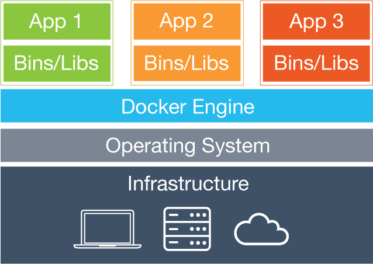

                </td>
            </tr>
            <tr class="c95">
                <td class="c58" colspan="1" rowspan="1">
                    

                        Figura 1 - Arquitectura de una m&aacute;quina virtual

                    
Fuente: <a class="c26" href="https://www.google.com/url?q=https://www.docker.com/what-docker&amp;sa=D&amp;ust=1489312943739000&amp;usg=AFQjCNEC1-kpCGBCfuOh6J3PE1hVlYqF1A">https://www.docker.com/what-docker</a>&nbsp;

                </td>
                <td class="c58" colspan="1" rowspan="1">
                    

                        Figura 2 - Arquitectura de un contenedor Docker

                    
Fuente: <a class="c26" href="https://www.google.com/url?q=https://www.docker.com/what-docker&amp;sa=D&amp;ust=1489312943740000&amp;usg=AFQjCNHpKON5PGhFHuWi7Sjj4YcFEbidYA">https://www.docker.com/what-docker</a>&nbsp;

                </td>
            </tr>
        </tbody>
    </table>
    

    
Un buen ejemplo es el t&aacute;ndem Vagrant + Docker. &nbsp;Mientras que Docker alivia muchas de las desventajas de tener muchas aplicaciones ejecut&aacute;ndose localmente para los distintos entornos (development, test, stating/acceptance, production&hellip;), las maquinas virtuales proveen de m&uacute;ltiples instancias de Docker. De este modo hacemos uso de la m&aacute;quina virtual para arrancar o parar su propia plataforma Docker, permitiendo un r&aacute;pido aprovisionamiento de servicios.

    

    
Adem&aacute;s la abstracci&oacute;n prove&iacute;da por Docker es muy &uacute;til ya que solo con una m&aacute;quina virtual &nbsp;se elimina el problema de la tecnolog&iacute;a subyacente, haci&eacute;ndolas invisible para el servicio implementado. De este modo tenemos las construcciones de nuestros servicios creadas, almacenadas, versionadas en el registro del Docker y listas para ser usadas.

    

    
Otros caso de aplicaci&oacute;n son por ejemplo en Plataforma como Servicio (PaaS) e Infraestructura como Servicio (IaaS). Aunque existen otras plataformas como Kubernetes<a href="#ftnt13" id="ftnt_ref13">[13]</a>&nbsp;que facilitan la provisi&oacute;n r&aacute;pida y la alta disponibilidad de contenedores, cada vez m&aacute;s el ecosistema Docker cuenta con m&aacute;s herramientas que solventan este tipo de necesidades, como es Docker Swarm. 

    <h2 class="c25" id="h.w3hcch520bsp">6.4 Docker compose</h2>
    
Es una de las herramientas disponibles en el ecosistema docker. Docker Compose es una herramienta para definir y ejecutar aplicaciones multicontenedor basadas en Docker. Con compose usas un fichero de configuraci&oacute;n para todos los servicios de tu aplicaci&oacute;n y con un solo comando crea y ejecuta todos los servicios de tu configuraci&oacute;n. Algunas de sus caracter&iacute;sticas son:

    

    <ul class="c12 lst-kix_czexvz1zoqdr-0 start">
        <li class="c6">M&uacute;ltiples entornos aislados en un &uacute;nico host.</li>
        <li class="c6">Mantiene los datos de los contenedores cuando son creados.</li>
        <li class="c6">Solo reconstruye los contenedores cuando estos han cambiado.</li>
        <li class="c6">M&uacute;ltiples configuraciones a trav&eacute;s de variables y herencia.</li>
    </ul>
    

    
Dada su notoriedad en internet como est&aacute;ndar de facto<a href="#ftnt14" id="ftnt_ref14">[14]</a>&nbsp;para gestionar contenedores Docker, ser&aacute; la tecnolog&iacute;a usada para la gesti&oacute;n de la infraestructura.

    <h2 class="c25" id="h.und8h6tobxc0">6.5 Mysql</h2>
    
MySQL es la base de datos relacional open source m&aacute;s extendida en el mundo. Por este motivo y dada su aceptaci&oacute;n en la comunidad me he decantado por esta soluci&oacute;n.

    <h2 class="c25" id="h.1ud2a4izwsfw">6.6 Neo4j</h2>
    
A diferencia de otras soluciones noSQL<a href="#ftnt15" id="ftnt_ref15">[15]</a>&nbsp;que se basan en formatos de datos como JSON y XML, esta es una base de datos orientada a grafos implementada en Java. En ella se representa la informaci&oacute;n como nodos y sus relaciones como aristas de forma que pueda ser aplicada teor&iacute;a de grafos para leer la informaci&oacute;n. 

    

    <ul class="c12 lst-kix_mug6ghwu2qqc-0 start">
        <li class="c6">Rendimiento. Poseen un rendimiento muy por encima de las bases de datos relacionales (SQL) y por debajo de las actuales noSQL. </li>
        <li class="c6">Agilidad. Gracias a su simpleza para gestionar los datos la convierten en la perfecta elecci&oacute;n para casi cualquier tipo de desarrollo.</li>
        <li class="c6">Escalabilidad. Al no disponer de esquemas fijos no requiere de esfuerzo extra por parte de los sistemas para replicar datos, como tambi&eacute;n se da en las bases de datos noSQL. </li>
    </ul>
    

    
Har&eacute; uso de esta tecnolog&iacute;a ya que Neo4j es la base de datos orientada a grafos m&aacute;s extendida y de mayor notoriedad.

    <h2 class="c25" id="h.xepqcfaamnt">6.7 Spring boot</h2>
    
La aparici&oacute;n de tecnolog&iacute;as como Ruby on Rails o Nodejs han impulsado la orientaci&oacute;n hacia la infraestructura como c&oacute;digo, ya que ofrec&iacute;an soluciones autosuficientes para el desarrollo y la ejecuci&oacute;n de aplicativos. 

    

    
Spring es el framework m&aacute;s reconocido por la comunidad Java y gracias a su madurez, sus creadores, Pivotal<a href="#ftnt16" id="ftnt_ref16">[16]</a>, crean Spring Boot . 

    

    
Spring Boot ofrece las ventajas de desarrollo bajo entorno Spring sin los inconvenientes de incorporar, decidir o adaptar el desarrollo a un modelo de servidor web espec&iacute;fico, dado que el mismo provee de los mecanismos suficientes para su ejecuci&oacute;n.

    

    
Siguiendo la l&iacute;nea de arquitectura como c&oacute;digo, Spring boot ser&aacute; parte indispensable de la arquitectura del proyecto.

    

    

    

    <h1 class="c9" id="h.hpp4beucubjm">7 DESCRIPCI&Oacute;N T&Eacute;CNICA</h1>
    
En el siguiente diagrama se describe a alto nivel la arquitectura propuesta:

    

    
    
    <table class="c3">
        <tbody>
            <tr class="c86">
                <td class="c54" colspan="1" rowspan="1">
                    
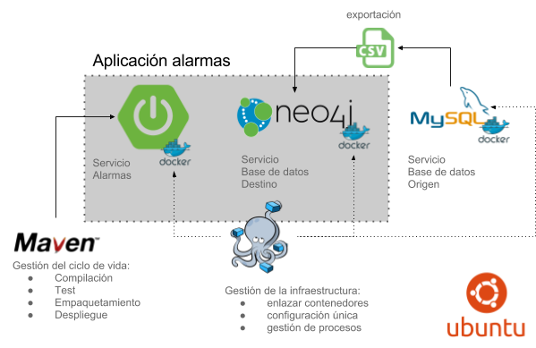

                </td>
            </tr>
            <tr class="c17">
                <td class="c54" colspan="1" rowspan="1">
                    

                        Figura 3 - Diagrama de arquitectura alto nivel

                    
Mashup de m&uacute;ltiples fuentes: <a class="c26" href="https://www.google.com/url?q=http://www.iconsdb.com/icon-sets/web-2-green-icons/csv-icon.html&amp;sa=D&amp;ust=1489312943758000&amp;usg=AFQjCNFRH5jLcKFQQUzPw3NykwIYuhCqHA">http://www.iconsdb.com/icon-sets/web-2-green-icons/csv-icon.html</a>, <a class="c26" href="https://www.google.com/url?q=https://www.mysql.com/&amp;sa=D&amp;ust=1489312943758000&amp;usg=AFQjCNG9DbUU4p9frLw7tf7xxrZhI7qpFg">https://www.mysql.com/</a>,&nbsp;<a class="c26" href="https://www.google.com/url?q=https://maven.apache.org/&amp;sa=D&amp;ust=1489312943759000&amp;usg=AFQjCNEIhtl1pxyviJ6l8dpBRRrbxf_dLw">https://maven.apache.org/</a>,&nbsp;<a class="c26" href="https://www.google.com/url?q=https://www.docker.com/&amp;sa=D&amp;ust=1489312943759000&amp;usg=AFQjCNGSBr0PlPISnpZpFXtKjFgfXcwnTA">https://www.docker.com/</a>,&nbsp;<a class="c26" href="https://www.google.com/url?q=http://www.ubuntu.com/&amp;sa=D&amp;ust=1489312943760000&amp;usg=AFQjCNHgt7dMMEeL_722KnWSPDnWIOEufA">http://www.ubuntu.com/</a>, <a class="c26" href="https://www.google.com/url?q=http://projects.spring.io/spring-boot/&amp;sa=D&amp;ust=1489312943760000&amp;usg=AFQjCNEbBzi-NqoG7IAJVhw7uHsHdPU31A">http://projects.spring.io/spring-boot/</a>&nbsp;&nbsp; 

                </td>
            </tr>
        </tbody>
    </table>
    

    
Esta arquitectura es bastante sencilla y no va a cubrir todas las &aacute;reas de una empresa, ya que el objeto de este proyecto es mostrar c&oacute;mo el uso de esta tecnolog&iacute;as dan valor al negocio.

    

    
La arquitectura est&aacute; centrada en la aplicaci&oacute;n de Alarmas, compuesta por sistema operativo Linux en el que se provisionar&aacute; una aplicaci&oacute;n basada en dos servicios. Vamos a explicar en qu&eacute; consiste esta arquitectura.

    <h2 class="c25" id="h.e1use2wt49l">7.1 Gesti&oacute;n de la infraestructura</h2>
    
En este punto encontramos Docker como tecnolog&iacute;a predominante y sobre la que nos apoyamos para la completa configuraci&oacute;n de la infraestructura con el objetivo de facilitar la configuraci&oacute;n e interacci&oacute;n de los servicios

    <h2 class="c25" id="h.1pifvithpdls">7.2 Gesti&oacute;n del ciclo de vida de la aplicaci&oacute;n</h2>
    
Maven ser&aacute; el encargado de gestionar el ciclo de vida del servicio de alarmas e incluso de la generaci&oacute;n de la imagen Docker para el servicio de alarmas.

    <h2 class="c25" id="h.58r6voj6x6ql">7.3 Aplicaci&oacute;n alarmas</h2>
    
Est&aacute; compuesta por el servicio de base de datos destino y el servicio de alarmas. La aplicaci&oacute;n alarmas pretende convertirse en un sistema de detecci&oacute;n de fraudes que transmita a los usuarios cualquier nuevo fraude en el que se est&eacute; incurriendo. 

    <h2 class="c25" id="h.p5vclgjff3l6">7.4 Servicios</h2>
    
Los servicios estar&aacute;n compuestos por contenedores Docker, son:

    <h3 class="c25" id="h.q8legfp1z7i2">7.4.1 Servicio base de datos origen</h3>
    
Base de datos Mysql que emular&aacute; el modelo de dominio de la empresa, y contendr&aacute; un modelos de datos que servir&aacute; como punto de partida para el proceso de migraci&oacute;n y transformaci&oacute;n de la informaci&oacute;n.

    <h3 class="c25" id="h.dchsma5wg3te">7.4.2 Servicio base de datos destino</h3>
    
Base de datos Neo4j que contendr&aacute; el modelo de dominio destino tras aplicar un proceso de transformaci&oacute;n de la informaci&oacute;n que est&aacute; contenida en la base de datos origen. Adem&aacute;s proveer&aacute; de datos a la aplicaci&oacute;n de alarmas.

    <h3 class="c25" id="h.d9kc45ybxj44">7.4.3 Servicio alarmas</h3>
    
Aplicaci&oacute;n desarrollada en Spring boot que realizar&aacute; una lectura peri&oacute;dica de la informaci&oacute;n almacenada en la base de datos destino y emitir&aacute; un evento al usuario cada vez que se localice un nuevo fraude.

    

    <h1 class="c9" id="h.to41exjw804o">8 PROTOTIPO</h1>
    <h2 class="c25" id="h.lvja5s2jesb">8.1 Requisitos</h2>
    <ul class="c12 lst-kix_809cjxw5z86h-0 start">
        <li class="c6">Sistema Ubuntu 15.10, </li>
        <li class="c6">Software</li>
    </ul>
    <ul class="c12 lst-kix_809cjxw5z86h-1 start">
        <li class="c15 c60">Oracle JDK 8</li>
        <li class="c15 c60">Maven 3.x</li>
        <li class="c15 c60">Docker 1.11.x</li>
        <li class="c15 c60">Docker-compose 1.3.x</li>
    </ul>
    <ul class="c12 lst-kix_809cjxw5z86h-0">
        <li class="c6">Imagenes docker</li>
    </ul>
    <ul class="c12 lst-kix_809cjxw5z86h-1 start">
        <li class="c15 c60">Neo4j official</li>
        <li class="c15 c60">Mysql official </li>
        <li class="c15 c60">Alpine oraclejdk8</li>
    </ul>
    

    

    <h3 class="c25" id="h.2jh7z5bjba1u">8.1.1 Instalaci&oacute;n y configuraci&oacute;n</h3>
    
Para la instalaci&oacute;n partiremos desde un sistema Ubuntu 15.10 reci&eacute;n instalado como premisa 

    <h4 class="c25" id="h.ssfd6nm4zge6">8.1.1.1 Jdk </h4>
    
Para la instalaci&oacute;n del JDK oficial y no el prove&iacute;do por defecto en Ubuntu (OpenJDK) se han seguido los siguientes pasos:

    

    
Agregar un repositorio APT de que contenga el paquete del JDK de Oracle:

    

    
    
    <table class="c3">
        <tbody>
            <tr class="c17">
                <td class="c49" colspan="1" rowspan="1">
                    
$ sudo add-apt-repository ppa:webupd8team/java

                </td>
            </tr>
        </tbody>
    </table>
    

    
Instalar JDK 8:

    
    
    <table class="c3">
        <tbody>
            <tr class="c17">
                <td class="c49" colspan="1" rowspan="1">
                    
$ sudo apt-get update

                    
$ sudo apt-get install oracle-java8-installer

                </td>
            </tr>
        </tbody>
    </table>
    

    
Verificar la instalaci&oacute;n:

    
    
    <table class="c3">
        <tbody>
            <tr class="c17">
                <td class="c49" colspan="1" rowspan="1">
                    
$ java -version

                    
java version &quot;1.8.0_91&quot;

                    
Java(TM) SE Runtime Environment (build 1.8.0_91-b14)

                    
Java HotSpot(TM) 64-Bit Server VM (build 25.91-b14, mixed mode)

                </td>
            </tr>
        </tbody>
    </table>
    

    <h4 class="c25" id="h.kdhj801hujmt">8.1.1.2 Software</h4>
    
Para la instalaci&oacute;n del software usaremos por defecto el software prove&iacute;do por el sistema operativo. Para ello ayud&aacute;ndonos de la herramienta apt-get &nbsp;bastar&aacute; con ejecutar los siguientes comandos:

    
    
    <table class="c3">
        <tbody>
            <tr class="c17">
                <td class="c49" colspan="1" rowspan="1">
                    
$ apt-get update

                    
$ apt-get install docker-engine docker-compose maven

                </td>
            </tr>
        </tbody>
    </table>
    

    
Y tras ello verificaremos las instalaciones, para 

    

    
Maven:

    
    
    <table class="c3">
        <tbody>
            <tr class="c17">
                <td class="c49" colspan="1" rowspan="1">
                    
$ mvn -v

                    
Apache Maven 3.3.3

                    
Maven home: /usr/share/maven

                    
Java version: 1.8.0_91, vendor: Oracle Corporation

                    
Java home: /usr/lib/jvm/java-8-oracle/jre

                    
Default locale: es_ES, platform encoding: UTF-8

                    
OS name: &quot;linux&quot;, version: &quot;4.2.0-35-generic&quot;, arch: &quot;amd64&quot;, family: &quot;unix&quot;

                </td>
            </tr>
        </tbody>
    </table>
    

    
Docker:

    
    
    <table class="c3">
        <tbody>
            <tr class="c17">
                <td class="c49" colspan="1" rowspan="1">
                    
$ docker -v

                    
Docker version 1.11.1, build 5604cbe

                </td>
            </tr>
        </tbody>
    </table>
    

    
Docker compose:

    
    
    <table class="c3">
        <tbody>
            <tr class="c17">
                <td class="c49" colspan="1" rowspan="1">
                    
$ docker-compose -v

                    
docker-compose version: 1.3.1

                    
CPython version: 2.7.10

                    
OpenSSL version: OpenSSL 1.0.2d 9 Jul 2015

                </td>
            </tr>
        </tbody>
    </table>
    

    <h4 class="c25" id="h.eov8537ttv32">8.1.1.3 Imagenes docker</h4>
    
Aunque las im&aacute;genes son descargadas por defecto en el momento en el que son usadas en este caso mostrar&eacute; c&oacute;mo se realiza la descarga de las mismas:

    

    
    
    <table class="c3">
        <tbody>
            <tr class="c17">
                <td class="c49" colspan="1" rowspan="1">
                    
$ docker pull frolvlad/alpine-oraclejdk8

                    
$ docker pull neo4j

                    
$ docker pull mysql

                </td>
            </tr>
        </tbody>
    </table>
    

    
Y una vez descargadas verificamos que las im&aacute;genes ya est&aacute;n disponibles localmente:

    

    
    
    <table class="c3">
        <tbody>
            <tr class="c17">
                <td class="c49" colspan="1" rowspan="1">
                    
$ docker images

                    
REPOSITORY &nbsp; &nbsp; &nbsp; &nbsp; &nbsp; &nbsp; &nbsp; &nbsp; &nbsp; TAG &nbsp; &nbsp; IMAGE ID &nbsp; &nbsp; &nbsp;CREATED &nbsp; &nbsp; &nbsp; SIZE

                    
frolvlad/alpine-oraclejdk8 &nbsp; slim &nbsp; &nbsp;235ff60512aa &nbsp;6 minute ago &nbsp;167.4 MB

                    
neo4j &nbsp; &nbsp; &nbsp; &nbsp; &nbsp; &nbsp; &nbsp; &nbsp; &nbsp; &nbsp; &nbsp; &nbsp;latest &nbsp;89bec6f32b19 &nbsp;3 minute ago &nbsp;411.3 MB

                    
mysql &nbsp; &nbsp; &nbsp; &nbsp; &nbsp; &nbsp; &nbsp; &nbsp; &nbsp; &nbsp; &nbsp; &nbsp;latest &nbsp;7a5866c2edbf &nbsp;1 minute ago &nbsp;361.3 MB

                </td>
            </tr>
        </tbody>
    </table>
    

    <h2 class="c25" id="h.o5gmgjysn90l">8.2 Desarrollo</h2>
    
El desarrollo lo dividir&eacute; en tres partes bien diferenciadas:

    <h3 class="c25" id="h.vm4c17kr6fvf">8.2.1 Fase 1 - base</h3>
    
Durante esta fase, se desarrollaran:

    <ol class="c12 lst-kix_gie1cig2oqoz-0 start" start="1">
        <li class="c5 c52">Base para Aplicaci&oacute;n de Alarmas.</li>
        <li class="c5 c52">Ficheros de configuraci&oacute;n Docker y Docker Compose</li>
    </ol>
    

    

    <h4 class="c25" id="h.a6vfw9nklvsr">8.2.1.1 Base aplicaci&oacute;n de alarmas</h4>
    

    
En primer lugar creamos la estructura b&aacute;sica del proyecto:

    

    
    
    <table class="c3">
        <tbody>
            <tr class="c17">
                <td class="c49" colspan="1" rowspan="1">
                    
$ mkdir -p alarmas-app/src/main/java/ alarmas-app/src/main/docker &nbsp;alarmas-app/src/main/resources

                    
$ cd alarmas-app

                </td>
            </tr>
        </tbody>
    </table>
    

    
Creamos un fichero pom.xml con este contenido:

    

    
    
    <table class="c3">
        <tbody>
            <tr class="c17">
                <td class="c49" colspan="1" rowspan="1">
                    
&lt;?xml version=&quot;1.0&quot; encoding=&quot;UTF-8&quot;?&gt;

                    
&lt;project xmlns=&quot;http://maven.apache.org/POM/4.0.0&quot; xmlns:xsi=&quot;http://www.w3.org/2001/XMLSchema-instance&quot;

                    
&nbsp;&nbsp;&nbsp;&nbsp;&nbsp;&nbsp;&nbsp;&nbsp;xsi:schemaLocation=&quot;http://maven.apache.org/POM/4.0.0 http://maven.apache.org/xsd/maven-4.0.0.xsd&quot;&gt;

                    
&nbsp;&nbsp;&nbsp;&nbsp;&nbsp;&nbsp;&nbsp;&nbsp;&lt;modelVersion&gt;4.0.0&lt;/modelVersion&gt;

                    
&nbsp;&nbsp;&nbsp;&nbsp;&nbsp;&nbsp;&nbsp;&nbsp;&lt;parent&gt;

                    
&nbsp;&nbsp;&nbsp;&nbsp;&nbsp;&nbsp;&nbsp;&nbsp;&nbsp;&nbsp;&nbsp;&nbsp;&nbsp;&nbsp;&nbsp;&nbsp;&lt;groupId&gt;org.springframework.boot&lt;/groupId&gt;

                    
&nbsp;&nbsp;&nbsp;&nbsp;&nbsp;&nbsp;&nbsp;&nbsp;&nbsp;&nbsp;&nbsp;&nbsp;&nbsp;&nbsp;&nbsp;&nbsp;&lt;artifactId&gt;spring-boot-starter-parent&lt;/artifactId&gt;

                    
&nbsp;&nbsp;&nbsp;&nbsp;&nbsp;&nbsp;&nbsp;&nbsp;&nbsp;&nbsp;&nbsp;&nbsp;&nbsp;&nbsp;&nbsp;&nbsp;&lt;version&gt;1.3.3.RELEASE&lt;/version&gt;

                    
&nbsp;&nbsp;&nbsp;&nbsp;&nbsp;&nbsp;&nbsp;&nbsp;&lt;/parent&gt;

                    

                    
&nbsp;&nbsp;&nbsp;&nbsp;&nbsp;&nbsp;&nbsp;&nbsp;&lt;groupId&gt;martin.vallejo&lt;/groupId&gt;

                    
&nbsp;&nbsp;&nbsp;&nbsp;&nbsp;&nbsp;&nbsp;&nbsp;&lt;artifactId&gt;alarmas-app&lt;/artifactId&gt;

                    
&nbsp;&nbsp;&nbsp;&nbsp;&nbsp;&nbsp;&nbsp;&nbsp;&lt;version&gt;1.0.0&lt;/version&gt;

                    
&nbsp;&nbsp;&nbsp;&nbsp;&nbsp;&nbsp;&nbsp;&nbsp;&lt;properties&gt;

                    
&nbsp;&nbsp;&nbsp;&nbsp;&nbsp;&nbsp;&nbsp;&nbsp;&nbsp;&nbsp;&nbsp;&nbsp;&nbsp;&nbsp;&nbsp;&nbsp;&lt;java.version&gt;1.8&lt;/java.version&gt;

                    
&nbsp;&nbsp;&nbsp;&nbsp;&nbsp;&nbsp;&nbsp;&nbsp;&lt;/properties&gt;

                    
&nbsp;&nbsp;&nbsp;&nbsp;&nbsp;&nbsp;&nbsp;&nbsp;&lt;dependencies&gt;

                    
&nbsp;&nbsp;&nbsp;&nbsp;&nbsp;&nbsp;&nbsp;&nbsp;&nbsp;&nbsp;&nbsp;&nbsp;&nbsp;&nbsp;&nbsp;&nbsp;&lt;dependency&gt;

                    
&nbsp;&nbsp;&nbsp;&nbsp;&nbsp;&nbsp;&nbsp;&nbsp;&nbsp;&nbsp;&nbsp;&nbsp;&nbsp;&nbsp;&nbsp;&nbsp;&nbsp;&nbsp;&nbsp;&nbsp;&nbsp;&nbsp;&nbsp;&nbsp;&lt;groupId&gt;org.springframework.boot&lt;/groupId&gt;

                    
&nbsp;&nbsp;&nbsp;&nbsp;&nbsp;&nbsp;&nbsp;&nbsp;&nbsp;&nbsp;&nbsp;&nbsp;&nbsp;&nbsp;&nbsp;&nbsp;&nbsp;&nbsp;&nbsp;&nbsp;&nbsp;&nbsp;&nbsp;&nbsp;&lt;artifactId&gt;spring-boot-starter-data-rest&lt;/artifactId&gt;

                    
&nbsp;&nbsp;&nbsp;&nbsp;&nbsp;&nbsp;&nbsp;&nbsp;&nbsp;&nbsp;&nbsp;&nbsp;&nbsp;&nbsp;&nbsp;&nbsp;&lt;/dependency&gt;

                    
&nbsp;&nbsp;&nbsp;&nbsp;&nbsp;&nbsp;&nbsp;&nbsp;&lt;/dependencies&gt;

                    
&nbsp;&nbsp;&nbsp;&nbsp;&nbsp;&nbsp;&nbsp;&nbsp;&lt;build&gt;

                    
&nbsp;&nbsp;&nbsp;&nbsp;&nbsp;&nbsp;&nbsp;&nbsp;&nbsp;&nbsp;&nbsp;&nbsp;&nbsp;&nbsp;&nbsp;&nbsp;&lt;plugins&gt;

                    
&nbsp;&nbsp;&nbsp;&nbsp;&nbsp;&nbsp;&nbsp;&nbsp;&nbsp;&nbsp;&nbsp;&nbsp;&nbsp;&nbsp;&nbsp;&nbsp;&nbsp;&nbsp;&nbsp;&nbsp;&nbsp;&nbsp;&nbsp;&nbsp;&lt;plugin&gt;

                    
&nbsp;&nbsp;&nbsp;&nbsp;&nbsp;&nbsp;&nbsp;&nbsp;&nbsp;&nbsp;&nbsp;&nbsp;&nbsp;&nbsp;&nbsp;&nbsp;&nbsp;&nbsp;&nbsp;&nbsp;&nbsp;&nbsp;&nbsp;&nbsp;&nbsp;&nbsp;&nbsp;&nbsp;&nbsp;&nbsp;&nbsp;&nbsp;&lt;groupId&gt;org.springframework.boot&lt;/groupId&gt;

                    
&nbsp;&nbsp;&nbsp;&nbsp;&nbsp;&nbsp;&nbsp;&nbsp;&nbsp;&nbsp;&nbsp;&nbsp;&nbsp;&nbsp;&nbsp;&nbsp;&nbsp;&nbsp;&nbsp;&nbsp;&nbsp;&nbsp;&nbsp;&nbsp;&nbsp;&nbsp;&nbsp;&nbsp;&nbsp;&nbsp;&nbsp;&nbsp;&lt;artifactId&gt;spring-boot-maven-plugin&lt;/artifactId&gt;

                    
&nbsp;&nbsp;&nbsp;&nbsp;&nbsp;&nbsp;&nbsp;&nbsp;&nbsp;&nbsp;&nbsp;&nbsp;&nbsp;&nbsp;&nbsp;&nbsp;&nbsp;&nbsp;&nbsp;&nbsp;&nbsp;&nbsp;&nbsp;&nbsp;&lt;/plugin&gt;

                    
&nbsp;&nbsp;&nbsp;&nbsp;&nbsp;&nbsp;&nbsp;&nbsp;&nbsp;&nbsp;&nbsp;&nbsp;&nbsp;&nbsp;&nbsp;&nbsp;&lt;/plugins&gt;

                    
&nbsp;&nbsp;&nbsp;&nbsp;&nbsp;&nbsp;&nbsp;&nbsp;&lt;/build&gt;

                    
&nbsp;&nbsp;&nbsp;&nbsp;&nbsp;&nbsp;&nbsp;&nbsp;&lt;repositories&gt;

                    
&nbsp;&nbsp;&nbsp;&nbsp;&nbsp;&nbsp;&nbsp;&nbsp;&nbsp;&nbsp;&nbsp;&nbsp;&nbsp;&nbsp;&nbsp;&nbsp;&lt;repository&gt;

                    
&nbsp;&nbsp;&nbsp;&nbsp;&nbsp;&nbsp;&nbsp;&nbsp;&nbsp;&nbsp;&nbsp;&nbsp;&nbsp;&nbsp;&nbsp;&nbsp;&nbsp;&nbsp;&nbsp;&nbsp;&nbsp;&nbsp;&nbsp;&nbsp;&lt;id&gt;spring-releases&lt;/id&gt;

                    
&nbsp;&nbsp;&nbsp;&nbsp;&nbsp;&nbsp;&nbsp;&nbsp;&nbsp;&nbsp;&nbsp;&nbsp;&nbsp;&nbsp;&nbsp;&nbsp;&nbsp;&nbsp;&nbsp;&nbsp;&nbsp;&nbsp;&nbsp;&nbsp;&lt;name&gt;Spring Releases&lt;/name&gt;

                    
&nbsp;&nbsp;&nbsp;&nbsp;&nbsp;&nbsp;&nbsp;&nbsp;&nbsp;&nbsp;&nbsp;&nbsp;&nbsp;&nbsp;&nbsp;&nbsp;&nbsp;&nbsp;&nbsp;&nbsp;&nbsp;&nbsp;&nbsp;&nbsp;&lt;url&gt;https://repo.spring.io/libs-release&lt;/url&gt;

                    
&nbsp;&nbsp;&nbsp;&nbsp;&nbsp;&nbsp;&nbsp;&nbsp;&nbsp;&nbsp;&nbsp;&nbsp;&nbsp;&nbsp;&nbsp;&nbsp;&lt;/repository&gt;

                    
&nbsp;&nbsp;&nbsp;&nbsp;&nbsp;&nbsp;&nbsp;&nbsp;&lt;/repositories&gt;

                    
&lt;/project&gt;

                </td>
            </tr>
            <tr class="c17">
                <td class="c49" colspan="1" rowspan="1">
                    
pom.xml

                </td>
            </tr>
        </tbody>
    </table>
    

    
Finalmente agregamos nuevas clase Aplicaci&oacute;n que gestionar&aacute; el arranque de nuestra aplicaci&oacute;n:

    

    

    
    
    <table class="c3">
        <tbody>
            <tr class="c17">
                <td class="c49" colspan="1" rowspan="1">
                    
package martin.vallejo.alarmas;

                    

                    
import org.springframework.boot.SpringApplication;

                    
import org.springframework.boot.autoconfigure.SpringBootApplication;

                    

                    
@SpringBootApplication

                    
public class Application {

                    

                    
&nbsp;&nbsp;&nbsp;&nbsp;&nbsp;&nbsp;&nbsp;&nbsp;private static final Logger logger = LoggerFactory.getLogger(Application.class);

                    

                    
&nbsp;&nbsp;&nbsp;&nbsp;&nbsp;&nbsp;&nbsp;&nbsp;public static void main(String[] args) {

                    
&nbsp;&nbsp;&nbsp;&nbsp;&nbsp;&nbsp;&nbsp;&nbsp;&nbsp;&nbsp;&nbsp;&nbsp;&nbsp;&nbsp;&nbsp;&nbsp;SpringApplication.run(Application.class, args);

                    
&nbsp;&nbsp;&nbsp;&nbsp;&nbsp;&nbsp;&nbsp;&nbsp;}

                    
}

                </td>
            </tr>
            <tr class="c17">
                <td class="c49" colspan="1" rowspan="1">
                    
src/main/java/martin.vallejo.alarmas.Application

                </td>
            </tr>
        </tbody>
    </table>
    

    
Y un controlador que mostrar&aacute; un saludo al entrar en la aplicaci&oacute;n:

    

    
    
    <table class="c3">
        <tbody>
            <tr class="c17">
                <td class="c49" colspan="1" rowspan="1">
                    
package martin.vallejo.alarmas.controller;

                    

                    
import org.springframework.web.bind.annotation.RestController;

                    
import org.springframework.web.bind.annotation.RequestMapping;

                    

                    
@RestController

                    
public class MainController {

                    

                    
&nbsp;&nbsp;&nbsp;&nbsp;&nbsp;&nbsp;&nbsp;&nbsp;@RequestMapping(&quot;/&quot;)

                    
&nbsp;&nbsp;&nbsp;&nbsp;&nbsp;&nbsp;&nbsp;&nbsp;public String index() {

                    
&nbsp;&nbsp;&nbsp;&nbsp;&nbsp;&nbsp;&nbsp;&nbsp;&nbsp;&nbsp;&nbsp;&nbsp;&nbsp;&nbsp;&nbsp;&nbsp;return &quot;Hello!&quot;;

                    
&nbsp;&nbsp;&nbsp;&nbsp;&nbsp;&nbsp;&nbsp;&nbsp;}

                    
}

                </td>
            </tr>
            <tr class="c17">
                <td class="c49" colspan="1" rowspan="1">
                    
cu

                </td>
            </tr>
        </tbody>
    </table>
    

    
Finalmente compilamos, empaquetamos y arrancamos nuestra aplicaci&oacute;n con:

    

    
    
    <table class="c3">
        <tbody>
            <tr class="c17">
                <td class="c49" colspan="1" rowspan="1">
                    
$ mvn clean package &amp;&amp; java -jar target/alarmas-app-1.0.0.jar 

                    
&hellip;

                    
02:17:54.488 [main] INFO &nbsp;martin.vallejo.alarmas.Application - Neo4j url: http://localhost:7474

                    

                    
&nbsp; . &nbsp; ____ &nbsp; &nbsp; &nbsp; &nbsp; &nbsp;_ &nbsp; &nbsp; &nbsp; &nbsp; &nbsp; &nbsp;__ _ _

                    
&nbsp;/\\ / ___&#39;_ __ _ _(_)_ __ &nbsp;__ _ \ \ \ \

                    
( ( )\___ | &#39;_ | &#39;_| | &#39;_ \/ _` | \ \ \ \

                    
&nbsp;\\/ &nbsp;___)| |_)| | | | | || (_| | &nbsp;) ) ) )

                    
&nbsp; &#39; &nbsp;|____| .__|_| |_|_| |_\__, | / / / /

                    
&nbsp;=========|_|==============|___/=/_/_/_/

                    
&nbsp;:: Spring Boot :: &nbsp; &nbsp; &nbsp; &nbsp;(v1.3.3.RELEASE)

                    

                    
2016-05-01 02:17:55.620 DEBUG 9867 --- [ &nbsp; &nbsp; &nbsp; &nbsp; &nbsp; main] o.s.w.c.s.StandardServletEnvironment &nbsp; &nbsp; : Adding [servletConfigInitParams] PropertySource with lowest search precedence

                    
2016-05-01 02:17:55.621 DEBUG 9867 --- [ &nbsp; &nbsp; &nbsp; &nbsp; &nbsp; main] o.s.w.c.s.StandardServletEnvironment &nbsp; &nbsp; : Adding [servletContextInitParams] PropertySource with lowest search precedence

                    
...

                </td>
            </tr>
        </tbody>
    </table>
    

    
Para verificarlo basta con ejecutar:

    

    
    
    <table class="c3">
        <tbody>
            <tr class="c17">
                <td class="c49" colspan="1" rowspan="1">
                    
$ curl <a class="c26" href="https://www.google.com/url?q=http://localhost:8080/&amp;sa=D&amp;ust=1489312943850000&amp;usg=AFQjCNGHQokxNFdXIQdS7qwyobqSYrxOpg">http://localhost:8080/</a>

                    
Hello!

                </td>
            </tr>
        </tbody>
    </table>
    

    <h4 class="c25" id="h.lksehgnfby33">8.2.1.2 Configuraci&oacute;n docker y compose</h4>
    

    <h5 class="c9" id="h.9ocd64zeotd">8.2.1.2.1 Servicio alarmas</h5>
    

    
Como ya se describi&oacute; en los requisitos usaremos alpine-oraclejdk8<a href="#ftnt17" id="ftnt_ref17">[17]</a>, que albergar&aacute; nuestra aplicaci&oacute;n. Para llevarlo a cabo creamos un fichero Dockerfile con el siguiente contenido:

    

    
    
    <table class="c3">
        <tbody>
            <tr class="c17">
                <td class="c49" colspan="1" rowspan="1">
                    
FROM frolvlad/alpine-oraclejdk8:slim

                    
VOLUME /tmp

                    
ADD alarmas-app-1.0.0.jar app.jar

                    
RUN sh -c &#39;touch /app.jar&#39;

                    
ENTRYPOINT [&quot;java&quot;,&quot;-Djava.security.egd=file:/dev/./urandom&quot;, &quot;-Dserver.port=8080&quot;,&quot;-jar&quot;,&quot;/app.jar&quot;]

                </td>
            </tr>
            <tr class="c17">
                <td class="c49" colspan="1" rowspan="1">
                    
src/main/docker/Dockerfile

                </td>
            </tr>
        </tbody>
    </table>
    

    
Como se puede ver en el fichero:

    <ol class="c12 lst-kix_vdh3b0j47xgm-0 start" start="1">
        <li class="c5 c52">Con el comando ADD&nbsp;agregamos el fichero jar resultante de empaquetar nuestra aplicaci&oacute;n. </li>
        <li class="c5 c52">Determinamos cual es el comando a ejecutar tras el arranque en ENTRYPOINT, que en este caso es ejecutar el jar como ya hicimos anteriormente.</li>
    </ol>
    

    

    <h5 class="c9" id="h.9mxfu2ijqxj0">8.2.1.2.2 Docker aplicaci&oacute;n de alarmas</h5>
    

    
Como ya se describi&oacute; anteriormente la aplicaci&oacute;n de alarmas est&aacute; compuesta por un servicio de BD NoSQL Neo4j y el servicio de alarmas<a href="#ftnt18" id="ftnt_ref18">[18]</a>. Creamos un fichero alarmas.compose&nbsp;en el cual a&ntilde;adiremos el siguiente contenido:

    

    
    
    <table class="c3">
        <tbody>
            <tr class="c17">
                <td class="c49" colspan="1" rowspan="1">
                    
# Gestiona el arranque de los servicios de la aplicaci&oacute;n de alarmas

                    
# Arranque: docker-compose -f alarmas.compose up -d

                    
# Parada: docker-compose -f alarmas.compose up -d

                    
neo4j:

                    
&nbsp; &nbsp; image: neo4j:latest

                    
&nbsp; &nbsp; ports:

                    
&nbsp; &nbsp; &nbsp; &nbsp; - 7474:7474

                    
&nbsp; &nbsp; &nbsp; &nbsp; - 7687:7687

                    
&nbsp; &nbsp; volumes:

                    
&nbsp; &nbsp; &nbsp; &nbsp; - ./neo4j/data:/data

                    
&nbsp; &nbsp; &nbsp; &nbsp; - ./csv:/files

                    
&nbsp; &nbsp; environment:

                    
&nbsp; &nbsp; &nbsp; &nbsp; - NEO4J_AUTH=none

                    
alarmas:

                    
&nbsp; &nbsp; image: alarmas-app:latest

                    
&nbsp; &nbsp; ports:

                    
&nbsp; &nbsp; &nbsp; &nbsp; - 8080:8080

                    
&nbsp; &nbsp; links: &nbsp; &nbsp; &nbsp; &nbsp;

                    
&nbsp; &nbsp; &nbsp; &nbsp; - neo4j

                </td>
            </tr>
            <tr class="c17">
                <td class="c49" colspan="1" rowspan="1">
                    
alarmas.compose

                </td>
            </tr>
        </tbody>
    </table>
    

    
El contenido est&aacute; dividido en dos servicios:

    <ol class="c12 lst-kix_w2hkgiutbw7i-0 start" start="1">
        <li class="c6">neo4j, como servicio de base de datos </li>
        <li class="c6">alarmas, como servicio de aplicaci&oacute;n</li>
    </ol>
    

    
Los par&aacute;metros de configuraci&oacute;n que usaremos son los siguientes:

    

    <ol class="c12 lst-kix_y3gnafa2oi1w-0 start" start="1">
        <li class="c6">ports, donde determinamos los puertos que queremos exponer</li>
        <li class="c6">volumes, donde definimos el mapeo entre el sistema de ficheros de la m&aacute;quina host y la imagen de docker. En este caso tenemos configurado dos volumes&nbsp;para Neo4j que definen:</li>
    </ol>
    <ol class="c12 lst-kix_ebfq1uymhoep-0 start" start="1">
        <li class="c15 c60">./neo4j/data:/data, ubicaci&oacute;n del los ficheros de BD</li>
        <li class="c15 c60">./csv:/files, ubicaci&oacute;n del directorio donde se leer&aacute;n los ficheros CSV&nbsp;que usaremos para el proceso ETL, y del cual hablaremos m&aacute;s adelante.</li>
    </ol>
    <ol class="c12 lst-kix_y3gnafa2oi1w-0" start="3">
        <li class="c6">environment, que define las variables de entorno usadas por el servicio y que permiten configurarlo a su vez. Las definidas son:</li>
    </ol>
    <ol class="c12 lst-kix_y3gnafa2oi1w-1 start" start="1">
        <li class="c27 c60">NEO4J_AUTH=none, para desactivar la seguridad con el fin de simplificar la interacci&oacute;n con Neo4j</li>
    </ol>
    <ol class="c12 lst-kix_y3gnafa2oi1w-0" start="4">
        <li class="c6">links, donde damos la visibilidad a otros servicios configurados. En el caso del servicio de alarmas tiene visibilidad sobre el servicio de base de datos, facilitando las configuraciones y accesos a las mismas. </li>
    </ol>
    

    <h5 class="c9" id="h.4gghtlp9wut6">8.2.1.2.3 Servicio mysql</h5>
    
La configuraci&oacute;n de nuestra base de datos inicial estar&aacute; contenida en un fichero llamado mysql.compose&nbsp;que tiene el siguiente aspecto:

    

    
    
    <table class="c3">
        <tbody>
            <tr class="c17">
                <td class="c49" colspan="1" rowspan="1">
                    
# Gestiona la base de datos de MySQL

                    
# Arranque: docker-compose -f mysql.compose up -d

                    
# Parada: docker-compose -f mysql.compose up -d

                    
mysql:

                    
&nbsp; &nbsp; image: mysql:latest

                    
&nbsp; &nbsp; environment:

                    
&nbsp; &nbsp; &nbsp; &nbsp; - MYSQL_ROOT_PASSWORD=root

                    
&nbsp; &nbsp; ports:

                    
&nbsp; &nbsp; &nbsp; &nbsp; - 3306:3306

                    
&nbsp; &nbsp; volumes:

                    
&nbsp; &nbsp; &nbsp; &nbsp; - ./mysql/data:/var/lib/mysql

                    
&nbsp; &nbsp; &nbsp; &nbsp; - ./csv:/var/lib/mysql-files

                </td>
            </tr>
            <tr class="c17">
                <td class="c49" colspan="1" rowspan="1">
                    
mysql.compose

                </td>
            </tr>
        </tbody>
    </table>
    

    
En este caso tenemos configurado dos volumes&nbsp;que definen:

    <ol class="c12 lst-kix_ebfq1uymhoep-0" start="3">
        <li class="c15 c60">./mysql/data:/var/lib/mysql, ubicaci&oacute;n del los ficheros de BD</li>
        <li class="c15 c60">./csv:/var/lib/mysql-files, ubicaci&oacute;n del directorio donde se almacenar&aacute;n los ficheros CSV&nbsp;que usaremos para el proceso ETL, y del cual hablaremos m&aacute;s adelante. Este dato puede ser obtenido ejecutando la siguiente sentencia en MySQL:</li>
    </ol>
    

    
    
    <table class="c3">
        <tbody>
            <tr class="c17">
                <td class="c49" colspan="1" rowspan="1">
                    
SHOW VARIABLES LIKE &quot;secure_file_priv&quot;;

                </td>
            </tr>
        </tbody>
    </table>
    

    <h3 class="c25" id="h.bhde9t8t37up">8.2.2 Fase 2 - an&aacute;lisis y migraci&oacute;n</h3>
    <h4 class="c25" id="h.i4iuc2ffccag">8.2.2.1 Modelo de datos inicial (sql)</h4>
    

    
    
    <table class="c3">
        <tbody>
            <tr class="c17">
                <td class="c54" colspan="1" rowspan="1">
                    
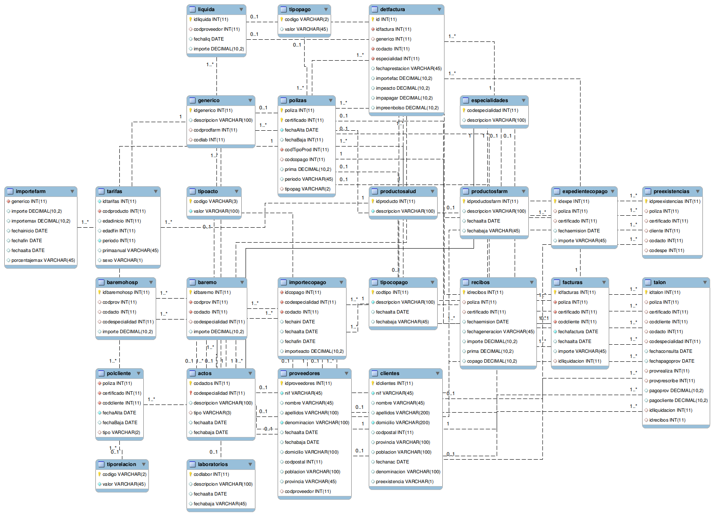

                </td>
            </tr>
            <tr class="c17">
                <td class="c54" colspan="1" rowspan="1">
                    

                        Figura 4 - Modelo de datos inicial

                    
Fuente propia

                </td>
            </tr>
        </tbody>
    </table>
    

    <h5 class="c9" id="h.dndwpeqg51zl">8.2.2.1.1 Descripci&oacute;n del modelo</h5>
    
Descripci&oacute;n de las tablas m&aacute;s importantes del modelo creado:

    

    <ul class="c12 lst-kix_j84uxmsyid4j-0 start">
        <li class="c6">Clientes, datos de los asegurados.</li>
        <li class="c6">Productos, maestro de los productos existentes en la compa&ntilde;&iacute;a.</li>
        <li class="c6">P&oacute;lizas, datos de las p&oacute;lizas: forma de pago, tipo de producto, importe de la prima, fecha alta/baja, forma de pago...</li>
        <li class="c6">Polcliente, relaci&oacute;n entre los clientes y las p&oacute;lizas. Aqu&iacute; vemos cu&aacute;ntas personas hay en una p&oacute;liza, que tipo de relaci&oacute;n existe entre ellos, cuando fu&eacute; la fecha de alta/baja&hellip;</li>
        <li class="c6">Tarifas, desglose de precios por a&ntilde;o del importe de la prima de la p&oacute;liza.</li>
        <li class="c6">Especialidades, maestro de especialidades m&eacute;dicas (Dermatolog&iacute;a, Pediatr&iacute;a...).</li>
        <li class="c6">Actos, hace referencia a las tareas que realiza un m&eacute;dico por cada Especialidad.( Consulta, Revisi&oacute;n, Vacunaci&oacute;n...).</li>
        <li class="c6">Preexistencias, listado de Especialidades/Actos que no est&aacute;n cubiertas en el seguro contratado para un asegurado. Son enfermedades u operaciones previas a la contrataci&oacute;n del seguro.</li>
        <li class="c6">Talon, datos de los servicios m&eacute;dicos realizados por los clientes-asegurados. Para cada p&oacute;liza vemos qu&eacute; cliente ha ido ido al medico, que especialidad/acto ha necesitado, a qu&eacute; m&eacute;dico a ido, si hay otro m&eacute;dico que le ha mandado las pruebas, cuando ocurri&oacute;, cu&aacute;nto tiene que pagar el asegurado y cuanto hay que pagarle al m&eacute;dico...</li>
        <li class="c6">Facturas, Facturas presentadas por asegurados o por m&eacute;dicos. Por ejemplo facturas farmac&eacute;uticas presentadas por los aseguradas para solicitar un reembolso o bien facturas de los m&eacute;dicos que llegan por papel.</li>
        <li class="c6">DetFactura, detalle de actos/especialidades que se desglosan en las facturas con su importe.</li>
        <li class="c6">Recibo, desglose de los pagos de los asegurados.</li>
        <li class="c6">Proveedores, datos de los m&eacute;dicos u Hospitales.</li>
        <li class="c6">Baremos, listado de importes que una compa&ntilde;&iacute;a paga a cada proveedor por Especialidad/acto.</li>
        <li class="c6">Liquidaci&oacute;n, desglose de los pagos a los proveedores.</li>
    </ul>
    

    <h4 class="c25" id="h.cf8dvvb5uw7c">8.2.2.2 Modelo de datos objetivo (grafo)</h4>
    

    
    
    <table class="c3">
        <tbody>
            <tr class="c17">
                <td class="c54" colspan="1" rowspan="1">
                    
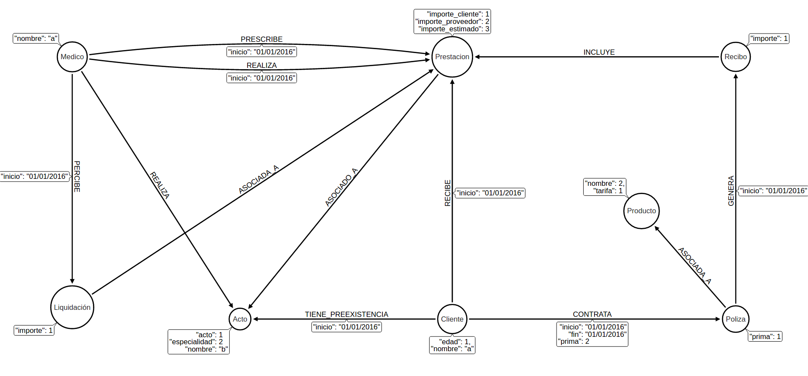

                </td>
            </tr>
            <tr class="c17">
                <td class="c54" colspan="1" rowspan="1">
                    

                        Figura 5 - Modelo de datos objetivo

                    
Fuente propia

                </td>
            </tr>
        </tbody>
    </table>
    

    <h5 class="c9" id="h.codpxqkg0zrx">8.2.2.2.1 Descripci&oacute;n del modelo</h5>
    

    
El modelo objetivo est&aacute; centrado en las entidades m&aacute;s importantes del modelo inicial. Cada una de las filas de las tablas del modelo inicial conformar&aacute;n los nodos del modelo objetivo y en ocasiones los v&eacute;rtices servir&aacute;n para agregar informaci&oacute;n temporal a la relaci&oacute;n.

    

    
Como resultado, los nodos ser&aacute;n:

    

    <ul class="c12 lst-kix_4oi4etc7bs3a-0 start">
        <li class="c5 c52">Cliente/Asegurado, el que contrata una P&oacute;liza en una fecha y con una prima.</li>
        <li class="c5 c52">P&oacute;liza, definida para un Producto concreto y tiene una tarifa espec&iacute;fica para obtener su prima.</li>
        <li class="c5 c52">Clientes, los que reciben Prestaciones m&eacute;dicas. En una fecha concreta, el cliente recibe determinados servicios m&eacute;dicos y tiene que pagar un importe por ellos.</li>
        <li class="c5 c52">Prestaciones, los servicios m&eacute;dicos los realizan y los prescriben M&eacute;dicos. Las prestaciones son los talones y facturas en el modelo de datos.</li>
        <li class="c5 c52">M&eacute;dicos, que cobran Liquidaciones por parte de la empresa.</li>
        <li class="c5 c52">M&eacute;dicos, las Prestaciones y los Clientes que tienen preexistencias poseen un listado de Actos asociados que los determina. </li>
        <li class="c5 c52">Cliente, que paga el importe del Recibo en una fecha.</li>
        <li class="c5 c52">P&oacute;lizas, que generan Recibos en una fecha.</li>
        <li class="c5 c52">Recibo, incluye el importe de la prima y el importe de las prestaciones m&eacute;dicas. </li>
    </ul>
    

    <h4 class="c25" id="h.7f0yukxcnmly">8.2.2.3 ETL - Extracci&oacute;n, Transformaci&oacute;n y Carga</h4>
    

    
ETL<a href="#ftnt19" id="ftnt_ref19">[19]</a>&nbsp;(siglas de extract, transform and load) es el proceso usado en entornos BI (Business Intelligence, basados principalmente en Data Warehouse) para la migraci&oacute;n de grandes vol&uacute;menes de datos entre bases de datos.

    

    
Como describen sus siglas el proceso consta:

    <ol class="c12 lst-kix_9tm7py85ny4s-0 start" start="1">
        <li class="c6">Extracci&oacute;n, donde se exportan los datos del sistema de origen a un formato intermedio.</li>
        <li class="c6">Transformaci&oacute;n, donde por norma general se realizan agregaciones y conversiones. Esta fase puede ser llevada en parte o en su totalidad durante la Extracci&oacute;n y Carga.</li>
        <li class="c6">Carga, donde se importan los datos en el sistema destino.</li>
    </ol>
    

    
Como parte del objetivo de este proyecto, realizaremos el proceso ETL para realizar la migraci&oacute;n del modelo original (SQL) al modelo objetivo (Grafo). El proceso constar&aacute; de dos partes:

    <ol class="c12 lst-kix_avowbswd35oe-0 start" start="1">
        <li class="c6">MySQL a CVS</li>
        <li class="c6">CVS a Neo4J</li>
    </ol>
    

    <h5 class="c9" id="h.turbe9o8e8my">8.2.2.3.1 MySQLl a CSV</h5>
    
En esta parte realizaremos la extracci&oacute;n de los datos de la base de datos inicial utilizando las mismas herramientas de las que nos provee MySQL. 

    

    
Mysql provee de una herramienta de exportaci&oacute;n de texto basado en SQL, que usado correctamente nos permite crear ficheros con formato CSV. Este formato es adem&aacute;s aceptado por las herramientas tipo excel.

    

    
Este ser&iacute;a el formato de la query de exportaci&oacute;n.

    

    
    
    <table class="c3">
        <tbody>
            <tr class="c42">
                <td class="c49" colspan="1" rowspan="1">
                    
SELECT &#39;campo1&#39;, &#39;campo2&#39;, ... 

                    
UNION 

                    
SELECT campo1, campo2, ...

                    
FROM tabla

                    
INTO OUTFILE &#39;ubicacion/fichero.csv&#39;

                    
FIELDS ENCLOSED BY &#39;&quot;&#39; TERMINATED BY &#39;,&#39; ESCAPED BY &#39;&#39; 

                    
LINES TERMINATED BY &#39;\r\n&#39;;

                </td>
            </tr>
        </tbody>
    </table>
    

    
Con ella obtenemos un fichero CSV compuesto por:

    <ol class="c12 lst-kix_vbjefu8d69if-0 start" start="1">
        <li class="c6">Una primera fila de cabecera, con los nombres de los campos (SELECT &#39;campo1&#39;, &#39;campo2&#39;, ... )</li>
        <li class="c6">Filas con datos, con los valores de cada uno de los campos (SELECT campo1, campo2, ...)</li>
        <li class="c6">Ubicacion del fichero y parametros de exportaci&oacute;n (INTO OUTFILE &#39;ubicacion/fichero.csv&#39; ...)</li>
    </ol>
    

    
La extracci&oacute;n de datos ser&aacute; llevada a cabo sobre las siguientes tablas a fin de obtener los datos necesarios para completar el modelo objetivo:

    

    <ul class="c12 lst-kix_82d0z5w5jh92-0 start">
        <li class="c6">productosalud</li>
        <li class="c6">recibos </li>
        <li class="c6">clientes </li>
        <li class="c6">polizas</li>
        <li class="c6">actos</li>
        <li class="c6">proveedores</li>
        <li class="c6">baremo</li>
        <li class="c6">liquida</li>
        <li class="c6">talon</li>
    </ul>
    

    
Un ejemplo de exportaci&oacute;n ser&iacute;a:

    

    
    
    <table class="c3">
        <tbody>
            <tr class="c17">
                <td class="c49" colspan="1" rowspan="1">
                    
-- CLIENTE Y SUS POLIZAS

                    
SELECT &#39;cliente&#39;, &#39;poliza&#39;, &#39;inicio&#39;, &#39;fin&#39;, &#39;prima&#39;

                    
UNION

                    
SELECT idclientes, polizas.poliza, UNIX_TIMESTAMP(polcliente.fechaalta), UNIX_TIMESTAMP(polcliente.fechabaja), prima

                    
FROM clientes

                    
LEFT JOIN polcliente ON polcliente.codcliente = clientes.idclientes 

                    
LEFT JOIN polizas ON polcliente.poliza = polizas.poliza

                    
INTO OUTFILE &#39;/var/lib/mysql-files/cliente_poliza.csv&#39;

                    
FIELDS ENCLOSED BY &#39;&quot;&#39; TERMINATED BY &#39;,&#39; ESCAPED BY &#39;&#39; 

                    
LINES TERMINATED BY &#39;\r\n&#39;;

                </td>
            </tr>
        </tbody>
    </table>
    

    
En este ejemplo tratamos de extraer las p&oacute;lizas asociadas a clientes que m&aacute;s tarde nos permitir&aacute; realizar la carga en el modelo objetivo:

    

    

    
    
    <table class="c3">
        <tbody>
            <tr class="c17">
                <td class="c54" colspan="1" rowspan="1">
                    
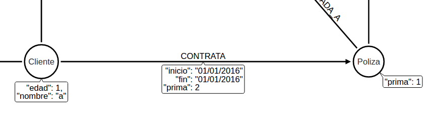

                </td>
            </tr>
            <tr class="c17">
                <td class="c54" colspan="1" rowspan="1">
                    

                        Figura 6 - Relaci&oacute;n cliente p&oacute;liza

                    
Fuente propia

                </td>
            </tr>
        </tbody>
    </table>
    

    <h5 class="c9" id="h.4ao9hjqnhopn">8.2.2.3.2 CSV a Neo4J</h5>
    
Una vez los datos extra&iacute;dos de Mysql est&aacute;n disponibles en formato CSV es posible realizar la carga de los datos en Neo4J. Al igual que MySQL, Neo4J proporciona una herramienta para carga de datos desde CSV.

    

    
Este ser&iacute;a el formato de la query de importaci&oacute;n:

    

    
    
    <table class="c3">
        <tbody>
            <tr class="c71">
                <td class="c49" colspan="1" rowspan="1">
                    
LOAD CSV WITH HEADERS FROM &#39;file:///ubicacion/fichero.csv&#39; AS line

                    
QUERY ...

                    
RETURN ...

                </td>
            </tr>
        </tbody>
    </table>
    

    
Compuesta por:

    <ol class="c12 lst-kix_iorpjqg1o56q-0 start" start="1">
        <li class="c6">Carga del fichero objetivo y opciones</li>
        <li class="c6">Query a ejecutar basada en el conjunto de datos proporcionados por el fichero objetivo.</li>
        <li class="c6">Retorno o salida, si es necesaria.</li>
    </ol>
    

    
Un ejemplo de importaci&oacute;n ser&iacute;a:

    

    
    
    <table class="c3">
        <tbody>
            <tr class="c93">
                <td class="c49" colspan="1" rowspan="1">
                    
// 5 Importar clientes

                    
LOAD CSV WITH HEADERS FROM &#39;file:///files/clientes.csv&#39; AS line

                    
CREATE (cliente:Cliente {id: TOINT(line.id) })

                    
SET cliente.edad = TOINT(line.edad), 

                    
&nbsp;&nbsp;&nbsp;&nbsp;&nbsp;&nbsp;&nbsp;&nbsp;cliente.nombre = line.nombre + &#39; &#39; + line.apellidos

                    
RETURN cliente

                </td>
            </tr>
        </tbody>
    </table>
    

    
En este ejemplo creamos clientes desde los datos proporcionados por el fichero CSV y realizamos conversiones de tipos como son el caso del ID, del nombre y concatenaciones para nombre.

    

    <h3 class="c25" id="h.2nrzzrkpsg9w">8.2.3 Fase 3 - Implementaci&oacute;n de alarmas</h3>
    <h4 class="c25" id="h.9jfh187aqux4">8.2.3.1 Conceptos</h4>
    
Dado que Spring provee de un sin fin de soluciones para el desarrollo, es importante conocer algunos t&eacute;rminos que utilizaremos:

    

    
Repository&nbsp;

    
interfaz especializada de JPARepository<a href="#ftnt20" id="ftnt_ref20">[20]</a>&nbsp;y que sustituye a los antiguos DAOS. Proveen de un conjunto de acciones CRUD<a href="#ftnt21" id="ftnt_ref21">[21]</a>&nbsp;b&aacute;sicas y permite agregar nuevas. 

    

    
Scheduler

    
Tarea planificada para un momento determinado. Ejecuta c&oacute;digo una vez llegada la fecha prefijada.

    

    
Modelo

    
Bean que representa un conjunto de datos. 

    

    
Cypher

    
lenguaje de consulta de Neo4J. Este lenguaje es muy intuitivo de tal forma que el modelado de las queries se realiza representando es casi forma id&eacute;ntica al resultado. Un ejemplo ser&iacute;a: 

    

    
    
    <table class="c3">
        <tbody>
            <tr class="c17">
                <td class="c49" colspan="1" rowspan="1">
                    
MATCH (n1:Nodo1)-[r:RELACION]-&gt;(n2:Nodo2) RETURN n1, r, n2

                </td>
            </tr>
            <tr class="c17">
                <td class="c49" colspan="1" rowspan="1">
                    
Ejemplo de query Neo4j

                </td>
            </tr>
        </tbody>
    </table>
    

    
Donde:

    <ol class="c12 lst-kix_puxrcdcrid1z-0 start" start="1">
        <li class="c6">MATCH, define qu&eacute; elementos formar&aacute;n parte de la cl&aacute;usula de b&uacute;squeda</li>
        <li class="c6">(n1:Nodo1)-[r:RELACION]-&gt;(n2:Nodo2), define los elementos y el modo de relacionarse entre los mismos:</li>
    </ol>
    <ol class="c12 lst-kix_puxrcdcrid1z-1 start" start="1">
        <li class="c15 c60">(n1:Nodo1),(n2:Nodo2), V&eacute;rtices<a href="#ftnt22" id="ftnt_ref22">[22]</a>&nbsp;o Nodos involucrados, representados entre par&eacute;ntesis</li>
        <li class="c15 c60">-[r:RELACION]-&gt;, Arista<a href="#ftnt23" id="ftnt_ref23">[23]</a>&nbsp;o relaci&oacute;n:</li>
    </ol>
    <ol class="c12 lst-kix_puxrcdcrid1z-2 start" start="1">
        <li class="c15 c44">--, Definici&oacute;n de arista,</li>
        <li class="c15 c44">[r:RELACION], Tipo de relaci&oacute;n</li>
        <li class="c15 c44">&gt;, Direcci&oacute;n<a href="#ftnt24" id="ftnt_ref24">[24]</a></li>
    </ol>
    <ol class="c12 lst-kix_puxrcdcrid1z-0" start="3">
        <li class="c6">RETURN, determina qu&eacute; valores ser&aacute;n retornados por la query</li>
    </ol>
    

    <h4 class="c25" id="h.q27f85364ewa">8.2.3.2 Ajustes</h4>
    
Como ya vimos anteriormente en la FASE 1 - BASE, es una aplicaci&oacute;n basada en el starter web de spring boot. Dado que centraremos toda nuestra atenci&oacute;n en los schedulers y queries se eliminar&aacute; la dependencia spring-boot-starter-data-rest&nbsp;y el controlador MainController&nbsp;asociado. Tras una actualizaci&oacute;n de dependencias nuestro pom.xml&nbsp;contendr&aacute;:

    

    
    
    <table class="c3">
        <tbody>
            <tr class="c17">
                <td class="c49" colspan="1" rowspan="1">
                    
&lt;parent&gt;

                    
&nbsp;&nbsp;&nbsp;&nbsp;&nbsp;&nbsp;&nbsp;&nbsp;&lt;groupId&gt;org.springframework.boot&lt;/groupId&gt;

                    
&nbsp;&nbsp;&nbsp;&nbsp;&nbsp;&nbsp;&nbsp;&nbsp;&lt;artifactId&gt;spring-boot-starter-parent&lt;/artifactId&gt;

                    
&nbsp;&nbsp;&nbsp;&nbsp;&nbsp;&nbsp;&nbsp;&nbsp;&lt;version&gt;1.4.0.M3&lt;/version&gt;

                    
&lt;/parent&gt;

                    
...

                    
&lt;dependency&gt;

                    
&nbsp;&nbsp;&nbsp;&nbsp;&nbsp;&nbsp;&nbsp;&nbsp;&lt;groupId&gt;org.springframework.boot&lt;/groupId&gt;

                    
&nbsp;&nbsp;&nbsp;&nbsp;&nbsp;&nbsp;&nbsp;&nbsp;&lt;artifactId&gt;spring-boot-starter-web&lt;/artifactId&gt;

                    
&lt;/dependency&gt;

                    
&lt;dependency&gt;

                    
&nbsp;&nbsp;&nbsp;&nbsp;&nbsp;&nbsp;&nbsp;&nbsp;&lt;groupId&gt;org.springframework.data&lt;/groupId&gt;

                    
&nbsp;&nbsp;&nbsp;&nbsp;&nbsp;&nbsp;&nbsp;&nbsp;&lt;artifactId&gt;spring-data-commons&lt;/artifactId&gt;

                    
&lt;/dependency&gt;

                    
&lt;dependency&gt;

                    
&nbsp;&nbsp;&nbsp;&nbsp;&nbsp;&nbsp;&nbsp;&nbsp;&lt;groupId&gt;org.springframework.data&lt;/groupId&gt;

                    
&nbsp;&nbsp;&nbsp;&nbsp;&nbsp;&nbsp;&nbsp;&nbsp;&lt;artifactId&gt;spring-data-neo4j&lt;/artifactId&gt;

                    
&nbsp;&nbsp;&nbsp;&nbsp;&nbsp;&nbsp;&nbsp;&nbsp;&lt;version&gt;4.1.1.RELEASE&lt;/version&gt;

                    
&lt;/dependency&gt;

                </td>
            </tr>
        </tbody>
    </table>
    

    <h4 class="c25" id="h.85ai2h56doyc">8.2.3.3 Configuracion scheduler </h4>
    
Para activar la funcionalidad de scheduling bastar&aacute; con agregar @EnableScheduling&nbsp;a nuestra clase Application:

    

    
    
    <table class="c3">
        <tbody>
            <tr class="c17">
                <td class="c49" colspan="1" rowspan="1">
                    
@SpringBootApplication

                    
@EnableScheduling

                    
public class Application {

                    
...

                </td>
            </tr>
        </tbody>
    </table>
    

    
Esto nos permitir&aacute; m&aacute;s tarde crear schedulers que revisen el estado de la base de datos en busca de fraudes.

    

    <h4 class="c25" id="h.vj4wt4uvp5nl">8.2.3.4 Conectividad Neo4J</h4>
    
Para llevar a cabo la conectividad con Neo4J, creamos nuestra configuraci&oacute;n bas&aacute;ndonos&nbsp;en Neo4jConfiguration&nbsp;incluida en spring-data-neo4j:

    

    
    
    <table class="c3">
        <tbody>
            <tr class="c17">
                <td class="c49" colspan="1" rowspan="1">
                    
@org.springframework.context.annotation.Configuration

                    
@EnableNeo4jRepositories(&quot;martin.vallejo.alarmas.repository&quot;)

                    
@EnableTransactionManagement

                    
public class ApplicationConfig extends Neo4jConfiguration {

                    
&nbsp;&nbsp;&nbsp;&nbsp;&nbsp;&nbsp;&nbsp;&nbsp;private static final Logger logger = LoggerFactory.getLogger(ApplicationConfig.class);

                    

                    
&nbsp;&nbsp;&nbsp;&nbsp;&nbsp;&nbsp;&nbsp;&nbsp;...

                    

                    
&nbsp;&nbsp;&nbsp;&nbsp;&nbsp;&nbsp;&nbsp;&nbsp;@Bean

                    
&nbsp;&nbsp;&nbsp;&nbsp;&nbsp;&nbsp;&nbsp;&nbsp;public Configuration getConfiguration() {

                    
&nbsp;&nbsp;&nbsp;&nbsp;&nbsp;&nbsp;&nbsp;&nbsp;&nbsp;&nbsp;&nbsp;&nbsp;&nbsp;&nbsp;&nbsp;&nbsp;// cargamos la configuracion de neo4j

                    
&nbsp;&nbsp;&nbsp;&nbsp;&nbsp;&nbsp;&nbsp;&nbsp;&nbsp;&nbsp;&nbsp;&nbsp;&nbsp;&nbsp;&nbsp;&nbsp;if (logger.isInfoEnabled()) {

                    
&nbsp;&nbsp;&nbsp;&nbsp;&nbsp;&nbsp;&nbsp;&nbsp;&nbsp;&nbsp;&nbsp;&nbsp;&nbsp;&nbsp;&nbsp;&nbsp;&nbsp;&nbsp;&nbsp;&nbsp;&nbsp;&nbsp;&nbsp;&nbsp;logger.info(&quot;Neo4j url: &quot; + URL);

                    
&nbsp;&nbsp;&nbsp;&nbsp;&nbsp;&nbsp;&nbsp;&nbsp;&nbsp;&nbsp;&nbsp;&nbsp;&nbsp;&nbsp;&nbsp;&nbsp;}

                    
&nbsp;&nbsp;&nbsp;&nbsp;&nbsp;&nbsp;&nbsp;&nbsp;&nbsp;&nbsp;&nbsp;&nbsp;&nbsp;&nbsp;&nbsp;&nbsp;Configuration config = new Configuration();

                    
&nbsp;&nbsp;&nbsp;&nbsp;&nbsp;&nbsp;&nbsp;&nbsp;&nbsp;&nbsp;&nbsp;&nbsp;&nbsp;&nbsp;&nbsp;&nbsp;config.driverConfiguration()//

                    
&nbsp;&nbsp;&nbsp;&nbsp;&nbsp;&nbsp;&nbsp;&nbsp;&nbsp;&nbsp;&nbsp;&nbsp;&nbsp;&nbsp;&nbsp;&nbsp;&nbsp;&nbsp;&nbsp;&nbsp;&nbsp;&nbsp;&nbsp;&nbsp;&nbsp;&nbsp;&nbsp;&nbsp;&nbsp;&nbsp;&nbsp;&nbsp;.setDriverClassName(&quot;org.neo4j.ogm.drivers.http.driver.HttpDriver&quot;)//

                    
&nbsp;&nbsp;&nbsp;&nbsp;&nbsp;&nbsp;&nbsp;&nbsp;&nbsp;&nbsp;&nbsp;&nbsp;&nbsp;&nbsp;&nbsp;&nbsp;&nbsp;&nbsp;&nbsp;&nbsp;&nbsp;&nbsp;&nbsp;&nbsp;&nbsp;&nbsp;&nbsp;&nbsp;&nbsp;&nbsp;&nbsp;&nbsp;.setURI(URL);

                    
&nbsp;&nbsp;&nbsp;&nbsp;&nbsp;&nbsp;&nbsp;&nbsp;&nbsp;&nbsp;&nbsp;&nbsp;&nbsp;&nbsp;&nbsp;&nbsp;return config;

                    
&nbsp;&nbsp;&nbsp;&nbsp;&nbsp;&nbsp;&nbsp;&nbsp;}

                    

                    
&nbsp;&nbsp;&nbsp;&nbsp;&nbsp;&nbsp;&nbsp;&nbsp;@Bean

                    
&nbsp; &nbsp; public SessionFactory getSessionFactory() {

                    
&nbsp; &nbsp; &nbsp; &nbsp; // agregamos los modelos a la factoria de sesion

                    
&nbsp; &nbsp; &nbsp; &nbsp; return new SessionFactory(getConfiguration(), &quot;martin.vallejo.alarmas.domain&quot;);

                    
&nbsp; &nbsp; }

                    

                    
}

                </td>
            </tr>
        </tbody>
    </table>
    

    
La configuraci&oacute;n est&aacute; compuesta por:

    <ol class="c12 lst-kix_z77rifdhc5b3-0 start" start="1">
        <li class="c6">@EnableNeo4jRepositories(&quot;martin.vallejo.alarmas.repository&quot;), permite definir en qu&eacute; paquete estar&aacute;n alojados los repositorios</li>
        <li class="c6">getConfiguration(), donde definimos el driver y la configuraci&oacute;n para acceder a la base de datos</li>
        <li class="c6">New SessionFactory(getConfiguration(),&quot;martin.vallejo.alarmas.domain&quot;), que define &nbsp;la ubicaci&oacute;n de los modelos.</li>
    </ol>
    

    
Para que nos hagamos una idea, y de forma conceptual y m&aacute;s visual este es el resultado de la configuraci&oacute;n aplicada:

    

    

    

    
    
    <table class="c3">
        <tbody>
            <tr class="c17">
                <td class="c54" colspan="1" rowspan="1">
                    
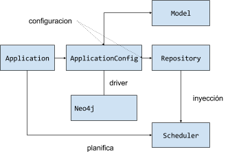

                </td>
            </tr>
            <tr class="c17">
                <td class="c54" colspan="1" rowspan="1">
                    

                        Figura 7 - Diagrama de configuraci&oacute;n

                    
Fuente propia

                </td>
            </tr>
        </tbody>
    </table>
    <h4 class="c25" id="h.ewxfcb23rd6s">8.2.3.5 Creaci&oacute;n repositorio</h4>
    
Los repositorios heredan la clase GraphRepository&nbsp;tipada por el modelo que debe gestionar y deben de estar anotados con @Repository, como se observa en el siguiente ejemplo: 

    

    
    
    <table class="c3">
        <tbody>
            <tr class="c17">
                <td class="c49" colspan="1" rowspan="1">
                    
@Repository

                    
public interface PrestacionRepository extends GraphRepository&lt;Acto&gt; {

                    

                    
&nbsp; &nbsp; @Query(&quot;OPTIONAL MATCH (medico:Medico)-[realiza:REALIZA]-&gt;(prestacion:Prestacion) &quot; +

                    
&nbsp; &nbsp; &nbsp; &nbsp; &nbsp; &nbsp; &quot;OPTIONAL MATCH (medico:Medico)-[prescribe:PREESCRIBE]-&gt;(prestacion:Prestacion) &quot; +

                    
&nbsp; &nbsp; &nbsp; &nbsp; &nbsp; &nbsp; &quot;WHERE prestacion.importe_proveedor &gt;= prestacion.importe_estimado &quot; +

                    
&nbsp; &nbsp; &nbsp; &nbsp; &nbsp; &nbsp; &quot;RETURN medico, prestacion, prescribe, realiza&quot;)

                    
&nbsp; &nbsp; Iterable&lt;FacturaEngordada&gt; getFacturasEngordadas();

                    
}

                </td>
            </tr>
        </tbody>
    </table>
    

    
En este ejemplo adem&aacute;s se agrega una nueva operaci&oacute;n basada en una query especifica para detectar facturas engordadas. Los elementos que componen esta operaci&oacute;n son:

    <ol class="c12 lst-kix_c3jn31fvzck5-0 start" start="1">
        <li class="c6">@Query, que contiene la query personalizada vinculada a getFacturasEngordadas.</li>
        <li class="c6">Iterable&lt;FacturaEngordada&gt;, como resultado de la ejecuci&oacute;n de @Query&nbsp;se obtiene un Iterable con un objeto que cumpla los valores descritos en la sentencia RETURN&nbsp;de la query. &nbsp;</li>
    </ol>
    

    
A continuaci&oacute;n un ejemplo de objeto resultante:

    

    
    
    <table class="c3">
        <tbody>
            <tr class="c17">
                <td class="c49" colspan="1" rowspan="1">
                    
@QueryResult

                    
public class FacturaEngordada {

                    

                    
&nbsp; &nbsp; private Medico medico;

                    
&nbsp; &nbsp; private Prestacion prestacion;

                    
&nbsp; &nbsp; private Prescribe prescribe;

                    
&nbsp; &nbsp; private Realiza realiza;

                    

                    
&nbsp; &nbsp; ...

                    
}

                </td>
            </tr>
        </tbody>
    </table>
    

    
Nota: V&eacute;ase que la clase est&aacute; anotada con @QueryResult

    

    
Los repositorios que crearemos cubrir&aacute;n:

    <ul class="c12 lst-kix_1od7yh45onsb-0 start">
        <li class="c6">Actos</li>
        <li class="c6">Cliente</li>
        <li class="c6">Liquidaci&oacute;n</li>
        <li class="c6">M&eacute;dico</li>
        <li class="c6">P&oacute;liza</li>
        <li class="c6">Prestaci&oacute;n</li>
        <li class="c6">Producto</li>
        <li class="c6">Recibo</li>
    </ul>
    

    
Adem&aacute;s de las operaciones b&aacute;sicas que proporcionan los repositorios, como ya se ha descrito anteriormente ser&aacute;n agregadas un total de cuatro queries para cubrir algunos casos de fraude. Las queries que agregaremos se describen a continuaci&oacute;n.

    

    <h2 class="c25" id="h.yrzj0b7z0qot">8.3 Queries</h2>
    <h3 class="c25" id="h.908sjvtjaghz">8.3.1 Alteraci&oacute;n de registros</h3>
    
Todas las p&oacute;lizas poseen una determinada prima seg&uacute;n el producto que un cliente haya contratado. Mensualmente los clientes tienen que pagar el recibo correspondiente de la prima m&aacute;s el importe de las prestaciones realizadas. Con esta query vamos a controlar que el importe del recibo no ha sido manipulado por un empleado de la compa&ntilde;&iacute;a. 

    

    
Las tablas que hemos analizado son P&oacute;lizas, Tal&oacute;n y Recibos. En la tabla de p&oacute;lizas tenemos la prima por producto y en la tabla tal&oacute;n tenemos las prestaciones que ha realizado el cliente con el importe que le corresponde pagar por cada una. El recibo ha de ser el sumatorio de ambas tablas.

    <h4 class="c25" id="h.q7ipoo4o4eli">8.3.1.1 Query cypher</h4>
    
    
    <table class="c3">
        <tbody>
            <tr class="c17">
                <td class="c49" colspan="1" rowspan="1">
                    
MATCH (pe:Prestacion)--(re:Recibo)--(po:Poliza)

                    
WITH 

                    
&nbsp;&nbsp;&nbsp;&nbsp;&nbsp;&nbsp;&nbsp;&nbsp;re,

                    
&nbsp;&nbsp;&nbsp;&nbsp;&nbsp;&nbsp;&nbsp;&nbsp;pe,

                    
&nbsp;&nbsp;&nbsp;&nbsp;&nbsp;&nbsp;&nbsp;&nbsp;po,

                    
&nbsp;&nbsp;&nbsp;&nbsp;&nbsp;&nbsp;&nbsp;&nbsp;SUM(pe.importe_cliente) AS importe_solicitado,

                    
&nbsp;&nbsp;&nbsp;&nbsp;&nbsp;&nbsp;&nbsp;&nbsp;re.importe/12 AS importe_esperado

                    
WHERE importe_solicitado &gt; importe_esperado

                    
RETURN re,pe,po

                </td>
            </tr>
        </tbody>
    </table>
    

    <h4 class="c25" id="h.h7yqx53mvhwa">8.3.1.2 Resultado</h4>
    
    
    <table class="c3">
        <tbody>
            <tr class="c17">
                <td class="c54" colspan="1" rowspan="1">
                    
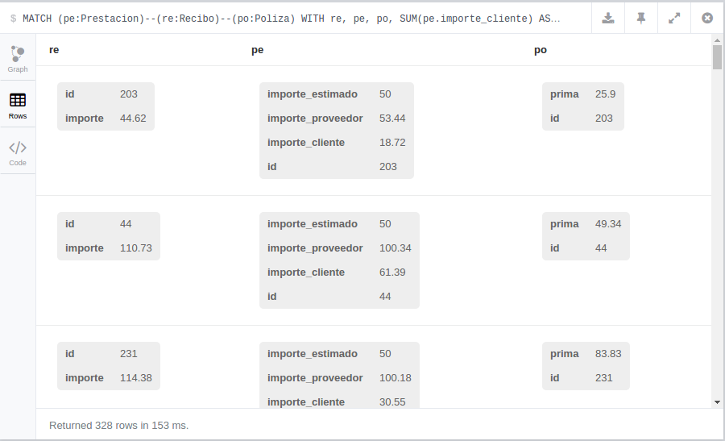

                </td>
            </tr>
            <tr class="c17">
                <td class="c54" colspan="1" rowspan="1">
                    

                        Figura 8 - Registros Alterados - Resultado de la ejecuci&oacute;n

                    
Fuente propia

                </td>
            </tr>
            <tr class="c17">
                <td class="c54" colspan="1" rowspan="1">
                    
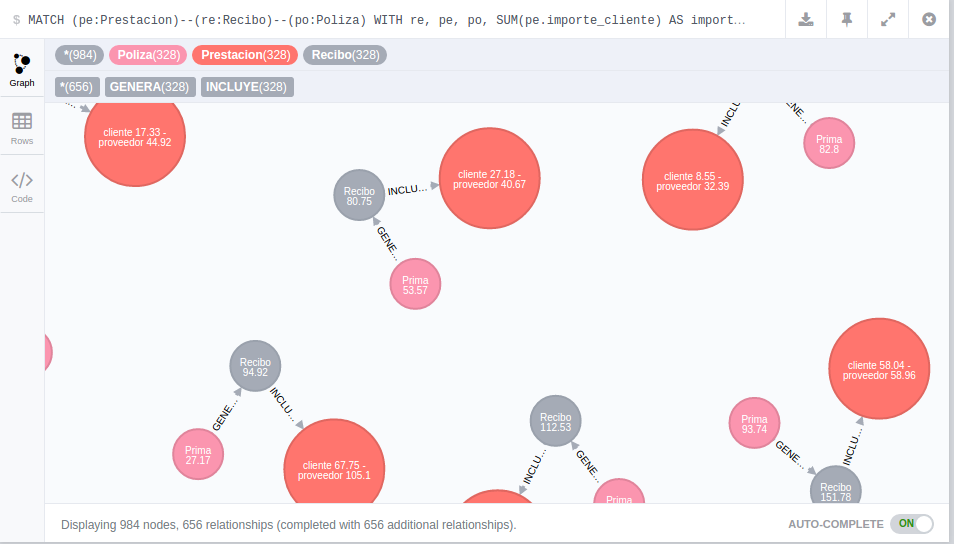

                </td>
            </tr>
            <tr class="c17">
                <td class="c54" colspan="1" rowspan="1">
                    

                        Figura 9 - Registros Alterados - Grafo resultante

                    
Fuente propia

                </td>
            </tr>
        </tbody>
    </table>
    <h3 class="c25" id="h.t08s2qyktbwk">8.3.2 Benefactor</h3>
    
En las prestaciones m&eacute;dicas, tanto en talones como facturas de los clientes, vienen detallados los m&eacute;dicos que realizan un acto y los m&eacute;dico que los prescriben. Tenemos que contabilizar las veces que un m&eacute;dico prescribe un acto y lo realiza el mismo m&eacute;dico para diferentes clientes ya que estos casos son de favoritismo.

    

    
La &uacute;nica tabla aqu&iacute; implicada es Tal&oacute;n. En esta tabla tenemos todos los datos de las p&oacute;lizas, clientes, actos m&eacute;dicos que ha necesitado, qu&eacute; m&eacute;dico se lo ha prescrito y el m&eacute;dico que ha realizado la consulta.

    

    <h4 class="c25" id="h.lvdmutazw565">8.3.2.1 Query cypher</h4>
    
    
    <table class="c3">
        <tbody>
            <tr class="c17">
                <td class="c49" colspan="1" rowspan="1">
                    
MATCH (m1:Medico)-[:PRESCRIBE]-&gt;(pe:Prestacion)&lt;-[:REALIZA]-(m2:Medico) 

                    
WITH &nbsp;

                    
&nbsp;&nbsp;&nbsp;&nbsp;&nbsp;&nbsp;&nbsp;&nbsp;m1, &nbsp;

                    
&nbsp;&nbsp;&nbsp;&nbsp;&nbsp;&nbsp;&nbsp;&nbsp;m2, 

                    
&nbsp;&nbsp;&nbsp;&nbsp;&nbsp;&nbsp;&nbsp;&nbsp;count(pe) AS total 

                    
WHERE total &gt; 2 &nbsp;

                    
RETURN m1, m2, total 

                </td>
            </tr>
        </tbody>
    </table>
    

    <h4 class="c25" id="h.18w16lw2u72i">8.3.2.2 Resultado</h4>
    
Desgraciadamente para este caso la consulta contiene una cl&aacute;usula de agregaci&oacute;n por lo que no puede ser mostrada la relaci&oacute;n entre benefactor y realizador.

    
    
    <table class="c3">
        <tbody>
            <tr class="c17">
                <td class="c54" colspan="1" rowspan="1">
                    
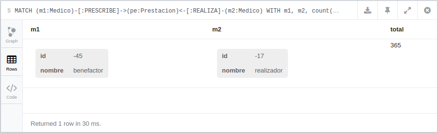

                </td>
            </tr>
            <tr class="c17">
                <td class="c54" colspan="1" rowspan="1">
                    

                        Figura 10 - Benefactor - Resultado de la ejecuci&oacute;n Fuente propia

                </td>
            </tr>
        </tbody>
    </table>
    <h3 class="c25" id="h.c363lrz7pd0p">8.3.3 Preexistencias</h3>
    
Se denominan preexistencias las enfermedades u operaciones que un cliente ha tenido antes de contratar una p&oacute;liza. Hay que tener un seguimiento especial a estos clientes y contabilizar las veces que va a un m&eacute;dico relacionado con su preexistencia.

    

    
Las tablas que hemos analizado son Cliente, Tal&oacute;n y Actos. Las preexistencias de un cliente viene detalladas por una lista de actos y de especialidades, por lo que hay que contabilizar cuantas prestaciones tiene ese cliente cuyos actos son los mismos o pueden tener relaci&oacute;n con sus preexistencias.

    <h4 class="c25" id="h.b3i3buijcjbg">8.3.3.1 Query cypher</h4>
    
    
    <table class="c3">
        <tbody>
            <tr class="c17">
                <td class="c49" colspan="1" rowspan="1">
                    
MATCH (pr:Prestacion)&lt;-[:RECIBE]-(cl:Cliente)-[:TIENE_PREEXISTENCIA]-&gt;(ac:Acto)&lt;-[:ASOCIADO_A]-(pr) 

                    
WITH cl, ac, pr, 

                    
&nbsp;&nbsp;&nbsp;&nbsp;&nbsp;&nbsp;&nbsp;&nbsp;COUNT(ac) AS total 

                    
WHERE total &gt; 10 

                    
RETURN cl, ac, pr, total; 

                </td>
            </tr>
        </tbody>
    </table>
    

    <h4 class="c25" id="h.r0v1um82fmqz">8.3.3.2 Resultado</h4>
    
    
    <table class="c3">
        <tbody>
            <tr class="c17">
                <td class="c54" colspan="1" rowspan="1">
                    
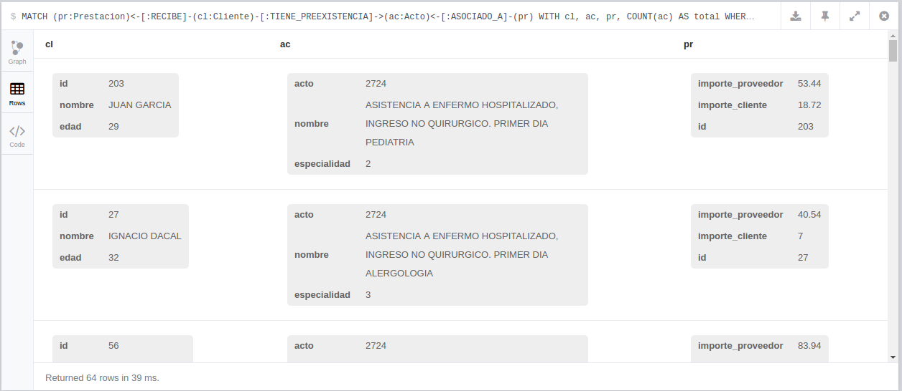

                </td>
            </tr>
            <tr class="c17">
                <td class="c54" colspan="1" rowspan="1">
                    

                        Figura 11 - Preexistencias - Resultado de la ejecuci&oacute;n

                    
Fuente propia

                </td>
            </tr>
            <tr class="c17">
                <td class="c54" colspan="1" rowspan="1">
                    
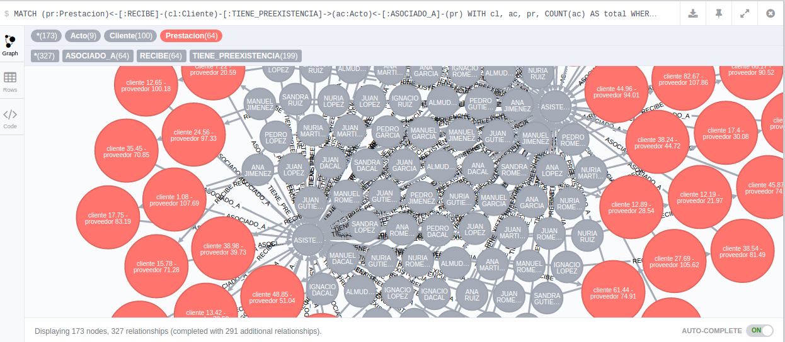

                </td>
            </tr>
            <tr class="c17">
                <td class="c54" colspan="1" rowspan="1">
                    

                        Figura 12 - Preexistencias - Resultado de la ejecuci&oacute;n

                    
Fuente propia

                </td>
            </tr>
        </tbody>
    </table>
    
&nbsp;8.3.4 Engordar facturas

    
Las prestaciones m&eacute;dicas tienen registrado los importes que hay que pagar a los clientes ,a los m&eacute;dicos y un importe que estima la compa&ntilde;&iacute;a por estos servicios.Tenemos que conocer cuales son los m&eacute;dicos cuyo importe por prestaci&oacute;n supera el importe estimado.

    

    
La tabla implicada es Tal&oacute;n, donde tenemos todos los datos de las p&oacute;lizas, clientes, actos m&eacute;dicos que ha necesitado, qu&eacute; m&eacute;dico se lo ha prescrito ,el m&eacute;dico que ha realizado la consulta ,el importe de dichos actos y el importe estimado por la compa&ntilde;&iacute;a.

    <h4 class="c25" id="h.eehsmnwwz7tk">8.3.3.3 Query cypher</h4>
    
    
    <table class="c3">
        <tbody>
            <tr class="c17">
                <td class="c49" colspan="1" rowspan="1">
                    
MATCH (medico:Medico)--(prestacion:Prestacion) 

                    
WHERE prestacion.importe_proveedor &gt;= prestacion.importe_estimado 

                    
RETURN medico, prestacion,realiza,prescribe 

                </td>
            </tr>
        </tbody>
    </table>
    
&nbsp;

    <h4 class="c25" id="h.1x66bwu3x8cr">8.3.3.4 Resultado</h4>
    
    
    <table class="c3">
        <tbody>
            <tr class="c17">
                <td class="c54" colspan="1" rowspan="1">
                    
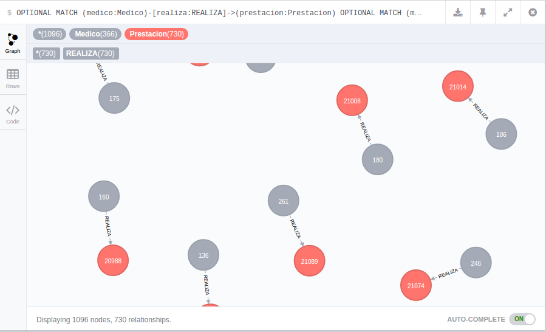

                </td>
            </tr>
            <tr class="c17">
                <td class="c54" colspan="1" rowspan="1">
                    

                        Figura 13 - Engordar Facturas - Resultado de la ejecuci&oacute;n

                    
Fuente propia

                </td>
            </tr>
        </tbody>
    </table>
    <h4 class="c25" id="h.bjsvx3uao787">8.3.3.5 Creaci&oacute;n scheduler</h4>
    

    
Para crear schedulers:

    

    
    
    <table class="c3">
        <tbody>
            <tr class="c17">
                <td class="c49" colspan="1" rowspan="1">
                    
@Component

                    
public class BenefactorScheduledTask implements AnalisisFraudeScheduleTask {

                    

                    
&nbsp; &nbsp; @Override

                    
&nbsp; &nbsp; @Scheduled(cron = &quot;0 0 * * * *&quot;)

                    
&nbsp; &nbsp; public void analizar() {

                    
&nbsp; &nbsp; &nbsp; &nbsp; &hellip; codigo

                    
&nbsp; &nbsp; }

                    
}

                </td>
            </tr>
            <tr class="c17">
                <td class="c49" colspan="1" rowspan="1">
                    
Estructura base del scheduler

                </td>
            </tr>
        </tbody>
    </table>
    

    <ol class="c12 lst-kix_jzne3rhv8o9f-0 start" start="1">
        <li class="c6">@Component, al igual que otros elementos de Spring es necesario marcar la clase con esta anotaci&oacute;n. Al agregar esta anotaci&oacute;n Spring provee de funcionalidades extra a las instancias creadas de esta clase (como si de EJB se tratar&aacute;). Un ejemplo ser&iacute;a el uso de @Autowired&nbsp;para realizar la inyecci&oacute;n de nuestros repositorios.</li>
        <li class="c6">@Scheduled, aplicado sobre el m&eacute;todo que contendr&aacute; el c&oacute;digo a ejecutar una vez se cumpla el plazo descrito en la expresi&oacute;n cron<a href="#ftnt25" id="ftnt_ref25">[25]</a>.</li>
    </ol>
    

    
Los scheduler que crearemos son (el criterio de ejecuci&oacute;n se basa en el criterio de reproducibilidad del fraude):

    <ul class="c12 lst-kix_uug25iqr6z2a-0 start">
        <li class="c6">Benefactor</li>
    </ul>
    <ul class="c12 lst-kix_uug25iqr6z2a-1 start">
        <li class="c15 c60">Ejecuci&oacute;n cada d&iacute;a 1 del mes (expresi&oacute;n &quot;0 0 0 1 * *&quot;)</li>
    </ul>
    <ul class="c12 lst-kix_uug25iqr6z2a-0">
        <li class="c6">ClientePreexistencias</li>
    </ul>
    <ul class="c12 lst-kix_uug25iqr6z2a-1 start">
        <li class="c15 c60">Ejecuci&oacute;n cada hora (expresi&oacute;n &quot;0 0 * * * *&quot;)</li>
    </ul>
    <ul class="c12 lst-kix_uug25iqr6z2a-0">
        <li class="c6">EngordarFacturas</li>
    </ul>
    <ul class="c12 lst-kix_uug25iqr6z2a-1 start">
        <li class="c15 c60">Ejecuci&oacute;n cada hora (expresi&oacute;n &quot;0 0 * * * *&quot;)</li>
    </ul>
    <ul class="c12 lst-kix_uug25iqr6z2a-0">
        <li class="c6">RegistrosAlterados</li>
    </ul>
    <ul class="c12 lst-kix_uug25iqr6z2a-1 start">
        <li class="c15 c60">Ejecuci&oacute;n cada hora (expresi&oacute;n &quot;0 0 * * * *&quot;)</li>
    </ul>
    

    
Estos a su vez est&aacute;n vinculados a una de las cuatro queries previamente descritas.

    

    <h4 class="c25" id="h.yieakodgm4vs">8.3.3.6 Ejecuci&oacute;n y Resultados</h4>
    
Una vez realizados los cambios necesarios y agregados modelos, repositorios y schedulers estamos en disposici&oacute;n de construir la aplicaci&oacute;n de Alarmas. Bastar&aacute; con ejecutar los siguientes comandos (en negrillas):

    

    
    
    <table class="c3">
        <tbody>
            <tr class="c17">
                <td class="c49" colspan="1" rowspan="1">
                    
$ cd alarmas-app

                    
$ mvn clean install docker:build

                    
...

                    
Step 5 : ENTRYPOINT java -Djava.security.egd=file:/dev/./urandom -Dserver.port=8080 -jar /app.jar

                    
---&gt; Running in 9adf954ac2f4

                    
---&gt; 2e72ecf4c72d

                    
Removing intermediate container 9adf954ac2f4

                    
Successfully built 2e72ecf4c72d

                    
[INFO] Built alarmas-app

                    
[INFO] ------------------------------------------------------------------------

                    
[INFO] BUILD SUCCESS

                    
...

                </td>
            </tr>
            <tr class="c17">
                <td class="c49" colspan="1" rowspan="1">
                    
Fragmento de ejemplo de ejecuci&oacute;n del build de maven

                </td>
            </tr>
        </tbody>
    </table>
    

    
Una vez finalizado, nuestro docker estar&aacute; disponible para ser ejecutado. Haciendo uso de docker-compose y el fichero de configuraci&oacute;n que creamos durante la FASE 1:

    

    
    
    <table class="c3">
        <tbody>
            <tr class="c17">
                <td class="c49" colspan="1" rowspan="1">
                    
$ docker-compose -f alarmas.compose up -d

                    
Creating pfg_neo4j_1...

                    
Creating pfg_alarmas_1...

                </td>
            </tr>
            <tr class="c17">
                <td class="c49" colspan="1" rowspan="1">
                    
Arrancando los servicios de Neo4j y Alarmas

                </td>
            </tr>
        </tbody>
    </table>
    

    
Como se observa docker compose se ha hecho cargo de iniciar las dos instancias para los dos servicios definidos en el fichero alarmas.compose, alarmas y neo4j. Para verificar la correcta ejecuci&oacute;n de los servicios usaremos la opci&oacute;n ps&nbsp;de docker-compose: 

    

    
    
    <table class="c3">
        <tbody>
            <tr class="c17">
                <td class="c49" colspan="1" rowspan="1">
                    
$ docker-compose -f alarmas.compose ps 

                    
&nbsp; &nbsp; &nbsp;Name &nbsp; &nbsp; &nbsp; &nbsp; &nbsp; &nbsp; &nbsp; &nbsp; &nbsp; Command &nbsp; &nbsp; &nbsp; &nbsp; &nbsp; &nbsp; &nbsp; State &nbsp; &nbsp; &nbsp; &nbsp; &nbsp; &nbsp; &nbsp; &nbsp; &nbsp; &nbsp; &nbsp; &nbsp; &nbsp; &nbsp; Ports &nbsp; &nbsp; &nbsp; &nbsp; &nbsp; &nbsp; &nbsp; &nbsp; &nbsp; &nbsp; &nbsp; &nbsp; &nbsp; 

                    
--------------------------------------------------------------------------------------------------------

                    
pfg_alarmas_1 &nbsp; java -Djava.security.egd=f ... &nbsp; Up &nbsp; &nbsp; &nbsp; 0.0.0.0:8080-&gt;8080/tcp &nbsp; &nbsp; &nbsp; &nbsp; &nbsp; &nbsp; &nbsp; &nbsp; &nbsp; &nbsp; &nbsp; &nbsp; &nbsp; &nbsp; &nbsp; &nbsp; &nbsp; 

                    
pfg_neo4j_1 &nbsp; &nbsp; /docker-entrypoint.sh neo4j &nbsp; &nbsp; &nbsp;Up &nbsp; &nbsp; &nbsp; 7473/tcp, 0.0.0.0:7474-&gt;7474/tcp, 0.0.0.0:7687-&gt;7687/tcp 

                </td>
            </tr>
            <tr class="c17">
                <td class="c49" colspan="1" rowspan="1">
                    
La opci&oacute;n ps ofrece informaci&oacute;n detallada de los servicios gestionados por docker-compose

                </td>
            </tr>
        </tbody>
    </table>
    

    
Como se observa, disponemos informaci&oacute;n acerca de:

    <ul class="c12 lst-kix_nk639m503p0q-0 start">
        <li class="c6">Name, nombre del servicio</li>
        <li class="c6">Command, comando por el docker al iniciarse</li>
        <li class="c6">State, estado del servicio</li>
        <li class="c6">Ports, con el mapeo entre puertos locales y remotos</li>
    </ul>
    

    
Para verificar el correcto funcionamiento de la aplicaci&oacute;n (siempre y cuando la migraci&oacute;n de datos descrita en la FASE 2&nbsp;se llevase a cabo), podemos usar la opci&oacute;n logs&nbsp;en docker-compose&nbsp;acompa&ntilde;ada del nombre del servicio (alarmas) del cual queremos obtenerlos:

    

    
    
    <table class="c3">
        <tbody>
            <tr class="c17">
                <td class="c49" colspan="1" rowspan="1">
                    
$ docker-compose -f alarmas.compose logs alarmas

                </td>
            </tr>
        </tbody>
    </table>
    

    
Dar&iacute;a como salida algo asi:

    

    
    
    <table class="c3">
        <tbody>
            <tr class="c17">
                <td class="c49" colspan="1" rowspan="1">
                    
...

                    
alarmas_1 | ################################

                    
alarmas_1 | # Informe de factura engordada #

                    
alarmas_1 | ################################

                    
...

                    
alarmas_1 | Factura engordada FacturaEngordada{medico=Medico{_id=2007, id=1, nombre=&#39;LUCAS ESTEVES&#39;}, prestacion=Prestacion{_id=1496, id=1, nombre=&#39;null&#39;, importeCliente=2.25, importeProveedor=33.47, importeEstimado=null}, prescribe=null, realiza=Prescribe{_id=5766, inicio=Sat Jan 17 19:14:52 GMT 1970, medico=Medico{_id=2007, id=1, nombre=&#39;LUCAS ESTEVES&#39;}, prestacion=Prestacion{_id=1496, id=1, nombre=&#39;null&#39;, importeCliente=2.25, importeProveedor=33.47, importeEstimado=null}}} - Tue Jul 05 20:15:02 GMT 2016

                    
...

                </td>
            </tr>
            <tr class="c17">
                <td class="c49" colspan="1" rowspan="1">
                    
Fragmento de log &nbsp;con informe de factura engordada

                </td>
            </tr>
        </tbody>
    </table>
    

    
Como se observa el scheduler de Facturas engordadas&nbsp;ha sido ejecutado realizando la b&uacute;squeda de fraudes e imprimiendo en el fichero de log los registros afectados por el mismo. 

    <h1 class="c85" id="h.e0yk2yvdlwtb">Conclusiones</h1>
    
Este trabajo me ha permitido indagar m&aacute;s en esta tecnolog&iacute;a y aplicar de una forma sencilla una prueba de concepto<a href="#ftnt26" id="ftnt_ref26">[26]</a>, sobre alguna de mis tareas cotidianas. Los casos desarrollados muestran problemas reales de las compa&ntilde;&iacute;as de seguros y estas tecnolog&iacute;as encajan perfectamente para dar soluciones reales a los mismos.

    

    
Por otro lado, esta ola tecnol&oacute;gica ha hecho aparecer o fortalecer conceptos orientados a:

    <ul class="c12 lst-kix_49mok4c05sb6-0 start">
        <li class="c6">La reducci&oacute;n de los inconvenientes generados</li>
    </ul>
    <ul class="c12 lst-kix_49mok4c05sb6-1 start">
        <li class="c15 c60">por el desarrollo, rendimiento, fallos</li>
        <li class="c15 c60">por la infraestructura de servidores, bases de datos, </li>
        <li class="c15 c60">la escalabilidad del hardware y el software</li>
        <li class="c15 c60">la orquestaci&oacute;n e interoperabilidad de servicios</li>
        <li class="c15 c60">...</li>
    </ul>
    <ul class="c12 lst-kix_49mok4c05sb6-0">
        <li class="c6">Incrementando la simplicidad de los desarrollos (m&aacute;s con menos), como se puede ver en mi desarrollo Java con Spring Boot.</li>
        <li class="c6">Mejorando la seguridad en m&uacute;ltiples &aacute;reas como:</li>
    </ul>
    <ul class="c12 lst-kix_49mok4c05sb6-1 start">
        <li class="c15 c60">Replicabilidad de datos y sistemas</li>
        <li class="c15 c60">Recuperaci&oacute;n ante fallos de los sistemas y outage<a href="#ftnt27" id="ftnt_ref27">[27]</a>. </li>
    </ul>
    

    
En la actualidad m&aacute;s y m&aacute;s compa&ntilde;&iacute;as est&aacute;n abrazando estos nuevos conceptos (no solo los relacionados con big data), sino tambi&eacute;n la infraestructura como c&oacute;digo, noSQL tambi&eacute;n con bases de datos orientadas a grafos, contenerizaci&oacute;n<a href="#ftnt28" id="ftnt_ref28">[28]</a>,... ya que ofrecen grandes ventajas y reducen los inconvenientes de su adopci&oacute;n.

    

    

    <h1 class="c9" id="h.3lstccutwue8">9 REFERENCIAS</h1>
    

    <h2 class="c25" id="h.ps4h2cnseoih">9.1 Docker</h2>
    
Herramientas

    <ol class="c12 lst-kix_q7nug13t57n-0 start" start="1">
        <li class="c6"><a class="c26" href="https://www.google.com/url?q=https://hub.docker.com/&amp;sa=D&amp;ust=1489312944126000&amp;usg=AFQjCNGftR8H02C2h_lxvbNGyMDBoQxz7A">https://hub.docker.com/</a></li>
        <li class="c6"><a class="c26" href="https://www.google.com/url?q=https://docs.docker.com/compose/&amp;sa=D&amp;ust=1489312944127000&amp;usg=AFQjCNFBUc0n_PkpuBedx-W1jBdM2DdltQ">https://docs.docker.com/compose/</a>&nbsp;</li>
    </ol>
    

    
Configuraci&oacute;n

    <ol class="c12 lst-kix_qy0uelm22eap-0 start" start="1">
        <li class="c6"><a class="c26" href="https://www.google.com/url?q=https://docs.docker.com/v1.10/engine/userguide/containers/dockervolumes/&amp;sa=D&amp;ust=1489312944129000&amp;usg=AFQjCNFNtlDPX3Im3ErPyCJOlr9mfXWAQQ">https://docs.docker.com/v1.10/engine/userguide/containers/dockervolumes/</a>&nbsp;</li>
        <li class="c6"><a class="c26" href="https://www.google.com/url?q=https://docs.docker.com/compose/compose-file/&amp;sa=D&amp;ust=1489312944130000&amp;usg=AFQjCNE8uokUcFQ5Ml3kZxW5GjJ3UIWZkA">https://docs.docker.com/compose/compose-file/</a>&nbsp;</li>
    </ol>
    

    
Im&aacute;genes

    <ol class="c12 lst-kix_j6xbvs5okyri-0 start" start="1">
        <li class="c6"><a class="c26" href="https://www.google.com/url?q=https://hub.docker.com/_/mysql/&amp;sa=D&amp;ust=1489312944131000&amp;usg=AFQjCNF3dfaYBlnjPWzaY68rdeQtKhqmVw">https://hub.docker.com/_/mysql/</a></li>
        <li class="c6"><a class="c26" href="https://www.google.com/url?q=https://hub.docker.com/_/alpine/&amp;sa=D&amp;ust=1489312944132000&amp;usg=AFQjCNF0J1PB2DnOS7Hh_OV4QpQcqP4fTg">https://hub.docker.com/_/alpine/</a></li>
        <li class="c6"><a class="c26" href="https://www.google.com/url?q=https://hub.docker.com/r/frolvlad/alpine-oraclejdk8/&amp;sa=D&amp;ust=1489312944133000&amp;usg=AFQjCNHZirgBZkOfMV2sT5E_FTV-6eLvWw">https://hub.docker.com/r/frolvlad/alpine-oraclejdk8/</a></li>
        <li class="c6"><a class="c26" href="https://www.google.com/url?q=https://hub.docker.com/_/neo4j/&amp;sa=D&amp;ust=1489312944134000&amp;usg=AFQjCNG2B4w9-kzeMmHE48satwgl8ggkuw">https://hub.docker.com/_/neo4j/</a>&nbsp;</li>
    </ol>
    <h2 class="c25" id="h.d80qp0knz2if">9.2 Spring boot</h2>
    

    
CRUD con repositorios

    <ol class="c12 lst-kix_b9kg2kcr8jwr-0 start" start="1">
        <li class="c6"><a class="c26" href="https://www.google.com/url?q=http://docs.spring.io/spring-data/data-neo4j/docs/4.1.1.RELEASE/reference/html/%23reference_programming-model_repositories&amp;sa=D&amp;ust=1489312944136000&amp;usg=AFQjCNFZ6ZKyOOOEgnOzybtgaXCoJLTJKw">http://docs.spring.io/spring-data/data-neo4j/docs/4.1.1.RELEASE/reference/html/#reference_programming-model_repositories</a></li>
    </ol>
    

    
Proyecto base 

    <ol class="c12 lst-kix_30qbq51p133j-0 start" start="1">
        <li class="c6"><a class="c26" href="https://www.google.com/url?q=http://projects.spring.io/spring-data-neo4j/&amp;sa=D&amp;ust=1489312944138000&amp;usg=AFQjCNFSQtuKpDqlR3AX33KAhRjJ8NxtUA">http://projects.spring.io/spring-data-neo4j/</a></li>
        <li class="c6"><a class="c26" href="https://www.google.com/url?q=https://spring.io/guides/gs/spring-boot/&amp;sa=D&amp;ust=1489312944138000&amp;usg=AFQjCNH3_dBm6qplqySNW-N5KZC2w4IYIw">https://spring.io/guides/gs/spring-boot/</a></li>
        <li class="c6"><a class="c26" href="https://www.google.com/url?q=https://spring.io/guides/gs/maven/&amp;sa=D&amp;ust=1489312944139000&amp;usg=AFQjCNFzxL8CD8ist9ETbDueglo7yeWc4A">https://spring.io/guides/gs/maven/</a>&nbsp;</li>
        <li class="c6"><a class="c26" href="https://www.google.com/url?q=https://spring.io/guides/gs/accessing-neo4j-data-rest/&amp;sa=D&amp;ust=1489312944140000&amp;usg=AFQjCNFLmYpljxWqsli1wT6Nmf3teduB5w">https://spring.io/guides/gs/accessing-neo4j-data-rest/</a>&nbsp;</li>
    </ol>
    

    
Modelado, Relaciones y Queries

    <ol class="c12 lst-kix_we96vvrch9kf-0 start" start="1">
        <li class="c6"><a class="c26" href="https://www.google.com/url?q=http://docs.spring.io/spring-data/neo4j/docs/current/reference/html/%23reference_programming-model_relationships&amp;sa=D&amp;ust=1489312944141000&amp;usg=AFQjCNEJ0aHpyzyGl_uBhzfVEcT42Y6SgQ">http://docs.spring.io/spring-data/neo4j/docs/current/reference/html/#reference_programming-model_relationships</a></li>
    </ol>
    

    
Schedulers 

    <ol class="c12 lst-kix_hrubo4ul5l1u-0 start" start="1">
        <li class="c6"><a class="c26" href="https://www.google.com/url?q=https://spring.io/guides/gs/scheduling-tasks/&amp;sa=D&amp;ust=1489312944143000&amp;usg=AFQjCNGjk-27GyXXpOqf1A4e-Ynl4Z1zSg">https://spring.io/guides/gs/scheduling-tasks/</a></li>
    </ol>
    

    
Spring docker

    <ol class="c12 lst-kix_mfd42fmrrlpn-0 start" start="1">
        <li class="c6"><a class="c26" href="https://www.google.com/url?q=https://spring.io/guides/gs/spring-boot-docker/&amp;sa=D&amp;ust=1489312944144000&amp;usg=AFQjCNHM8C4eX-Uge3dbIEvC6THfGI9aBg">https://spring.io/guides/gs/spring-boot-docker/</a></li>
    </ol>
    

    <h2 class="c25" id="h.mc9g8xs6zo4y">9.3 Neo4j</h2>
    
La idea

    <ol class="c12 lst-kix_884c4pt9zd2v-0 start" start="1">
        <li class="c5 c52"><a class="c26" href="https://www.google.com/url?q=https://www.youtube.com/watch?v%3DvgE8Buqmry0&amp;sa=D&amp;ust=1489312944146000&amp;usg=AFQjCNEHsp5N-fHTE9uyzADc08EJlva28w">https://www.youtube.com/watch?v=vgE8Buqmry0</a>&nbsp;</li>
    </ol>
    

    
Informaci&oacute;n general

    <ol class="c12 lst-kix_iv9o7neiu23b-0 start" start="1">
        <li class="c5 c52"><a class="c26" href="https://www.google.com/url?q=https://neo4j.com/developer/&amp;sa=D&amp;ust=1489312944148000&amp;usg=AFQjCNF54Dl-k3rgIyqPCYRYbXqe5-qeRw">https://neo4j.com/developer/</a></li>
        <li class="c6"><a class="c26" href="https://www.google.com/url?q=https://github.com/neo4j-examples/&amp;sa=D&amp;ust=1489312944148000&amp;usg=AFQjCNHoC3D9NZjZc9X6WPYKuNRmFm-GzA">https://github.com/neo4j-examples/</a></li>
        <li class="c6"><a class="c26" href="https://www.google.com/url?q=https://github.com/neo4j-examples/movies-java-spring-data-neo4j/tree/master/src/main&amp;sa=D&amp;ust=1489312944149000&amp;usg=AFQjCNGjYThNHdCpzaQnvcf6TIVe8ji_dw">https://github.com/neo4j-examples/movies-java-spring-data-neo4j/tree/master/src/main</a></li>
    </ol>
    

    
Conceptos Refactorizaci&oacute;n nodos y tablas

    <ol class="c12 lst-kix_nw9l4q6l1w7q-0 start" start="1">
        <li class="c6"><a class="c26" href="https://www.google.com/url?q=http://www.markhneedham.com/blog/2016/05/22/neo4j-vs-relational-refactoring-extracting-nodetable/&amp;sa=D&amp;ust=1489312944150000&amp;usg=AFQjCNGdhX07FQt0KBwNh_EMAfaIcid5eA">http://www.markhneedham.com/blog/2016/05/22/neo4j-vs-relational-refactoring-extracting-nodetable/</a></li>
        <li class="c6"><a class="c26" href="https://www.google.com/url?q=http://www.markhneedham.com/blog/2016/05/22/neo4j-vs-relational-refactoring-add-a-new-fieldproperty/&amp;sa=D&amp;ust=1489312944151000&amp;usg=AFQjCNEm0T_0i4lczrcjm3g-u_aTEZCYQg">http://www.markhneedham.com/blog/2016/05/22/neo4j-vs-relational-refactoring-add-a-new-fieldproperty/</a></li>
    </ol>
    

    
Migraci&oacute;n Mysql a Neo4j

    <ol class="c12 lst-kix_6czg7grieguz-0 start" start="1">
        <li class="c6"><a class="c26" href="https://www.google.com/url?q=https://www.youtube.com/watch?v%3DIRTgsxL9V8g&amp;sa=D&amp;ust=1489312944153000&amp;usg=AFQjCNErdpLBqUX1Ma2iUdL5l59W4jnXew">https://www.youtube.com/watch?v=IRTgsxL9V8g</a></li>
        <li class="c6">Cheatsheet Neo4j <a class="c26" href="https://www.google.com/url?q=http://neo4j.com/docs/cypher-refcard/current/&amp;sa=D&amp;ust=1489312944154000&amp;usg=AFQjCNEUGFfV4fR8VOMVMV4uJAA3xAL5Jw">http://neo4j.com/docs/cypher-refcard/current/</a></li>
        <li class="c6">Por que manejo de fechas como timestamp - Neo4j manejo de fechas <a class="c26" href="https://www.google.com/url?q=http://neo4j.com/blog/visualize-time-based-graphs-neo4j/&amp;sa=D&amp;ust=1489312944154000&amp;usg=AFQjCNHCDoy__Yrq8kP3THyWIYlMXe5yYg">http://neo4j.com/blog/visualize-time-based-graphs-neo4j/</a></li>
    </ol>
    

    
Carga masiva de datos en Neo4j

    <ol class="c12 lst-kix_eli06wns9zh-0 start" start="1">
        <li class="c6"><a class="c26" href="https://www.google.com/url?q=http://jexp.de/blog/2014/03/quickly-create-a-100k-neo4j-graph-data-model-with-cypher-only/&amp;sa=D&amp;ust=1489312944156000&amp;usg=AFQjCNEXQnC4RhQr30fVAANlVZt2zFaAVg">http://jexp.de/blog/2014/03/quickly-create-a-100k-neo4j-graph-data-model-with-cypher-only/</a></li>
        <li class="c6"><a class="c26" href="https://www.google.com/url?q=http://jexp.de/blog/2014/03/sampling-a-neo4j-database/&amp;sa=D&amp;ust=1489312944157000&amp;usg=AFQjCNE1Y9tGzGciWd0vuVHY8-e89OCACg">http://jexp.de/blog/2014/03/sampling-a-neo4j-database/</a></li>
    </ol>
    

    <h2 class="c25" id="h.qucrpi5m0fmi">9.4 Herramientas</h2>
    <ol class="c12 lst-kix_duk8lh7nazr8-0 start" start="1">
        <li class="c6"><a class="c26" href="https://www.google.com/url?q=http://www.apcjones.com/arrows/&amp;sa=D&amp;ust=1489312944158000&amp;usg=AFQjCNGMbVwexb5coJNYcuUkHiaCiXdxcQ">http://www.apcjones.com/arrows/</a></li>
    </ol>
    

    <h2 class="c25" id="h.ugm8473z8anr">9.5 Otras referencias</h2>
    <ol class="c12 lst-kix_68f7wkrecw8t-0 start" start="1">
        <li class="c6"><a class="c26" href="https://www.google.com/url?q=http://google.com&amp;sa=D&amp;ust=1489312944160000&amp;usg=AFQjCNHhG4kGeRB671-2kWxNV7gCXg06ug">http://</a><a class="c26" href="https://www.google.com/url?q=http://google.com&amp;sa=D&amp;ust=1489312944160000&amp;usg=AFQjCNHhG4kGeRB671-2kWxNV7gCXg06ug">g</a><a class="c26" href="https://www.google.com/url?q=http://google.com&amp;sa=D&amp;ust=1489312944160000&amp;usg=AFQjCNHhG4kGeRB671-2kWxNV7gCXg06ug">oogle.com</a>&nbsp;</li>
        <li class="c6"><a class="c26" href="https://www.google.com/url?q=http://stackoverflow.com&amp;sa=D&amp;ust=1489312944161000&amp;usg=AFQjCNHls5NwanguGQ4F88X12MViL8phdg">http://stackoverflow.com</a>&nbsp;(<a class="c26" href="https://www.google.com/url?q=http://stackoverflow.com/questions/tagged/neo4j&amp;sa=D&amp;ust=1489312944161000&amp;usg=AFQjCNGXrP9VyVv9OIv0-YGvHwcbH3V7Kw">http://stackoverflow.com/questions/tagged/neo4j</a>)</li>
        <li class="c6"><a class="c26" href="https://www.google.com/url?q=http://jexp.de/blog/2014/03/sampling-a-neo4j-database/&amp;sa=D&amp;ust=1489312944162000&amp;usg=AFQjCNEluYi0gHZOFIis1mifah4g9nwqyQ">http://jexp.de</a></li>
        <li class="c6"><a class="c26" href="https://www.google.com/url?q=http://martinfowler.com/articles/microservices.html&amp;sa=D&amp;ust=1489312944163000&amp;usg=AFQjCNG9Q-GgCAOhsIwACGardbF3SJOgQA">http://martinfowler.com/articles/microservices.html</a>&nbsp;</li>
    </ol>
    

    

    

    

        

        
        
        <table class="c3">
            <tbody>
                <tr class="c42">
                    <td class="c100" colspan="2" rowspan="1">
                        
Detecci&oacute;n de fraudes en el seguro de salud con bases de datos orientadas a grafos

                    </td>
                    <td class="c98" colspan="1" rowspan="1">
                        
P&aacute;gina &nbsp;de &nbsp;

                    </td>
                </tr>
            </tbody>
        </table>
        

    

    

    

        
<a href="#ftnt_ref1" id="ftnt1">[1]</a>&nbsp;<a class="c26" href="https://www.google.com/url?q=https://www.youtube.com/watch?v%3DvgE8Buqmry0&amp;sa=D&amp;ust=1489312944190000&amp;usg=AFQjCNF1fn7_Xk3zVmEFelRT17DLTcB-OA">https://www.youtube.com/watch?v=vgE8Buqmry0</a>&nbsp;

    

    

        
<a href="#ftnt_ref2" id="ftnt2">[2]</a>&nbsp;Neo4j <a class="c26" href="https://www.google.com/url?q=https://neo4j.com/&amp;sa=D&amp;ust=1489312944194000&amp;usg=AFQjCNHdUvxWyhmae1rYAVny4EjGXEImVA">https://neo4j.com/</a>&nbsp;

    

    

        
<a href="#ftnt_ref3" id="ftnt3">[3]</a>&nbsp;Microservicios <a class="c26" href="https://www.google.com/url?q=http://martinfowler.com/articles/microservices.html&amp;sa=D&amp;ust=1489312944191000&amp;usg=AFQjCNFA_emf29aaeLhpfpdBLpmiRJ4cvA">http://martinfowler.com/articles/microservices.html</a>&nbsp;

    

    

        
<a href="#ftnt_ref4" id="ftnt4">[4]</a>&nbsp;Docker &nbsp;<a class="c26" href="https://www.google.com/url?q=https://www.docker.com/&amp;sa=D&amp;ust=1489312944192000&amp;usg=AFQjCNEj_8iZxUXwWQ-YSaYmrQ64p2MpIw">https://www.docker.com/</a>&nbsp;

    

    

        
<a href="#ftnt_ref5" id="ftnt5">[5]</a>&nbsp;Spring Boot <a class="c26" href="https://www.google.com/url?q=http://projects.spring.io/spring-boot/&amp;sa=D&amp;ust=1489312944193000&amp;usg=AFQjCNHRdYN0ImlkbgOfVQ_vEuyYunAFzA">http://projects.spring.io/spring-boot/</a>&nbsp;

    

    

        
<a href="#ftnt_ref6" id="ftnt6">[6]</a>&nbsp;Servicio <a class="c26" href="https://www.google.com/url?q=https://es.wikipedia.org/wiki/Servicio_de_tecnolog%25C3%25ADas_de_la_informaci%25C3%25B3n&amp;sa=D&amp;ust=1489312944195000&amp;usg=AFQjCNHFv1YCZpW49UyV0kaFXtxgdJnXag">https://es.wikipedia.org/wiki/Servicio_de_tecnolog%C3%ADas_de_la_informaci%C3%B3n</a>&nbsp;

    

    

        
<a href="#ftnt_ref7" id="ftnt7">[7]</a>&nbsp;Continuous testing, <a class="c26" href="https://www.google.com/url?q=https://en.wikipedia.org/wiki/Continuous_testing&amp;sa=D&amp;ust=1489312944173000&amp;usg=AFQjCNEG0_yCx5mWk342QrKcGUGJk11u2w">https://en.wikipedia.org/wiki/Continuous_testing</a>

    

    

        
<a href="#ftnt_ref8" id="ftnt8">[8]</a>&nbsp;Continuous delivery, <a class="c26" href="https://www.google.com/url?q=https://en.wikipedia.org/wiki/Continuous_delivery&amp;sa=D&amp;ust=1489312944174000&amp;usg=AFQjCNFfWepJlB1Cfl6wQDjrUqzP_AUFjw">https://en.wikipedia.org/wiki/Continuous_delivery</a>

    

    

        
<a href="#ftnt_ref9" id="ftnt9">[9]</a>&nbsp;Cambio en paralelo, <a class="c26" href="https://www.google.com/url?q=http://martinfowler.com/bliki/ParallelChange.html&amp;sa=D&amp;ust=1489312944166000&amp;usg=AFQjCNETcF755qg02UjZhpWROj5Bey9RiQ">http://martinfowler.com/bliki/ParallelChange.html</a>&nbsp;

    

    

        
<a href="#ftnt_ref10" id="ftnt10">[10]</a>&nbsp;BlueGreenDeployment, <a class="c26" href="https://www.google.com/url?q=http://martinfowler.com/bliki/BlueGreenDeployment.html&amp;sa=D&amp;ust=1489312944165000&amp;usg=AFQjCNEFKKr1gHQunit_SGX4HNB5FZ0V1Q">http://martinfowler.com/bliki/BlueGreenDeployment.html</a>

    

    

        
<a href="#ftnt_ref11" id="ftnt11">[11]</a>&nbsp;Aplicaci&oacute;n, 1 Servicio (en enfoque monol&iacute;tico) o N Servicios (en enfoque microservicios) 

    

    

        
<a href="#ftnt_ref12" id="ftnt12">[12]</a>&nbsp;Hipervisor, https://en.wikipedia.org/wiki/Hypervisor

    

    

        
<a href="#ftnt_ref13" id="ftnt13">[13]</a>&nbsp;Kubernetes, <a class="c26" href="https://www.google.com/url?q=http://kubernetes.io/&amp;sa=D&amp;ust=1489312944176000&amp;usg=AFQjCNF8IYlJyxO-44IEB8xSc64j8ZhV5w">http://kubernetes.io/</a>&nbsp;

    

    

        
<a href="#ftnt_ref14" id="ftnt14">[14]</a>&nbsp;Est&aacute;ndar de facto <a class="c26" href="https://www.google.com/url?q=https://es.wikipedia.org/wiki/Est%25C3%25A1ndar_de_facto&amp;sa=D&amp;ust=1489312944177000&amp;usg=AFQjCNGP82kNDTGIpVtYv96q7PvFlll9lQ">https://es.wikipedia.org/wiki/Est%C3%A1ndar_de_facto</a>

    

    

        
<a href="#ftnt_ref15" id="ftnt15">[15]</a>&nbsp;noSQL, <a class="c26" href="https://www.google.com/url?q=https://en.wikipedia.org/wiki/NoSQL&amp;sa=D&amp;ust=1489312944178000&amp;usg=AFQjCNEa3ehKB1h1bvt0AU_ZUOXC3tp9Fg">https://en.wikipedia.org/wiki/NoSQL</a>&nbsp;

    

    

        
<a href="#ftnt_ref16" id="ftnt16">[16]</a>&nbsp;Pivotal, empresa propietaria de Spring framework. <a class="c26" href="https://www.google.com/url?q=https://pivotal.io/&amp;sa=D&amp;ust=1489312944179000&amp;usg=AFQjCNHcjkE5j1cxcvKLi6PkZuPtKwLSHQ">https://pivotal.io/</a>

    

    

        
<a href="#ftnt_ref17" id="ftnt17">[17]</a>&nbsp;Alpine-oraclejdk8, imagen basada en imagen Alpine de solo 5Mb de peso y que incorpora el JDK8 de oracle. M&aacute;s informaci&oacute;n en <a class="c26" href="https://www.google.com/url?q=https://hub.docker.com/r/frolvlad/alpine-oraclejdk8/&amp;sa=D&amp;ust=1489312944171000&amp;usg=AFQjCNEWMJRmbZVBLaJEJeE00evZXUzg_Q">https://hub.docker.com/r/frolvlad/alpine-oraclejdk8/</a>&nbsp;

    

    

        
<a href="#ftnt_ref18" id="ftnt18">[18]</a>&nbsp;En una implementaci&oacute;n real no ser&iacute;a necesario incluir Neo4j ya que ser&iacute;a un servicio independiente de la aplicaci&oacute;n.

    

    

        
<a href="#ftnt_ref19" id="ftnt19">[19]</a>&nbsp;ETL, <a class="c26" href="https://www.google.com/url?q=https://en.wikipedia.org/wiki/Extract,_transform,_load&amp;sa=D&amp;ust=1489312944174000&amp;usg=AFQjCNH7ZxmCtYq-pWUyTp2KUXa31sCZ7A">https://en.wikipedia.org/wiki/Extract,_transform,_load</a>

    

    

        
<a href="#ftnt_ref20" id="ftnt20">[20]</a>&nbsp;JPA, acr&oacute;nimo de Java Persistence API. est&aacute;ndar Java para el desarrollo de API orientadas al acceso de datos. <a class="c26" href="https://www.google.com/url?q=https://en.wikipedia.org/wiki/Java_Persistence_API&amp;sa=D&amp;ust=1489312944184000&amp;usg=AFQjCNH2vJfuo1c9C5aJRAvMYv3qREcFqQ">https://en.wikipedia.org/wiki/Java_Persistence_API</a>&nbsp;

    

    

        
<a href="#ftnt_ref21" id="ftnt21">[21]</a>&nbsp;CRUD, acr&oacute;nimo de Create, Read, Update, Delete. <a class="c26" href="https://www.google.com/url?q=https://en.wikipedia.org/wiki/Create,_read,_update_and_delete&amp;sa=D&amp;ust=1489312944183000&amp;usg=AFQjCNH_D0ORDSwnIwifusnjjxrillyYMg">https://en.wikipedia.org/wiki/Create,_read,_update_and_delete</a>&nbsp;

    

    

        
<a href="#ftnt_ref22" id="ftnt22">[22]</a>&nbsp;Vertice, <a class="c26" href="https://www.google.com/url?q=https://es.wikipedia.org/wiki/V%25C3%25A9rtice_(teor%25C3%25ADa_de_grafos)&amp;sa=D&amp;ust=1489312944185000&amp;usg=AFQjCNFjCQFL1cmbSJAAQbY9LBzy1apdTg">https://es.wikipedia.org/wiki/V%C3%A9rtice_(teor%C3%ADa_de_grafos)</a>&nbsp;

    

    

        
<a href="#ftnt_ref23" id="ftnt23">[23]</a>&nbsp;Arista, <a class="c26" href="https://www.google.com/url?q=https://es.wikipedia.org/wiki/Arista_(teor%25C3%25ADa_de_grafos)&amp;sa=D&amp;ust=1489312944185000&amp;usg=AFQjCNH4hECnn3DD1LqcyiKlRWRFyen7yw">https://es.wikipedia.org/wiki/Arista_(teor%C3%ADa_de_grafos)</a>&nbsp;

    

    

        
<a href="#ftnt_ref24" id="ftnt24">[24]</a>&nbsp;Grafos dirigidos y no dirigidos, <a class="c26" href="https://www.google.com/url?q=https://es.wikipedia.org/wiki/Grafo&amp;sa=D&amp;ust=1489312944186000&amp;usg=AFQjCNEjPC5MVjYysVytpeXBxF-U8Ca86Q">https://es.wikipedia.org/wiki/Grafo</a>&nbsp;

    

    

        
<a href="#ftnt_ref25" id="ftnt25">[25]</a>&nbsp;Cron <a class="c26" href="https://www.google.com/url?q=https://en.wikipedia.org/wiki/Cron&amp;sa=D&amp;ust=1489312944196000&amp;usg=AFQjCNGbN__NEAXUWHv-m0RUwuMdmrPY5w">https://en.wikipedia.org/wiki/Cron</a>&nbsp;

    

    

        
<a href="#ftnt_ref26" id="ftnt26">[26]</a>&nbsp;Walking skeleton, <a class="c26" href="https://www.google.com/url?q=http://alistair.cockburn.us/Walking%2Bskeleton&amp;sa=D&amp;ust=1489312944187000&amp;usg=AFQjCNHmVHAixJPhozqW0vbCTdOl0lf1NQ">http://alistair.cockburn.us/Walking+skeleton</a>&nbsp;

    

    

        
<a href="#ftnt_ref27" id="ftnt27">[27]</a>&nbsp;Outage <a class="c26" href="https://www.google.com/url?q=https://en.wikipedia.org/wiki/Outage&amp;sa=D&amp;ust=1489312944189000&amp;usg=AFQjCNGTenA4kStDX12W-DoeKGMjcQkF0w">https://en.wikipedia.org/wiki/Outage</a>&nbsp;

    

    

        
<a href="#ftnt_ref28" id="ftnt28">[28]</a>&nbsp;Containerizaci&oacute;n <a class="c26" href="https://www.google.com/url?q=http://www.webopedia.com/TERM/C/containerization.html&amp;sa=D&amp;ust=1489312944188000&amp;usg=AFQjCNExDkWY7u3FELqqS_bSThYAYPOn9g">http://www.webopedia.com/TERM/C/containerization.html</a>&nbsp;

    

</body>

</html>
